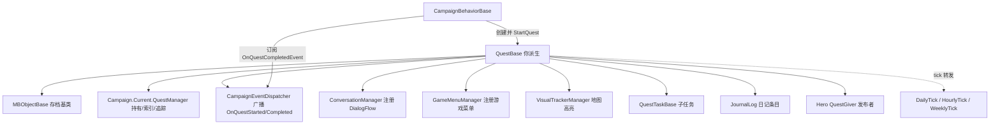

# QuestBase

**Namespace:** `TaleWorlds.CampaignSystem`
**Module:** `TaleWorlds.CampaignSystem`
**Type:** `public abstract class QuestBase : MBObjectBase`
**Base:** `MBObjectBase`
**File:** `bin/TaleWorlds.CampaignSystem/TaleWorlds.CampaignSystem/QuestBase.cs`

## 一句话职责

`QuestBase` 是**每一个任务类型的根**：它把「任务从开始到结束」的完整生命周期、日记日志、追踪对象、对话流与游戏菜单的注册，以及一堆供引擎/行为查询的 `virtual` 钩子，统一管理起来。你写的任务不是 `new` 一个 `QuestBase`，而是**继承它、填好抽象成员、在钩子里写逻辑**，再由 `StartQuest()` 把它接进战役。

## 心智模型

把它想成**「任务对象 = 一段被引擎驱转的状态机」**，而不是一个普通数据类：

- **你不会 `new QuestBase()`，而是 `new 你的派生类(...)`。** 受保护构造函数 `QuestBase(string questId, Hero questGiver, CampaignTime duration, int rewardGold)` 要求派生类在构造时传齐任务 id、发布者、期限与奖励金；基类的 `[SaveableField(100)] _questState`（`Ongoing`/`Finalized`）从这一刻起就被纳入存档。
- **它在 Campaign（战役）层，不在 Mission（战斗）层。** 任务状态只在地图推进；进入战斗不会创建或结束任务。
- **谁持有 / 谁驱动。** 任务实例由你（通常在某个 `CampaignBehaviorBase` 里）创建并调用 `StartQuest()`；之后由 `Campaign.Current.QuestManager` 持有与索引，`CampaignEventDispatcher` 负责广播 `OnQuestStarted` / `OnQuestCompleted` 等事件，引擎的每日/每小时 tick 通过 `QuestManager` 转发到任务的 `DailyTick()` / `HourlyTick()`。
- **完成是「终态 + 清理」。** 任意 `CompleteQuestWith*(...)` 都会先调你的 `On*` 钩子，再 `FinalizeQuest()`（置 `_questState = Finalized`、结束所有未完成的 `QuestTaskBase`、调用 `OnFinalize()`、`ClearRelatedFields()` 移除监听器/对话流/游戏菜单），最后广播 `OnQuestCompleted` 并 `AfterFinalize()` 移除追踪对象与地图标记。**一旦 Finalized，任务不可再被 tick 或恢复。**
- **它是可存盘的。** 关键字段带 `[SaveableField]` / `[SaveableProperty]`（`_questState`=100、`QuestDueTime`=101、`_taskList`=102、`_journalEntries`=103、`IsTrackEnabled`=104、`_questGiver`=106、`RewardGold`=107），读档时由 `InitializeQuestOnLoadWithQuestManager()` 重新 `RegisterEvents()` + `InitializeQuestOnGameLoad()` + `AddDialogs()`。

## 何时用 / 何时不要用

**用 `QuestBase` 当：**

- 你要做**一个带目标、进度、期限、奖励、日记的任务**（主线/支线/家族/ settlements 任务都走它）。
- 需要把某 `Hero` / 物品 / 地点在地图上**高亮追踪**（`AddTrackedObject` + `VisualTrackerManager`）。
- 需要给任务挂**专属对话线**（`OfferDialogFlow` / `DiscussDialogFlow` / `QuestCharacterDialogFlow`）或**专属游戏菜单**（`AddGameMenu` / `AddGameMenuOption`）。
- 需要响应「任务开始 / 完成 / 失败 / 超时 / 取消」去发奖励、改关系、触发后续（`CampaignEvents.OnQuestCompletedEvent` 等）。

**不要用 `QuestBase` 当：**

- **不要把 `QuestBase` 当数据结构直接 `new` 后到处传。** 必须派生并实现 `Title` / `IsRemainingTimeHidden` 两个抽象成员，否则编译不过；且未经 `StartQuest()` 的任务不会注册事件、不会被 `QuestManager` 索引、不会进入存档。
- **不要在 `OnFailed` / `OnCanceled` 里再调 `CompleteQuestWithSuccess()`。** `FinalizeQuest()` 已把状态置为 `Finalized` 并清场；终态之后再「完成」是一次重复终态，会二次广播事件并可能导致追踪对象/菜单状态错乱。
- **不要在任务外直接写 `_questGiver` / `QuestDueTime` 的私有/受保护成员。** `QuestGiver` 的 setter 是 `private`（只能由基类构造赋值）；改期限走公开的 `ChangeQuestDueTime(CampaignTime)`，改发布者没有公开入口（发布者语义上不应中途更换）。
- **不要把 `JournalEntries` / `TaskList` 当可变列表长期持有并改。** 它们是 `MBReadOnlyList` 视图；增删走 `AddLog*` / `AddTask`，直接改内部集合会绕过事件广播并破坏存档一致性。

## 依赖图（可点击）



- **上游（创建 / 持有）：**[CampaignBehaviorBase](../CampaignBehaviorBase/)（通常在它的某个初始化逻辑里 `new 你的任务(...)` 并 `StartQuest()`）；[Campaign](../Campaign/) 通过 `Campaign.Current.QuestManager` 持有全部进行中任务；[Hero](../Hero/) 作为 `QuestGiver` 被引用（并在 `StartQuest` 时自动加入追踪）。
- **下游（任务驱动 / 关联）：**[QuestTaskBase](../QuestTaskBase/)（子任务，经 `AddTask` 加入 `_taskList`）、[JournalLog](../JournalLog/)（日记，经 `AddLog*` 加入 `_journalEntries`）、[Hero](../Hero/)（追踪对象 / 发布者）、[Settlement](../Settlement/)（任务常围绕某据点）。
- **Events：** `CampaignEventDispatcher.OnQuestStarted` / `OnQuestCompleted(this, QuestCompleteDetails)`；行为侧可订阅 `CampaignEvents.OnQuestStartedEvent` / `OnQuestCompletedEvent`。
- **Save 点：** `[SaveableField(100..107)]` + `InitializeQuestOnLoadWithQuestManager()`（读档重建）。
- **基类：** [MBObjectBase](../../campaign-ext/MBObjectBase/)（id / 存档注册）。

## 风险（可能导致崩溃 / 坏档）

1. **在 `OnBeforeTimedOut` 里把 `completeWithSuccess` / `doNotResolveTheQuest` 同时置为冲突值。** `CompleteQuestWithTimeOut` 先调 `OnBeforeTimedOut(ref completeWithSuccess, ref doNotResolveTheQuest)`；若你设了 `doNotResolveTheQuest = true` 则直接 `return`（任务保持进行）；若 `completeWithSuccess = true` 则转 `CompleteQuestWithSuccess()`。两者都误设会让任务既不结束也不成功，悬在过期态。
2. **终态后再次调用 `Complete*` / 在 `OnFinalize` 之后还访问已清场的对话/菜单。** `FinalizeQuest()` 已 `ClearRelatedFields()`（移除监听器、对话流、`GameMenuManager` 的相关菜单与选项）。终态后再 `AddGameMenu` 会因 `GameMenuManager` 状态不一致而抛 `KeyNotFoundException` 或静默失效。
3. **`AddGameMenuOption` 指向不存在的 `menuId`。** 内部 `(GetGameMenu(menuId) ?? throw new KeyNotFoundException())`——必须先用 `AddGameMenu` 建好菜单再添选项，否则直接抛异常（战役加载期崩）。
4. **读档后忘记 `InitializeQuestOnLoadWithQuestManager` 重新注册事件。** 若你的自定义任务在 `InitializeQuestOnGameLoad()` 里没恢复必要的订阅/状态，读档后任务虽在 `QuestManager` 里，却不再响应 tick 与事件，表现成「任务卡住」。
5. **在 `OnHeroCanDieInfoIsRequested` 等 `ref bool result` 查询钩子里写错默认值。** 这些钩子被击杀/结婚/被俘等判定**反向咨询**；基类的 `OnHeroCanDieInfoIsRequested` 默认 `result = !hero.IsNotable || hero != QuestGiver`（保护发布者不被杀）。你重写时必须自己设 `result`，否则默认 `false`/未赋值会让英雄「无法死亡/无法结婚」等被悄悄禁掉，引发难以排查的 AI 异常。
6. **把 `_journalEntries` / `_taskList` 当普通列表改。** 它们是 `[SaveableField]` 集合；绕过 `AddLog*` / `AddTask` 直接增删会跳过 `OnQuestLogAdded` 广播并可能导致存档序列化缺字段。

## 成员说明（按主题分组）

> 大部分逻辑入口是 `public` 的「完成/日志/追踪/菜单」方法；真正的**你的逻辑**写在 `protected virtual` 钩子里（引擎在生命周期节点回调它们）。

### A. 生命周期（公开，引擎/你共同驱动）

- **`StartQuest()`** — 把任务置为 `Ongoing`，依次调 `OnStartQuest()` → `RegisterEvents()` → `MapEventHelper.OnConversationEnd()` → 若 `QuestGiver` 未被追踪则 `QuestManager.AddTrackedObjectForQuest` → `CampaignEventDispatcher.OnQuestStarted(this)`。**这是任务接入战役的唯一正确入口。**
- **`CompleteQuestWithSuccess()` / `CompleteQuestWithFail(TextObject)` / `CompleteQuestWithTimeOut(TextObject)` / `CompleteQuestWithBetrayal(TextObject)` / `CompleteQuestWithCancel(TextObject)`** — 五个终态入口，均先调对应 `On*`（如 `OnCompleteWithSuccess` / `OnFailed` / `OnTimedOut` / `OnBetrayal` / `OnCanceled`），再 `FinalizeQuest()` + 广播 `OnQuestCompleted(this, QuestCompleteDetails.{Success|Fail|Timeout|FailWithBetrayal|Cancel})` + `AfterFinalize()`。传入的 `TextObject` 会作为一条日志追加。
- **`ChangeQuestDueTime(CampaignTime)`** — 改期限；直接写 `QuestDueTime` 的公开 setter（受保护）的唯一合法入口。
- **`InitializeQuestOnLoadWithQuestManager()`** — 读档重建：`RegisterEvents()` + `InitializeQuestOnGameLoad()` + `AddDialogs()`。**不要在运行时手动调用。**

### B. 状态与属性（只读为主）

- **`IsOngoing` / `IsFinalized`** — 基于 `_questState` 的只读判断；终态判定与「还能不能 tick」都看它。
- **`QuestGiver`** (`Hero`, `private set`) — 发布者；构造时赋值，运行中不可改。
- **`QuestDueTime`** (`CampaignTime`, `[SaveableProperty(101)]`) — 期限；只读获取，改走 `ChangeQuestDueTime`。
- **`RewardGold`** (`public readonly int`, `[SaveableField(107)]`) — 奖励金，构造时定死。
- **`Title`** (`abstract TextObject`) / **`IsRemainingTimeHidden`** (`abstract bool`) — **必须实现**；前者是任务名（带本地化），后者决定是否在 UI 隐藏剩余时间。
- **`RelationshipChangeWithQuestGiver`** (`virtual int`) — 完成时与发布者关系的变化量；可覆写。
- **`IsTrackEnabled`** (`[SaveableProperty(104)]`) — 是否对追踪对象做地图高亮；`ToggleTrackedObjects()` 翻转它。
- **`IsSpecialQuest` / `SpecialQuestType`** — 特殊任务标识（默认空串 = 普通任务）。

### C. 日记日志

- **`AddLog(TextObject, bool hideInformation=false)`** — 追加一条普通日记 `JournalLog`（时间戳 = `CampaignTime.Now`），并广播 `OnQuestLogAdded`。
- **`AddDiscreteLog(TextObject, TextObject taskName, int currentProgress, int targetProgress, TextObject shortText=null, bool hideInformation=false)`** — 离散进度日志（`LogType.Discreate`），用于「X/Y」式进度。
- **`AddTwoWayContinuousLog(TextObject, TextObject taskName, int currentProgress, int range, ...)`** — 双向连续进度日志。
- **`JournalEntries`** (`MBReadOnlyList<JournalLog>`) — 全部日记的只读视图。
- **`RemoveLog` / `UpdateQuestTaskStage`** (`protected`) — 内部维护日记进度，通常经任务逻辑间接调用。

### D. 子任务

- **`AddTask(QuestTaskBase)`** (`protected`) — 把子任务加入 `_taskList` 并 `SetReferences()`；`FinalizeQuest` 会 `Finish` 所有活跃子任务。
- **`TaskList`** (`MBReadOnlyList<QuestTaskBase>`) — 只读视图。

### E. 追踪对象（地图高亮）

- **`AddTrackedObject(ITrackableCampaignObject)` / `RemoveTrackedObject(...)` / `IsTracked(...)`** — 经 `QuestManager` 登记/注销追踪；`AddTrackedObject` 在 `IsTrackEnabled` 时还会 `VisualTrackerManager.RegisterObject`。
- **`ToggleTrackedObjects()`** — 翻转 `IsTrackEnabled` 并批量注册/注销地图高亮。

### F. 对话流与游戏菜单

- **`OfferDialogFlow` / `DiscussDialogFlow` / `QuestCharacterDialogFlow`** (`protected DialogFlow`) — 三个对话流；在 `SetDialogs()`（抽象，你实现）里构造，`InitializeQuestOnCreation` / `InitializeQuestOnLoadWithQuestManager` 时经 `ConversationManager.AddDialogFlow` 注册，`ClearRelatedFields` 时移除。
- **`AddGameMenu(string, TextObject, OnInitDelegate, ...)` / `AddGameMenuOption(string, string, TextObject, OnConditionDelegate, OnConsequenceDelegate, ...)`** — 给任务挂专属游戏菜单与选项（如「和 X 谈谈」「交还物品」）。必须先 `AddGameMenu` 再 `AddGameMenuOption`。
- **`IsLocationTrackedByQuest(Location)`** (`virtual`) — 该地点是否被本任务追踪（返回 `GameMenuOption.IssueQuestFlags`），用于任务地点在地图上的标记。

### G. 引擎回调钩子（你 override 写逻辑）

- **`RegisterEvents()`** — 订阅你需要的 `CampaignEvents`（最常见钩子）。
- **`OnStartQuest()`** — 任务开始瞬间；初始化内部状态、发首条日记。
- **`DailyTick()` / `HourlyTick()` / `WeeklyTick()` / `HourlyTickParty(MobileParty)`** — 周期性逻辑（推进进度、判定成败）。由 `QuestManager` 的 `*WithQuestManager` 转发。
- **`OnCompleteWithSuccess()` / `OnFailed()` / `OnTimedOut()` / `OnBetrayal()` / `OnCanceled()` / `OnFinalize()`** — 各终态的「你的收尾」（发奖励、改关系、清场）。
- **`OnBeforeTimedOut(ref bool completeWithSuccess, ref bool doNotResolveTheQuest)`** — 超时前拦截：可决定「直接成功」或「不解决（保持进行）」。
- **`QuestPreconditions()`** — 任务前置条件（默认 `false`）。
- **`OnHeroCanDieInfoIsRequested` / `OnHeroCanMarryInfoIsRequested` / `OnHeroCanLeadPartyInfoIsRequested` / `OnHeroCanHavePartyRoleOrBeGovernorInfoIsRequested` / `OnHeroCanBecomePrisonerInfoIsRequested` / `OnHeroCanBeSelectedInInventoryInfoIsRequested` / `OnHeroCanMoveToSettlementInfoIsRequested` / `OnHeroCanHaveCampaignIssuesInfoIsRequested`** — 一组 **`ref bool result` 查询钩子**：引擎在判定「英雄能否 X」时反向咨询任务（例如保护发布者不被杀）。你覆写时必须给 `result` 赋值。
- **`GetPrefabName()`** (`virtual`) — 地图标记 prefab，默认 `"bd_target_board_2"`。
- **`GetCurrentProgress()` / `GetMaxProgress()`** — UI 进度展示（默认 -1 / 1）。

## 最小真实示例

### 示例 1：定义一个自定义任务并在行为里启动它

```csharp
using TaleWorlds.CampaignSystem;
using TaleWorlds.CampaignSystem.Actions;   // ChangeRelationAction 等
using TaleWorlds.CampaignSystem.CampaignBehaviors;
using TaleWorlds.Localization;
using TaleWorlds.Core;

namespace MyMod
{
    // 真实基类构造签名：QuestBase(string questId, Hero questGiver, CampaignTime duration, int rewardGold)
    public class EscortMerchantQuest : QuestBase
    {
        private readonly Hero _target;
        private int _escortedDays;

        public EscortMerchantQuest(Hero questGiver, Hero target, CampaignTime duration)
            : base("escort_merchant_" + target.StringId, questGiver, duration, rewardGold: 500)
        {
            _target = target;
        }

        // 两个抽象成员必须实现
        public override TextObject Title => new TextObject("{=myquest}护送商人 {TARGET.NAME}");
        public override bool IsRemainingTimeHidden => false;

        protected override void SetDialogs() { /* 在这里构造 OfferDialogFlow 等 */ }

        protected override void OnStartQuest()
        {
            // 任务开始：发第一条日记、追踪目标
            AddLog(new TextObject("{=start}我开始护送 {TARGET.NAME}。"));
            AddTrackedObject(_target);
        }

        protected override void DailyTick()
        {
            // 真实获取路径：Campaign.Current.QuestManager 持有的任务会被引擎转发 DailyTick
            _escortedDays++;
            if (_escortedDays >= 7)
            {
                // 完成时走基类公开入口（会触发 OnCompleteWithSuccess + 广播 + 清理）
                CompleteQuestWithSuccess();
            }
        }

        protected override void OnCompleteWithSuccess()
        {
            // 完成奖励：改关系走 Action，而非直接写字段
            if (QuestGiver != null)
            {
                ChangeRelationAction.ApplyPlayerRelation(QuestGiver, 10);
            }
        }

        protected override void InitializeQuestOnGameLoad() { /* 读档恢复内部状态 */ }
    }

    // 在一个 CampaignBehavior 里创建并启动任务
    public class MyQuestGiverBehavior : CampaignBehaviorBase
    {
        public override void RegisterEvents() { }

        public void StartEscortFor(Hero giver, Hero target)
        {
            var quest = new EscortMerchantQuest(giver, target, CampaignTime.DaysFromNow(10));
            quest.StartQuest();   // 唯一正确入口：注册事件 + 追踪 + 广播 OnQuestStarted
        }
    }
}
```

### 示例 2：在行为里订阅任务完成事件

```csharp
public class MyRewardBehavior : CampaignBehaviorBase
{
    public override void RegisterEvents()
    {
        // 真实事件名（引擎 OnQuestCompleted 的对外订阅点）
        CampaignEvents.OnQuestCompletedEvent.AddNonSerializedListener(this, OnQuestCompleted);
    }

    private void OnQuestCompleted(QuestBase quest, QuestBase.QuestCompleteDetails detail)
    {
        if (detail == QuestBase.QuestCompleteDetails.Success && quest is EscortMerchantQuest)
        {
            // 任务成功：这里可发额外奖励、推进后续任务链
            GiveGoldToMainHero(500);
        }
    }

    public override void SyncData(IDataStore dataStore) { }
}
```

## 导航

- ↑ 父级（Parent）：[Campaign](../Campaign/) — 任务系统由 `Campaign.Current.QuestManager` 持有，属战役层
- ↔ 同级（Sibling）：[Hero](../Hero/)（QuestGiver / 追踪对象）· [Settlement](../Settlement/)（任务常围绕据点）· [MobileParty](../MobileParty/)（HourlyTickParty 载体）· [CampaignBehaviorBase](../CampaignBehaviorBase/)（创建并启动任务的地方）· [QuestManager](../QuestManager/)（任务持有/索引）· [QuestTaskBase](../QuestTaskBase/)（子任务）
- 相关（Related）：[MBObjectBase](../../campaign-ext/MBObjectBase/)（存档基类）· [JournalLog](../JournalLog/)（日记条目）· [CampaignEvents](../CampaignEvents/)（OnQuestStarted/Completed 订阅）

## 参见

- ↑ 上游枢纽：[Campaign](../Campaign/) — `Campaign.Current.QuestManager` 与各 `CampaignEvents`
- ↓ 下游/相关：[QuestManager](../QuestManager/)（任务注册与索引）· [QuestTaskBase](../QuestTaskBase/)（子任务）· [JournalLog](../JournalLog/)（日记）· [Hero](../Hero/)（发布者/追踪对象）
- 创建与启动：[CampaignBehaviorBase](../CampaignBehaviorBase/) — 在行为里 `new 你的任务(...)` 并 `StartQuest()`
