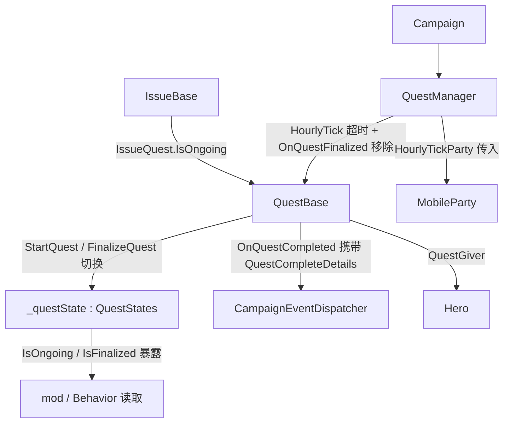

# QuestStates

**命名空间:** `TaleWorlds.CampaignSystem`（嵌套于 `QuestBase` 内）  
**模块:** `TaleWorlds.CampaignSystem`  
**类型:** `internal enum QuestStates`（定义于 `QuestBase` 内部，非独立文件）  
**源文件:** `bin/TaleWorlds.CampaignSystem/TaleWorlds.CampaignSystem/QuestBase.cs`

## 概述

`QuestStates` 是定义于 `QuestBase` 内部的 `internal` 枚举，只含 `Ongoing` 与 `Finalized` 两个值，用来标记一个任务（Quest）当前是「进行中」还是「已结束」。它经 `[SaveableField(100)]` 私有字段 `_questState` 随战役存档序列化（在 `SaveableCampaignTypeDefiner` 中以枚举编号 `2041` 注册），由 `QuestBase.StartQuest()` 与 `FinalizeQuest()`（后者被各 `CompleteQuestWith*` 统一调用）在生命周期两端切换；外部几乎不应直接读写该枚举，而应通过 `IsOngoing` / `IsFinalized` 这两个公开布尔属性判断，或依赖 `QuestManager` 驱动的任务状态机。

## 心智模型

把 `QuestStates` 想成任务（Quest）生命周期里的一盏「进行 / 结束」双态灯：绝大多数 mod 代码从不需要知道这个枚举类型本身，只要向 `QuestBase` 问 `IsOngoing` 或 `IsFinalized` 即可。它的拥有者是 `QuestBase` 上的私有字段 `_questState`，写在 Campaign（战役）层，不属于 Mission（战斗）层。任务的生命周期由引擎驱动，而不是你手动维护：`StartQuest()` 把灯拨到 `Ongoing` 并把自己注册进 `QuestManager._quests`、开始接收每 tick 推进与超时判定；当任一 `CompleteQuestWith*`（成功 / 失败 / 取消 / 超时 / 背叛）被调用时，`FinalizeQuest()` 把灯拨到 `Finalized`，并顺带清理任务监听、对话流、追踪对象与地图标记，再通知 `QuestManager` 把它从 `_quests` 移除。因此「读」是安全的（`IsOngoing` / `IsFinalized`），但「直接改 `_questState`」会绕过整段清理，留下卡死、仍在 tick、仍被追踪的幽灵任务。`QuestStates` 只表达二元进行 / 结束，并不记录成功还是失败——那个更细的「结局」由 `QuestCompleteDetails` 在 `OnQuestCompleted` 事件里单独传递。

## 何时使用 / 何时不要使用

- **使用**：用 `quest.IsOngoing` 判断任务是否仍在进行（tick 守卫、是否可触发对话、是否计入「活跃任务」）；用 `quest.IsFinalized` 判断任务是否已经结束；在 `QuestManager` 遍历时按这两个布尔做过滤。
- **使用**：要结束任务时调用对应的 `CompleteQuestWithSuccess()` / `CompleteQuestWithFail()` / `CompleteQuestWithCancel()` / `CompleteQuestWithTimeOut()` / `CompleteQuestWithBetrayal()`，让引擎把 `_questState` 切到 `Finalized` 并跑完整清理流程。
- **不要使用**：不要直接给 `_questState` 或任何能触达它的内部写法赋值来「结束」任务——这会跳过 `FinalizeQuest` 的清理（移除监听、`ClearRelatedFields`、移除追踪对象与地图标记、`QuestManager.OnQuestFinalized` 从 `_quests` 移除），产生卡死任务。
- **不要使用**：不要因为 `IsFinalized == true` 就假定任务「成功了」。`Finalized` 涵盖成功、失败、取消、超时、背叛五种结局；要区分结局请订阅 `CampaignEvents.OnQuestCompleted` 并读取传入的 `QuestCompleteDetails`。
- **不要使用**：不要把 `QuestStates` 与 `IssueState` 混用。`IssueState` 是 `IssueBase` 上更细的「问题」生命周期（Ongoing / SolvingWithQuestSolution / …），二者是不同类型，跨类型比较既编译不过也语义错误。

## 依赖图



- 上游 / 持有者：
  - [Campaign](../Campaign) 持有 [QuestManager](../QuestManager)（`Campaign.Current.QuestManager`），所有任务集合、tick 推进与超时判定都从它发起。
  - [QuestBase](../QuestBase) 是 `_questState` 字段的真正持有者；[QuestCompleteDetails](../QuestCompleteDetails) 是与之配套的「结局」枚举，经 `CampaignEventDispatcher` 在任务结束时广播。
- 下游 / 变更入口：
  - [QuestManager](../QuestManager) 通过 `OnQuestStarted` 把 `Ongoing` 任务加入 `_quests`，通过 `HourlyTick` 对到期任务调用 `CompleteQuestWithTimeOut`，并在 `OnQuestFinalized` 里把 `Finalized` 任务从 `_quests` 移除。
  - [IssueBase](../IssueBase) / [IssueState](../IssueState) 描述「问题」侧生命周期；当问题生成其任务后，任务端进入 `Ongoing`，二者的 `Ongoing` 概念同名但类型不同。
  - [Hero](../Hero) 作为 `QuestGiver` 被 `StartQuest` 登记为追踪对象；[MobileParty](../MobileParty) 在 `HourlyTickParty` 中接受各任务的行为回调。
  - [CampaignEvents](../CampaignEvents) / [CampaignEventDispatcher](../CampaignEventDispatcher)（含 `OnQuestStarted` / `OnQuestCompleted`）是任务状态变化的对外通知点。

## 风险

- **直接改 `_questState` 绕过清理**：`_questState` 是 `internal` 私有字段，同程序集的 mod 可强行赋值。若不经 `FinalizeQuest()` 就把它设成 `Finalized`，任务的事件监听、`OfferDialogFlow` / `DiscussDialogFlow` / `QuestCharacterDialogFlow`、追踪对象、地图标记都不会被清除，`QuestManager._quests` 也仍保留它——表现为「已结束却还在 tick、还在地图上、还占着追踪槽」的幽灵任务。结束任务一律走 `CompleteQuestWith*`。
- **卡死任务永不进入 Finalized**：若某条任务逻辑达到了「完成」条件却忘了调用 `CompleteQuestWith*`，`_questState` 会一直停在 `Ongoing`。它会持续出现在 `QuestManager.IsThereActiveQuestWithType`、`IsQuestGiver` 的遍历里、持续被每 tick 推进、持续被超时判定盯上，且永远不会从 `_quests` 移除。检查任务推进逻辑时确认每条成功 / 失败路径都最终调用了完成方法。
- **`Finalized` ≠ 成功**：`IsFinalized` 只说明任务已结束，不能推出结局。把 `IsFinalized` 当作「玩家赢了」的判断会漏掉失败 / 取消 / 超时 / 背叛。区分结局请读 `QuestCompleteDetails`（来自 `OnQuestCompleted`）。
- **与 `IssueState` 类型混淆**：`IssueState`（在 `IssueBase` 内，`Ongoing` / `SolvingWithQuestSolution` / `SolvingWithAlternativeSolution` / `SolvingWithLordSolution`）和 `QuestStates` 是两套独立枚举。`IssueBase.IsOngoingWithoutQuest` 判的是「问题还没有任务」，而 `QuestBase.IsOngoing` 判的是「任务进行中」。对 `Quest` 用 `IssueState`、或对 `Issue` 用 `QuestStates` 比较都是类型错误。
- **存档枚举反序列化**：`QuestStates` 经 `[SaveableField(100)]` 序列化，并在 `SaveableCampaignTypeDefiner` 注册为枚举编号 `2041`。若某次改动重命名或删除枚举值（例如新增 `Paused` 后又移除），旧版本存档里写入的旧值可能无法映射到新枚举，导致读档断言失败或任务 `_questState` 落到错误状态。改动此枚举必须考虑向后兼容与存档迁移。
- **读档重建的悬空任务**：`QuestManager.OnGameLoaded` 会跳过 `IsFinalized` 的任务、重新初始化未结束的任务；若某个未结束任务找不到对应的活跃 `Issue`（且不是 `IsSpecialQuest`），引擎会 `Debug.FailedAssert` 并调用 `CompleteQuestWithCancel` 取消它。依赖「任务一定能在读档后原样继续」时，要考虑它可能在加载阶段被自动取消。

## 成员说明

`QuestStates` 只有两个枚举值，二者共同描述任务的二元生命周期：

### `Ongoing`

- **含义**：任务进行中。`IsOngoing => _questState == QuestStates.Ongoing`。
- **谁设置它**：`QuestBase.StartQuest()`（源码 `QuestBase.cs:154`）在任务启动时写入。紧接着 `StartQuest` 调用 `OnStartQuest`、`RegisterEvents`、`MapEventHelper.OnConversationEnd`，把 `QuestGiver` 登记为追踪对象，并触发 `CampaignEventDispatcher.Instance.OnQuestStarted`；`QuestManager.OnQuestStarted` 此时把它加入 `_quests`。
- **带来的行为**：只要处于 `Ongoing`，该任务就会出现 `QuestManager` 的各类遍历中（`IsThereActiveQuestWithType`、`IsQuestGiver`、`CheckQuestForMenuLocations` 等都以 `quest.IsOngoing` 作守卫）；`QuestManager.HourlyTick / DailyTick / WeeklyTick / HourlyTickParty` 会对它调用对应回调；`HourlyTick` 还会检查 `QuestDueTime.IsPast`，对到期任务安排 `CompleteQuestWithTimeOut`。各 `QuestBehavior` 也常用 `base.IsOngoing` 守卫自己的推进逻辑（如 `EscortMerchantCaravanIssueBehavior`、`LandlordTrainingForRetainersIssueBehavior` 等）。

### `Finalized`

- **含义**：任务已结束。`IsFinalized => _questState == QuestStates.Finalized`。注意它**不区分**成功 / 失败 / 取消 / 超时 / 背叛——那五种更细的结局由 `QuestCompleteDetails` 在 `OnQuestCompleted` 事件中单独携带。
- **谁设置它**：`QuestBase.FinalizeQuest()`（私有，源码 `QuestBase.cs:244`）写入。它被五个完成方法统一调用：`CompleteQuestWithSuccess`、`CompleteQuestWithTimeOut`、`CompleteQuestWithFail`、`CompleteQuestWithBetrayal`、`CompleteQuestWithCancel`。每个完成方法在切到 `Finalized` 之前先调用自己的 `On*` 钩子（如 `OnCompleteWithSuccess` / `OnFailed` / `OnCanceled`），切到 `Finalized` 之后再调用 `AfterFinalize`。
- **带来的行为**：`FinalizeQuest` 会先取消所有仍在活动的 `QuestTaskBase`（`task.Finish(QuestTaskBase.FinishStates.Cancel)`），再置 `_questState = Finalized`，调用 `OnFinalize`，并 `ClearRelatedFields`——移除该任务在 `CampaignEventDispatcher` 上的全部监听器、在 `ConversationManager` 上的对话行、在 `GameMenuManager` 上的相关菜单与选项；随后 `RemoveAllTrackedObjects`（经 `QuestManager`）与 `RemoveAllMapMarkers`（经 `MapMarkerManager`）。最后 `Campaign.Current.QuestManager.OnQuestFinalized(this)` 把它从 `_quests` 移除。此后该任务不再被 tick、不再被超时判定、也不再出现在活跃任务遍历中。具体的结局通过 `CampaignEventDispatcher.Instance.OnQuestCompleted(this, QuestCompleteDetails.X)` 广播给 `CampaignEvents` 的订阅者。

## 示例

### 示例 1：遍历任务并区分进行中 / 已结束

```csharp
using TaleWorlds.CampaignSystem;

// 真实来源：当前 Campaign 的 QuestManager 持有全部任务
foreach (QuestBase quest in Campaign.Current.QuestManager.Quests)
{
    if (quest.IsOngoing)
    {
        // 任务仍在进行：会被 tick、可能被超时、仍计入活跃任务
        // 不要在这里手动把 _questState 改成 Finalized
        if (quest.QuestDueTime.IsPast)
        {
            // 超时由 QuestManager.HourlyTick 负责调用 CompleteQuestWithTimeOut
        }
    }
    else if (quest.IsFinalized)
    {
        // 已结束（成功/失败/取消/超时/背叛之一），不再 tick、已从 _quests 移除
    }
}
```

`IsOngoing` / `IsFinalized` 是 `QuestBase` 上的公开布尔属性，对应 `_questState == QuestStates.Ongoing / Finalized`；它们只读、安全，不触发任何世界变更。

### 示例 2：在任务 Behavior 中用 IsOngoing 守卫推进逻辑

```csharp
// 在继承 QuestBase 的任务 Behavior 的每日 tick / 对话回调里
using TaleWorlds.CampaignSystem;

if (base.IsOngoing)
{
    // 只有任务进行中才执行推进逻辑；Finalized 后什么也不做
    // 满足条件时应调用 CompleteQuestWithSuccess() 等由引擎收尾，而不是改字段
}
```

此处 `base.IsOngoing` 与 `QuestManager` 内 `quest.IsOngoing` 守卫（如 `QuestManager.cs:94` 的 `IsThereActiveQuestWithType`、`:189` 的超时判定）用的是同一个底层状态，保证只有真正进行中的任务才会被推进。

## 参见

- ↑ 父级：[战役 API 索引](../)
- ↔ 同级 / 相关：[Campaign](../Campaign)（持有 `QuestManager`）· [QuestManager](../QuestManager)（驱动任务集合、tick 与超时、移除）· [QuestBase](../QuestBase)（`_questState` 的持有者与生命周期方法）· [QuestCompleteDetails](../QuestCompleteDetails)（任务「结局」枚举，与 `QuestStates` 互补）· [IssueBase](../IssueBase) / [IssueState](../IssueState)（问题侧生命周期，勿与 `QuestStates` 混用）
- 关联实体与通知：[Hero](../Hero)（任务发布者 `QuestGiver`）· [MobileParty](../MobileParty)（任务 tick 的队伍参数）· [CampaignEvents](../CampaignEvents) / [CampaignEventDispatcher](../CampaignEventDispatcher)（任务开始 / 完成事件）· [JournalLog](../JournalLog)（任务日志）· [QuestTaskBase](../QuestTaskBase)（任务子目标，随 `Finalized` 一并取消）
