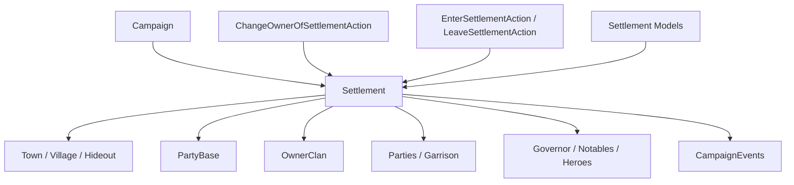

# Settlement

**命名空间:** `TaleWorlds.CampaignSystem.Settlements`  
**模块:** `TaleWorlds.CampaignSystem`  
**类型:** `public sealed class Settlement : MBObjectBase, ILocatable<Settlement>, IMapPoint, ITrackableCampaignObject, ITrackableBase, ISiegeEventSide, IRandomOwner, ISettlementDataHolder`  
**基类:** [MBObjectBase](../../core/MBObjectBase)  
**源文件:** `bin/TaleWorlds.CampaignSystem/TaleWorlds.CampaignSystem.Settlements/Settlement.cs`

## 一句话职责

`Settlement` 是战役地图上**不会移动的固定节点**，把城镇、村庄或藏身处的玩法组件、`PartyBase`、驻军/驻留队伍、英雄、领地所有权与围城状态统一挂在一个对象上。它适合用来**读取**据点及其组件的状态；要转移所有权、让队伍进出或处理围城，必须走对应的 Action 与事件流程，绝不能用一个字段赋值去“假装”世界状态已更新。

## 心智模型

### 它是什么

把 `Settlement` 想成地图上的**据点外壳**：它本身几乎不计算规则，只负责“据点在这里、属于谁、里面有什么”。真正的玩法由组件提供——

- 城镇/城堡用 `Town` 组件（城堡与城镇共用 `Town`，靠 `Town.IsTown` / `Town.IsCastle` 区分）；
- 村庄用 `Village` 组件；
- 藏身处用 `Hideout` 组件。

据点同时拥有一个 `Party`（[PartyBase](../PartyBase)），所以它能参与遭遇、持有物品、容纳驻军；`Parties`、`HeroesWithoutParty`、`Notables`、`BoundVillages` 和 `SiegeEvent` 描述其动态内容。

关键认知：**“据点换主人”不是给 Settlement 写一个字段**。`Settlement.OwnerClan` 是一个**只读计算属性**——城镇取 `Town.OwnerClan`，村庄取 `Village.Bound.OwnerClan`，藏身处取 `Hideout.MapFaction as Clan`，它自己没有 setter。真正的所有权字段在 `Town.OwnerClan` / `Village.Bound.OwnerClan` 上，而换主人必须调用 [ChangeOwnerOfSettlementAction](../../campaign-ext/ChangeOwnerOfSettlementAction)，让领地、驻军、总督、绑定村庄、地图事件与通知一起更新。

### 生命周期与持有关系

- **创建/注册：** 构造函数建立据点的 `Party`（`PartyBase`）；XML 反序列化再绑定 `SettlementComponent` 与 `Town`/`Village`/`Hideout`。所有据点由 [MBObjectBase](../../core/MBObjectBase) 体系经 `MBObjectManager` 注册，可用 `Settlement.Find(stringId)` 检索。
- **运行中：** [Clan](../Clan) 经 `OwnerClan` 持有领地关系；[MobileParty](../MobileParty) 通过 `EnterSettlementAction` / `LeaveSettlementAction` 进入/离开据点；[Hero](../Hero) 可作为总督、无派对角色或囚犯停留；`SiegeEvent` 与 `MapEvent` 读取据点状态。
- **经济/军事：** 城墙血量、繁荣、安全、忠诚、民兵等数值由对应 Model 或组件计算（`MaxWallHitPoints` 来自 `WallHitPointCalculationModel`，`Town.Prosperity/Security/Loyalty` 由各自的 Settlement Model 计算）。Settlement 提供状态与关系容器，不是所有规则的计算器。
- **读档/迁移：** 组件、`Party`、领地缓存与定位器会按加载顺序分阶段重建；自定义 Behavior 存档时只保存稳定 `StringId`，加载完成后再用 `Settlement.Find` 取回对象，不要保存 `Settlement.Party` 或缓存列表实例。

### 何时用，何时不要用

- **用：** 查当前玩家所在据点、据点类型、所有者、驻军、驻留队伍、绑定村庄、英雄与围城状态；用稳定 ID 检索据点。
- **用：** 通过 `Settlement.CurrentSettlement`、`Settlement.All`、`Settlement.Find` / `FindFirst` 取得已注册据点；`MobileParty.CurrentSettlement` 也可拿到队伍所在据点。
- **不要直接写 `OwnerClan`：** 它没有 setter，且所有权实际存在 `Town`/`Village` 组件上；换主人用 `ChangeOwnerOfSettlementAction.ApplyByDefault(...)` 等。直接改 `Town.OwnerClan` 也只能更新部分缓存，漏掉驻军、总督、绑定村庄和通知链。
- **不要把 `Town`、`Village`、`Hideout` 当成可互换组件：** 先检查 `IsTown` / `IsCastle` / `IsVillage` / `IsHideout`，再访问对应组件；`Town.Prosperity`、`Town.Security`、`Town.Loyalty` 都在 **Town 上**，不在 Settlement。
- **不要让队伍直接进出：** 进出据点必须经 `EnterSettlementAction.ApplyForParty(...)` / `LeaveSettlementAction.ApplyForParty(...)`，直接改 `Parties` 或位置会破坏 `PartyBase` 与地图定位的双向关系。
- **不要在 Campaign 或地图状态未建立时访问 `CurrentSettlement`：** 静态入口依赖当前 Campaign 与主队伍地图位置，可能返回 null。

## 依赖图



### 上游与持有者

- [Campaign](../Campaign) 提供 `Settlements` 集合、时间、模型与地图事件；`Settlement.All` 只能在活动 Campaign 内使用。
- [Clan](../Clan) 经 `OwnerClan` 连接所有权；[MobileParty](../MobileParty) 经 `CurrentSettlement`、驻军与攻城连接移动层；[Hero](../Hero) 经 `Owner`、`Governor`、无派对角色与囚犯连接人物层。
- [PartyBase](../PartyBase) 提供据点的交互外壳、物品与驻军 roster；`Town`/`Village`/`Hideout` 组件提供专门规则；`CultureObject`（`Settlement.Culture` 字段）决定民兵兵种与视觉。

### 下游与变更入口

- [CampaignEvents](../CampaignEvents) 的据点进入、所有者改变、遭遇与围城事件是 Behavior 的观察点。
- [ChangeOwnerOfSettlementAction](../../campaign-ext/ChangeOwnerOfSettlementAction) 负责所有权级联（`ApplyByDefault` / `ApplyBySiege` / `ApplyByRebellion` / `ApplyByLeaveFaction`）；[EnterSettlementAction](../../campaign-ext/EnterSettlementAction) / [LeaveSettlementAction](../../campaign-ext/LeaveSettlementAction) 负责队伍进出。
- `SettlementEconomyModel`、`SettlementLoyaltyModel`、`SettlementSecurityModel`、`SettlementMilitiaModel`、`WallHitPointCalculationModel` 等 Model 计算结果，不替代 Action。

## 关键成员与调用时机

### 类型、身份与组件

| 成员 | 用途、副作用与时机 |
| --- | --- |
| `IsTown` / `IsCastle` / `IsFortification` / `IsVillage` / `IsHideout` | 判定据点种类。`IsTown`/`IsCastle`/`IsFortification` 都派生自 `Town`（`Town.IsTown`/`Town.IsCastle`），村庄看 `Village != null`，藏身处看 `Hideout != null`。访问具体组件前务必先用对应 `IsXxx` 守卫，避免空引用。 |
| `Town` / `Village` / `Hideout` | 直接引用具体玩法组件。它们是可写字段，但正常情况下由 XML 初始化与 ownership Action 维护；不要随意替换实例。注意繁荣/安全/忠诚在 `Town` 上，不在 Settlement。 |
| `SettlementComponent` | 底层组件基类（`{ get; private set; }`），提供 `MapFaction`。`MapFaction => SettlementComponent?.MapFaction`，判空前注意可能为 null。 |
| `Name` / `Culture` / `Position` / `GatePosition` / `HasPort` | 只读身份与地图位置。`Culture` 为 `CultureObject` 字段，`Position`/`GatePosition` 为 `CampaignVec2` 地图坐标。 |
| `StringId`（继承自 MBObjectBase） | 稳定 ID，是存档与 `Settlement.Find` 的检索键。 |

### 所有权与阵营

| 成员 | 用途、副作用与时机 |
| --- | --- |
| `OwnerClan` | **只读计算属性**：城镇取 `Town.OwnerClan`，村庄取 `Village.Bound.OwnerClan`，藏身处取 `Hideout.MapFaction as Clan`，否则 null。**没有 setter**——换主人必须走 `ChangeOwnerOfSettlementAction`。 |
| `Owner` | 只读：`OwnerClan.Leader`。当 `OwnerClan` 为 null（叛乱、所有权过渡或读档中间态）时访问会抛异常；先判 `OwnerClan`。 |
| `MapFaction` | 只读：`SettlementComponent?.MapFaction`。据点所属阵营，随所有权改变。 |

### 驻军、队伍与英雄

| 成员 | 用途、副作用与时机 |
| --- | --- |
| `Party` | 只读 `PartyBase`（`{ get; private set; }`）。据点的交互外壳与物品 roster；不要直接替换实例。 |
| `ItemRoster` / `Stash` | `ItemRoster => Party.ItemRoster`；`Stash` 为独立 `ItemRoster`。修改 roster 会触发经济与事件副作用。 |
| `Parties` | `MBReadOnlyList<MobileParty>`：当前驻留据点的队伍（驻军/巡逻/民兵）。由进入/离开 Action 维护，直接改底层缓存会破坏双向关系。 |
| `HeroesWithoutParty` / `Notables` | 只读缓存列表：驻留的无派对英雄与要人。随进出、囚禁与读档重建，使用时取最新缓存。 |
| `MilitiaPartyComponent` / `Militia` | 民兵队伍组件与数量。`Militia` 有 setter，但写入会触发 `TransferReadyMilitiasToMilitiaParty` / `SpawnMilitiaParty`；通常只读，由 `SettlementMilitiaModel` 驱动。 |

### 状态、围城与经济

| 成员 | 用途、副作用与时机 |
| --- | --- |
| `IsUnderSiege` / `SiegeEvent` / `IsUnderRaid` / `LastAttackerParty` / `CurrentSiegeState` | 围城/劫掠状态。`IsUnderSiege => SiegeEvent != null`；`SiegeEvent`/`LastAttackerParty` 在地图事件回调后可能变 null，长期状态只保存稳定 ID，处理前重新获取。 |
| `IsActive` / `IsStarving` / `IsRaided` / `InRebelliousState` | 派生状态。`IsStarving => Town.FoodStocks <= 0`；`InRebelliousState` 仅城镇/城堡。 |
| `MaxWallHitPoints` / `SettlementHitPoints` / `SettlementWallSectionHitPointsRatioList` | 城墙血量。`MaxWallHitPoints` 由 `WallHitPointCalculationModel.CalculateMaximumWallHitPoint(Town)` 计算。 |
| `Town.Prosperity` / `Town.Security` / `Town.Loyalty` | **这些状态在 Town 组件上，不在 Settlement**；对应的 `ProsperityChange`/`SecurityChange`/`LoyaltyChange` 由同名 Model 计算。修改规则应替换 Model，不要把结果写回另一份世界状态。 |
| `Alleys` / `LocationComplex` | 城镇小巷与场景内地点复杂体；仅在城镇据点非空。 |

### 静态获取与查找

| 成员 | 用途、副作用与时机 |
| --- | --- |
| `CurrentSettlement` | 静态：按优先级返回玩家被俘据点 / 遭遇据点 / 主队伍所在据点；地图未建立或无位置时返回 null。 |
| `All` | 静态：`Campaign.Current.Settlements` 的只读列表；只能在活动 Campaign 使用。 |
| `Find(string)` / `FindFirst(predicate)` / `FindAll(predicate)` / `GetFirst` | `Find` 经 `MBObjectManager.Instance.GetObject<Settlement>(id)` 检索；其余基于 `All` 查询。读档后恢复阶段用 `StringId` 重新 `Find`。 |

## Action、事件与 Model 边界

| 目标 | 正确入口 | 风险 |
| --- | --- | --- |
| 转移城镇/村庄所有权 | `ChangeOwnerOfSettlementAction.ApplyByDefault(Hero, Settlement)`（或 `ApplyBySiege` / `ApplyByRebellion` / `ApplyByLeaveFaction`） | `Settlement.OwnerClan` 只读无 setter；直接改 `Town.OwnerClan` 只更新部分缓存，漏掉驻军、总督、绑定村庄与通知。 |
| 让队伍进出据点 | `EnterSettlementAction.ApplyForParty(MobileParty, Settlement)` / `LeaveSettlementAction.ApplyForParty(MobileParty)` | 直接操作 `Parties` 或位置会破坏 `PartyBase` 与地图定位的双向关系。 |
| 读取经济/忠诚/民兵 | `Campaign.Current.Models` 的 Settlement Model | Model 只计算结果；不要在每 tick 把结果写回另一份状态。繁荣/安全/忠诚在 `Town` 上。 |
| 处理据点攻城 | `SiegeEvent`、Campaign 事件与对应 Action | 不要在 `IsUnderSiege` 为真时假定 owner、party 与 map event 可立刻销毁；`SiegeEvent` 可能在回调后变 null。 |

## 风险边界

- **所有权只读：** 源码中 `OwnerClan` 是计算属性，无 setter，所有权字段在 `Town.OwnerClan` / `Village.Bound.OwnerClan` 上。换主人必须调用 `ChangeOwnerOfSettlementAction`，否则驻军、总督、绑定村庄、领地缓存与事件通知都不会同步。
- **`Owner` 空值：** `Owner => OwnerClan.Leader`；叛乱、所有权过渡与读档中间态 `OwnerClan` 可能为 null，访问 `Owner` 前先判 `OwnerClan`。
- **组件必须守卫：** `Town`/`Village`/`Hideout` 同时只有一个非空。繁荣、安全、忠诚、总督在 `Town` 上；村庄产出在 `Village` 上。未用 `IsTown`/`IsVillage`/`IsHideout` 守卫就访问会空引用。
- **Party 双向关系：** Settlement 的 `PartyBase` 与 `Parties`、驻留队伍相互同步；直接清空 roster 或替换 `Party` 会让队伍仍指向已移除据点。
- **围城/事件时机：** `SiegeEvent`、`MapEvent`、`LastAttackerParty` 可能在回调后变为 null；不能把这些运行时引用写入长期 Campaign 状态，只保存 `StringId` 并在需要时重新 `Find` / `Campaign.Current.SettlementLocator` 定位。
- **模型结果不是存档字段：** `Town.Prosperity/Security/Loyalty`、`MaxWallHitPoints`、民兵等会被 Model / daily tick 更新；修改规则应替换 Model，修改世界应走 Action。
- **保存加载顺序：** `SettlementComponent`、`Town`/`Village`/`Hideout`、`Party` 与 `OwnerClan` 分阶段恢复。自定义存档保存 `Settlement.StringId`，在加载完成后再 `Settlement.Find`。

## 真实示例

### 从当前玩家位置读取据点状态

```csharp
using TaleWorlds.CampaignSystem;

// 当前玩家被俘/遭遇/主队伍所在的据点；地图未建立时返回 null
Settlement settlement = Settlement.CurrentSettlement;
if (settlement != null)
{
    bool underSiege = settlement.IsUnderSiege;        // => SiegeEvent != null
    Clan ownerClan = settlement.OwnerClan;            // 只读计算属性，可能为 null
    int residentParties = settlement.Parties.Count;  // MBReadOnlyList<MobileParty>
    float wallMax = settlement.MaxWallHitPoints;      // 由 WallHitPointCalculationModel 计算
}
```

`CurrentSettlement` 依赖当前 Campaign 与主队伍地图位置；`OwnerClan` 在叛乱或所有权过渡时可能为空，`Parties` 也会随地图 tick 改变，使用前都应判空/重新读取。

### 通过稳定 ID 查找据点并读取城镇组件

```csharp
using TaleWorlds.CampaignSystem;

// 经 MBObjectManager 按 StringId 检索当前 Campaign 注册对象
Settlement town = Settlement.Find("town_1");
if (town != null && town.IsTown && town.Town != null)
{
    // 繁荣/安全/忠诚在 Town 组件上，不在 Settlement
    float prosperity = town.Town.Prosperity;
    Hero governor = town.Town.Governor;
    var boundVillages = town.BoundVillages;           // 绑定村庄（Settlement 上）
}

// 遍历全部据点：Settlement.All => Campaign.Current.Settlements
foreach (Settlement s in Settlement.All)
{
    if (s.IsCastle)
    {
        // 城堡与城镇共用 Town 组件，用 Town.IsCastle 区分
    }
}
```

若目标是换主人，应把该对象交给 `ChangeOwnerOfSettlementAction.ApplyByDefault(...)`，不要写 `OwnerClan` 或 `Town.OwnerClan`。

## 版本注记

本页以 v1.4.5 `TaleWorlds.CampaignSystem.Settlements/Settlement.cs` 及同目录 `Town.cs`、`Village.cs`、`Hideout.cs`，以及 `TaleWorlds.CampaignSystem.Actions/ChangeOwnerOfSettlementAction.cs`、`EnterSettlementAction.cs`、`LeaveSettlementAction.cs` 源码为准。跨版本使用时重新确认组件初始化顺序、所有权 setter 与 siege 事件参数。

## 导航

- ↑ 父级：[Campaign API](../)
- ↔ 同级：[Hero](../Hero) · [Clan](../Clan) · [Kingdom](../Kingdom) · [MobileParty](../MobileParty) · [PartyBase](../PartyBase)
- 子级/相关：[Town](../Town) · [Village](../Village) · [Hideout](../Hideout) · [CampaignEvents](../CampaignEvents) · [ChangeOwnerOfSettlementAction](../../campaign-ext/ChangeOwnerOfSettlementAction) · [EnterSettlementAction](../../campaign-ext/EnterSettlementAction) · [LeaveSettlementAction](../../campaign-ext/LeaveSettlementAction) · [SettlementEconomyModel](../SettlementEconomyModel) · [SettlementLoyaltyModel](../SettlementLoyaltyModel)
