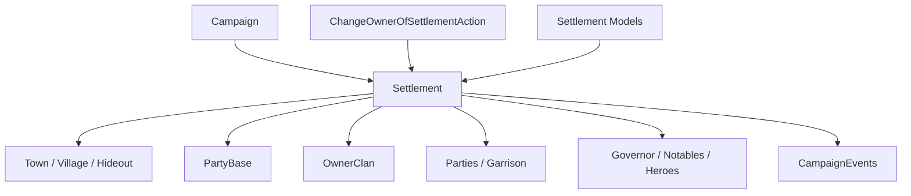

# Settlement

**命名空间:** `TaleWorlds.CampaignSystem.Settlements`  
**模块:** `TaleWorlds.CampaignSystem`  
**类型:** `public sealed class Settlement : MBObjectBase, ILocatable<Settlement>, ITrackableCampaignObject, ITrackableBase, IRandomOwner`  
**基类:** [MBObjectBase](../../core/MBObjectBase)  
**源文件:** `bin/TaleWorlds.CampaignSystem/TaleWorlds.CampaignSystem.Settlements/Settlement.cs`

## 一句话职责

`Settlement` 是战役地图上的据点容器，统一承载城镇、村庄或藏身处的组件、PartyBase、驻军/驻留队伍、英雄、领地所有权和攻城状态。它适合用来读取据点及其组件的状态；转移所有权、移动队伍或处理攻城时，必须走对应的 Action 和事件流程，避免只更新一个缓存字段而留下不同步的世界状态。

## 心智模型

### 它是什么

`Settlement` 是地图上的稳定节点，具体玩法由 `Town`、`Village` 或 `Hideout` 组件提供。它同时拥有一个 [PartyBase](../PartyBase)，所以据点可以参与遭遇、驻军和物品库存；`Parties`、`HeroesWithoutParty`、`Notables`、`BoundVillages` 和 `SiegeEvent` 描述其动态内容。

据点的 `Owner` 实际来自 `OwnerClan.Leader`。因此“据点换主人”不是简单写一个 Hero 或 Clan 字段：必须通过 [ChangeOwnerOfSettlementAction](../../campaign-ext/ChangeOwnerOfSettlementAction) 让领地、驻军、总督、绑定村庄、地图事件和通知一起更新。

### 生命周期与持有关系

- **创建/注册：** 构造函数建立据点的 PartyBase；XML 反序列化再绑定 `SettlementComponent` 和 Town/Village/Hideout。
- **运行中：** `Clan` 持有领地关系，`MobileParty` 进入/离开据点，`Hero` 可以作为总督、无派对角色或囚犯停留，`SiegeEvent` 和 MapEvent 读取据点状态。
- **经济/军事：** 墙体、忠诚、安全、民兵、繁荣和经济由对应 Model 或组件计算；Settlement 提供状态和关系，不是所有规则的计算器。
- **读档/迁移：** 据点组件、Party、领地和缓存会按加载顺序重建；保存到自定义 Behavior 时只保存稳定 ID，不保存 `Settlement.Party` 或缓存列表实例。

### 何时用，何时不用

- **使用：** 查当前据点、类型、所有者、驻军、驻留队伍、村庄绑定、英雄和围城状态。
- **使用：** 通过 `Settlement.CurrentSettlement`、`Settlement.All`、`Settlement.Find` 或从 `MobileParty.CurrentSettlement` 获得已注册据点。
- **不要直接改 `OwnerClan`：** 用 `ChangeOwnerOfSettlementAction`；直接 setter 不能完成驻军、总督、地图事件和领地缓存的全链路更新。
- **不要把 `Town`、`Village`、`Hideout` 当作互换组件：** 先检查 `IsTown`、`IsVillage`、`IsHideout`，再访问对应组件。
- **不要在没有 Campaign 或地图状态未建立时访问 `CurrentSettlement`：** 静态入口依赖当前 Campaign 和玩家地图位置。

## 依赖图



### 上游与持有者

- [Campaign](../Campaign) 提供 `Settlements` 集合、时间、模型和地图事件；`Settlement.All` 只能在活动 Campaign 使用。
- [Clan](../Clan) 通过 `OwnerClan` 连接所有权；[MobileParty](../MobileParty) 通过 `CurrentSettlement`、驻军和攻城连接移动层。
- [PartyBase](../PartyBase) 提供据点的交互外壳、物品和驻军 roster；Town/Village/Hideout 组件提供专门规则。

### 下游与变更入口

- [CampaignEvents](../CampaignEvents) 的据点进入、所有者改变、遭遇和围城事件是 Behavior 的观察点。
- [ChangeOwnerOfSettlementAction](../../campaign-ext/ChangeOwnerOfSettlementAction) 负责所有权级联；[EnterSettlementAction](../../campaign-ext/EnterSettlementAction) / [LeaveSettlementAction](../../campaign-ext/LeaveSettlementAction) 负责队伍进出。
- `SettlementEconomyModel`、`SettlementLoyaltyModel`、`SettlementSecurityModel`、`SettlementMilitiaModel` 等 Model 计算规则，不替代 Action。

## 关键成员与调用时机

### 类型、身份与所有者

| 成员 | 用途、副作用与时机 |
| --- | --- |
| `CurrentSettlement`、`All`、`Find`、`FindFirst` | 获取当前玩家据点、集合或稳定 ID 查询结果。加载和切换地图期间可能为空，结果应在使用处判空。 |
| `Town`、`Village`、`Hideout`、`IsTown`、`IsVillage`、`IsHideout` | 判断据点组件类型。只有对应类型存在时才能读取城镇经济、村庄产出或藏身处状态。 |
| `OwnerClan`、`Owner`、`MapFaction` | 读取政治所有者和地图阵营。`Owner` 依赖 `OwnerClan.Leader`，叛乱/加载中间态不要无条件访问。 |
| `Party`、`ItemRoster` | 读取据点 PartyBase 和物品；驻军/物品变更有 roster、经济和事件副作用，不要直接替换 Party。 |

### 动态内容与风险状态

| 成员 | 用途、副作用与时机 |
| --- | --- |
| `Parties`、`HeroesWithoutParty`、`Notables` | 读取当前驻留队伍、无派对英雄和要人缓存。它们会随进出、总督、囚禁和读档改变。 |
| `BoundVillages` | 读取与城镇绑定的村庄；领地所有权变化时由 Action/Settlement 流程维护，不要手动改列表。 |
| `IsUnderRaid`、`IsUnderSiege`、`SiegeEvent`、`LastAttackerParty` | 查询围城/劫掠/攻击方状态。地图事件中对象可能在回调后失效，处理前应保存稳定 ID 并重新获取。 |
| `MaxWallHitPoints`、`Prosperity`、`Security`、`Loyalty`、`Militia` | 读取组件/Model 计算的据点状态；这些数值可能由 daily tick 改变，不是通用写入入口。 |

## Action、事件与 Model 边界

| 目标 | 正确入口 | 风险 |
| --- | --- | --- |
| 转移城镇/村庄所有权 | `ChangeOwnerOfSettlementAction.ApplyByDefault` 或原因匹配的 Apply | 直接改 `OwnerClan` 会漏掉驻军、总督、绑定村庄和事件。 |
| 让队伍进出据点 | `EnterSettlementAction` / `LeaveSettlementAction` | 直接操作 `Parties` 或位置会破坏 PartyBase 与地图定位。 |
| 读取经济/忠诚/民兵 | `Campaign.Current.Models` 的 Settlement Model | Model 只计算结果；不要在每 tick 把结果写回另一份状态。 |
| 处理据点攻城 | `SiegeEvent`、Campaign 事件和对应 Action | 不要在 `IsUnderSiege` 为真时假定 owner、party 和 map event 可以立刻销毁。 |

## 风险边界

- **所有者空值：** 源码中的 `Owner` 通过 `OwnerClan.Leader` 取得；叛乱、领地转移和读档中间态可能没有可用 Owner，访问前必须检查 `OwnerClan`。
- **直接所有权 setter：** `Town.OwnerClan` 等局部 setter 会维护部分缓存，却不替代 ChangeOwner Action 的总督、驻军、地图事件和通知链。
- **Party 双向关系：** Settlement 的 PartyBase 与驻军/驻留队伍相互同步；直接清空 roster 或 Parties 会让队伍仍指向已移除据点。
- **围城/地图事件时机：** `SiegeEvent`、`MapEvent`、`LastAttackerParty` 可能在回调后变为 `null`；不能把这些运行时引用写入长期 Campaign 状态。
- **模型结果不是存档字段：** Prosperity、Security、Loyalty、Militia、墙体和经济值会被 Model/tick 更新；修改规则应替换 Model，修改世界应走 Action。
- **保存加载顺序：** SettlementComponent、Town/Village/Hideout、Party 和 OwnerClan 会分阶段恢复。自定义存档保存 `Settlement.StringId`，在加载完成后再 `Settlement.Find`。

## 真实示例

### 从当前玩家位置读取据点状态

```csharp
using TaleWorlds.CampaignSystem;

Settlement settlement = Settlement.CurrentSettlement;
if (settlement != null)
{
    bool underSiege = settlement.IsUnderSiege;
    Clan ownerClan = settlement.OwnerClan;
    int residentParties = settlement.Parties.Count;
}
```

据点来自当前玩家地图位置；`OwnerClan` 在叛乱或所有权过渡时可能为空，`Parties` 也会随地图 tick 改变。

### 通过稳定 ID 查找据点并读取组件

```csharp
using TaleWorlds.CampaignSystem;

Settlement town = Settlement.Find("town_1");
if (town != null && town.IsTown && town.Town != null)
{
    float prosperity = town.Town.Prosperity;
    var boundVillages = town.BoundVillages;
}
```

`Find` 返回当前 Campaign 注册对象；组件类型需要先检查。若目标是换主人，应把该对象交给 `ChangeOwnerOfSettlementAction`，不要写 `OwnerClan`。

## 版本注记

本页以 v1.4.5 `TaleWorlds.CampaignSystem.Settlements/Settlement.cs`、Town、Village、Hideout、PartyBase 和所有权 Action 源码为准。跨版本使用时重新确认组件初始化、所有权 setter 和 siege 事件参数。

## 导航

- ↑ 父级：[Campaign API](../)
- ↔ 同级：[Hero](../Hero) · [Clan](../Clan) · [Kingdom](../Kingdom) · [MobileParty](../MobileParty) · [PartyBase](../PartyBase)
- 子级/相关：[Town](../Town) · [Village](../Village) · [Hideout](../Hideout) · [CampaignEvents](../CampaignEvents) · [ChangeOwnerOfSettlementAction](../../campaign-ext/ChangeOwnerOfSettlementAction) · [EnterSettlementAction](../../campaign-ext/EnterSettlementAction) · [SettlementEconomyModel](../SettlementEconomyModel) · [SettlementLoyaltyModel](../SettlementLoyaltyModel)
