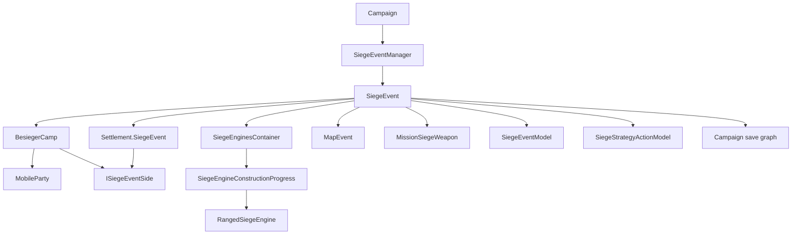

# SiegeEvent

**命名空间：** `TaleWorlds.CampaignSystem.Siege`
**模块：** `TaleWorlds.CampaignSystem`
**类型：** `public class SiegeEvent`
**基类：** 无；它不是 `MBObjectBase`
**源文件：** `bin/TaleWorlds.CampaignSystem/TaleWorlds.CampaignSystem.Siege/SiegeEvent.cs`

## 一句话职责

它保存并推进“某个据点正在被围攻”的战役层事实：被围据点、攻城营、攻守两侧的器械和炮击状态，以及围城与 `MapEvent`、玩家 siege mission 之间的边界。

## 心智模型

`SiegeEvent` 是战役地图上的“围城记录”，不是一场 Mission，也不是 `MapEvent` 本身。一个对象对应一个被围据点；构造时把 `Settlement.SiegeEvent` 指向自己，并创建一个 `BesiegerCamp` 作为攻方。被围的 `Settlement` 自己实现 `ISiegeEventSide`，因此攻方和守方都可以用同一组侧面操作访问。

对象的所有权和生命周期由 `Campaign.Current.SiegeEventManager` 管理。正常创建路径是 `SiegeEventManager.StartSiegeEvent(settlement, besiegerParty)`，它会构造对象、放入管理器列表并刷新据点视觉。遭遇流程也会在部队抵达一个尚未被围的据点时走这个入口。mod 通常应从 `Settlement.SiegeEvent`、`PlayerSiege.PlayerSiegeEvent` 或 `Campaign.Current.SiegeEventManager.SiegeEvents` 读取，**不要直接调用 `SiegeEvent` 构造函数**。

围城在战役 tick 中推进，而不是由 mod 手动驱动。每次 `Campaign` 的 `RealTick` 都会让 `SiegeEventManager.Tick` 遍历列表；只要时间增量非零、攻城方领袖和据点没有正在进行的 `MapEvent`，`SiegeEvent.Tick` 就依次为攻方和守方执行：

1. `AdvanceStrategy` 让 `SiegeStrategyActionModel` 决定造、部署、撤回、拆除还是待命。
2. `ConstructionTick` 推进器械建造和重新部署。
3. `BombardTick` 消费已到达的炮弹，再为就绪的远程器械生成新的炮击决策。

因此，围城和战斗是两个层次：突击、出城、封锁战各自是 `MapEvent`；战斗会暂时阻止围城器械 tick，结算时再把胜负写回 `SiegeEvent`。玩家真正进入 siege mission 时，战役层器械会被投影为 `MissionSiegeWeapon`，任务结束后的血量/摧毁状态必须通过回写入口同步回战役层。

## 攻守两侧

| `BattleSideEnum` | 实际对象 | 侧面职责 |
| --- | --- | --- |
| `Attacker` | `BesiegerCamp` | 保存围攻方部队、领袖、派系、攻城策略、攻方器械和攻方炮弹。 |
| `Defender` | `BesiegedSettlement`，即 `Settlement` | 保存守方策略、守方器械、炮弹、守军伤亡，并通过 `EncounterModel` 提供据点防守方部队。 |

通过 `GetSiegeEventSide` 取得一侧，而不是把 `Settlement` 强转为另一个专用守方类型：

```csharp
SiegeEvent siegeEvent = PlayerSiege.PlayerSiegeEvent;
if (siegeEvent != null && !siegeEvent.ReadyToBeRemoved)
{
    ISiegeEventSide attacker = siegeEvent.GetSiegeEventSide(BattleSideEnum.Attacker);
    ISiegeEventSide defender = siegeEvent.GetSiegeEventSide(BattleSideEnum.Defender);

    Dictionary<SiegeEngineType, int> attackerEngines =
        siegeEvent.GetPreparedSiegeEnginesAsDictionary(attacker);
    Dictionary<SiegeEngineType, int> defenderEngines =
        siegeEvent.GetPreparedSiegeEnginesAsDictionary(defender);
}
```

`ISiegeEventSide` 的共同契约包括 `SiegeEngines`、`SiegeEngineMissiles`、`SiegeStrategy`、参战方枚举、伤亡累计、目标选择和侧面收尾。`BesiegerCamp` 的参战方来自内部 `MobileParty` 列表；封锁战类型只纳入具备海军航行能力的攻方部队。`Settlement` 的参战方则委托给 `Campaign.Current.Models.EncounterModel`。

## 依赖图



- [Campaign](../Campaign/) 持有 `SiegeEventManager`，并在战役时间推进时驱动它。
- [SiegeEventManager](../SiegeEventManager/) 是创建、持有、tick 和读档后遍历的管理器；`SiegeEvent` 不是对象管理器中的 `MBObjectBase`。
- [SaveManager](../../save-system/SaveManager/) 负责围城保存图的序列化与恢复；围城对象应通过 Campaign 读档流程重建，不应由 Behavior 自己序列化运行时引用。
- [Settlement](../Settlement/) 的 `SiegeEvent` 是“该据点是否正在被围”的最直接入口。构造和收尾流程维护这个引用，mod 不应直接写 `null`。
- [BesiegerCamp](../BesiegerCamp/) 是攻方 `ISiegeEventSide`，把攻城部队的加入、离开和领袖变化反映到围城。
- [MapEvent](../MapEvent/) 表示围城中的突击、出城、封锁等具体战斗；它结束时调用 `OnBeforeSiegeEventEnd`，但不等于围城对象。
- [SiegeEventModel](../SiegeEventModel/) 提供建造速度、器械血量、伤害、命中率、装填时间和预置器械等规则；`SiegeEvent` 只负责按这些规则编排状态转移。
- [SiegeStrategyActionModel](../SiegeStrategyActionModel/) 提供“下一步动作”的决策；`AdvanceStrategy` 再把结果交给 `DoSiegeAction`。
- [CampaignEvents](../CampaignEvents/) / [CampaignEventDispatcher](../CampaignEventDispatcher/) 接收开始、结束、器械建成、炮击命中、器械摧毁和封锁开关等通知。
- [CampaignMission](../CampaignMission/) 和 [MissionSiegeWeapon](../../core-extra/MissionSiegeWeapon/) 是战役器械进入 siege mission 的投影边界；任务内的 [Mission](../../mission/Mission/) 不应被存进 Campaign 状态。

## 如何获取

最常用的读取方式是先从当前玩家相关的据点或静态玩家入口取得，再判空：

```csharp
using TaleWorlds.CampaignSystem.Party;
using TaleWorlds.CampaignSystem.Settlements;
using TaleWorlds.CampaignSystem.Siege;

Settlement besieged = MobileParty.MainParty.BesiegedSettlement;
SiegeEvent siegeEvent = besieged?.SiegeEvent;
if (siegeEvent != null && !siegeEvent.ReadyToBeRemoved)
{
    string label = siegeEvent.ToString();
}
```

`MobileParty.BesiegedSettlement` 对攻城方队伍通过 `BesiegerCamp.SiegeEvent` 得到据点；守方或菜单逻辑更稳妥的入口是 `PlayerSiege.PlayerSiegeEvent`。要扫描整个战役中的围城，可以遍历管理器保存的只读列表：

```csharp
using System.Linq;
using TaleWorlds.CampaignSystem;
using TaleWorlds.CampaignSystem.Siege;

SiegeEvent siegeEvent = Campaign.Current.SiegeEventManager.SiegeEvents
    .FirstOrDefault(item => !item.ReadyToBeRemoved);
if (siegeEvent != null)
{
    Settlement settlement = siegeEvent.BesiegedSettlement;
    BesiegerCamp camp = siegeEvent.BesiegerCamp;
}
```

`Campaign.Current`、`SiegeEventManager` 和 `Settlement.SiegeEvent` 都要求当前 Campaign 已建立且读档已完成。不要从 `MBObjectManager` 查询 `SiegeEvent`，也不要把上一次读档的对象引用缓存到自己的 Behavior 中。

## 生命周期与 MapEvent 边界

### 创建

`SiegeEventManager.StartSiegeEvent` 调用构造函数。构造函数会：

- 将 `settlement.SiegeEvent` 设为当前对象，并把 `besiegerParty.BesiegerCamp` 指向新建的 `BesiegerCamp`。
- 初始化攻守两侧的 `SiegeEnginesContainer`、策略和炮弹列表。
- 记录 `SiegeStartTime = CampaignTime.Now`。
- 如果攻城方领袖与据点家族领袖满足条件，施加一次关系变化；这不是无副作用的工厂。
- 据点有港口且攻城方有船时调用 `ActivateBlockade`。
- 发布 `OnSiegeEventStarted`，并刷新据点视觉和等级遮罩。

这也是为什么直接构造或手动给 `Settlement.SiegeEvent` 赋值会破坏反向引用、关系事件、器械初始化和管理器列表。

### `Tick(float dt)`

`SiegeEventManager.Tick` 只会对尚未 `ReadyToBeRemoved` 的对象调用 `Tick`。`Tick` 的实际防护条件是 `CampaignTime.DeltaTime != CampaignTime.Zero`，且 `BesiegerCamp.LeaderParty.MapEvent == null`、`BesiegedSettlement.Party.MapEvent == null`。满足后先让攻城方清理已改变默认行为的部队，再依次推进攻方和守方。

`dt` 参数本身不是建造速度的来源；建造和重新部署使用全局的 `CampaignTime.DeltaTime`。因此不要在 `Campaign` tick 之外自行累加 `dt`，也不要在 `MapEvent` 仍存在时强行补一次 tick。

### `ConstructionTick(ISiegeEventSide)`

每次只选一个待建造项目：攻方若有尚未激活的 `SiegePreparations`，优先推进准备阶段；否则从已部署列表中找到第一个未完成且不在重新部署的器械。进度由 `Campaign.Current.Models.SiegeEventModel.GetConstructionProgressPerHour` 计算，再按 Campaign 时间增量增加并限制在 `0` 到 `1`。

当 `Progress >= 1` 且不在重新部署时，项目变为 `IsActive`，`CreateSiegeObject` 会为远程器械创建 `RangedSiegeEngine`，发布器械建成事件并标记据点视觉。正在重新部署的已建成器械以每小时 `0.5` 的速度推进 `RedeploymentProgress`，完成后才能再次激活。过期的 `RemovedSiegeEngine` 也在这里清理。

### `BombardTick(ISiegeEventSide)`

时间暂停时该方法立即返回。随后它消费已经到达且命中的 `SiegeEngineMissile`：目标可以是城墙或对方远程器械；命中会调用 `SiegeEventModel.GetSiegeEngineDamage`，必要时从部署位移除被摧毁器械，并发布炮击/摧毁事件。过期炮弹会从两侧的炮弹列表清除。

接着遍历当前侧已激活、可装填、仍有血量的远程器械。它先让 `RangedSiegeEngine` 重新装填，再由侧面 `GetAttackTarget` 选择目标，调用 `OnFireDecisionTaken` 记录当前目标、上一目标和下一次装填时间，按 `GetSiegeEngineHitChance` 掷命中结果，并创建带有未来碰撞时间的 `SiegeEngineMissile`。这是一套战役层的离散炮击，不是 Mission 中逐帧的弹道模拟。

### `MapEvent` 与收尾

`MapEventManager.StartSiegeMapEvent`、`StartSiegeOutsideMapEvent` 和封锁战入口创建具体地图战斗。`MapEvent` 的 `FinishBattleAndKeepSiegeEvent` 可以让一场战斗结束但保留围城；普通结算在 `FinalizeEvent` 阶段会对攻城、出城和封锁相关战斗调用 `SiegeEvent.OnBeforeSiegeEventEnd`。

该回调只把 `SallyOut`、`Siege` 和 `SiegeOutside` 的胜负写入内部的攻城方败北标记。它不负责清空 `Settlement.SiegeEvent`。战斗本身结束后，围城可能继续存在，也可能由战斗结果或攻城方离开进入 `FinalizeSiegeEvent`。

## 策略与器械动作

### `AdvanceStrategy` 与 `SiegeStrategyActionModel`

`AdvanceStrategy` 不自己决定器械配置，而是调用：

```csharp
Campaign.Current.Models.SiegeStrategyActionModel
    .GetLogicalActionForStrategy(
        side,
        out SiegeStrategyActionModel.SiegeAction action,
        out SiegeEngineType engineType,
        out int deploymentIndex,
        out int reserveIndex);
```

随后把四个输出交给 `DoSiegeAction`。默认模型对 `DefaultSiegeStrategies.Custom` 返回 `Hold`；攻方和守方支持的策略集合不同，不能把一个策略名无条件套到另一侧。`SiegeStrategyActionModel` 是可替换的决策边界，`SiegeEvent` 是执行边界。

### `DoSiegeAction`

它执行五种 `SiegeAction`：

| 动作 | 实际副作用 |
| --- | --- |
| `ConstructNewSiegeEngine` | 通过 `SiegeEventModel.GetSiegeEngineHitPoints` 创建 `Progress = 0` 的器械，并放入部署槽。 |
| `DeploySiegeEngineFromReserve` | 从 `ReservedSiegeEngines[reserveIndex]` 取出项目，放入部署槽；原槽位器械会被移回预备队并重新部署。 |
| `MoveSiegeEngineToReserve` | 从部署槽移回预备队，开始重新部署计时。 |
| `RemoveDeployedSiegeEngine` | 从部署槽移除且不放回预备队。 |
| `Hold` | 不改变器械布局。 |

构造新器械或部署器械都会刷新据点视觉。`deploymentIndex` 和 `reserveIndex` 必须分别来自对应容器的有效数组/列表；容器方法直接索引数组，没有为 mod 做范围保护。未知枚举值会抛出 `ArgumentOutOfRangeException`。

### `BreakSiegeEngine`

它只寻找指定一侧指定类型中一台**已激活**的器械。`DefaultSiegeEngineTypes.Preparations` 在攻方会把准备进度清零；远程和近战器械则从对应部署数组移除，不进入预备队。器械被炮击摧毁时也是通过这条执行路径完成状态移除。

编程式拆除应在 Campaign 事件回调或与 tick 不重叠的时机进行：

```csharp
using TaleWorlds.CampaignSystem.Party;
using TaleWorlds.CampaignSystem.Siege;
using TaleWorlds.Core;

Settlement besieged = MobileParty.MainParty.BesiegedSettlement;
SiegeEvent siegeEvent = besieged?.SiegeEvent;
if (siegeEvent != null && !siegeEvent.ReadyToBeRemoved)
{
    ISiegeEventSide attacker = siegeEvent.GetSiegeEventSide(BattleSideEnum.Attacker);
    siegeEvent.BreakSiegeEngine(attacker, DefaultSiegeEngineTypes.SiegeTower);
}
```

没有匹配的激活器械时该方法不会抛出，只会不做拆除；这不代表传入的侧面或围城引用可以为 `null`。

## 嵌套状态类型

### `SiegeEngineConstructionProgress`

它是单台器械的战役记录。构造函数把 `Hitpoints` 初始化为 `MaxHitPoints`，把 `RedeploymentProgress` 初始化为 `1`，并保留传入的 `Progress`。关键派生状态是：

- `IsConstructed`：`Progress >= 1f`。
- `IsBeingRedeployed`：`RedeploymentProgress < 1f`。
- `IsActive`：已经建成且不在重新部署。
- `SiegeEngine` / `MaxHitPoints`：器械类型和该次围城计算出的生命上限。
- `Hitpoints`：当前战役层血量，炮击和任务回写都会改变它。
- `RangedSiegeEngine`：远程器械建成后由 `CreateSiegeObject` 生成；近战器械通常为 `null`。

`SetProgress`、`SetHitpoints`、`SetRedeploymentProgress` 和 `SetRangedSiegeEngine` 都是公开写入口，但自身不做范围校验。正常进度修改应交给 `ConstructionTick`，正常器械移除应交给 `DoSiegeAction` 或 `BreakSiegeEngine`；直接写出负血量、超过 `1` 的进度或错误的远程子状态，会让 `IsActive`、策略计数和 mission 投影互相矛盾。

### `RangedSiegeEngine`

它是远程器械的炮击子状态，不是地图上的场景对象。`EngineType` 标识器械；`NextTimeEngineCanBombard`、`LastBombardTime` 和 `IsReadyToFire` 描述装填窗口；`CurrentTargetType`/`CurrentTargetIndex` 保存当前目标，`PreviousDamagedTargetType`/`PreviousTargetIndex` 保存上一次受损目标；`AlreadyFired` 防止同一装填窗口重复决策；`NextProjectileCollisionTime` 是任务或 UI 需要的下一次碰撞时间投影。

`Hold` 清除当前目标，`Reload` 清除 `AlreadyFired`，`OnFireDecisionTaken` 会记录上一目标、当前目标、开火时间并按 model 计算下一次可炮击时间。这三个方法属于 `BombardTick` 的协议；不要在 UI 或每帧自定义逻辑中手动调用，否则可能重复生成炮弹或跳过装填规则。

### `SiegeEnginesContainer`

每个 `ISiegeEventSide` 有一个容器。攻方数组容量是 `3` 个近战槽和 `4` 个远程槽；守方是 `0` 个近战槽和 `4` 个远程槽。守方的 `SiegePreparations` 为 `null`，攻方则有 `DefaultSiegeEngineTypes.Preparations` 记录准备阶段。

| 状态 | 读取入口 | 含义 |
| --- | --- | --- |
| 已部署 | `DeployedSiegeEngines`、`DeployedRangedSiegeEngines`、`DeployedMeleeSiegeEngines` | 已占用部署位的项目；列表只读视图和数组都可能包含尚未建成或正在重新部署的项目。 |
| 预备 | `ReservedSiegeEngines` | 已拥有但未占用部署位的项目。预制器械加入预备队时会被设为建成，但 `RedeploymentProgress` 先设为 `0`。 |
| 统计 | `DeployedSiegeEngineTypesCount`、`ReservedSiegeEngineTypesCount` | 由容器维护的类型计数，供策略模型读取。 |
| 已移除 | `RemovedSiegeEngines` | 带 `RemovalTime` 和原槽位的延迟清理记录，不会由 `AllSiegeEngines()` 返回。 |

`AllSiegeEngines()` 依次枚举准备项目、部署列表和预备列表。`AddPrebuiltEngineToReserve`、`DeploySiegeEngineAtIndex`、`RemoveDeployedSiegeEngine`、`RemovedSiegeEngineFromReservedSiegeEngines`、`FindDeploymentIndexOfDeployedEngine` 和 `ClearRemovedEnginesIfNecessary` 是公开的容器操作；优先让 `SiegeEvent` 通过 `DoSiegeAction` 编排它们。公开的 `readonly` 部署数组仍然允许修改元素，直接改数组会绕过列表和类型计数刷新，属于高风险用法。

### `SiegeEngineMissile`

这是战役层炮击的不可变快照，保存射手类型/槽位、目标类型/槽位、目标器械引用、是否命中、碰撞时间和开火决策时间。它由 `BombardTick` 创建并存入侧面的 `SiegeEngineMissiles`；双方侧面都会在 tick 中消费和清理。不要跨越围城生命周期缓存其中的 `TargetSiegeEngine` 引用。

## 围城状态与封锁

- `BesiegedSettlement` 和 `BesiegerCamp` 是构造时固定的两端；它们不是可替换的临时视图。
- `SiegeStartTime` 是围城开始时刻。`SiegeWallSeed` 和 `SiegePeopleSeed` 使用它、据点 StringId、墙体血量和双方伤亡数生成确定性种子，适合显示/模拟读取，不应当被当作存档 ID。
- `IsPlayerSiegeEvent` 通过攻城营领袖是否为主部队，或 `PlayerSiege.PlayerSiegeEvent == this` 判断玩家关联。收尾期间玩家菜单和领袖引用都可能变化，不能把它作为跨帧的永久身份。
- `ReadyToBeRemoved` 实现为 `BesiegedSettlement.Party.SiegeEvent == null`。它为真后，管理器下一次 tick 才会把对象从列表移除。
- `GetCurrentBattleType` 在攻城营领袖有 `MapEvent` 时返回其 `EventType`，否则返回 `MapEvent.BattleTypes.Siege`；`IsPartyInvolved` 会按这个类型合并攻守参战方。
- `CanPartyJoinSide` 以双方参战方的 `IFaction.IsAtWarWith` 关系判断加入资格：目标侧不能与候选方交战，另一侧必须与候选方交战。它是查询，不会把部队加入围城。

`ActivateBlockade` 和 `DeactivateBlockade` 是海上封锁状态开关。新围城在据点有港口且攻城方至少有船时自动激活；激活会发布 `OnBlockadeActivated`、刷新海军视觉，并在主部队属于攻方时禁用 `MobileParty.MainParty.Anchor`。停用会反向恢复主部队锚点并发布 `OnBlockadeDeactivated`。`BlockadeShouldBeActivated` 是“应当激活但尚未完成激活”的持久化标记，不等同于 `IsBlockadeActive`；旧存档加载时 `OnAfterLoad` 会依据版本和该标记补激活。

## siege mission 同步

`GetPreparedAndActiveSiegeEngines` 只返回一侧 `DeployedSiegeEngines` 中同时满足以下条件的项目：`IsActive`、`Hitpoints > 0`、类型不是 `Preparations`。每个项目会被转换为 `MissionSiegeWeapon.CreateCampaignWeapon(type, index, health, maxHealth)`。

`PlayerSiege.StartSiegeMission` 和 siege ambush 入口在 `Settlement.SiegeState.OnTheWalls` 阶段分别取得攻守两侧列表，再传给 `CampaignMission.OpenSiegeMissionWithDeployment`。因此 mission 看到的是进入任务瞬间的战役快照，不会自动替代 `SiegeEvent` 的持续状态。

任务结束后，`SetSiegeEngineStatesAfterSiegeMission(attackerData, defenderData)` 是把 `IEnumerable<IMissionSiegeWeapon>` 回写到攻守两侧的公开入口：有正血量的远程器械会更新 `Hitpoints`；被摧毁的项目会走 `BreakSiegeEngine`。正常 mission 和 siege ambush 对近战器械的处理条件不同，不能把所有任务武器都当作同一种回写数据。

当前 v1.4.5 反编译源码中能确认的是：战役层明确提供了这个回写方法，而在 `PlayerSiege`/`PlayerEncounter` 的公开启动路径中只看到“导出到 mission”，没有找到一个普遍自动调用该回写方法的调用点。自定义 siege mission 若绕开原生结算，必须在拿到 `IMissionSiegeWeapon` 集合后主动回写；否则战役层血量会停留在进场前，下一次炮击或重新进入任务会使用过期状态。

## `SiegeEventModel` 与策略模型边界

`Campaign.Current.Models.SiegeEventModel` 是规则提供者，不是 `SiegeEvent` 的存储替代物。源码中它至少参与：

- `GetConstructionProgressPerHour`：按侧面有效部队、工程技能、据点建筑和 perk 计算建造速度。
- `GetSiegeEngineHitPoints`：计算当前围城、器械类型和攻守侧的最大血量。
- `GetSiegeEngineDamage`、`GetSiegeEngineHitChance`、`GetRangedSiegeEngineReloadTime`：控制炮击结果和节奏。
- `GetPrebuiltSiegeEnginesOfSettlement`、`GetPrebuiltSiegeEnginesOfSiegeCamp`：初始化守方和攻方预制器械。
- `GetAvailableManDayPower`、有效攻城部队和其他可用器械查询：为模型和策略提供输入。

`Campaign.Current.Models.SiegeStrategyActionModel` 只负责把一侧当前的 `SiegeStrategy` 翻译成 `SiegeAction`、器械类型和两个索引。`AdvanceStrategy` 再调用 `DoSiegeAction`。替换 model 时必须在 Campaign 建立前注册一个非空、契约一致的实现；返回负索引、不存在的预备器械、越界部署位、负建造速度或无效血量都会把错误留到 tick、炮击或 mission 投影阶段。

## 收尾与读档

### `FinalizeSiegeEvent`

它不是“把一个字段置空”的轻量清理：会发布 `OnSiegeEventEnded`，处理玩家 siege 状态和菜单，调用攻城营与据点两侧的 `FinalizeSiegeEvent`，必要时结束仍挂在据点上的 `MapEvent`，再刷新守方驻军行为。`BesiegerCamp.FinalizeSiegeEvent` 清除攻城方部队；`Settlement.FinalizeSiegeEvent` 重置据点 siege state、把自己的 `SiegeEvent` 置为 `null` 并刷新 Party 状态。

不要在 `MapEvent` 的 assault 尚未 finalized 时强行调用，也不要只清 `Settlement.SiegeEvent`。前者可能触发 `BesiegerCamp.RemoveAllSiegeParties` 的阶段断言，后者会留下 `MobileParty.BesiegerCamp`、管理器列表和地图事件之间的悬空关系。应让原生撤围/战斗结算流程负责调用，若写自定义流程必须先遵守同一阶段顺序。

### `OnAfterLoad`

`Campaign` 会在 session start 阶段先处理地图事件，再让 `SiegeEventManager.OnAfterLoad` 遍历每个 `SiegeEvent`。对象随后调用 `BesiegerCamp.OnAfterLoad` 修复旧版本的领袖/派系引用；当加载版本早于 `v1.3.13.105378` 且 `BlockadeShouldBeActivated` 为真时补开封锁。容器自己的加载回调会重建只读计数包装。

`Settlement.AfterLoad` 还会检查“存在围城但没有攻城营领袖”的坏状态：若据点挂着 `MapEvent` 则先结束地图事件，否则结束围城。这个顺序说明读档后的 `LeaderParty` 不能假定非空；mod 在 `OnAfterLoad` 期间应重新通过 `Settlement.SiegeEvent` 获取对象，不要沿用读档前引用。

## 错误阶段、空引用与存档风险

- **没有 Campaign：** `Campaign.Current`、`Campaign.Current.Models`、`PlayerSiege.PlayerSiegeEvent` 和 `CampaignTime.Now` 依赖战役上下文。不要在模块加载、主菜单或 Campaign 销毁后访问它们。
- **入口为空：** `Settlement.SiegeEvent` 在未被围或已进入收尾时为 `null`；`ReadyToBeRemoved` 为真时不要再取器械或调用策略。
- **读档阶段领袖为空：** `Tick` 会访问 `BesiegerCamp.LeaderParty.MapEvent`；原生 `Settlement.AfterLoad` 会处理异常状态。自定义读档回调不能在领袖修复前驱动 tick。
- **错误的战斗阶段：** `Tick` 在双方有 `MapEvent` 时应暂停；`ConstructionTick`、`BombardTick`、`AdvanceStrategy` 和 `BreakSiegeEngine` 都是由管理器或战斗协议在正确阶段调用的入口。手动重复调用会重复建造、重复生成炮弹或与 `MapEvent` 结算竞争。
- **错误的 mission 状态：** `StartSiegeMission` 只为 `Settlement.SiegeState.OnTheWalls` 准备墙战投影；在其它阶段复用这条链路会触发原生断言或传入不匹配的场景数据。
- **索引和数组：** `DeploySiegeEngineAtIndex`、`RemoveDeployedSiegeEngine` 直接使用数组索引，没有安全范围检查；不要把 `ReservedSiegeEngines` 的列表索引和部署槽索引混用。
- **绕过容器操作：** 直接改部署数组元素不会刷新 `DeployedSiegeEngineTypesCount`、列表或视觉；直接改进度/血量也不会发布器械建成、命中和摧毁事件。
- **回写数据长度：** `SetSiegeEngineStatesAfterSiegeMission` 会按活动部署项目从后向前读取任务集合；传入集合少于活动器械数会导致索引异常。自定义 mission 必须保留双方对应的武器集合和顺序。
- **持久化引用：** `SiegeEvent`、`BesiegerCamp`、`SiegeEngineConstructionProgress`、`RangedSiegeEngine` 和炮弹都属于 Campaign 存档图的一部分，由 [SaveManager](../../save-system/SaveManager/) 参与恢复。Behavior 不应把它们的运行时引用写进自己的长期状态；只保存稳定 ID、标量和自己定义的可序列化数据，读档后再从 `Campaign.Current` 获取。

## 导航

- ↑ 父级：[Campaign API](../)
- ↔ 同级：[SiegeEventManager](../SiegeEventManager/) · [BesiegerCamp](../BesiegerCamp/) · [ISiegeEventSide](../ISiegeEventSide/) · [Settlement](../Settlement/) · [MapEvent](../MapEvent/)
- 内部类型：`SiegeEngineConstructionProgress` · `RangedSiegeEngine` · `SiegeEnginesContainer` · `SiegeEngineMissile`
- 相关模型：[SiegeEventModel](../SiegeEventModel/) · [DefaultSiegeEventModel](../DefaultSiegeEventModel/) · [SiegeStrategyActionModel](../SiegeStrategyActionModel/) · [DefaultSiegeStrategyActionModel](../DefaultSiegeStrategyActionModel/)
- 相关战役/任务：[Campaign](../Campaign/) · [CampaignMission](../CampaignMission/) · [CampaignEvents](../CampaignEvents/) · [CampaignEventDispatcher](../CampaignEventDispatcher/) · [Mission](../../mission/Mission/) · [MissionSiegeWeapon](../../core-extra/MissionSiegeWeapon/) · [IMissionSiegeWeapon](../../core-extra/IMissionSiegeWeapon/)
- 相关实体：[MobileParty](../MobileParty/) · [PartyBase](../PartyBase/) · [Town](../Town/) · [DefaultSiegeEngineTypes](../../core-extra/DefaultSiegeEngineTypes/) · [SiegeBombardTargets](../SiegeBombardTargets/)
