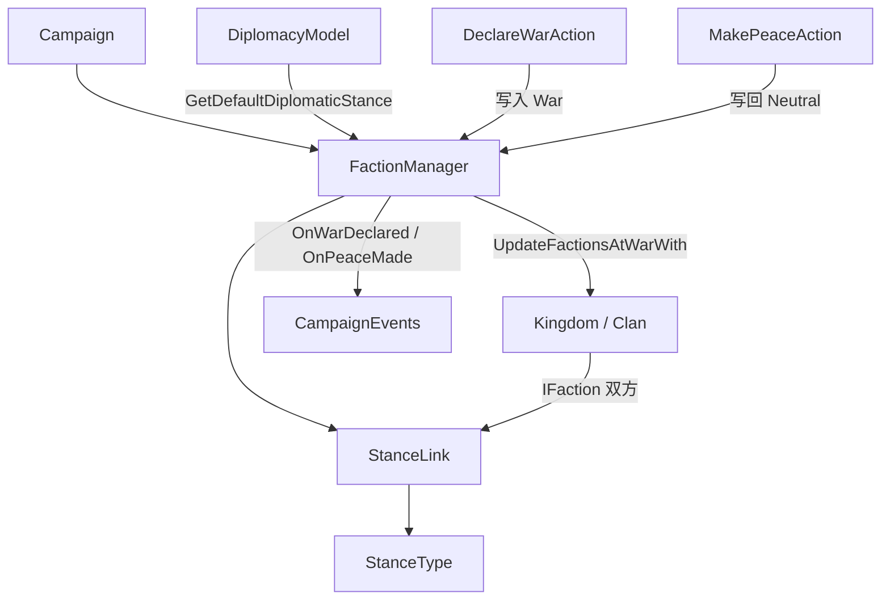

# StanceType

**命名空间：** `TaleWorlds.CampaignSystem`
**模块：** `TaleWorlds.CampaignSystem`
**类型：** `internal enum StanceType`
**源文件：** `bin/TaleWorlds.CampaignSystem/TaleWorlds.CampaignSystem/StanceType.cs`

## 概述

`StanceType` 是 CampaignSystem 中描述「两个派系之间当前是和平还是交战」的内部枚举，只有两个取值：`Neutral`（中立/和平）与 `War`（战争）。它不单独存在，而是内嵌在 [StanceLink](../StanceLink) 的 `_stanceType` 字段里，由 [FactionManager](../FactionManager) 集中持有——每当引擎需要判断两 faction（[Kingdom](../Kingdom) 或 [Clan](../Clan)）是否敌对、能否互相攻击、是否触发战争事件或计算贡金时，最终都回到这对 faction 的 `StanceLink.StanceType`。它是整个外交/战争状态机的「开关」，读取与变更都必须经过 [FactionManager](../FactionManager) 与外交 Action，绝不能直接当普通字段读写。

## 心智模型

不要把 `StanceType` 想成一个可以随处 new、随时赋值的普通枚举——它在源码里是 `internal enum`，并且永远住在 `StanceLink` 内部，由 [FactionManager](../FactionManager) 这唯一的管理者创建与维护。其生命周期是：当你（或引擎）首次查询任意两 faction 的关系时，`FactionManager.GetStanceLinkInternal(faction1, faction2)` 会懒加载一条 `StanceLink`，初始值由 `DiplomacyModel.GetDefaultDiplomaticStance` 决定（返回 `War` 姿态则为 `War`，否则为 `Neutral`）。之后读取姿态应走 `FactionManager.IsAtWarAgainstFaction` / `IsNeutralWithFaction` 或 `StanceLink.IsAtWar` / `IsNeutral`，不要自己缓存枚举值。写入姿态必须通过外交 Action（`DeclareWarAction.ApplyBy*`、`MakePeaceAction.Apply*`）或 `FactionManager.DeclareWar` / `FactionManager.SetNeutral`，它们内部都调用 `SetStance`，进而触发 `UpdateFactionsAtWarWith`、`ResetStats`、战争起止时间记录与 `OnMapEventContinuityNeedsUpdate` 等级联。直接给 `StanceLink.StanceType` 或 `_stanceType` 赋值会绕过这一切，留下坏状态。

## 枚举值

源码（`StanceType.cs`）仅定义了两个值，没有 `[Flags]`、没有注释、也没有显式赋整数，因此按 C# 枚举默认值规则：`Neutral = 0`（默认）、`War = 1`。

| 值 | 数值 | 语义 | 对战争 / 外交逻辑的影响 |
| --- | --- | --- | --- |
| `Neutral` | `0` | 两 faction 之间处于和平 / 中立关系。这是新关系的默认姿态（`GetDefaultDiplomaticStance` 不返回 `War` 时）。 | 双方不互为敌人：不能依「交战」逻辑互相攻击；可贸易、可结盟、可外交互动。`StanceLink.IsNeutral == true`。结束战争（`MakePeaceAction` / `FactionManager.SetNeutral`）会把它写回 `Neutral`，并在 setter 里 `ResetStats()`、记录 `PeaceDeclarationDate`、刷新地图事件连续性。 |
| `War` | `1` | 两 faction 处于正式交战状态。 | 双方互为敌人：可发动地图攻击、围城、触发战争事件、累计伤亡与战利品、缔结贡金条款。`StanceLink.IsAtWar == true`。进入战争（`DeclareWarAction` / `FactionManager.DeclareWar`）会 `ResetStats()`、记录 `WarStartDate`、并调用双方 `UpdateFactionsAtWarWith()` 刷新「交战中的派系」缓存。读档后 `FactionManager.AfterLoad` 还会对 `IsAtConstantWar` 但 `!IsAtWar` 的关系补写 `War`。 |

> 注意：枚举是 `internal` 的，mod 既不能新增取值，也无法直接引用 `StanceType` 类型本身；要改 / 读姿态必须经由上述公共入口。

## 何时使用 / 何时不要使用

**用：**
- 通过 `FactionManager.IsAtWarAgainstFaction(a, b)` / `IsNeutralWithFaction(a, b)` 判断两个 [IFaction](../IFaction)（如玩家的 `Clan.PlayerClan.MapFaction` 与某个 [Kingdom](../Kingdom)）是否处于战争 / 中立。
- 通过 `StanceLink.IsAtWar` / `IsNeutral` 在已拿到 `StanceLink` 时做守卫。
- 在自定义 `CampaignBehavior` 里监听战争 / 和平事件，依据姿态变化执行逻辑。

**不要用（用正确替代）：**
- 不要直接写 `stanceLink.StanceType = StanceType.War` 或去改 `_stanceType` 字段——这绕过了 `SetStance` 的全部级联（见风险）。改姿态一律走 [DeclareWarAction](../../campaign-ext/DeclareWarAction) / [MakePeaceAction](../../campaign-ext/MakePeaceAction)（首选，会带政治停滞、贡金、事件），或 `FactionManager.DeclareWar` / `FactionManager.SetNeutral`（仅做最小状态切换）。
- 不要用「关系值下降」或 `ChangeRelationAction` 来模拟战争——关系与外交姿态是两套独立系统，开战必须显式切换 `StanceType`。
- 不要缓存 `StanceType` 值做长期判断：姿态随时可能被外交 AI / 王国决策改写，每次都应经 `FactionManager` 重新查询。

## 依赖图



- **上游 / 持有者：** [Campaign](../Campaign) 持有 [FactionManager](../FactionManager)（`FactionManager.Instance`），后者集中维护所有 `StanceLink`；[Kingdom](../Kingdom) 与 [Clan](../Clan) 作为 `IFaction` 是每条 `StanceLink` 的双方；`DiplomacyModel`（经 `Campaign.Current.Models.DiplomacyModel`）决定新关系的初始姿态。
- **嵌套定义：** [StanceLink](../StanceLink) 是 `StanceType` 的唯一载体，字段 `_stanceType` 经 `StanceType` 属性暴露并触发级联。
- **下游 / 变更入口：** [DeclareWarAction](../../campaign-ext/DeclareWarAction) 与 [MakePeaceAction](../../campaign-ext/MakePeaceAction) 是改姿态的官方外交入口；`FactionManager.DeclareWar` / `SetNeutral` 是最低层切换；姿态变化经 [Campaign](../Campaign) 的事件系统广播给战争 AI、任务与 UI。

## 风险

- **绕过级联导致「交战缓存」失真**：直接改 `StanceType` 不会调用 `SetStance`，也就不会触发双方 `UpdateFactionsAtWarWith()`。结果：`IFaction` 持有的「当前交战派系列表」与真实姿态不一致，攻击判定、地图图标、AI 决策会基于过时状态。
- **战争统计不重置**：`StanceType` 的 setter 在进出 `War` 时会 `ResetStats()`（清空伤亡、围城、劫掠、贡金等累计）并记录 `WarStartDate` / `PeaceDeclarationDate`。直接赋值跳过这一步，会让上一次战争的统计污染新战争，或让和平后残留战争数据。
- **事件 / 合法性链断裂**：外交 Action 会发布 `OnWarDeclared` / `OnPeaceMade`、政治停滞与地图视觉刷新。直接改枚举值不会派发这些事件，依赖事件的 [Kingdom](../Kingdom) 决策、任务、脚本与 UI 收不到通知，轻则界面不同步，重则行为卡死。
- **读档修复依赖真实姿态**：`FactionManager.AfterLoad` 会遍历所有 `StanceLink`，对 `IsAtConstantWar` 但 `!IsAtWar` 的关系补写 `War`。若存档里的姿态本就错乱（例如被人手工篡改过），这个修复可能把不该开战的双方强行拉入战争。
- **引用已灭 faction 悬空**：[FactionManager](../FactionManager) 在每日 tick 中会对 `IsEliminated` 任一方的关系调用 `RemoveStance` 删除 `StanceLink`。外部若缓存了某条 `StanceLink` 引用，在对方被灭后该引用会失效，使用前应重新经 `FactionManager` 查询并判空。
- **序列化绑定固定枚举 id**：`SaveableTypeDefiner.AddEnumDefinition(typeof(StanceType), 2029)` 把该枚举以固定 id 写入存档。手动增删枚举值、改顺序或跨版本不兼容都会让读档解析失败或错位，可能坏档。
- **`internal` 不可扩展**：mod 无法直接引用或扩展 `StanceType`；任何「新增第三种姿态」的企图都无法被引擎的 `if (== StanceType.War)` 分支识别，应改用 `DiplomacyModel` 或自定义状态，而不是改这个枚举。

## 成员说明

`StanceType` 本身无方法成员，其「语义」完全体现在两个取值与内嵌它的 [StanceLink](../StanceLink) 上：

| 成员 | 语义与访问方式 |
| --- | --- |
| `Neutral` | 和平 / 中立取值（`= 0`）。读取用 `StanceLink.IsNeutral` 或 `FactionManager.IsNeutralWithFaction(a, b)`；要回到此状态用 [MakePeaceAction](../../campaign-ext/MakePeaceAction) 或 `FactionManager.SetNeutral`。 |
| `War` | 交战取值（`= 1`）。读取用 `StanceLink.IsAtWar` 或 `FactionManager.IsAtWarAgainstFaction(a, b)`；要进入此状态用 [DeclareWarAction](../../campaign-ext/DeclareWarAction) 或 `FactionManager.DeclareWar`。 |
| `StanceLink.StanceType`（属性，internal） | 内嵌在 [StanceLink](../StanceLink) 上的当前姿态。setter 是唯一会触发 `ResetStats`、`UpdateFactionsAtWarWith` 与事件刷新的写入点；外部不应直接赋值。 |

## 示例

### 示例 1：读取玩家阵营与所有王国的外交姿态

```csharp
using TaleWorlds.CampaignSystem;

// 玩家阵营（Clan.PlayerClan.MapFaction 即玩家所属 IFaction）
IFaction playerFaction = Clan.PlayerClan.MapFaction;

// 遍历所有王国，依 StanceType 分流处理（读取经 FactionManager，内部走 GetStanceLinkInternal）
foreach (Kingdom kingdom in Campaign.Current.Kingdoms)
{
    if (kingdom == playerFaction)
    {
        continue; // 跳过自己
    }

    if (FactionManager.IsAtWarAgainstFaction(playerFaction, kingdom))
    {
        // 当前姿态为 War：双方互为敌人，可走战争逻辑
    }
    else if (FactionManager.IsNeutralWithFaction(playerFaction, kingdom))
    {
        // 当前姿态为 Neutral：和平 / 中立，可走外交 / 贸易逻辑
    }
}
```

`IsAtWarAgainstFaction` / `IsNeutralWithFaction` 内部都经 `GetStanceLinkInternal` 取真实的 `StanceLink.StanceType`；姿态可能随外交 AI 改变，每次判断都重新查询，不要缓存结果。

### 示例 2：通过外交 Action 切换姿态（正确入口）

```csharp
using TaleWorlds.CampaignSystem;
using TaleWorlds.CampaignSystem.Actions;

IFaction playerFaction = Clan.PlayerClan.MapFaction;

// 取一个与玩家阵营中立的王国作为目标
Kingdom target = null;
foreach (Kingdom kingdom in Campaign.Current.Kingdoms)
{
    if (kingdom != playerFaction && FactionManager.IsNeutralWithFaction(playerFaction, kingdom))
    {
        target = kingdom;
        break;
    }
}

if (target != null)
{
    // 进入 War 姿态：写入 StanceType.War + 政治停滞 + OnWarDeclared 事件
    DeclareWarAction.ApplyByKingdomDecision(playerFaction, target);

    // 之后回到 Neutral 姿态：写回 StanceType.Neutral + 重置统计 + OnPeaceMade
    // MakePeaceAction.Apply(playerFaction, target);
}
```

绝不要在这里直接写 `stanceLink.StanceType = StanceType.War`——那会跳过 `UpdateFactionsAtWarWith`、`ResetStats` 与事件广播。改姿态一律走 `DeclareWarAction` / `MakePeaceAction`（或至少 `FactionManager.DeclareWar` / `SetNeutral`）。

## 参见

- ↑ 父级：[战役 API 索引](../)
- ↔ 相关：[Campaign](../Campaign)（持有 FactionManager 与全部关系）· [FactionManager](../FactionManager)（StanceLink 与姿态的唯一管理者）· [StanceLink](../StanceLink)（`StanceType` 的载体）· [Kingdom](../Kingdom) · [Clan](../Clan)
- 改姿态的官方入口：[DeclareWarAction](../../campaign-ext/DeclareWarAction) · [MakePeaceAction](../../campaign-ext/MakePeaceAction)
