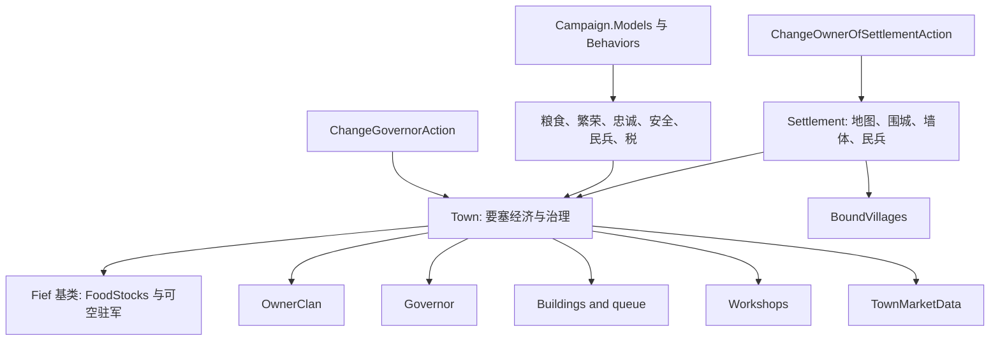

# Town

**命名空间：** `TaleWorlds.CampaignSystem.Settlements`  
**模块：** `TaleWorlds.CampaignSystem`  
**类型：** `public class Town : Fief`  
**基类：** `Fief`  
**源文件：** `bin/TaleWorlds.CampaignSystem/TaleWorlds.CampaignSystem.Settlements/Town.cs`  
**持久化角色：** `Settlement` 的城镇/城堡组件；主体字段和关联对象进入 Campaign 存档图。

## 概述与心智模型

`Town` 不是地图据点本身，而是附着在一个 [Settlement](../Settlement/) 上的要塞经济与治理层。同一个类型同时表示城市和城堡：`IsTown` / `IsCastle` 区分形态，`Settlement.Town` 是从空间、派对和围城实体进入此组件的正确路径。

应按三层理解归属边界。`Settlement` 持有地图位置、`Party`、`BoundVillages`、围城、墙体，以及实际的 `Militia` 值和其生成/转移民兵派对的副作用。[Fief](../Fief/) 基类贡献可保存的 `FoodStocks`，以及缓存且可空的 `GarrisonPartyComponent`（经 `GarrisonParty` 暴露）。`Town` 贡献要塞的经济与治理状态：领主家族、总督、建筑队列、工坊、市场、繁荣、忠诚、安全和贸易税累积值。因此 `Town.Militia` 只是到 `Settlement.Militia` 的继承式读取，不是 Town 自己存储的字段；`Town.DailyTick` 写入的粮食属于 `Fief.FoodStocks`。

在已启动的战役事件或 Campaign Behavior 中，用 `Settlement.All` 或 `Campaign.Current.AllTowns` / `AllCastles` 查找对象，再读取 `settlement.Town`。`Town.AllFiefs` 合并城市和城堡；它们都是当前 `Campaign.Current` 的只读视图。不要在主菜单、Campaign 尚未建立、读档未完成或 Campaign 已销毁时访问这些静态集合，也不要 `new Town()` 代替原生据点 XML/对象管理器初始化。

## 所有权、组件与依赖



| 关系 | 使用边界 |
| --- | --- |
| [Settlement](../Settlement/) | `Settlement.Town` 是组件入口，`Town.Settlement` 反向取得宿主。它拥有地图/围城/墙体状态和可变的民兵生命周期；`Settlement.OwnerClan` 对要塞委托给 `Town.OwnerClan`，对村庄则经其 `Bound` 据点解析。 |
| [Fief](../Fief/) | 基类拥有可保存的 `FoodStocks` 和缓存的 `GarrisonPartyComponent`；`GarrisonParty` 可以为 null。应从当前 Town 取得这个活跃派对，不能把它视为 Town 数值字段或可跨读档保存的 roster 引用。 |
| [Village](../Village/) | `Town.Villages` 是宿主的 `BoundVillages` 视图；`TradeBoundVillages` 是运行期缓存，表示贸易上指向该 Town 的村庄，不等同于所有绑定村庄。 |
| [Building](../Building/) 与 [Workshop](../Workshop/) | `Buildings`、`BuildingsInProgress` 和 `Workshops` 是经营资产；当前工程优先于默认项目。建造效果通过 `AddEffectOfBuildings` 输入模型，而非由页面代码自行相加。 |
| [Campaign](../Campaign/) | `Campaign.Current.Models` 提供经济、粮食、[忠诚](../SettlementLoyaltyModel/)、[安全](../SettlementSecurityModel/)、民兵、建造、[税](../SettlementTaxModel/)、[财务](../ClanFinanceModel/)和[总督资格](../ClanPoliticsModel/)模型；这些结果是当前规则，不是稳定常数。 |
| [Hero](../Hero/) | `Governor` 是领地总督，且会与 `Hero.GovernorOf` 保持双向关系。资格由 `ClanPoliticsModel` 决定；总督调动与事件必须经 [ChangeGovernorAction](../../campaign-ext/ChangeGovernorAction/)。 |
| Behaviors 与 campaign-ext Actions | [GarrisonRecruitmentCampaignBehavior](../GarrisonRecruitmentCampaignBehavior/) 在需要补充驻军时通过 `Settlement.AddGarrisonParty()` 创建并填充可空派对。归属改变应调用 [ChangeOwnerOfSettlementAction](../../campaign-ext/ChangeOwnerOfSettlementAction/)，总督委任应调用 [ChangeGovernorAction](../../campaign-ext/ChangeGovernorAction/)，销售应调用 [SellItemsAction](../../campaign-ext/SellItemsAction/)；这些生命周期由 dispatcher 通知行为。 |
| [SaveManager](../../save-system/SaveManager/) | Town、建筑、工坊、所有者、总督与市场数据是保存图的一部分；自定义状态只能在 Behavior 的 `SyncData` 中保存可序列化数据。 |

## 每日经济与状态结算

`Campaign.DailyTickSettlement` 会对村庄调用 `Village.DailyTick()`，对有 `Town` 的据点调用 `Town.DailyTick()`。因此模组通常应在每日事件之后读取结果，或替换相应 GameModel 来改变公式；不要手动补调 `DailyTick`，否则会重复加减状态。

`Town.DailyTick` 的实际次序是：将忠诚和安全加入各自模型的日变化；若原本有粮则通知拥有者消耗；加上食物变化、把粮食限制在 `0..FoodStocksUpperLimit()` 并更新 `RemainingFoodPercentage`；为拥有特定技能的总督处理关系收益；加入繁荣和民兵变化；最后按驻军模型修复城墙。`Prosperity` 下限为 0，`Loyalty` / `Security` 被裁剪到 0..100。`GetProsperityLevel` 的阈值是 2,000 和 5,000。

| 查询 | 来源与时机 | 重要副作用 |
| --- | --- | --- |
| `ProsperityChange` / `ProsperityChangeExplanation` | `SettlementProsperityModel.CalculateProsperityChange`；解释版适合 UI/诊断 | 日结才写入 `Prosperity`。 |
| `FoodChange`、`FoodChangeWithoutMarketStocks` | `SettlementFoodModel.CalculateTownFoodStocksChange` | 后者排除市场库存，不能代替真实日结；结果写入继承的 `Fief.FoodStocks`，上限还会加建筑粮仓效果。 |
| `LoyaltyChange`、`SecurityChange`、`MilitiaChange` | 各自的 Settlement Model | 文化、政策、问题、建筑、驻军、总督技能与市场销售都可能参与；`MilitiaChange` 写入 `Settlement.Militia`，读取任意结果都不改变世界。 |
| `Construction` | `BuildingConstructionModel.CalculateDailyConstructionPower` | 是当日施工能力，项目实际推进属于原生建造流程。 |
| `MarketData`、`GetItemPrice`、`GetItemCategoryPriceIndex` | TownMarketData | `GetItemPrice` 是报价查询；库存更新时 `OnInventoryUpdated` 才通知市场数据。 |
| `SoldItems` | 只读销售日志 | 民兵模型会把有“民兵奖励”分类的销量计入城市民兵变化；用 `SetSoldItems` 替换日志会改变后续模型输入。 |

默认民兵模型对城镇以繁荣、市场中的奖励物品、建筑、政策、问题、总督技能和叛乱忠诚度计算变化；对村庄则以炉灶数为主要输入。不要把 `Militia` 当纯数字缓存，`Settlement.Militia` 还会把已生成民兵派对和待生成民兵合并，并可触发派对创建或转移。

## 读取与世界变更的边界

读取 `OwnerClan`、`Governor`、`Buildings`、`Workshops`、`MarketData`、`TradeBoundVillages` 以及各种 `*Change` 是查询。即使某些 setter 公开，也不代表它们是完整的世界操作：

- **所有权：** 不要直接赋 `Town.OwnerClan`。其内部只处理领地加入/移出 Clan 和村庄视觉标脏；`ChangeOwnerOfSettlementAction` 还会处理被征服时的驻军、移除总督、停止不再有效的行动、刷新绑定村庄与派对，并发布 `OnSettlementOwnerChanged`。许多 Behavior（工坊、贸易绑定、外交、囚犯、巡逻）依赖该事件。
- **总督：** 不要直接赋 `Governor`。调用方必须先经当前 `Campaign.Current.Models.ClanPoliticsModel.CanHeroBeGovernor` 规则筛选，检查预期的所有者 Clan 约束，并满足 `hero.GovernorOf == null || hero.GovernorOf == town`。[ChangeGovernorAction.Apply](../../campaign-ext/ChangeGovernorAction/) 只决定立即或延迟安置，并清理目标领地原有的总督；它不会从另一座已任命 Town 移除传入英雄。跨领地调任必须先显式调用 `ChangeGovernorAction.RemoveGovernorOf` 解除旧委任，再分配新领地。
- **建筑、工坊和税：** `Buildings` / `BuildingsInProgress` 是保存的内部工作队列，`Workshops` 有受保护 setter；把列表或数组替换为自造对象会绕过建造、所有权和加载修复流程。用原生菜单、行为或相应 Action/模型扩展管理它们。
- **驻军：** `town.GarrisonParty` 是可选的活跃 `MobileParty`。[GarrisonRecruitmentCampaignBehavior](../GarrisonRecruitmentCampaignBehavior/) 需要补充时会经 `Settlement.AddGarrisonParty()` 创建它；征服、叛乱、派对销毁和玩家管理各自有 Behavior/Action 路径。不要自行构造驻军组件或替换其 roster 来模拟这些生命周期。

## 真实获取与安全示例

以下查询适合已启动 Campaign 的 Behavior 或 Campaign 事件；它从真实集合取得组件，不造假服务对象，也不改动任何状态：

```csharp
using System.Linq;
using TaleWorlds.CampaignSystem;
using TaleWorlds.CampaignSystem.Settlements;

public static class FiefInspection
{
    public static float ReadFirstPlayerTownProsperity()
    {
        Settlement settlement = Settlement.All.FirstOrDefault(
            candidate => candidate.IsTown && candidate.OwnerClan == Clan.PlayerClan);
        Town town = settlement?.Town;

        return town == null ? 0f : town.Prosperity;
    }

    public static float ReadCurrentLoyaltyDelta(Town town)
    {
        if (town == null)
        {
            return 0f;
        }

        return Campaign.Current.Models.SettlementLoyaltyModel
            .CalculateLoyaltyChange(town, includeDescriptions: true)
            .ResultNumber;
    }

    public static int ReadGarrisonMemberCount(Town town)
    {
        return town?.GarrisonParty?.MemberRoster.TotalManCount ?? 0;
    }
}
```

第二个查询明确经由当前的 `SettlementLoyaltyModel`：它只取得当日计算结果，并不写入 `Loyalty`。驻军查询沿用可空的 `Fief.GarrisonParty` 路径，故 0 表示当前无驻军派对或无成员。诊断安全变化时可相应使用安全模型或 `town.SecurityChangeExplanation`；不要把显示用的变化量反向作为 setter 写回。

为领地安排总督时，通过 Action 保留传送、旧总督清理和事件通知：

```csharp
using System.Linq;
using TaleWorlds.CampaignSystem;
using TaleWorlds.CampaignSystem.Actions;
using TaleWorlds.CampaignSystem.Settlements;

public static class GovernorAssignment
{
    public static void AssignPlayerClanGovernor()
    {
        Town town = Campaign.Current.AllTowns.FirstOrDefault(
            candidate => candidate.OwnerClan == Clan.PlayerClan);
        Clan intendedOwner = town?.OwnerClan;
        Hero candidate = intendedOwner?.Heroes.FirstOrDefault(
            hero => hero.Clan == intendedOwner
                && Campaign.Current.Models.ClanPoliticsModel.CanHeroBeGovernor(hero)
                && (hero.GovernorOf == null || hero.GovernorOf == town));

        if (town != null && intendedOwner == Clan.PlayerClan && candidate != null)
        {
            ChangeGovernorAction.Apply(town, candidate);
        }
    }
}
```

这里故意由调用方在 Action 之前对有效模型执行 `CanHeroBeGovernor` 和原生的目标/null `GovernorOf` 守卫。它会把目标 Clan 的所有者策略写明，阻止不合资格或已在其他领地任职的英雄进入只负责安置方式的 Action，也不暗示可安全调任。若要调任现任总督，必须先对旧委任显式调用 `ChangeGovernorAction.RemoveGovernorOf`，再应用新的委任。

## 贸易税、叛乱与易主生命周期

`TradeTaxAccumulated` 是可读取的累积值，不是税额公式。[SellItemsAction](../../campaign-ext/SellItemsAction/) 在据点发生销售时才会改变它：先从 [SettlementTaxModel](../SettlementTaxModel/) 取得城镇税率和受安全影响的佣金，再累加该佣金。调用当前 [ClanFinanceModel](../ClanFinanceModel/) 的 `CalculateTownIncomeFromTariffs(ownerClan, town, applyWithdrawals: false)` 只是只读预览；使用 `applyWithdrawals: true` 时，默认财务实现会从 `TradeTaxAccumulated` 扣除平滑后的基础提款，并可能触发玩家资产收入事件。UI 或诊断不要调用提款形式，也不要以直接写累积值取代销售 Action。

[RebellionsCampaignBehavior](../RebellionsCampaignBehavior/) 负责每日的叛乱状态阈值/事件转换和完整叛乱流程。它开始叛乱前会比较据点民兵、可空驻军强度和支援守军；随后经 [ChangeOwnerOfSettlementAction.ApplyByRebellion](../../campaign-ext/ChangeOwnerOfSettlementAction/) 改变所有权，重建驻军/民兵/囚犯状态，委任总督并发动新势力战争。绝不可直接切换公开字段 `InRebelliousState`：这会跳过阈值通知和叛乱/易主生命周期。普通征服或转让同样应使用理由匹配的 `ChangeOwnerOfSettlementAction`，而不是直接赋 `OwnerClan`。

## 加载、缓存与存档风险

- **缓存不是存档真相：** `TradeBoundVillages` 标有 `CachedData`；Town 的加载回调会新建该缓存，村庄反序列化和 `VillageTradeBoundCampaignBehavior` 再建立关系。读档后不要保存旧 `MBReadOnlyList`、旧 Town 引用或假定缓存已在 `OnGameLoaded` 前填好。
- **加载会修复资产：** `AfterLoad` 逐个调用工坊 `AfterLoad()`，移除不存在或未准备好的建筑类型，必要时清空施工队列，并且只在 `Governor != null && Governor.GovernorOf == null` 时清除总督。存档升级后先重新取得组件和建筑对象，不能沿用加载前缓存。
- **市场与库存：** 对据点 `ItemRoster` 的正常变更会触发 roster-updated 事件，因此会到达 `TownMarketData`。但原始 roster 变更不是销售：它不会复现付款、税/佣金、销售日志或相关事件。销售应使用 [SellItemsAction](../../campaign-ext/SellItemsAction/)，也不要直接写 `SoldItems` 或市场内部数据。
- **生命周期：** `OnInit` 初始化忠诚、安全、贸易税和据点金币；`OnSessionStart` 取得围城营地帧。不要在这些阶段之前依赖营地位置，也不要在非 Campaign 环境调用模型属性。
- **枚举中变更：** 所有权和围城 Action 会影响派对、村庄、工坊与事件订阅者。先物化候选结果，再执行 Action，避免在 `AllTowns` / `AllFiefs` 枚举中直接换主。

## 版本说明

本页描述的是反编译得到的 Bannerlord v1.4.5 实现。关键交叉证据来自 `bin/TaleWorlds.CampaignSystem/TaleWorlds.CampaignSystem.GameComponents/DefaultClanPoliticsModel.cs`、`bin/TaleWorlds.CampaignSystem/TaleWorlds.CampaignSystem.Actions/SellItemsAction.cs`、`bin/TaleWorlds.CampaignSystem/TaleWorlds.CampaignSystem.GameComponents/DefaultClanFinanceModel.cs` 和 `bin/TaleWorlds.CampaignSystem/TaleWorlds.CampaignSystem.CampaignBehaviors/RebellionsCampaignBehavior.cs`。迁移到其他版本或全面替换模型的模组前，必须重新核对模型阈值、Action 副作用、Behavior 顺序和存档回调。

## 导航

- ↑ Parent: [Campaign API](../)
- ↔ Siblings: [Settlement](../Settlement/) · [Fief](../Fief/) · [Village](../Village/) · [Building](../Building/) · [Workshop](../Workshop/) · [Hero](../Hero/)
- Related: [GarrisonRecruitmentCampaignBehavior](../GarrisonRecruitmentCampaignBehavior/) · [RebellionsCampaignBehavior](../RebellionsCampaignBehavior/) · [SettlementTaxModel](../SettlementTaxModel/) · [ClanFinanceModel](../ClanFinanceModel/) · [ClanPoliticsModel](../ClanPoliticsModel/) · [ChangeOwnerOfSettlementAction](../../campaign-ext/ChangeOwnerOfSettlementAction/) · [ChangeGovernorAction](../../campaign-ext/ChangeGovernorAction/) · [SellItemsAction](../../campaign-ext/SellItemsAction/) · [SaveManager](../../save-system/SaveManager/)
