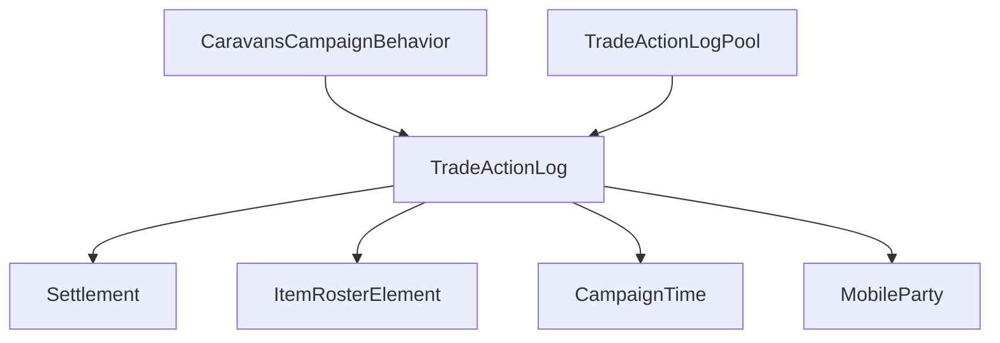

# TradeActionLog

**命名空间：** `TaleWorlds.CampaignSystem.CampaignBehaviors`
**模块：** `TaleWorlds.CampaignSystem`
**类型：** `internal class TradeActionLog`（嵌套于 `CaravansCampaignBehavior` 内部的贸易日志数据载体，非 MBObjectBase 派生，由 `CaravansCampaignBehaviorTypeDefiner` 以 id 2 注册存档）
**源文件：** `bin/TaleWorlds.CampaignSystem/TaleWorlds.CampaignSystem.CampaignBehaviors/CaravansCampaignBehavior.cs`

## 概述

`TradeActionLog` 是商队（`MobileParty.IsCaravan`）在战役中完成一轮商品买卖时被 `CaravansCampaignBehavior` 记下来的一笔「交易快照」：它记录某件物品在哪座据点以什么价格买入、之后又在哪座据点以什么价格卖出、由哪个 `ItemRosterElement` 承载，以及买入发生的战役时刻。它本身不计算任何经济规则，只是一段被对象池复用、随商队存档的轻量记录，供商队后续挑选「值得吹嘘的盈利交易」作为与玩家对话的谣言素材。

## 心智模型

把它想成商队账本上的一行流水，而不是经济系统本身。`TradeActionLog` 由 `CaravansCampaignBehavior` 在买入商品时通过 `TradeActionLogPool.CreateNewLog(...)` 从对象池借出一个实例并填好买入信息（`BoughtSettlement`、`BuyPrice`、`ItemRosterElement`、`BoughtTime`），卖出时再调用 `OnSellAction(...)` 补上 `SoldSettlement` 与 `SellPrice`。这些日志按商队分组存放在私有的 `_tradeActionLogs`（`Dictionary<MobileParty, List<TradeActionLog>>`）里，全部参与 `[SaveableField]` 存档——六个字段都被 `CaravansCampaignBehaviorTypeDefiner` 以 id 2 注册为可序列化字段。生命周期完全由 `CaravansCampaignBehavior` 掌控：商队进入据点时超过 7 天的旧日志会被回收并 `Reset` 后归还对象池；商队被摧毁时整条日志列表释放回池。因此 mod 不应自己创建 `TradeActionLog` 或长期持有引用，要读商队盈利记录应走 `Campaign.Current.GetCampaignBehavior<CaravansCampaignBehavior>()` 并依赖其公开接口，或直接观察其产出的 `OnCaravanTransactionCompleted` 事件。

## 何时使用 / 何时不要使用

- **不要**直接 `new TradeActionLog`：它是 `internal` 且由对象池管理，外部构造的实例不会被任何行为消费，也拿不到 `BoughtTime` 之外的正确状态。
- **不要**长期缓存 `TradeActionLog` 引用：对象池会在回收时 `Reset` 并复用同一实例，跨 tick 持有的引用内容会被悄悄改写。
- **用** `ProfitRate` 只读属性快速判断某笔交易是否盈利（>1.2 即高于 `ProfitRateRumorThreshold`），用于筛选可讲述的谣言。
- **用** `OnSellAction` 在卖出路径上补全日志——但仅当你是 `CaravansCampaignBehavior` 内部逻辑时才应调用，外部 mod 不应触碰。

## 依赖图



- 上游创建者：[CaravansCampaignBehavior](../CaravansCampaignBehavior) 通过内部 `TradeActionLogPool` 借出/回收 `TradeActionLog`，并持有按商队分组的 `_tradeActionLogs`。
- 数据关联：[Settlement](../Settlement)（`BoughtSettlement`/`SoldSettlement` 指向买入与卖出据点）、[MobileParty](../MobileParty)（日志列表以商队为键）、[Town](../Town)（买入与卖出价格来自 `Town.GetItemPrice`）。
- 序列化层：`CampaignTime` 经 `SaveableField(5)` 存档；整体随 `CaravansCampaignBehaviorTypeDefiner`（id 2）写入存档。

## 风险

- **internal + 池化复用：** `TradeActionLog` 是 `internal`，外部 mod 无法访问，且实例由 `TradeActionLogPool` 复用；对象池在 `ReleaseLog` 时调用 `Reset` 并可能再次 `Pop` 给下一次买入，意味着你手里持有的引用内容会随时被覆盖。任何跨 tick 的缓存都不可靠。
- **存档字段顺序：** 六个字段以 `SaveableField(0..5)` 编号序列化，加载顺序依赖 `CaravansCampaignBehaviorTypeDefiner` 的注册；自定义逻辑不应依赖日志内存顺序，应只通过 `ItemRosterElement.EquipmentElement.Item` 等业务键去匹配。
- **Campaign 层数据，Mission 不可直接读：** `TradeActionLog` 是 Campaign 经济数据，挂在商队上；在 `Mission`（战斗场景）里没有活动 Campaign 商队交易上下文，访问会拿到空或过期数据。
- **不要把它当可变世界状态改：** 要改变商队买卖行为应改 `CaravansCampaignBehavior` 的参数或对应经济 Model/Action，而不是去改这些日志里的 `BuyPrice`/`SellPrice`——它们只是已发生交易的记录，改了既不会回滚交易，也会污染谣言与统计。
- **7 天回收时机：** `OnSettlementEntered` 中只回收进入据点时超过 7 天的日志；若想在别处读取某商队的近期交易，注意更早的记录可能已被回收。

## 成员说明

### 买入信息（创建时由 `CreateNewLog` 填写）

| 成员 | 真实表示与用途 |
| --- | --- |
| `BoughtSettlement`（`Settlement`，`SaveableField(0)`） | 这笔交易商品的**买入据点**。由 `CreateNewLog(boughtSettlement, ...)` 写入，用于谣言文本里「我从 X 买进」的来源地。 |
| `BuyPrice`（`int`，`SaveableField(1)`） | 在买入据点成交的**买入单价**（来自 `town.GetItemPrice(...)`）。是计算利润率与谣言 `BUY_COST` 文本的基础。 |
| `ItemRosterElement`（`ItemRosterElement`，`SaveableField(3)`） | 这笔交易对应的**商品元素**（物品 + 数量）。`OnSellItems` 用它把卖出动作与正确的买入日志配对（比较 `EquipmentElement.Item`）。 |
| `BoughtTime`（`CampaignTime`，`SaveableField(5)`） | 买入发生的**战役时刻**。`OnSettlementEntered` 用它判断日志是否已存活超过 7 天以决定回收。 |

### 卖出信息（卖出时由 `OnSellAction` 补全）

| 成员 | 真实表示与用途 |
| --- | --- |
| `SoldSettlement`（`Settlement`，`SaveableField(4)`） | 这笔交易的**卖出据点**。`OnSellAction(soldSettlement, sellPrice)` 写入；在 `OnSellItems` 中仅当新卖价高于原 `SellPrice` 时刷新，使日志最终保留最高成交价。 |
| `SellPrice`（`int`，`SaveableField(2)`） | 在卖出据点的**最新卖出单价**。`OnSellAction` 写入，且只被更高卖价覆盖，代表该商品已实现的（最佳）卖出收入。 |
| `ProfitRate`（`float`，只读计算属性） | **利润率 = SellPrice / BuyPrice**。判断一笔交易是否盈利的唯一派生指标；`caravan_ask_trade_rumors_on_consequence` 用它（>1.2）筛选可讲述的盈利交易。 |
| `OnSellAction(Settlement, int)` | 卖出路径上的「补全」方法：把卖价与卖出据点写回日志。它**不创建也不销毁**日志，只是把买入快照升级成完整交易记录。 |
| `Reset()` | 对象池回收时调用：清空两个据点引用、把买卖价归零，使实例可安全复用于下一笔交易。 |

## 示例

以下代码镜像 `CaravansCampaignBehavior` 内部对 `TradeActionLog` 的真实用法（注意它是 `internal`，仅在该行为内部可访问）。

### 买入时从对象池创建日志

```csharp
using TaleWorlds.CampaignSystem;
using TaleWorlds.CampaignSystem.Settlements;
using TaleWorlds.CampaignSystem.Roster;

// 在 BuyCategory 内：为本次买入的商品创建/复用一条 TradeActionLog
if (caravanParty.LastVisitedSettlement != null && destinationForMobileParty != null && Campaign.Current.GameStarted)
{
    if (!_tradeActionLogs.TryGetValue(caravanParty, out var logs))
    {
        logs = new List<TradeActionLog>();
        _tradeActionLogs.Add(caravanParty, logs);
    }
    int buyPrice = town.GetItemPrice(rosterElement.EquipmentElement, caravanParty);
    logs.Add(_tradeActionLogPool.CreateNewLog(town.Settlement, buyPrice, rosterElement));
}
```

### 商队谣言对话中筛选盈利交易

```csharp
using TaleWorlds.CampaignSystem;
using TaleWorlds.CampaignSystem.Settlements;

// 在 caravan_ask_trade_rumors_on_consequence 内：挑选利润率 > 1.2 的交易讲述
if (_tradeActionLogs.TryGetValue(MobileParty.ConversationParty, out var value))
{
    foreach (TradeActionLog item in value)
    {
        float profitRate = item.ProfitRate;
        if (profitRate > 1.2f && item.SoldSettlement != null && item.SoldSettlement != item.BoughtSettlement)
        {
            MBTextManager.SetTextVariable("ITEM_NAME", item.ItemRosterElement.EquipmentElement.Item.Name);
            MBTextManager.SetTextVariable("SETTLEMENT", item.BoughtSettlement.EncyclopediaLinkWithName);
            MBTextManager.SetTextVariable("DESTINATION", item.SoldSettlement.EncyclopediaLinkWithName);
        }
    }
}
```

## 参见

- ↑ 父级：[Campaign API 索引](../)
- ↔ 相关：[CaravansCampaignBehavior](../CaravansCampaignBehavior) · [Settlement](../Settlement) · [MobileParty](../MobileParty) · [Town](../Town) · [Hero](../Hero) · [Clan](../Clan)
