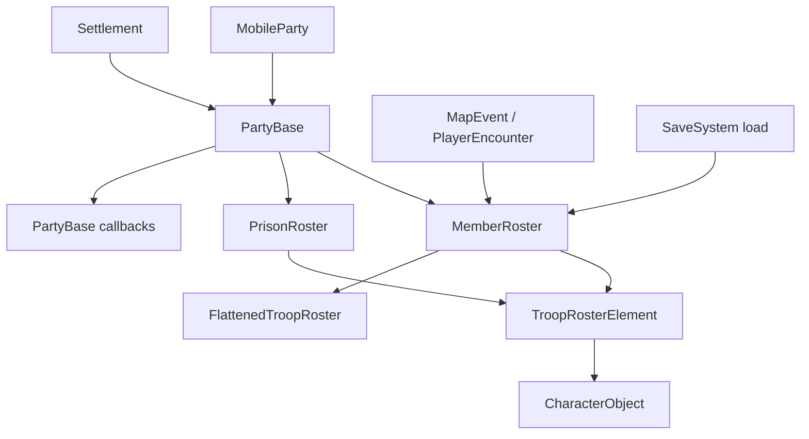

# TroopRoster

**命名空间:** `TaleWorlds.CampaignSystem.Roster`  
**模块:** `TaleWorlds.CampaignSystem`  
**类型:** `public class TroopRoster : ISerializableObject`  
**基类:** `ISerializableObject`  
**源文件:** `bin/TaleWorlds.CampaignSystem/TaleWorlds.CampaignSystem.Roster/TroopRoster.cs`  
**版本说明:** 本页按 v1.4.5 的 `TroopRoster.cs` 与实际 Campaign 调用点书写。

## 一句话职责

`TroopRoster` 是一个按 `CharacterObject` 分组的兵员状态容器：它同时记录人数、伤员、兵种经验和缓存统计，并在拥有它的 [PartyBase](../PartyBase) 上触发名册变化回调。

## 心智模型：Party 的名册，不是独立部队

`TroopRoster` 只描述“有哪些兵以及每种兵的状态”，不负责移动、战斗、俘虏转移或队伍注册。正常的宿主是 [MobileParty](../MobileParty) 或 [Settlement](../Settlement) 的 `PartyBase`：

```text
MobileParty / Settlement
  -> PartyBase
      -> MemberRoster / PrisonRoster : TroopRoster
          -> TroopRosterElement(CharacterObject, Number, WoundedNumber, Xp)
```

一个已注册队伍的 `MemberRoster` 和 `PrisonRoster` 都是由宿主持有的真实状态。`OwnerParty` 在源码中是内部的保存属性，mod 通常从 `mobileParty.MemberRoster`、`mobileParty.PrisonRoster`、`partyBase.MemberRoster` 或 `settlement.Party.MemberRoster` 获取它，而不是自己构造并挂接一个名册。

### 生命周期与所有权

1. `PartyBase` 创建自己的成员、俘虏和物品名册，并把 `OwnerParty` 设为自身；队伍进入 Campaign 后，名册成为世界状态的一部分。
2. `AddToCounts`、`RemoveTroop`、`WoundTroop` 等修改方法更新计数和 `VersionNo`，并在适用时调用 `OwnerParty.OnHeroAdded`、`OnHeroRemoved`、`OnRosterSizeChanged` 或 `OnXpChanged`。
3. `GetTroopRoster()` 根据 `VersionNo` 重建内部 `MBList<TroopRosterElement>` 缓存。它适合遍历读取，不应被当成绕过回调的写入口。
4. 存档加载时，序列化层恢复元素数组、数量和版本；`OnLoad` 丢弃旧的派生列表缓存，随后 `CalculateCachedStatsOnLoad()` 为本轮加载的名册重新计算统计。
5. 队伍销毁、俘虏释放和遭遇结算由相应的 Action 或 Campaign 流程负责。名册仍然可能被清空，但直接保留旧 `TroopRoster` 引用不能延长宿主的生命周期。

### Party 名册与临时名册的区别

- `MobileParty.MainParty.MemberRoster`、`MobileParty.MainParty.PrisonRoster` 和 `Settlement.Party.MemberRoster` 是会影响游戏世界的宿主名册。
- `TroopRoster.CreateDummyTroopRoster()` 返回一个 `OwnerParty == null` 的临时容器，源码用它收集随机伤亡、遭遇战奖励和待转移的兵员。它不会注册到 Campaign，也不会自动把兵员放进任何队伍。
- `CloneRosterData()` 也返回没有宿主的副本，并且只复制元素的角色、数量和伤员数，不复制经验。把它当作计算/转移中间结果，不要误以为它是原名册的可写视图。

## 何时使用，何时不要用

### 适合使用

- 从 `MobileParty`、`PartyBase` 或 `Settlement` 读取成员、俘虏、伤员、英雄数量和兵种经验。
- 在一个已经确定的 Campaign 流程中，通过 `AddToCounts`、`RemoveTroop`、`WoundTroop` 或 `AddXpToTroop` 修改队伍名册。
- 为战斗、UI 或自定义规则读取 `GetTroopRoster()`，再用 `TroopRosterElement.Character` 查到实际的 [CharacterObject](../CharacterObject)。
- 用 `CreateDummyTroopRoster()` 暂存一批需要随后交给 Action 或另一份名册的数据。

### 不要把它当成这些东西

- **不是队伍创建 API。** 新建和注册移动队伍必须走 `MobileParty.CreateParty` 及其组件初始化路径；不能把 dummy 名册塞进一个半成品 `PartyBase`。
- **不是英雄状态迁移 API。** 把 Hero 加入队伍、囚禁、释放或从队伍移除，应使用相应的 [AddHeroToPartyAction](../../campaign-ext/AddHeroToPartyAction)、[TakePrisonerAction](../../campaign-ext/TakePrisonerAction) 或其他 Action，不能只给名册加一个英雄计数。
- **不是战斗结果 API。** 战斗、伤亡和战利品由 [MapEvent](../MapEvent)、遭遇流程和 [CampaignBattleRecoveryBehavior](../CampaignBattleRecoveryBehavior) 协调；名册方法只执行它被调用的那一部分状态修改。
- **不是规则 Model。** `TotalManCount`、`TotalWounded`、工资和战斗力是当前名册状态或 Model 的输入。要改变计算规则，应扩展/替换对应 Model，而不是每个 tick 反复覆盖名册结果。

## 依赖与数据流



- **上游宿主：** [MobileParty](../MobileParty) 和 [PartyBase](../PartyBase) 决定名册属于哪个队伍、遭遇或据点；[Settlement](../Settlement) 的驻军名册也遵守同一容器契约。
- **元素与对象：** [TroopRosterElement](../TroopRosterElement) 保存 `Character`、`Number`、`WoundedNumber` 和 `Xp`。`CharacterObject` 来自已注册的 ObjectSystem 对象，而不是临时 new 出来的兵种。
- **下游计算：** [FlattenedTroopRoster](../FlattenedTroopRoster) 把按兵种分组的名册展开为单兵视图；Party 的容量、战斗和 AI Model 会读取名册统计，但不会替 `TroopRoster` 管理宿主生命周期。
- **事件与流程：** [PlayerEncounter](../PlayerEncounter)、[MapEvent](../MapEvent)、`CampaignBattleRecoveryBehavior` 和 Party screen 等系统会按遭遇/战斗时机读取或修改名册；这些调用点解释了为什么 `AddToCounts` 的 Party 回调不能跳过。
- **存档边界：** `data`、`_count` 和 `OwnerParty` 参与 `ISerializableObject`/SaveSystem 恢复；加载后缓存必须重建，mod 不应把 `GetTroopRoster()` 返回的运行时列表作为自己的长期存档格式。

## 成员与调用时机

### 统计属性

| 成员 | 用途、副作用与时机 |
| --- | --- |
| `Count` | 名册中有多少个不同的 `TroopRosterElement` 槽位，不是总人数。遍历索引时使用它，并在修改后重新读取。 |
| `VersionNo` | 名册状态版本；数量、伤员或经验变化会更新它，`GetTroopRoster()` 用它判断缓存是否过期。可用于缓存自己的派生结果，但不能替代业务事件。 |
| `TotalRegulars` / `TotalHeroes` | 分别统计普通兵人数和英雄槽位数量。英雄数量按元素的 `Number` 维护，而英雄伤势从 `HeroObject.IsWounded` 反映。 |
| `TotalWoundedRegulars` / `TotalWoundedHeroes` / `TotalWounded` | 统计伤员。普通兵的伤员数来自元素；英雄的 `WoundedNumber` 由英雄当前伤势决定。不要把英雄伤员当成可永久写入的普通兵数。 |
| `TotalManCount` / `TotalHealthyCount` | `TotalManCount` 是普通兵与英雄的总人数；`TotalHealthyCount` 扣除普通兵和英雄伤员，适合在已有 Campaign 规则中做当前状态读取。 |

### 获取与复制

| 成员 | 用途、副作用与调用时机 |
| --- | --- |
| `GetTroopRoster()` | 返回按 `VersionNo` 维护的 `MBList<TroopRosterElement>`，用于遍历或 LINQ 查询。元素是 struct；在 `foreach` 中改它的字段不会可靠地写回原名册，应调用名册的修改方法。 |
| `GetElementCopyAtIndex(int)` / `GetCharacterAtIndex(int)` | 按槽位读取元素或角色。索引必须来自当前 `Count`，不要缓存索引跨越会改变名册排序/数量的操作。 |
| `FindIndexOfTroop(CharacterObject)` / `Contains(CharacterObject)` | 把已注册的 `CharacterObject` 映射到名册槽位。传入 null 或已销毁对象前先完成生命周期检查。 |
| `GetTroopCount(CharacterObject)` | 获取一种兵的当前人数；找不到时返回 0。要删除时不能只根据返回的 0 继续调用 `RemoveTroop`。 |
| `ToFlattenedRoster()` | 根据当前健康/伤员统计创建 [FlattenedTroopRoster](../FlattenedTroopRoster)；它是新的展开结果，不是对原名册的实时写视图。 |
| `CloneRosterData()` | 创建无宿主副本，保留角色、人数和伤员数但不保留经验。适合临时计算，不能拿它替换 Party 的真实名册。 |
| `RostersAreIdentical(TroopRoster, TroopRoster)` | 比较两个名册的宿主、槽位、版本和角色/数量关系，用于流程校验，不是合并操作。 |

### 正确的修改入口

| 成员 | 用途、副作用与调用时机 |
| --- | --- |
| `AddToCounts(CharacterObject, int, bool, int, int, bool, int)` | 首选的增减入口。它会创建/定位槽位，处理普通兵与英雄的计数，更新版本，并调用宿主的 Hero/roster 回调。新增槽位时不能让数量和伤员合计为非正数。 |
| `AddToCounts(TroopRosterElement)` / `Add(TroopRoster)` | 把元素或另一份名册的数量加入当前名册；`Add(TroopRoster)` 遍历源名册。它们会按元素调用 `AddToCounts`，不等于转移，源名册不会自动减少。 |
| `AddToCountsAtIndex(int, int, int, int, bool)` | 修改已存在槽位的数量、伤员和经验；会校正“伤员不能多于总数”，并触发宿主回调。只有拿到仍然有效的当前索引时才调用。 |
| `RemoveTroop(CharacterObject, int, UniqueTroopDescriptor, int)` | 从已存在的角色槽位减少人数；模拟战斗时会根据 `PlayerEncounter.CurrentBattleSimulation` 保留零数量槽位。调用前必须确认角色在名册中。 |
| `WoundTroop(CharacterObject, int, UniqueTroopDescriptor)` | 增加指定兵种的伤员数，不减少总人数；由上层战斗/恢复流程决定时机。不要用它模拟死亡。 |
| `AddXpToTroop(CharacterObject, int)` / `AddXpToTroopAtIndex(int, int)` | 增加兵种经验；按索引入口会调用 `OwnerParty.OnXpChanged`。负数或失效索引不应由 mod 直接传入。 |
| `RemoveIf(Predicate<TroopRosterElement>)` / `Clear()` / `RemoveZeroCounts()` | 批量移除元素、清空名册或清理零人数槽位。它们会改变版本和缓存；遍历返回值进行后续迁移时，应先完成当前操作再改源名册。 |

### 有限的结构操作

`SetElementNumber`、`SetElementWoundedNumber` 和 `SetElementXp` 直接按索引写单个元素，`SwapTroopsAtIndices` 与 `ShiftTroopToIndex` 调整槽位顺序。这些入口主要服务于遭遇、Party screen 或内部流程；它们不等价于“把一个兵安全加入/移出 Party”。需要触发英雄归属、队伍统计和经验通知时，优先使用上面的 `AddToCounts`、`RemoveTroop` 和 `AddXpToTroop`。

`RemoveNumberOfNonHeroTroopsRandomly(int)` 返回一个无宿主的随机普通兵名册，并从源名册中移除健康普通兵；`WoundNumberOfNonHeroTroopsRandomly(int)` 则只增加随机普通兵伤员。二者都会受当前缓存统计和输入人数约束，适合战斗伤亡流程，不适合用作随意招募/删兵工具。

## 真实获取与修改示例

### 从当前玩家队伍读取健康普通兵

下面的路径直接使用当前 Campaign 的玩家移动队伍，和源码中的 Party/Encounter 读取方式一致。它只读取，不创建名册，也不改 Party：

```csharp
using System.Linq;
using TaleWorlds.CampaignSystem;
using TaleWorlds.CampaignSystem.Party;
using TaleWorlds.CampaignSystem.Roster;

public int CountHealthyRegularsInPlayerParty()
{
    if (Campaign.Current == null || MobileParty.MainParty == null)
    {
        return 0;
    }

    TroopRoster roster = MobileParty.MainParty.MemberRoster;
    return roster.GetTroopRoster()
        .Where(element => element.Character != null && !element.Character.IsHero)
        .Sum(element => element.Number - element.WoundedNumber);
}
```

### 在已有名册中安全增加同类兵

真实队伍修改必须先取得 `MobileParty.MainParty.MemberRoster`，再使用 `AddToCounts`，让 Party 收到版本和 roster 回调。这个例子只把当前已有的第一个普通兵槽位增加一人，避免使用虚构的兵种 ID：

```csharp
using TaleWorlds.CampaignSystem;
using TaleWorlds.CampaignSystem.Party;
using TaleWorlds.CampaignSystem.Roster;

public bool AddOneExistingRegularTroop()
{
    if (Campaign.Current == null || MobileParty.MainParty == null)
    {
        return false;
    }

    TroopRoster roster = MobileParty.MainParty.MemberRoster;
    for (int index = 0; index < roster.Count; index++)
    {
        CharacterObject character = roster.GetCharacterAtIndex(index);
        if (character != null && !character.IsHero)
        {
            roster.AddToCounts(character, 1);
            return true;
        }
    }

    return false;
}
```

要把兵员从一个 Party 转移到另一个 Party，不能只对目标名册调用 `AddToCounts`；应由对应的转移/遭遇/俘虏流程先从源名册扣除，再把同一 `TroopRosterElement` 的语义交给目标流程处理。

## 风险与崩溃边界

- **孤儿名册：** 把 `CreateDummyTroopRoster()` 或 `CloneRosterData()` 当作真实队伍名册会丢失 `OwnerParty` 回调，导致 Hero 所属、Party 统计或地图状态不同步。真实队伍始终从宿主获取。
- **无效索引：** `GetCharacterAtIndex`、`SetElement*`、`AddToCountsAtIndex` 和 `GetElement*` 的部分重载直接访问数组。负数、过期索引或空名册可能抛出 `IndexOutOfRangeException`，不要在删槽位后继续使用旧索引。
- **非法数量：** `TroopRosterElement.Number`、`WoundedNumber` 和 `Xp` 拒绝负值；伤员数也不能违反总数关系。应使用 `AddToCounts` 的差量语义，而不是直接修改从缓存列表中拿到的 struct。
- **跳过 Party 回调：** `SetElementNumber` 或直接改元素字段不会自动完成 Hero 加入/移除、`OnRosterSizeChanged`、经验通知和上层 Action 的事件级联。英雄、俘虏、战斗伤亡和队伍转移必须使用相应的 Campaign 流程。
- **英雄伤势混淆：** 英雄的 `WoundedNumber` 读取 `HeroObject.IsWounded`；把英雄当普通兵反复设置伤员数，会得到与 Hero 生命周期不一致的统计。
- **缓存误用：** `GetTroopRoster()` 的列表由 `VersionNo` 控制。把它缓存到跨 tick、遭遇或读档的长期状态中，可能读取过期队伍；保存自己的状态时应存稳定的 `CharacterObject.Id` 或宿主标识，并在当前 Campaign 重新解析。
- **读档阶段：** `OnLoad` 到 `CalculateCachedStatsOnLoad` 之间，派生统计和展开列表可能尚未完成。不要在 SaveSystem 正在恢复 roster 时启动自定义战斗、UI 或批量名册修改。
- **对象注册：** `TroopRosterElement` 序列化保存的是 `CharacterObject` 的对象 ID。自定义兵种必须先由 `MBObjectManager` 正确注册并在读档时可解析，否则名册可能得到 null 角色或在后续读取时崩溃。
- **任务时机：** `MemberRoster`、`PrisonRoster`、`MapEvent` 和 `PlayerEncounter` 的所有权会随战斗、俘虏、队伍销毁而变化。不要在结束/销毁回调中继续使用已经脱离宿主的 `TroopRoster` 引用。

## 版本与实现边界

v1.4.5 的 `TroopRoster` 通过 `ISerializableObject` 保存元素数组和统计版本，元素本身通过 `TroopRosterElement` 的 SaveSystem 契约恢复。不同版本可能调整缓存字段、伤员处理或 Party 回调；mod 不应依赖反编译出的私有数组结构。跨版本代码应优先依赖 `MobileParty.MemberRoster`、`PartyBase.MemberRoster`、`AddToCounts`、`GetTroopRoster` 和 `TroopRosterElement` 的公开语义。

## 导航

- **↑ Parent：** [Campaign API index](../) · [Campaign](../Campaign)
- **↔ Siblings：** [PartyBase](../PartyBase) · [MobileParty](../MobileParty) · [FlattenedTroopRoster](../FlattenedTroopRoster) · [TroopRosterElement](../TroopRosterElement)
- **Related：** [CharacterObject](../CharacterObject) · [Settlement](../Settlement) · [MapEvent](../MapEvent) · [PlayerEncounter](../PlayerEncounter) · [AddHeroToPartyAction](../../campaign-ext/AddHeroToPartyAction) · [TakePrisonerAction](../../campaign-ext/TakePrisonerAction) · [CampaignBattleRecoveryBehavior](../CampaignBattleRecoveryBehavior)
