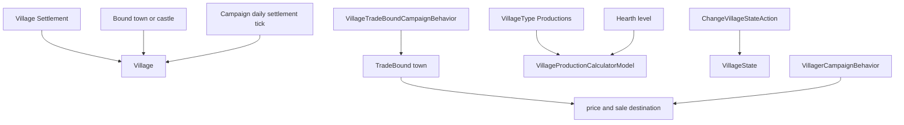
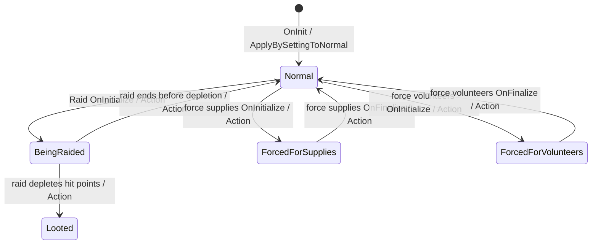

# Village

**命名空间：** `TaleWorlds.CampaignSystem.Settlements`  
**模块：** `TaleWorlds.CampaignSystem`  
**类型：** `public class Village : SettlementComponent`  
**基类：** `SettlementComponent`  
**源文件：** `bin/TaleWorlds.CampaignSystem/TaleWorlds.CampaignSystem.Settlements/Village.cs`  
**持久化角色：** 附着在村庄 `Settlement` 的经济组件；炉灶、状态、绑定据点、市场和税等进入 Campaign 存档图。

## 概述与心智模型

`Village` 是一个村庄 Settlement 的生产和民生状态，不是独立派系或独立领地。`Settlement.Village` 才是从地图位置、村庄派对和遭袭状态进入它的路径；`Village.Settlement` 反向回到实体。它的政治归属来自 `Bound` 据点，因此 `Village.MapFaction` 委托给 `Bound.MapFaction`，而村庄 `Settlement.OwnerClan` 同样经该绑定据点解析。

`Bound` 是行政/领地绑定：设置时会同步维护 `Settlement.BoundVillages`。当绑定对象是城镇时，`TradeBound` 固定就是该城镇；当绑定对象是城堡时，`TradeBound` 是可变的贸易目的地，由原生行为选择邻近、可达且政治关系允许的城镇。不要把两者混为一谈，也不要把 `TradeBound` 当永久存档配置。

在启动后的 Campaign Behavior、据点/村庄事件或日结后，用 `Village.All`、`Settlement.All` 或某个 `Town.Villages` 取得对象。静态集合依赖 `Campaign.Current`，故不适合主菜单、未完成读档或战役销毁期。不要直接构造 `Village`、`VillageMarketData` 或村民派对来拼接世界对象。

## 何时使用，何时停在 Settlement 边界

当需求是“这一个村庄当前能生产什么、处于什么袭击状态、依附哪个领地、该由哪个城镇定价”时，先取得 `Settlement`，确认 `settlement.IsVillage`，再读取 `settlement.Village`。这条路径既保留地图位置、`Party`、库存与民兵，也不会把城镇或城堡的 `Town` 组件误当成村庄。

不要在以下情形从 `Village` 开始写世界状态：

- **领地归属或绑定村清单：** 领主、所有权与 `Settlement.BoundVillages` 由宿主据点及其所有权 Action 维护。`Bound` 没有公共 setter；重新接线会破坏 Town 的村庄视图和贸易缓存。
- **袭击、强征或恢复：** 它们是 [MapEvent](../MapEvent/) 的结算结果，不是“把枚举改成另一项”。[RaidEventComponent](../RaidEventComponent/) 在开始时设为 `BeingRaided`，按结算把村庄设为 `Looted` 或 `Normal`；强征志愿兵/物资组件分别使用对应的 forced 状态。模组只应在自身确有等价完整流程时走 [ChangeVillageStateAction](../../campaign-ext/ChangeVillageStateAction/)。
- **商队与军团集结：** 原生商队创建在传入村庄时只把 `Village.TradeBound` 作为出发城镇候选；这不让村庄成为商队市场。军团的 `FindBestGatheringSettlementAndMoveTheLeader` 选择的是一般 `Settlement`，而非 Village 的经济组件。传给这些系统的是当前 `Settlement`，不能用 `Village` 虚构位置或替换 AI 目标。
- **经济规则：** 改变“每日会产多少”应替换/扩展活动的 [VillageProductionCalculatorModel](../VillageProductionCalculatorModel/)；改变城堡绑定村应贸易往何处，应由 [VillageTradeModel](../VillageTradeModel/) 和原生 Behavior 的重算路径决定。读取模型结果不能代替它们。

## 依赖、生产与贸易路径



| 关系 | 实际职责 |
| --- | --- |
| [Settlement](../Settlement/) | 保存村庄实体、`Party`、库存、民兵与 `IsRaided`；`Settlement.Village` / `Village.Settlement` 是双向组件入口。 |
| [Town](../Town/) | `Bound` 决定归属；若 `Bound.IsTown`，该 Town 也是贸易绑定。城堡绑定村的 `TradeBound` 会被贸易行为重算。 |
| [Campaign](../Campaign/) | `Campaign.DailyTickSettlement` 调用 `Village.DailyTick`；模型从 `Campaign.Current.Models` 计算炉灶、生产、民兵与贸易规则。 |
| [VillageType](../VillageType/) | `Productions` 定义该村可产出的物品和基础数量；`IsProducing(item)` 仅检查这份配置。 |
| [VillageTradeBoundCampaignBehavior](../VillageTradeBoundCampaignBehavior/) / [VillagerCampaignBehavior](../VillagerCampaignBehavior/) | 前者重算城堡绑定村的 `TradeBound`，后者按库存与状态维护村民贸易派对；两者都是生命周期所有者，不是 Village setter 的替代品。 |
| campaign-ext Actions | [ChangeVillageStateAction](../../campaign-ext/ChangeVillageStateAction/) 负责村庄状态变化；它会发布状态事件并把据点等级遮罩标脏。所有权变化仍属于 `ChangeOwnerOfSettlementAction`，而不是 Village setter。 |
| [SaveManager](../../save-system/SaveManager/) | 所有跨读档的扩展状态需用 Behavior 的 `SyncData` 管理；不要持久化村民派对或价格缓存的旧引用。 |

## 炉灶、生产、库存与民兵

`Hearth` 是村庄规模的连续值，而不是货币。`GetHearthLevel()` 用 200 和 600 作为低/中/高分层：小于 200 为 0，200 到 599 为 1，至少 600 为 2；`GetProsperityLevel()` 直接映射这个等级。`HearthChange` 来自活动的 `SettlementProsperityModel.CalculateHearthChange`，解释版可显示模型的当日原因。v1.4.5 的默认模型只给 `Normal` 状态基础增长，给 `Looted` 状态 -1 的袭击项；正常村庄还会读取 `Bound` 的总督 Perk 和要塞建筑效果，并叠加政策、文化与议题效果。它是一次模型观察，不是待调用的增量命令。

原生 `DailyTick` 先记录日结前炉灶等级，再加 `HearthChange`；跨等级时将 Settlement Party 的等级遮罩标脏；炉灶最低钳到 10；随后将民兵模型变化加入宿主 `Settlement.Militia`，最后把村庄金币压回 1,000。因此不要额外调用该方法，也不要把读取的 `HearthChange` 手动再加一次。

默认生产模型只在 `VillageState.Normal` 时出产。每种 [VillageType](../VillageType/) 的 `Productions` 物品先需要有效 `TradeBound` 才会加入基础产量，再按 `(炉灶等级 + 1) * 0.5` 缩放，并叠加贸易绑定城镇总督 Perk、文化特性和绑定领地的 `VillageProduction` 建筑效果。没有贸易绑定时，默认物品产量保持为零；食物计算不要求贸易绑定，但同样只接受正常状态，并以炉灶等级加一为基础，再受本村活跃议题影响。`GetWarehouseCapacity()` 通过活动的 [VillageProductionCalculatorModel](../VillageProductionCalculatorModel/) 分别调用 `CalculateDailyFoodProductionAmount` 与每项 `CalculateDailyProductionAmount`，将结果相加后取至少 1 的五日容量；这是村民贸易行为判断是否该发货的实际阈值，而不是一个固定仓库字段。

| 成员 | 安全含义 |
| --- | --- |
| `HearthChange` / `HearthChangeExplanation` | 只读模型查询；日结负责写 `Hearth`。 |
| `Militia` / `MilitiaChange` | `Militia` 实际读取宿主 `Settlement.Militia`；村庄默认变化含基础 0.5、退役项和 `Hearth / 400`。 |
| `MarketData` / `GetItemPrice` | 村庄价格转交给 `TradeBound.Town.MarketData`；若没有贸易绑定，价格函数返回 1，不能据此推断真实市场经济。 |
| `TradeTaxAccumulated` | 可保存的累计村庄关税池。默认 `ClanFinanceModel.CalculateVillageIncome` 对 `Looted` / `BeingRaided` 村庄给出零收入；其他状态先按 `RevenueSmoothenFraction()` 平滑，再计算政策和总督 Perk。仅当财务流程传入 `applyWithdrawals: true` 时，模型才从税池扣除本次未修正的基础份额。读取预览不会提取，自行减值则会绕过这套结算。 |
| `GetWarehouseCapacity` / `IsProducing` | 前者是模型驱动的库存容量，后者只检验产物配置，不表示此刻真的在生产。 |

## 状态、贸易绑定与 Action 边界

`VillageStates` 包含 `Normal`、`BeingRaided`、`ForcedForVolunteers`、`ForcedForSupplies` 和 `Looted`。`IsDeserted` 只在 `Looted` 时为真，`Settlement.IsRaided` 同样由 `Looted` 推导。`VillageState` setter 本身会为 Normal / BeingRaided / Looted 发送有限的 dispatcher 回调，但完整状态转换还必须由 `ChangeVillageStateAction` 发布旧/新状态和袭击者，并刷新等级遮罩。因此：



这张图描述原生 [MapEvent](../MapEvent/) 组件的路径，而不是允许的任意跳转表。[RaidEventComponent](../RaidEventComponent/) 初始化时进入 `BeingRaided`，在 `OnBeforeFinalize` 中按据点生命值转为 `Looted` 或 `Normal`，随后才派发 raid-completed 回调。两个强征组件则先在 `OnBeforeFinalize` 派发 supplies/volunteers-completed 回调，到 `OnFinalize` 才通过 Action 恢复 `Normal`；因此完成回调的监听器不能假定此刻状态已经恢复。

直接 setter 只为 `Normal`、`BeingRaided`、`Looted` 派发各自的专用回调，对两个 forced 状态没有对应分支。[ChangeVillageStateAction](../../campaign-ext/ChangeVillageStateAction/) 会在每次实际变化后统一派发 [CampaignEvents](../CampaignEvents/) 的 `VillageStateChanged` 所观察的旧状态、新状态和袭击者，并刷新据点等级遮罩。绕过 Action 会令 forced 转换尤其难以被通用监听器看到。

- 使用 `ChangeVillageStateAction.ApplyBySettingToBeingRaided`、`ChangeVillageStateAction.ApplyBySettingToBeingForcedForSupplies`、`ChangeVillageStateAction.ApplyBySettingToBeingForcedForVolunteers`、`ChangeVillageStateAction.ApplyBySettingToLooted` 或 `ChangeVillageStateAction.ApplyBySettingToNormal` 改变状态；不要直接赋 `VillageState`。
- `Bound` 是私有 setter，不能也不应重接。它的 setter 会同时从旧据点移除、加入新据点的绑定村庄集合。
- 不要主动赋 `TradeBound`。`VillageTradeBoundCampaignBehavior` 在新局、读档、宣战/和平、Clan 王国变化、Clan 销毁和据点易主时为所有城堡绑定村重新计算；它会先选同阵营最近城镇，再选非交战的外国城镇，且必须在距离上限内。

村民贸易也不是“调用一个卖货函数”。`VillagerCampaignBehavior` 仅在村庄正常、没有地图事件且仓库库存达到 `GetWarehouseCapacity()` 时，按概率创建或补充村民队；它从村庄库存装载货物并将队伍送到 `TradeBound`。遭袭、无绑定、村民队在战斗/筏上或村庄主人有地图事件时都会阻止这条路径。

`GetDefenderParties` 与 `GetNextDefenderParty` 也是 MapEvent 的读取入口，而不是派对管理 API。两者都先交出宿主 `Settlement.Party`，再读取同阵营、非商队的驻留移动派对，但过滤并不完全相同：`GetDefenderParties` 只在 Raid / IsForcingSupplies / IsForcingVolunteers 类型中纳入民兵和村民；`GetNextDefenderParty` 的逐项游标路径不使用 `battleType` 做这层排除。调用方必须采用其 MapEvent 预期的遍历协议，不能混用结果或在枚举时改写 `Settlement.Parties`。让 `EncounterModel` 与 MapEvent 选择防守方，勿为“补一个守军”手动创建村民或把商队塞入枚举。

## 真实获取与安全示例

以下读取在启动后的 Campaign Behavior 或村庄相关事件中执行。`Settlement.CurrentSettlement` 按顺序反映玩家被囚禁的据点、当前遭遇据点或主队驻留据点，也可能返回 `null`。示例先取得这个实时 `Settlement`，确认它确为村庄，再通过 `settlement.Village` 进入组件；不构造对象，也不靠脱离上下文的 ID 查找：

```csharp
using TaleWorlds.CampaignSystem;
using TaleWorlds.CampaignSystem.Settlements;

public static class VillageInspection
{
    public static int ReadCurrentVillageHearthLevel()
    {
        Settlement settlement = Settlement.CurrentSettlement;
        Village village = settlement != null && settlement.IsVillage
            ? settlement.Village
            : null;

        return village == null ? 0 : village.GetHearthLevel();
    }
}
```

状态恢复必须通过 Action，才能同时通知状态接收者和刷新视觉等级：

```csharp
using TaleWorlds.CampaignSystem.Actions;
using TaleWorlds.CampaignSystem.Settlements;

public static class VillageRecovery
{
    public static void MarkCurrentLootedVillageNormal()
    {
        Settlement settlement = Settlement.CurrentSettlement;
        Village village = settlement != null && settlement.IsVillage
            ? settlement.Village
            : null;

        if (village != null && village.VillageState == Village.VillageStates.Looted)
        {
            ChangeVillageStateAction.ApplyBySettingToNormal(village.Settlement);
        }
    }
}
```

此示例只展示 Action 边界，不代表可以随意跳过游戏的掠夺后果。实际模组应在自身任务/事件完成且状态转换语义成立时调用相应 Action。

## 加载、缓存与存档风险

- **绑定在加载后重建：** 新局 XML 反序列化会读取 `Bound` 并同步 Town 的贸易缓存；已保存 Campaign 则保留保存图中的引用。随后 `VillageTradeBoundCampaignBehavior.OnGameLoaded` 重新选择城堡绑定村的 `TradeBound`。勿将旧 TradeBound/Town/Village 对象引用当作跨读档句柄。
- **状态会影响产出：** Looted、BeingRaided 或强征状态不满足默认生产模型的 Normal 条件。直接写炉灶、库存或状态会让生产、容量、村民派对和 UI 的观察值彼此矛盾。
- **民兵有派对副作用：** 将变化写入 `Settlement.Militia` 可能产生或填充民兵派对。不要在枚举 `Settlement.Parties` 时同时手改民兵，也不要把 `Village.Militia` 缓存为脱离 Settlement 的数值。
- **价格不是独立市场：** 无 `TradeBound` 时价格为 1 是故障回退；访问 `TradeBound.Town` 前应允许为空。不要创建自有市场数据来绕过贸易行为。
- **市场数据属于存档图：** `MarketData` 是与该 Village 绑定并保存的 `VillageMarketData`，而物品报价仍转交当前 `TradeBound.Town.MarketData`。读档后不要继续使用旧的市场对象或其价格结果；应从当前 `settlement.Village` 重新进入关系并允许贸易绑定被重算。
- **易主和移除使引用过期：** 村庄的阵营与所有者通过 `Bound` 解析；绑定据点易主会触发贸易行为重算城堡村的 `TradeBound`。遭袭结算、易主、村庄或 Campaign 被移除/销毁后，不要继续操作事件前缓存的 Village、Bound、TradeBound 或 defender-party 引用；在仍有效的战役回调中从当前 Settlement/集合重新取得对象。
- **生命周期：** `OnInit` 用 Action 设为 Normal 并给村庄 1,000 金币。村民和贸易绑定行为依赖事件注册及已加载世界；在更早阶段调用生产或状态变更会产生不完整关系。
- **可写字段不是操作协议：** `Hearth` 和 `TradeTaxAccumulated` 因保存图而公开可写，原生仍分别通过日结、袭击/结算与经济路径维持关联数据。把它们当作普通 setter 会让炉灶等级遮罩、民兵、库存、税收和 UI 观察值失步；需要自定义规则时放进兼容的 Model/Behavior，并把自己的持久化数据放进 `SyncData`。

## 版本说明

本页描述反编译得到的 Bannerlord v1.4.5：`Village.cs`、`Settlement.cs`、`Town.cs`、`DefaultVillageTradeModel.cs`、`DefaultVillageProductionCalculatorModel.cs`、`VillageTradeBoundCampaignBehavior.cs`、`VillagerCampaignBehavior.cs` 以及三个村庄 MapEvent 组件共同构成上述边界。跨版本或整体替换模型后，重查状态枚举、贸易距离规则、日结顺序和 Action 副作用；不要把这里的阈值或 Behavior 订阅顺序视为稳定扩展契约。

## 导航

- ↑ Parent: [Campaign API](../)
- ↔ Siblings: [Settlement](../Settlement/) · [Town](../Town/) · [Campaign](../Campaign/)
- Related: [VillageType](../VillageType/) · [VillageTradeModel](../VillageTradeModel/) · [VillageProductionCalculatorModel](../VillageProductionCalculatorModel/) · [MapEvent](../MapEvent/) · [RaidEventComponent](../RaidEventComponent/) · [CampaignEvents](../CampaignEvents/) · [ChangeVillageStateAction](../../campaign-ext/ChangeVillageStateAction/) · [SaveManager](../../save-system/SaveManager/)
