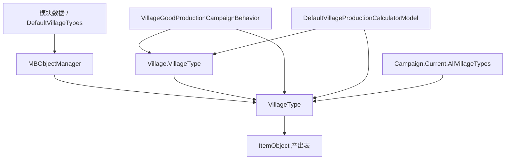

# VillageType

**命名空间：** `TaleWorlds.CampaignSystem.Settlements`  
**模块：** `TaleWorlds.CampaignSystem`  
**类型：** `public sealed class VillageType : MBObjectBase`  
**基类：** [MBObjectBase](../../core/MBObjectBase)  
**源文件：** `bin/TaleWorlds.CampaignSystem/TaleWorlds.CampaignSystem.Settlements/VillageType.cs`  
**对象角色：** 由模块数据注册的“村庄类型”定义对象（如小麦农场、马场、铁矿、渔村）；`Village` 持有一个引用，`VillageGoodProductionCampaignBehavior` 与 `VillageProductionCalculatorModel` 读取它的产出表来计算每日物资。

## 概述

`VillageType` 是 Bannerlord 战役层里“**一种村庄的经济身份卡**”：它把某个村庄类型会生产哪些物品、每种物资的每日基础产量、以及该类型在地图上使用的场景网格（正常 / 在建 / 被烧毁三种外观）和本地化简称全部打包成一个只读定义。游戏里每一座村庄（`Village`）通过 `Village.VillageType` 字段引用一个已注册的 `VillageType` 实例——例如一座“帝国马场”村庄就指向 `DefaultVillageTypes.EuropeHorseRanch`。它本身不持有任何村庄的运行态（炉火数、库存、税收），只是被生产行为（`VillageGoodProductionCampaignBehavior`）和产量模型（`DefaultVillageProductionCalculatorModel`）当作数据表来查询，从而决定每天往村庄 / 城镇仓库塞多少物资。

## 心智模型

把 `VillageType` 想成**“从模块 XML / 代码注册表里来的生产配方”**，而不是会自己运转的战役行为：

- 它是 `MBObjectBase` 的子类，由 `MBObjectManager` 在战役初始化时注册。`DefaultVillageTypes` 在构造时调用 `Game.Current.ObjectManager.RegisterPresumedObject(new VillageType(stringId))` 登记全部约 22 种类型，再逐个调用 `Initialize(...)` 填好名称、网格与产出表，并通过 `AddProductions(...)` 追加副产物（如马场除马外还产牛、羊、骡）。你几乎永远**不要 `new VillageType()`** 自己造一个——它只在对象管理器加载链里才有意义，且名称 / 网格 / 产出在加载后基本稳定。
- **它是共享单例**：所有同类型村庄引用同一个 `VillageType` 对象。`Productions`、`PrimaryProduction`、`ShortName`、`MeshName*` 都是只读或一次性初始化数据；直接改它们会同时影响所有引用该类型的村庄，且**存档时会把改动固化进存档**。要“改一个村庄的产出”，正确做法是走 `*Action` / 自定义 Model，而不是改这张共享定义。
- **产出表是 `(ItemObject, float)` 元组列表**：`Item1` 是物品，`Item2` 是“每天的基础产量权重”。`GetProductionPerDay(ItemObject)` 直接返回该物品的系数；真正的每日入库量还要经 `VillageProductionCalculatorModel.CalculateDailyProductionAmount` 叠加炉火等级、文化特性、建筑与专长加成后才得到。
- **何时用**：读取村庄类型的产出构成、按类型统计某类物资的世界总产能、在 UI 上显示村庄类型的本地化名称或换对应网格。`All` 静态属性可遍历全部已注册类型。
- **何时不用**：不要把它当成可变状态去写；不要在对象管理器尚未完成加载时访问 `Productions`（可能为空）；不要在 Mission 层去读战役层的村庄类型数据。

## 依赖图



| 关联对象 | 实际边界 |
| --- | --- |
| [MBObjectManager](../../campaign-ext/MBObjectManager) 与 [MBObjectBase](../../core/MBObjectBase) | `VillageType` 以 `StringId` 注册与查找；`DefaultVillageTypes` 在战役初始化阶段 `RegisterPresumedObject` + `Initialize` 后它才可用。 |
| [Village](../Village) | 村庄通过 `Village.VillageType` 字段持有引用；`Village.Deserialize` 用 `ReadObjectReferenceFromXml("village_type", typeof(VillageType), node)` 反序列化这一引用。运行态（炉火、库存）不在这里。 |
| [Settlement](../Settlement) | 村庄是据点的组成部分；`VillageType` 的网格名和简称用于据点场景与 UI 渲染，不决定据点归属。 |
| [ItemObject](../../core/ItemObject) | 产出表每一项 `(ItemObject, float)` 中的物品；物品必须已注册，`Productions` 才能正确解析。 |
| [Campaign](../Campaign) | `Campaign.Current.AllVillageTypes` 即 `VillageType.All` 的底层来源；全部类型在战役加载后才有内容。 |
| [VillageProductionCalculatorModel](../VillageProductionCalculatorModel) | 读取 `VillageType.Productions` 计算每日实际产量；`CalculateProductionSpeedOfItemCategory` 遍历 `VillageType.All` 取某类物资的世界产能上限。 |
| `VillageGoodProductionCampaignBehavior` | 在每日 tick 时遍历 `village.VillageType.Productions`，把物资实际加入村庄 / 城镇仓库并派发 `OnItemProduced`。 |

## 读取哪些成员

按责任分组理解，而不是把每个字段当成独立 API：

| 分组 | 代表成员 | 它真正表示什么 / 何时用 |
| --- | --- | --- |
| 身份与显示 | `ShortName`、`MeshName`、`MeshNameUnderConstruction`、`MeshNameBurned` | `ShortName` 是本地化简称（如“Wheat Farm”），`ToString()` 直接返回它，用于 UI 与日志。`MeshName*` 三个字符串是村庄经济建筑在地图上的网格名，分别对应正常、在建、被烧毁三种外观状态；它们只是资源引用名，不承载逻辑。 |
| 产出表 | `Productions`、`PrimaryProduction` | `Productions` 是只读的 `(ItemObject, float)` 列表，每一项 `(物品, 每日基础产量权重)`。`PrimaryProduction` 不是第一个元素，而是遍历全表后 `Item1.Value * Item2` 乘积最大（即货币价值最高）的那一项——游戏用它代表该村庄的“主营货物”。 |
| 查询入口 | `GetProductionPerDay(ItemObject)`、`GetProductionPerDay(ItemCategory)` | 前者返回指定物品在产出表中的每日系数（无则 `0f`）；后者把同一 `ItemCategory` 下所有产出的系数累加，便于按“马 / 矿 / 粮食”等类别汇总产能。 |
| 全部类型 | `All` | 静态属性，等于 `Campaign.Current.AllVillageTypes`，返回所有已注册 `VillageType` 的只读列表；用于遍历与全局统计。 |
| 注册与加载 | `Initialize(...)`、`AddProductions(...)` | `Initialize` 由 `DefaultVillageTypes` 在加载时调用，一次性填好名称、网格与初始产出表并触发 `AfterInitialized`；`AddProductions` 把新产出**前置拼接**进 `_productions`（新项排在最前）。`AutoGeneratedInstanceCollectObjects` 是存档系统的对象收集钩子，不是给 mod 调用的入口。 |

## 何时使用，何时不要使用

### 适合使用

- 在 Campaign 逻辑里通过 `village.VillageType` 读取某村庄的产出构成、主产物资或显示名。
- 通过 `VillageType.All` 或 `MBObjectManager.Instance.GetObjectTypeList<VillageType>()` 遍历全部已注册类型做全局统计。
- 用 `GetProductionPerDay(ItemObject / ItemCategory)` 取某类型的基础产能系数，再交给产量模型换算成实际日产量。
- 在模块加载完成后按稳定 ID 或 `DefaultVillageTypes.Xxx` 静态入口取得一个已注册类型。

### 不要这样使用

- 不要直接改 `Productions`、`ShortName`、`MeshName*` 等共享定义字段——所有同类型村庄都会受影响，且改动会被存档固化。
- 不要在 `MBObjectManager` 尚未完成村庄类型加载时访问 `Productions`（可能为空，遍历会拿到空表或空引用）。
- 不要把 `VillageType` 当成村庄运行态（炉火、库存、税收）的容器；这些状态在 `Village` 上，不在类型定义上。
- 不要在 Mission 层去读战役层的 `VillageType` 数据；跨层访问既无意义也拿不到正确上下文。

## 真实获取与使用示例

最稳定的入口是从一个现有村庄反查它的类型，或遍历全部已注册类型。`All` 的底层是 `Campaign.Current.AllVillageTypes`：

```csharp
using System.Linq;
using TaleWorlds.CampaignSystem;
using TaleWorlds.CampaignSystem.Settlements;
using TaleWorlds.Core;
using TaleWorlds.ObjectSystem;

public static class VillageTypeInspection
{
    // 1) 遍历全部已注册村庄类型，打印其本地化名称与主产物资
    public static void ListAllVillageTypes()
    {
        foreach (VillageType villageType in MBObjectManager.Instance.GetObjectTypeList<VillageType>())
        {
            ItemObject primary = villageType.PrimaryProduction;
            float perDay = villageType.GetProductionPerDay(primary);
            InformationManager.DisplayMessage(
                new TextObject($"{villageType.ShortName}: 主产 {primary.Name}, 日基础产量 {perDay}"));
        }
    }

    // 2) 从一座具体村庄读取它的类型与逐项产出，并用模型换算真实日产量
    public static void InspectVillageProduction(Settlement settlement)
    {
        Village village = settlement.Village;
        if (village == null || village.IsDeserted)
        {
            return;
        }

        VillageType type = village.VillageType;
        foreach (var production in type.Productions)
        {
            ItemObject item = production.Item1;
            float basePerDay = production.Item2;
            ExplainedNumber actual = Campaign.Current.Models
                .VillageProductionCalculatorModel.CalculateDailyProductionAmount(village, item);
            // basePerDay 是配方系数；actual.ResultNumber 才是叠加炉火/文化/建筑后的实际入库量
        }
    }

    // 3) 按类别汇总某类物资的世界产能上限
    public static float HorseProductionSpeed()
    {
        return Campaign.Current.Models.VillageProductionCalculatorModel
            .CalculateProductionSpeedOfItemCategory(DefaultItemCategories.Horse);
    }
}
```

需要按 ID 或静态入口取得特定类型时，应在模块加载完成后执行：

```csharp
using TaleWorlds.CampaignSystem.Settlements;

public static class RegisteredVillageTypeLookup
{
    public static VillageType GetWheatFarm()
    {
        // DefaultVillageTypes 的静态属性在战役加载后可用，指向已注册的共享实例
        return DefaultVillageTypes.WheatFarm;
    }

    public static float GrainFromWheatFarm()
    {
        // 小麦农场的产出表里，grain 的基础每日系数
        return DefaultVillageTypes.WheatFarm.GetProductionPerDay(
            MBObjectManager.Instance.GetObject<ItemObject>("grain"));
    }
}
```

`DefaultVillageTypes` 的静态属性（如 `WheatFarm`、`EuropeHorseRanch`、`IronMine`）是已注册实例的稳定入口；它不会创建新类型。把不存在的 ID 或尚未加载的依赖传入加载链，会拿到 `null`，进而在 `Productions` 或 `PrimaryProduction` 处抛空引用。

## 加载、版本与存档风险

- **注册顺序**：`DefaultVillageTypes` 先 `RegisterPresumedObject` 登记全部 `VillageType`，再 `Initialize` 填数据，`AddProductions` 追加副产物；其 `productions` 参数里的 `ItemObject` 必须已注册，否则产出表会引用到空物品。
- **共享单例不可改**：`Productions`、`PrimaryProduction`、`ShortName`、`MeshName*` 在加载后基本稳定。直接写这些字段会同时影响所有同类型村庄，并随存档固化。改村庄产出应走产量模型或自定义 `*Action`。
- **`AddProductions` 是前置插入**：`newProductions.Concat(_productions)` 把新项放在列表最前，会改变 `Productions` 的枚举顺序（但不改变 `PrimaryProduction` 的取值逻辑，它按价值重算）。
- **空表与空引用**：在 `MBObjectManager` 完成加载前访问 `Productions` 会得到空表；`PrimaryProduction` 在空表时取 `_productions[0]` 会越界，务必确认类型已初始化。
- **定义与运行态分离**：`VillageType` 只描述“这种村庄生产什么”，村庄的炉火、库存、税收在 `Village` 上。把类型当运行态容器会导致逻辑错乱。
- **版本差异**：1.4.5 的 `VillageType` 仍是 `sealed class` 且成员稳定；`DefaultVillageTypes` 注册的类型集合（含各文化马场、矿场、农场等）以 1.4.5 源码为准，不要假设旧版本的类型 ID 完全一致。

## 导航

- ↑ Parent: [Campaign API](../)
- ↔ Siblings: [Village](../Village) · [Settlement](../Settlement) · [Campaign](../Campaign) · [VillageProductionCalculatorModel](../VillageProductionCalculatorModel)
- Related: [MBObjectManager](../../campaign-ext/MBObjectManager) · [MBObjectBase](../../core/MBObjectBase) · [ItemObject](../../core/ItemObject)
