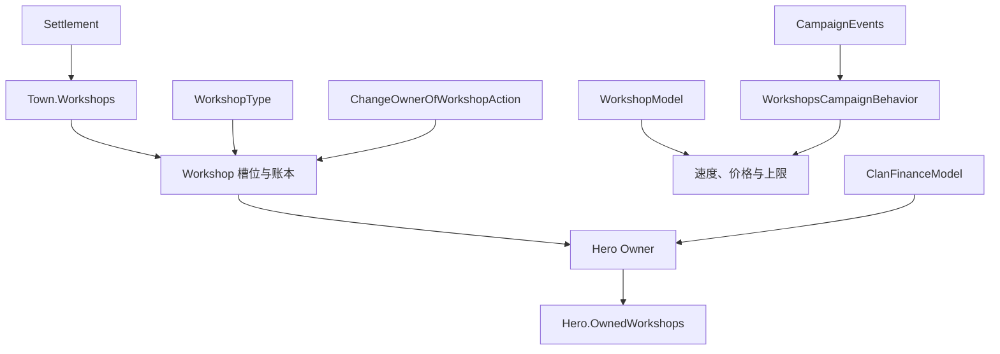

# Workshop

**命名空间：** `TaleWorlds.CampaignSystem.Settlements.Workshops`  
**模块：** `TaleWorlds.CampaignSystem`  
**类型：** `public class Workshop : SettlementArea`  
**基类：** `SettlementArea`  
**源文件：** `bin/TaleWorlds.CampaignSystem/TaleWorlds.CampaignSystem.Settlements.Workshops/Workshop.cs`  
**持久化角色：** 城镇中的一个可存档生产区域；宿主据点、主人、类型、资本、生产进度和上次运行时间都属于 Campaign 对象图。

## 概述与心智模型：工坊到底代表什么

`Workshop` 是城镇里一个固定的生产槽位。它把四种不能混为一谈的职责连在一起：

- **地点：** `Settlement` 和 `Tag` 标识这个槽位。真正保存槽位集合的是 `Settlement.Town.Workshops`，所以工坊既不是独立地图队伍，也不是独立据点。
- **人物：** `Owner` 是一个 [Hero](../Hero)，不是 [Clan](../Clan)。`Hero.OwnedWorkshops` 是反向的可存档集合。宗族通过领袖的资产取得工坊收入，并不直接持有工坊列表。
- **配方：** `WorkshopType` 是 XML/对象管理器登记的定义，提供一个或多个生产配方。其输入、输出类别和基础转化速度是共享的定义数据，不是每座工坊各自可随意改写的配置。
- **账本：** `Capital`、`InitialCapital`、进度和 `LastRunCampaignTime` 描述正在经营的状态；它们不是玩家金币，也不是一笔交易流水。

应把 `Workshop` 用作读取既有城镇产业、或交给原生 Campaign 流程处理的真实目标。不要自行构造它来往据点中塞一座工坊。城镇初始化、Hero 的反向所有权、工坊 Behavior 数据、存档登记和 Campaign 事件共同构成一个生命周期。

## 依赖关系与生命周期边界

工坊的上游实体和规则入口是 [Settlement](../Settlement)、[Town](../Town)、[Hero](../Hero) 与 [WorkshopType](../WorkshopType)；它们共同决定工坊的地点、主人、定义和运行规则。下游的 [ClanFinanceModel](../ClanFinanceModel) 只在财务流程中提取收入，不能替代工坊每日行为。



## 先取得真实工坊对象

按问题选择入口。两条路径都只能在 Campaign 已启动后使用。

| 问题 | 真实路径 | 为什么重要 |
| --- | --- | --- |
| “当前城镇有哪些工坊？” | `Settlement.CurrentSettlement -> Town -> Workshops` | 工坊属于城镇组件；村庄或没有 `Town` 的据点没有工坊数组。 |
| “这个 Hero 名下有哪些产业？” | `Hero.MainHero.OwnedWorkshops`，或另一位存活 Hero 的 `OwnedWorkshops` | 这是财务模型读取的主人侧反向视图。 |
| “它使用哪个定义？” | `workshop.WorkshopType`，再用 `WorkshopType.Find(id)` 或 `WorkshopType.All` | `WorkshopType.All` 委托给当前 `Campaign`，不能在 Campaign 初始化前读取。 |
| “当前规则是什么？” | `Campaign.Current.Models.WorkshopModel` 和 `ClanFinanceModel` | Model 提供当前生效规则，可能不同于原版默认实现。 |

以下只读示例刻意从当前据点开始，再确认所选工坊确实属于玩家。它还演示了新战役工坊初始化所使用的 `artisans` id 的 `WorkshopType.Find` 查询。

```csharp
using System.Linq;
using TaleWorlds.CampaignSystem;
using TaleWorlds.CampaignSystem.Settlements;
using TaleWorlds.CampaignSystem.Settlements.Workshops;

public static class WorkshopInspection
{
    public static string ReadCurrentPlayerWorkshop()
    {
        Town town = Settlement.CurrentSettlement?.Town;
        Workshop workshop = town?.Workshops.FirstOrDefault(
            candidate => candidate.Owner == Hero.MainHero);

        if (workshop == null)
        {
            return "No player-owned workshop at the current settlement.";
        }

        WorkshopType artisans = WorkshopType.Find("artisans");
        int purchaseCost = Campaign.Current.Models.WorkshopModel
            .GetCostForPlayer(workshop);

        return $"{workshop.Name}: {workshop.WorkshopType.Name}; " +
               $"capital={workshop.Capital}; price={purchaseCost}; " +
               $"artisansRegistered={artisans != null}";
    }
}
```

`WorkshopType.Find` 在当前模块集没有登记该 id 时会返回 `null`，使用结果前必须检查。不要让 `WorkshopType`、`Workshop`、`Town` 或 `Hero` 的缓存跨越读档边界；读档后应从当前 Campaign 对象图重新取得。

## 生产是每日 Behavior，不是 `IsRunning` 标记

1.4.5 的 `Workshop` 没有公开 `IsRunning` 属性。不能从资本、类型或存在生产配方去虚构这个状态。原生 `WorkshopsCampaignBehavior` 订阅 `DailyTickTownEvent`，并对每个 `Town.Workshops` 条目执行：

1. 城镇不处于叛乱时才运行生产循环；
2. 以 `WorkshopModel.GetEffectiveConversionSpeedOfProduction` 推进每个 `WorkshopType.Productions` 条目；
3. 经由城镇市场或玩家仓库路径尝试消耗输入、产出成品；
4. 即使因叛乱跳过生产，仍处理每日工坊费用。

`LastRunCampaignTime` 只有在 Behavior 的成功运行条件成立后才会更新。它可作为诊断线索，却不是回答“此刻是否正在生产”的通用布尔值。配方存在时仍可能因原料不足、资本不足、城镇叛乱或仓库/市场约束而无法完成生产。诊断 UI 应显示当前类型、每个配方的输入/输出、资本和上次运行时间，并把这些称为状态，而不是保证产出。

| 成员 | 应用于读取 | 不应推断或执行 |
| --- | --- | --- |
| `WorkshopType.Productions` | 已配置的输入/输出类别和基础 `ConversionSpeed` | 类型变更后不要继续用旧的进度索引；进度数组会按新配方数量重建。 |
| `GetProductionProgress(index)` | 每个配方累计的进度 | 不要用旧类型的索引，也不要把进度 `>= 1` 当作市场交易已完成。 |
| `LastRunCampaignTime` | Behavior 维护的运行证据 | 不要手动调用 `UpdateLastRunTime` 伪造“正在运行”。 |
| `Expense` | 当前 `WorkshopModel.DailyExpense` | 它来自 Model，不是每座工坊各自存档的工资设定。 |
| `Capital` / `InitialCapital` | 工坊账本与初始化基线 | 两者都不是主人金币余额，也不是最终利润报告。 |

## 利润、费用，以及收入何时进入 Hero

`ProfitMade` 的定义就是 `max(Capital - InitialCapital, 0)`。它是当前超过初始资本基线的金额，不是每日结算收入，也不表示主人已拿到金币。

默认 [ClanFinanceModel](../ClanFinanceModel) 把非负工坊利润除以 `RevenueSmoothenFraction()` 计算主人收入，默认实现的平滑分母为 5。宗族每日财务应用时，`ClanVariablesCampaignBehavior` 会调用 `CalculateClanGoldChange(..., applyWithdrawals: true)`；财务模型用 `workshop.ChangeGold(-income)` 从正的工坊份额中提款，再通过 `GiveGoldAction` 把合并后的宗族总额交给宗族领袖。对于主角，这次提款还会触发玩家资产收入事件。

因此每日有两条独立路径：

- **城镇生产与费用：** `DailyTickTownEvent` 改变工坊账本。玩家工坊通常在资本高于当前低资本阈值时从资本支付每日费用；否则 Behavior 可能使用主人的金币、回退到资本，或通过破产流程转让工坊。显贵工坊使用自身资本，同样可能破产。
- **宗族财务提款：** 财务 Behavior 将主人工坊账本中的一部分正值变为每日宗族收入，并在实际提款时减少该账本。

所以一座工坊可能在财务结算前已有正 `ProfitMade`，可能未生产却因费用损失资本，也可能在财务结算后显示不同数值。要取得当前 Model 下的估计值，应调用 `Campaign.Current.Models.ClanFinanceModel.CalculateOwnerIncomeFromWorkshop(workshop)`；不要在让原生每日财务运行的同时又自行支付该结果。

## 改世界状态时：Action 才拥有交易与事件

`Workshop` 的公开低层方法不能替代 Campaign 交易。`ChangeOwnerOfWorkshop` 确实会同步旧/新 `Hero.OwnedWorkshops` 集合，但不会计算交易金额、移动金币或广播所有权事件。`ChangeWorkshopProduction` 会重置进度数组，却不会支付转换费用或广播类型事件。`ChangeGold` 只修改工坊账本。

| 目标 | 应使用 | Action 保留的内容 |
| --- | --- | --- |
| 玩家购买 | [ChangeOwnerOfWorkshopAction.ApplyByPlayerBuying](../../campaign-ext/ChangeOwnerOfWorkshopAction) | Model 购买价、初始资本、Hero 反向所有权、金币转移和 `WorkshopOwnerChangedEvent` |
| 玩家出售 | 在选择有效显贵买家后使用 `ApplyByPlayerSelling` | 显贵收购价、重置资本、所有权列表、金币转移和事件 |
| 破产、战争或主人死亡 | 对应的 `ApplyByBankruptcy`、`ApplyByWar` 或 `ApplyByDeath` | 场景规定的资本/类型策略，以及所有权和事件处理 |
| 转换生产类型 | `ChangeProductionTypeOfWorkshopAction.Apply` | 当前 Model 的转换费用、进度重置、主人支付和 `WorkshopTypeChangedEvent` |
| 原生新战役初始化 | `InitializeWorkshopAction.ApplyByNewGame` | 初始资本、主人反向列表、生成的主人名字和 `WorkshopInitializedEvent` |

这些 Action 是改变机制，不是资格验证器。原生对话 UI 会在购买前检查玩家金币和 `GetMaxWorkshopCountForClanTier`，出售前使用 `WorkshopModel.CanPlayerSellWorkshop` / `GetNotableOwnerForWorkshop`。Mod 若直接调用 Action，必须做等价的时机与资格检查；Action 本身仍会执行其有限的交易逻辑。

下面的转换示例使用玩家已有产业和已登记类型。它通过 Action 支付当前 Model 的费用，而不是分别修改资本或主人金币。

```csharp
using System.Linq;
using TaleWorlds.CampaignSystem;
using TaleWorlds.CampaignSystem.Actions;
using TaleWorlds.CampaignSystem.Settlements.Workshops;

public static class WorkshopConversion
{
    public static bool ConvertFirstPlayerWorkshopToArtisans()
    {
        Workshop workshop = Hero.MainHero.OwnedWorkshops.FirstOrDefault();
        WorkshopType targetType = WorkshopType.Find("artisans");

        if (workshop == null || targetType == null ||
            workshop.WorkshopType == targetType)
        {
            return false;
        }

        int cost = Campaign.Current.Models.WorkshopModel
            .GetConvertProductionCost(targetType);
        if (Hero.MainHero.Gold < cost)
        {
            return false;
        }

        ChangeProductionTypeOfWorkshopAction.Apply(workshop, targetType);
        return true;
    }
}
```

此类世界状态变更应在合法的 Campaign 交互或 Behavior 中执行；不要一边枚举存活所有权集合，一边修改它，也不要放在无关的存档/读档回调中。类型或所有权监听器可能立即重建玩家工坊/仓库数据。

## 存档、事件与生命周期风险

- **存的是对象图，不是孤立数据：** `Workshop` 保存据点、主人、类型、资本、初始资本、进度和上次运行时间。`Town.Workshops` 与 `Hero.OwnedWorkshops` 从另一侧保存关联。工坊 Campaign Behavior 还单独保存玩家仓库/工坊 Behavior 数据。手工创建或替换对象会使其中一部分结构缺失。
- **读档修复：** `Workshop.AfterLoad` 会按当前 `WorkshopType.Productions.Count` 调整进度长度，并为零运行时间写入当前时间。工坊 Behavior 也会在读档时重建或移除玩家专用数据。读档后重新取得引用，不要保留读档前的列表或配方索引。
- **事件观察者：** 所有权和类型 Action 会发布 [CampaignEvents](../CampaignEvents) 通知。`WorkshopsCampaignBehavior` 监听两者：玩家获得资产时建立仓库/工坊数据，所有权或类型变化时刷新或移除数据。绕过 Action 即使看上去字段变了，UI 和仓库状态仍可能过期。
- **据点事件可以转让资产：** Behavior 还响应据点所有权、战争、宗族-王国关系变化和 Hero 死亡。敌对领地中的玩家工坊可走战争路径被转让，死亡显贵的工坊也会走死亡路径。不要在一次事件回调或一次每日 tick 内假定 `Owner` 恒定。
- **没有独立销毁槽位：** v1.4.5 源码没有公开的 `DestroyWorkshopAction` 或 Workshop 移除生命周期。`Town.Workshops` 是由 Town 初始化并进入存档的固定槽位集合；不要通过移除、置空或替换数组条目来模拟销毁。需要改变工坊状态时，应使用所有权、破产、战争、死亡或生产类型对应的原生 Action/Behavior，让它们维护反向集合、事件和存档数据。
- **不要直接写“盈利”：** `Capital` 的 setter 是私有的，但公开 `ChangeGold` 仍是底层账本改动。直接加奖金会跳过经济来源、财务提款时机和交易语义。新增经济规则应放入合适的 Model 或受控 Campaign Behavior，并明确决定如何存档。

## 导航

- ↑ Parent: [Campaign API](../)
- ↔ Siblings: [Settlement](../Settlement) · [Town](../Town) · [Village](../Village) · [Clan](../Clan) · [Hero](../Hero)
- Related: [WorkshopType](../WorkshopType) · [WorkshopModel](../WorkshopModel) · [ClanFinanceModel](../ClanFinanceModel) · [ChangeOwnerOfWorkshopAction](../../campaign-ext/ChangeOwnerOfWorkshopAction) · [CampaignEvents](../CampaignEvents) · [SaveManager](../../save-system/SaveManager)
