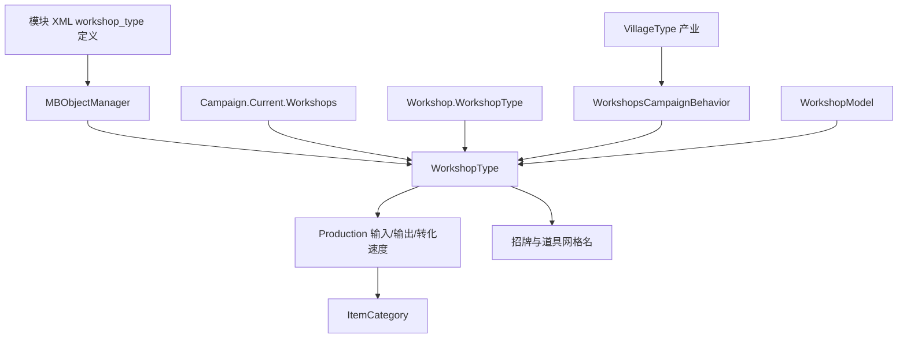

# WorkshopType

**命名空间：** `TaleWorlds.CampaignSystem.Settlements.Workshops`  
**模块：** `TaleWorlds.CampaignSystem`  
**类型：** `public sealed class WorkshopType : MBObjectBase`  
**基类：** [MBObjectBase](../../core/MBObjectBase)  
**源文件：** `bin/TaleWorlds.CampaignSystem/TaleWorlds.CampaignSystem.Settlements.Workshops/WorkshopType.cs`  
**对象角色：** 由 XML 与 `MBObjectManager` 注册的“作坊种类”定义；`Workshop` 持有它的引用作为自身类型，游戏逻辑只读消费它，不在运行时改写。

## 概述

`WorkshopType` 表示游戏里一种作坊的静态定义，例如铁匠铺、织布坊、酿酒坊等，而不是某一个具体的作坊实例。它在战役加载时由 `MBObjectManager` 从模块 XML 反序列化而成，承载该类作坊的本地化名、职业名、建造设备成本 `EquipmentCost`、用于随机选型的 `Frequency`、若干条 `Production` 生产配方（每条配方声明消费哪些 `ItemCategory` 输入、产出哪些 `ItemCategory` 输出、以及 `ConversionSpeed` 转化速度），以及贴在城镇场景上的招牌与道具网格名。之后 `Workshop.WorkshopType` 指向其中一个定义，生产行为由 `WorkshopsCampaignBehavior` 读取这些配方、由 `WorkshopModel` 计算成本与有效转化速度来推进。`WorkshopType` 本身是只读的定义数据，不持有任何具体作坊的经营状态。

## 心智模型

把 `WorkshopType` 理解成“一张作坊种类的配方卡”：它告诉你这种作坊能干什么、长什么样、值多少钱，但不代表某个镇上的某间作坊。它的生命周期完全由对象管理器掌控——`Initialize` 先建好空的 `_productions` 列表，`Deserialize` 再逐条读 XML 的 `<Production>` 与 `<Meshes>` 节点，把输入/输出引用通过 `MBObjectManager.GetObject<ItemCategory>` 解析进来，并把字符串属性（`name`、`jobname`、`description`、`equipment_cost`、`frequency`）填好。注册完成后，全部种类通过 `Campaign.Current.Workshops` 暴露，静态入口 `WorkshopType.All` 就是这张清单。`Workshop` 在初始化时（`InitializeWorkshop(owner, type)`）把 `WorkshopType` 引用挂到自己身上，于是生产逻辑可以顺着 `workshop.WorkshopType.Productions` 找到配方。mod 的常规用法是读取这些定义、按 `StringId` 查找、或在模块 XML 里新增一种作坊；它不属于 Model 也不属于 Behavior，不要在战役中 `new WorkshopType()`，也不要在运行中改动已注册种类的字段——真正改变世界状态要走 `*Action` 和 Behavior。

## 依赖图



| 关联对象 | 实际边界 |
| --- | --- |
| [MBObjectManager](../../campaign-ext/MBObjectManager) 与 [MBObjectBase](../../core/MBObjectBase) | 作坊种类以 `StringId` 注册和查找；`Deserialize` 用 `GetObject<ItemCategory>` 解析生产配方引用，引用缺失会得到空类别并打 `Debug.Print`。 |
| [Campaign](../Campaign) | `WorkshopType.All` 直接返回 `Campaign.Current.Workshops`，因此必须在战役已创建后访问，模块加载前为无效。 |
| [Workshop](../Workshop) | 具体作坊通过 `WorkshopType WorkshopType` 持有定义；`Productions.Count` 决定 `_productionProgress` 数组长度，换类型时由 `ChangeWorkshopProduction` 重建进度数组。 |
| [Settlement](../Settlement) / [Town](../Town) | 城镇在 `Town.Workshops` 中放置若干作坊槽位，`BuildWorkshopsAtGameStart` 与 `DecideBestWorkshopType` 依据村落产业为每个槽位挑选 `WorkshopType`。 |
| [VillageType](../VillageType) | `WorkshopsCampaignBehavior.DecideBestWorkshopType` 遍历与本镇绑定的村落，用其 `VillageType.Productions` 估算原料密度，从而决定哪种 `WorkshopType` 最适合该镇。 |
| [ItemObject](../../core/ItemObject) 与 [ItemCategory](../../core-extra/ItemCategory) | 每条 `Production` 的输入/输出都是 `(ItemCategory, int)`；具体产出物品在运行时由 `WorkshopModel`/行为从同类别物品中按加权随机挑选。 |
| [WorkshopModel](../WorkshopModel) 与 [DefaultWorkshopModel](../DefaultWorkshopModel) | `WorkshopModel` 消费 `EquipmentCost`、`Productions`、`ConversionSpeed` 计算建造成本、每日开销、有效转化速度与破产阈值；它是规则入口而非数据本身。 |
| [ChangeOwnerOfWorkshopAction](../../campaign-ext/ChangeOwnerOfWorkshopAction) | 作坊易主、战争接管、破产倒闭等通过 Action 间接改变 `Workshop.WorkshopType`，不是直接改 `WorkshopType` 字段。 |

## 内部结构：Production

`WorkshopType` 内嵌一个只读的 `Production` 结构，描述“一条生产配方”。它不对外构造，只由 `Deserialize` 在读取 XML 时填充。

| 成员 | 含义与调用时机 |
| --- | --- |
| `Inputs` → `MBReadOnlyList<(ItemCategory, int)>` | 本配方每次转化要消耗的原料类别及数量；行为在 `DetermineItemRosterHasSufficientInputs` 与 `GetInputCount` 中遍历它判断库存是否足够。 |
| `Outputs` → `MBReadOnlyList<(ItemCategory, int)>` | 本配方每次转化产出的类别及数量；`GetItemsToProduce` 据此在同类别物品里随机取具体 `ItemObject`，再按市场价估收益。 |
| `ConversionSpeed` → `float` | 该配方的转化速度（XML `conversion_speed`），越大每日推进越快；`FindTotalInputDensityScore` 与有效转化速度计算都用它。 |
| `AddInput` / `AddOutput` | XML 反序列化阶段把读到的类别引用加入配方；正常运行期不应调用。 |
| `ToString` | 仅拼接输入/输出类别名，用于调试日志。 |

## 关键成员说明

作坊种类的数据由私有 setter 的属性暴露，全部来自 XML，运行期不推荐改写：

| 成员 | 真正表示什么 |
| --- | --- |
| `EquipmentCost` → `int` | 建造该类作坊时购买设备的一次性金币成本（XML `equipment_cost`），被 `WorkshopModel` 用作购买/倒闭结算的基准。 |
| `Frequency` → `int` | 该种类在随机分配时的出现权重（XML `frequency`，缺省 1）；`FindTotalInputDensityScore` 用 `Frequency` 放大其被选概率，值越高越容易出现在适配原料的城镇。 |
| `Name` → `TextObject` | 作坊种类的本地化显示名（XML `name`），`GetName()` 与 `ToString()` 都返回它。 |
| `JobName` → `TextObject` | 该类作坊工人的职业名（XML `jobname`），供 UI 显示工种。 |
| `Description` → `TextObject` | 作坊种类的说明文本（XML `description`），用于百科或 tooltip。 |
| `IsHidden` → `bool` | 隐藏标记（XML `isHidden`）。为 `true` 的种类不会进入 `DecideBestWorkshopType` 的随机池，也免征每日开销（`HandleDailyExpense` 直接跳过）；常用于手工艺人等特例槽位。 |
| `SignMeshName` / `PropMeshName1~6` / `PropMeshName3List` → `string` | 贴在城镇场景上的招牌与若干道具网格资源名（XML `<Meshes>`），纯表现数据，由场景与 UI 读取装配。 |
| `Productions` → `MBReadOnlyList<Production>` | 该种类的全部生产配方集合；`RunTownWorkshop` 按索引推进每条配方的进度。 |
| `All` → `static MBReadOnlyList<WorkshopType>` | 便捷入口，等价于 `Campaign.Current.Workshops`，拿到全部已注册作坊种类。 |
| `Find(string idString)` → `static WorkshopType` | 按 `StringId` 在对象管理器中查找一个已注册种类（`MBObjectManager.Instance.GetObject<WorkshopType>(idString)`）；找不到返回 `null`。行为中用 `WorkshopType.Find("artisans")` 取手工艺人类型。 |
| `FindFirst(Func<WorkshopType,bool>)` → `static WorkshopType` | 在 `All` 上按谓词取第一个匹配项（`All.FirstOrDefault(predicate)`）。 |
| `Initialize()` / `Deserialize(...)` | 对象管理器的加载钩子：前者建空 `_productions`，后者从 XML 节点填充全部字段并解析配方引用。不要当作运行期重新解析的入口。 |

## 何时使用 / 何时不要使用

### 适合使用

- 在 Campaign 逻辑里读取 `Workshop.WorkshopType` 判断某间作坊的种类、显示名或生产配方。
- 在模块加载完成后用 `WorkshopType.Find("smithy")` 等稳定 `StringId` 定位一种已注册作坊，或用 `WorkshopType.All` 枚举全部种类。
- 在自定义 `WorkshopModel` 里把这些只读定义当作输入，计算你自己的成本/收益结果，再通过模型替换机制提供规则扩展。
- 在新增作坊种类时，为 XML 安排正确的加载顺序与唯一 `StringId`，并填好输入/输出类别与网格名。

### 不要这样使用

- 不要用 `new WorkshopType()` 在战役运行中拼装一个种类，也不要直接改写 `EquipmentCost`、`Productions` 等已注册字段——它们是定义层数据。
- 不要把 `WorkshopType` 当成经营状态容器；某间作坊的本金、进度、主人属于 `Workshop` 字段，改变它们要走 `ChangeOwnerOfWorkshopAction`、`ChangeProductionTypeOfWorkshopAction` 等 Action。
- 不要在 `MBObjectManager` 尚未完成 XML 加载时访问 `WorkshopType.All` 或 `Find`，此时 `Campaign.Current.Workshops` 可能为空或不全。
- 不要仅因为想换一种生产就改 `Workshop.WorkshopType` 字段；应通过行为/Action 走 `ChangeWorkshopProduction`，它会重建 `_productionProgress` 数组，否则进度长度与配方数量不匹配会在 `AfterLoad` 之外产生越界风险。

## 风险

- **注册顺序：** `Deserialize` 用 `GetObject<ItemCategory>` 解析配方引用；若类别未加载或 `StringId` 拼错，会得到空 `ItemCategory` 并打印 `Debug.Print`，该配方实际无法生产。
- **ID 是契约：** 已保存 `Workshop` 持有的是种类身份而非显示名；重命名 `StringId`、复用旧 ID 或删除已被存档引用的 XML 定义会让读档映射错乱甚至失败。
- **定义与运行态分离：** `WorkshopType` 是定义层，`Workshop` 是运行态。把字段当改世界的快捷方式会留下与 Behavior、Model、存档不一致的状态。
- **跨层访问：** `WorkshopType.All` 来自 `Campaign.Current.Workshops`，在 Mission 层或模块加载前访问会得到空引用或过期清单。
- **隐藏种类：** 误把 `IsHidden` 为 `true` 的种类当作可购买/可随机目标，会跳过开销与选型逻辑，行为上与设计意图不符。

## 示例

最稳定的读取方式是从具体 `Workshop` 顺着 `WorkshopType` 拿到定义，或枚举 `MBObjectManager` 中已注册的全部种类：

```csharp
using System.Linq;
using TaleWorlds.CampaignSystem;
using TaleWorlds.CampaignSystem.Settlements;
using TaleWorlds.CampaignSystem.Settlements.Workshops;
using TaleWorlds.Core;
using TaleWorlds.ObjectSystem;

public static class WorkshopTypeSurvey
{
    public static void InspectPlayerOwnedKinds()
    {
        foreach (var workshopType in MBObjectManager.Instance.GetObjectTypeList<WorkshopType>())
        {
            if (workshopType.IsHidden)
            {
                continue;
            }

            int buildCost = workshopType.EquipmentCost;
            int selectionWeight = workshopType.Frequency;

            foreach (var production in workshopType.Productions)
            {
                float speed = production.ConversionSpeed;
                foreach (var input in production.Inputs)
                {
                    ItemCategory category = input.Item1;
                    int requiredCount = input.Item2;
                }
            }
        }
    }
}
```

沿具体作坊读取其种类与配方，并用稳定 `StringId` 反查一个定义：

```csharp
using TaleWorlds.CampaignSystem;
using TaleWorlds.CampaignSystem.Settlements;
using TaleWorlds.CampaignSystem.Settlements.Workshops;
using TaleWorlds.Localization;

public static class WorkshopInspection
{
    public static string GetWorkshopKindName(Workshop workshop)
    {
        WorkshopType type = workshop.WorkshopType;
        TextObject displayName = type.Name;
        return displayName.ToString();
    }

    public static WorkshopType ResolveSmithy()
    {
        return WorkshopType.Find("smithy");
    }
}
```

这两个入口只用于读取或定位已注册对象，不会创建缺失种类；把不存在的 `StringId` 或未加载的依赖传入，会让 `Find` 返回 `null`，下游访问 `WorkshopType.Name` 时即崩溃。

## 参见

- ↑ 父级：[战役 API 索引](../)
- ↔ 同级相关：[Workshop](../Workshop) · [VillageType](../VillageType) · [WorkshopModel](../WorkshopModel) · [DefaultWorkshopModel](../DefaultWorkshopModel) · [Campaign](../Campaign) · [Town](../Town)
- 跨层级：[MBObjectManager](../../campaign-ext/MBObjectManager) · [ChangeOwnerOfWorkshopAction](../../campaign-ext/ChangeOwnerOfWorkshopAction) · [MBObjectBase](../../core/MBObjectBase) · [ItemObject](../../core/ItemObject) · [ItemCategory](../../core-extra/ItemCategory)
