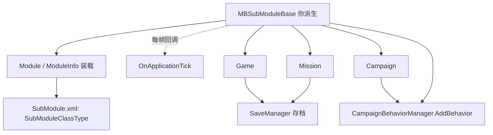

# MBSubModuleBase

**Namespace:** `TaleWorlds.MountAndBlade`
**Module:** `TaleWorlds.MountAndBlade`
**Type:** `public abstract class MBSubModuleBase`
**Base:** 无（顶层抽象基类）
**源文件：** `bin/TaleWorlds.MountAndBlade/TaleWorlds.MountAndBlade/MBSubModuleBase.cs`

## 职责一句话

它是每个可装载模块（Module）的「生命周期入口」：引擎在模块装载、游戏启动/加载/结束、每帧刷新等节点，逐个回调你派生类重写的虚方法；它本身不持有任何游戏状态，只负责在正确的时机把控制权交给你。

## 心智模型

**生命周期与持有者。** 你的派生类实例由引擎在模块装载阶段创建并长期持有在 `Module.CurrentModule` 的 `_subModuleBases` 集合中，直到进程退出或模块卸载。`MBSubModuleBase` 自身几乎不保存字段——真正的游戏状态在 [Game](.././Game)、[Campaign](../../campaign/Campaign)、[Mission](../../mission/Mission) 里。你写的子类更像「一组按时间触发的钩子」，而不是一个状态对象。

**调用链（已读源码确认）。** 模块装载时 `Module.InitializeSubModuleBases()`（`Module.cs:201`）会遍历 `_subModuleBases` 逐一调用 `OnSubModuleLoad()`；每帧由 `Module.OnApplicationTick()`（`Module.cs:463/523`）遍历调用 `OnApplicationTick(dt)`。进入游戏后，真正的分发者是 `MBGameManager`（战役游戏管理器），它用 `Module.CurrentModule.CollectSubModules()` 取回所有子模块，并在 [Campaign](../../campaign/Campaign) 构建流程中按固定顺序逐个回调（`MBGameManager.cs:102–171`）：`InitializeGameStarter` → `OnGameStart` → `BeginGameStart`/`OnCampaignStart` → `OnGameInitializationFinished` → `OnAfterGameInitializationFinished`。注意 `OnGameInitializationFinished` 是在 `Campaign` 已经构建好 `CampaignBehaviorManager` 之后才被调用的（`Campaign.cs:1422` 与 `1452`）。

**属于哪一层。** 它处在「模块/应用层」的最外层：比 [Game](.././Game) 更早存在、比任何 [CampaignBehaviorBase](../../campaign/Campaign) 都更早拿到控制权。它适合做「一次性注册」和「跨游戏边界的桥接」，不适合当成游戏内逻辑的家。

**何时用 / 何时不用。**
- 用：注册对话行、自定义类型、配置项；在游戏启动窗口内挂接 [CampaignBehaviorBase](../../campaign/Campaign)（见下方真实示例）；订阅/退订跨模块的全局事件。
- 不用：把战役逻辑直接写在 `OnApplicationTick` 里——应该用 `*Action.Apply` 或在 [CampaignBehaviorBase](../../campaign/Campaign) 里订阅 `CampaignEvents`，而不是在这里手写每帧轮询和字段赋值。不要在 `OnSubModuleLoad` 阶段去碰 `Campaign.Current`/`Game.Current`——那时还没有游戏（见 [崩溃边界](../../../architecture/crash-boundary)）。

## 依赖关系



- **上游（谁创建 / 持有）：**[Module 目录](./) 中的 `Module` 通过读取每个模块的 `SubModule.xml`（`<SubModuleClassType value="命名空间.类名"/>`，DLL 必须编译到 `bin/Win64_Shipping_Client/`）实例化并持有你的子模块；`MBGameManager` 负责在游戏启动时回调它。详见 [doc-contract](../../../architecture/doc-contract)。
- **下游（它调度 / 接入）：**[Game](.././Game)、[Campaign](../../campaign/Campaign)、[Mission](../../mission/Mission)。战役逻辑应通过 `CampaignBehaviorManager.AddBehavior`（非泛型）挂入 [Campaign](../../campaign/Campaign)。
- **Events：** 你通常在 `OnGameStart` 里拿到的 `IGameStarter`（`CampaignGameStarter`）上 `AddBehavior`，再由行为内部用 `CampaignEvents.*`（`DailyTickEvent`、`OnGameLoadedEvent` 等）订阅。
- **Behaviors / Actions：** 行为用 `CampaignBehaviorBase`；需要改变游戏状态时优先用引擎的 `*Action.Apply`，而非直接改字段。
- **Save 点：** 通过 `CampaignBehaviorManager` 注册的 [CampaignBehaviorBase](../../campaign/Campaign) 会被 `CampaignBehaviorDataStore` 自动纳入存档；在 `OnGameEnd` 之前引擎会触发 `OnBeforeSave` 收集行为数据。

## 风险（可能导致崩溃或存档损坏）

1. **在 `OnSubModuleLoad` / `OnBeforeInitialModuleScreenSetAsRoot` 里访问 `Campaign.Current` 或 `Game.Current`。** 这两个钩子在任意游戏创建之前触发，引用为 `null`，直接解引用会 `NullReferenceException`，表现为主菜单阶段崩溃。它们只适合做一次性静态注册（对话、类型、配置）。
2. **把 `CampaignBehaviorBase` 注册到错误的地方。** 若在 `OnSubModuleLoad` 里 `new` 一个行为却从没通过 `IGameStarter.AddBehavior` / `CampaignBehaviorManager.AddBehavior` 挂入，它永远不会被 `RegisterEvents`、`SyncData` 或存档流程触达——等于不存在。行为必须在「游戏启动窗口」内注册（见真实示例）。
3. **在 `OnApplicationTick` 里无保护地触碰游戏对象。** 主菜单、战役地图、选项界面都共享这一帧回调；若 `Game.Current == null` 或当前 `GameState` 不是你预期的状态，调用 `Mission`/`MBActionSet` 等 API 会崩。务必先 `if (Game.Current != null)` 并判断游戏状态。
4. **在 `OnApplicationTick` 里做重活或抛异常。** 它运行在渲染主循环里，阻塞或抛错会卡死或闪退整帧；把耗时逻辑推迟到协程/后台线程。
5. **在 `OnSubModuleLoad` 订阅了引擎/全局事件（如 `EngineController.ConfigChange`）却在 `OnSubModuleUnloaded` 里没退订。** 模块热重载时会造成重复订阅与方法泄漏。
6. **`SubModule.xml` 写错 `SubModuleClassType` 或 DLL 没编译到 `Win64_Shipping_Client`。** `SubModuleInfo.LoadFrom` 抛出的异常会被吞掉并打印 "Cannot load a submodule"，结果你的子模块根本没被加载，所有钩子静默失效。
7. **为行为起重复的 `StringId`。** `CampaignBehaviorDataStore` 以行为实例为键存读存档数据；两个行为 `StringId` 相同会在存读档时互相覆盖字段，导致存档内容错乱。

## 成员笔记（按主题分组，非签名墙）

### A. 模块装载期（进程/模块级，早于任何游戏）
- **`OnSubModuleLoad()`** — 模块装载时调用**一次**。用途：注册对话行、自定义 `MBObjectBase` 子类型、初始化静态配置。副作用：此时没有 [Game](.././Game) / [Campaign](../../campaign/Campaign)。何时重写：需要「只要模块在就生效」的全局注册。
- **`OnSubModuleUnloaded()`** — 模块卸载时调用。用途：退订你在 `OnSubModuleLoad` 里订阅的全局/引擎事件，避免泄漏。
- **`OnBeforeInitialModuleScreenSetAsRoot()`** — 初始模块界面即将成为根之前。用途：在首个界面出现前改 UI/本地化；同样**不能**假设游戏已存在。
- **`OnNewModuleLoad()`** — 有新模块在运行中加载时回调。
- **`OnConfigChanged()`** — 图形/配置变更后。用途：根据新配置刷新你缓存的渲染/选项状态。
- **`OnSubModuleActivated()` / `OnSubModuleDeactivated()`** — 当本模块在启动器里被启用/禁用切换时。

### B. 游戏启动期（正确的行为注册窗口）
- **`OnBeforeGameStart(MBGameManager, List<string> disabledModules)`** — 游戏真正开始前。可读取被禁用的模块列表来调整自己的行为。
- **`InitializeGameStarter(Game, IGameStarter)`** — 引擎构造游戏启动器时。**这是注册 `CampaignBehaviorBase` 的最早安全点之一**（通过把 `IGameStarter` 转型为 `CampaignGameStarter` 后 `AddBehavior`）。
- **`OnGameStart(Game game, IGameStarter gameStarterObject)`** — 战役游戏管理器对每种子模块回调。**最常用、最推荐的注册点**：在此把 `gameStarterObject` 转型为 `CampaignGameStarter` 并 `AddBehavior(new 你的行为())`，该行为会随 `CampaignGameStarter.CampaignBehaviors` 进入 `CampaignBehaviorManager`，自动参与事件与存读档（见真实示例）。副作用：此时 [Campaign](../../campaign/Campaign) 已存在。
- **`BeginGameStart(Game)` / `OnCampaignStart(Game, object)`** — 战役正式开始前后；适合读取战役参数。
- **`OnMultiplayerGameStart(Game, object)`** — 多人游戏开始；与战役路径分离，不要在这里注册战役行为。
- **`RegisterSubModuleObjects(bool isSavedCampaign)` / `AfterRegisterSubModuleObjects(bool)`** — 注册/反序列化本模块需要的游戏对象；`isSavedCampaign` 区分新档与读档。

### C. 初始化完成与读档
- **`OnGameInitializationFinished(Game game)`** — `Campaign` 已完成 `CampaignBehaviorManager` 构建之后回调。**若在此用 `Campaign.Current.CampaignBehaviorManager.AddBehavior(new 你的行为())` 同样可行**：该方法（`CampaignBehaviorManager.cs:76`）会顺带调用 `RegisterEvents()`，且行为会被纳入后续存读档。但注意：读档流程里 `LoadBehaviorData()`（`Campaign.cs:1429`）在此回调**之前**已跑过，所以晚加的行为不会有「旧档里的状态」可加载——对全新行为没问题，但不要指望它能还原读档数据。新战役场景优先用 `OnGameStart` 注册。
- **`OnAfterGameInitializationFinished(Game, object)`** — 初始化彻底完成后；适合做依赖全部行为已就绪的收尾。
- **`OnGameLoaded(Game, object)` / `OnAfterGameLoaded(Game)`** — 读档完成后；在此才能安全访问读档得到的 [Campaign](../../campaign/Campaign) 状态。
- **`OnNewGameCreated(Game, object)`** — 新档创建后。
- **`DoLoading(Game) : bool`** — 返回 `true` 表示由本子模块驱动加载流程。
- **`InitializeSubModuleGameObjects(Game)`** — 初始化本模块在游戏里的GameObject。

### D. 运行时每帧
- **`OnApplicationTick(float dt)`** — 每帧调用，`dt` 为帧间隔（秒）。用途：轮询输入、轻量计时；**务必**先判 `Game.Current != null`。副作用：在菜单也存在，切勿在此做重活或碰游戏对象而不加保护。
- **`AfterAsyncTickTick(float dt)`** — 异步 tick 之后。
- **`OnNetworkTick(float dt)`** — 网络帧。

### E. 结束与 Mission
- **`OnGameEnd(Game)`** — 游戏结束时；适合清理你创建的全局状态（注意：行为内的非序列化监听器由 `CampaignBehaviorManager` 自动清理，无需你手动退订）。
- **`OnBeforeMissionBehaviorInitialize(Mission)` / `OnMissionBehaviorInitialize(Mission)`** — 进入 [Mission](../../mission/Mission) 前后；可在此向 `mission` 注入自定义 `MissionBehavior`。
- **`OnInitialState()`** — 初始游戏状态建立时。

## 真实示例

下面是一段可编译的 C#：派生 `MBSubModuleBase`，在 `OnGameStart` 这个正确的窗口里把自定义 `CampaignBehaviorBase` 通过 `CampaignGameStarter.AddBehavior` 注册进去（真实 API 名，已对照源码）。

```csharp
using TaleWorlds.CampaignSystem;
using TaleWorlds.CampaignSystem.CampaignBehaviors; // 仅用于说明命名空间
using TaleWorlds.Core;
using TaleWorlds.MountAndBlade;

namespace MyMod
{
    // 在 SubModule.xml 中声明：<SubModuleClassType value="MyMod.MySubModule" />
    public class MySubModule : MBSubModuleBase
    {
        // 模块装载时调用一次：这里不要碰 Campaign.Current / Game.Current
        protected override void OnSubModuleLoad()
        {
            // 一次性静态注册（例如对话行、配置）——本例留空
        }

        // 推荐入口：在游戏构建期把行为挂入 CampaignGameStarter
        public override void OnGameStart(Game game, IGameStarter gameStarterObject)
        {
            // 只给单人战役注册；多人走 OnMultiplayerGameStart
            if (game.GameType == GameType.Single)
            {
                var starter = (CampaignGameStarter)gameStarterObject;
                starter.AddBehavior(new DailyGoldBehavior());
            }
        }

        // 备选入口（仅在已存在 Campaign 时可用）：
        // 在 OnGameInitializationFinished 里用真实的非泛型 API 注册，
        // CampaignBehaviorManager.AddBehavior 会顺带调用行为的 RegisterEvents()。
        // public override void OnGameInitializationFinished(Game game)
        // {
        //     Campaign.Current.CampaignBehaviorManager.AddBehavior(new DailyGoldBehavior());
        // }
    }

    // 真实行为：继承 TaleWorlds.CampaignSystem.CampaignBehaviorBase
    public class DailyGoldBehavior : CampaignBehaviorBase
    {
        private int _daysSinceBonus;

        public override void RegisterEvents()
        {
            // 真实事件名（见 BanditSpawnCampaignBehavior 等原生行为用法）
            CampaignEvents.DailyTickEvent.AddNonSerializedListener(this, OnDailyTick);
        }

        public override void SyncData(IDataStore dataStore)
        {
            // 存读档：字段经 CampaignBehaviorDataStore 自动纳入存档
            dataStore.SyncData("DaysSinceBonus", ref _daysSinceBonus);
        }

        private void OnDailyTick()
        {
            _daysSinceBonus++;
            if (_daysSinceBonus >= 7)
            {
                _daysSinceBonus = 0;
                // 改变状态优先用引擎 Action，而非直接写字段；此处仅示意
                GiveGoldToMainHero(1000);
            }
        }

        private void GiveGoldToMainHero(int amount)
        {
            if (Hero.MainHero != null)
            {
                Hero.MainHero.ChangeHeroGold(amount);
            }
        }
    }
}
```

对应的 `SubModule.xml`（放在模块根目录，`DLLName` 指向 `bin/Win64_Shipping_Client` 下的程序集）：

```xml
<Module>
  <SubModules>
    <SubModule>
      <Name value="MyMod" />
      <DLLName value="MyMod.dll" />
      <SubModuleClassType value="MyMod.MySubModule" />
    </SubModule>
  </SubModules>
</Module>
```

## 导航

- ↑ 上级（Parent）：[core 目录](./)
- ↔ 同级（Sibling）：[Game](.././Game)、[MBObjectBase](.././MBObjectBase)
- 相关（Related）：[doc-contract](../../../architecture/doc-contract) · [崩溃边界](../../../architecture/crash-boundary) · [Campaign](../../campaign/Campaign) · [Mission](../../mission/Mission)

## 参见

- ↑ 上游枢纽：[模块文档契约](../../../architecture/doc-contract)（子模块/行为生命周期入口的总约束）
- ↓ 下游/相关：[Game](.././Game)（子模块接入的游戏对象）· [Campaign](../../campaign/Campaign)（行为实际挂接处）· [Mission](../../mission/Mission)（使命级行为入口）
