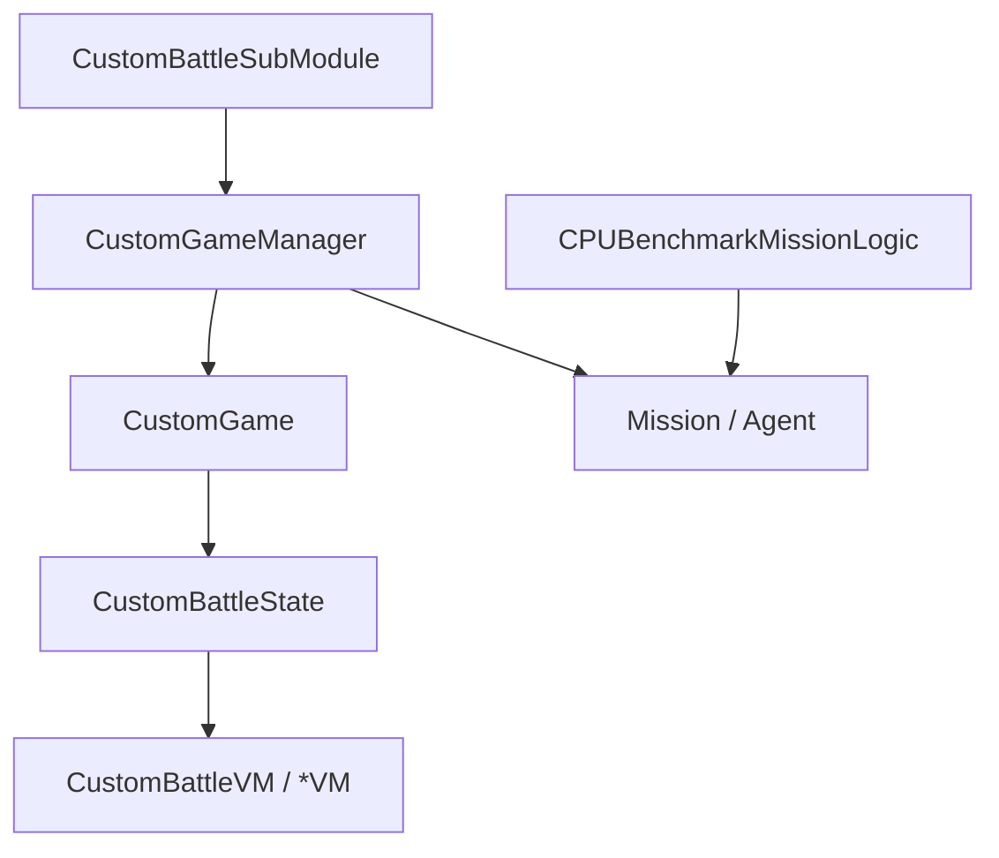

# CustomBattle 家族手册

**一句话职责：** `TaleWorlds.MountAndBlade.CustomBattle` 是「自定义战斗」模式（`CustomBattleSubModule` 激活）的全部类型。玩家在 `CustomBattleScreen` 里用 `CustomBattleVM` 配置双方编队（`ArmyComposition*VM`/`CustomBattleTroopTypeVM`）、地图（`CustomBattleSceneData`）后，`CustomGameManager` 创建 `CustomGame` 并装配一场 [Mission](../mission/Mission)；`CPUBenchmarkMissionLogic` 提供跑分场景。它是与战役解耦的独立对战入口。

## 心智模型

把自定义战斗想成「配置（VM/State）→ 对局（CustomGame）→ 管理器驱动 → Mission 开打」。`CustomBattleSubModule` 在模块加载时注册 UI 与行为；玩家在 `CustomBattleScreen` 改 `CustomBattleVM`/`CustomBattleState`；「开战」时 `CustomGameManager` 据 `CustomGame`（编队/地图/规则）生成 [Mission](../mission/Mission) 与双方部队。阅读顺序：先看 [MBSubModuleBase](../core/MBSubModuleBase) 了解 SubModule 入口，再看 [Mission](../mission/Mission) 与 [Agent](../mission/Agent) 了解战斗运行，最后回到本页按「入口 / 配置 / 对局 / 界面」找类型。

## 何时使用

- 你要加一种自定义战斗规则或编队类别——扩展 `CustomGame`/`CompositionType` 与对应 VM，不要直接改战役战斗流程。
- 自定义战斗与战役世界解耦；不要在这里写 `Hero`/`Settlement`/`MobileParty` 的战役字段（那是战役层的事）。
- 生成部队走与战役相同的 `Mission` 装配路径，确保 AI/编队逻辑一致。

## 依赖关系

- 上游：[MBSubModuleBase](../core/MBSubModuleBase) 定义 SubModule 契约；[Mission](../mission/Mission) 与 [Agent](../mission/Agent) 提供战斗运行环境。
- 下游：配置由 [GUI 总索引](../gui/_index) 的 `CustomBattleScreen` 呈现；对局结果独立于战役存档。
- 邻接模块：[mission-ext 总索引](../_index)。

## CustomBattle 类型（TaleWorlds.MountAndBlade.CustomBattle）

| Type | Namespace | Purpose | Timing |
| --- | --- | --- | --- |
| `ArmyCompositionGroupVM` | TaleWorlds.MountAndBlade.CustomBattle | 自定义战斗编队分组视图模型（一侧部队的一个兵种分组）。 | 编队配置 |
| `ArmyCompositionItemVM` | TaleWorlds.MountAndBlade.CustomBattle | 自定义战斗编队单项视图模型（某兵种/单位的数量项）。 | 编队配置 |
| `CompositionType` | TaleWorlds.MountAndBlade.CustomBattle | 编队类型枚举（步兵/骑兵/弓箭手），决定可调用的部队类别。 | 编队配置 |
| `CPUBenchmarkMissionLogic` | TaleWorlds.MountAndBlade.CustomBattle | 自定义战斗中的 CPU 基准测试任务逻辑（跑分场景）。 | 基准测试 |
| `CPUBenchmarkMissionSpawnHandler` | TaleWorlds.MountAndBlade.CustomBattle | CPU 基准测试任务的生成处理器。 | 基准测试 |
| `CustomBattleSceneData` | TaleWorlds.MountAndBlade.CustomBattle | 自定义战斗场景数据（地图/天气/时间），驱动战斗装配。 | 开战前 |
| `CustomBattleSceneNotificationContextProvider` | TaleWorlds.MountAndBlade.CustomBattle | 自定义战斗场景通知上下文提供者（UI 通知来源）。 | 通知触发 |
| `CustomBattleScreen` | TaleWorlds.MountAndBlade.CustomBattle | 自定义战斗的配置/进行界面（Gauntlet Screen）。 | 界面打开 |
| `CustomBattleSideVM` | TaleWorlds.MountAndBlade.CustomBattle | 自定义战斗某一方（玩家/敌方）的视图模型。 | 编队配置 |
| `CustomBattleState` | TaleWorlds.MountAndBlade.CustomBattle | 自定义战斗的当前状态（编队/地图/进行中），聚合配置。 | 全程 |
| `CustomBattleSubModule` | TaleWorlds.MountAndBlade.CustomBattle | 自定义战斗模块的 SubModule 入口，注册行为/UI。 | 模块加载 |
| `CustomBattleTroopTypeVM` | TaleWorlds.MountAndBlade.CustomBattle | 自定义战斗可用兵种类型的视图模型。 | 编队配置 |
| `CustomBattleViews` | TaleWorlds.MountAndBlade.CustomBattle | 自定义战斗相关视图集合，聚合多个 Gauntlet 视图。 | 界面渲染 |
| `CustomBattleVM` | TaleWorlds.MountAndBlade.CustomBattle | 自定义战斗主视图模型，承载编队与开战的配置状态。 | 全程 |
| `CustomGame` | TaleWorlds.MountAndBlade.CustomBattle | 自定义战斗的对局定义（双方编队/地图/规则）。 | 开战时 |
| `CustomGameManager` | TaleWorlds.MountAndBlade.CustomBattle | 自定义战斗管理器，创建并驱动 CustomGame 的生命周期。 | 开战/结束 |
| `SelectionGroup` | TaleWorlds.MountAndBlade.CustomBattle | 编队选择中的分组容器，管理可批量选取的部队项。 | 编队配置 |

## 风险与边界

- **与战役解耦**：自定义战斗结果不写战役存档；不要在这里改 `Hero`/`Settlement`/`MobileParty` 的战役字段。
- **SubModule 加载顺序**：`CustomBattleSubModule` 必须在依赖的 UI/行为之前注册，否则开战时找不到处理器。
- **部队装配一致**：生成双方部队应走与战役相同的 `Mission` 路径，避免 AI/编队行为不一致。
- **状态清理**：退出自定义战斗后 `CustomBattleState`/`CustomGame` 必须释放，否则残留状态影响下次对局。

## 参见

- 模块入口：[MBSubModuleBase](../core/MBSubModuleBase)
- 战斗运行：[Mission](../mission/Mission)、[Agent](../mission/Agent)
- 相关界面：[GUI 总索引](../gui/_index)
