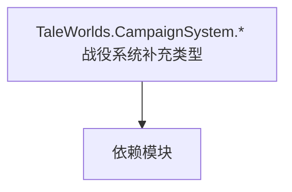

# TaleWorlds.CampaignSystem.* 战役系统补充类型

**一句话职责：** 本页以家族索引形式覆盖 `TaleWorlds.CampaignSystem.* 战役系统补充类型` 下全部 9 个业务类型，逐类给出命名空间、职责与典型时机，便于按模块而不是按字母表查阅。

## 心智模型

这里收敛 CampaignSystem 下若干补充类型：快速模拟（FastMode）开关、组件接口（ComponentInterfaces）、王国选举（Election）、战役游戏组件（GameComponents）、地图事件（MapEvents），以及出生/死亡与地图追踪的视图模型集合。它们是战役主循环的支撑与扩展点，本身不持有完整玩法。

## 何时使用

需要加速模拟、扩展战役组件或处理王国选举/地图事件时，从这里取用对应类型；扩展组件要提供可序列化状态。

## 依赖关系

`TaleWorlds.CampaignSystem.* 战役系统补充类型` 的类型依赖以下模块；缺其中任一都会导致编译或运行期失败。

- [Campaign 战役](../../campaign/Campaign)
- [CampaignBehaviorBase](../../campaign-ext/CampaignBehaviorBase)
- [API 总览](../../_index)

## 类型清单

| Type | Namespace | Purpose | Timing |
| --- | --- | --- | --- |
| `ClanMemberPartyRoleModel` | TaleWorlds.CampaignSystem.ComponentInterfaces | 领域模型，聚合规则与计算供 Behavior 调用；替换模型要提供同等契约，空替换会让依赖方拿到 null。 | 战役初始化期 |
| `ElectionOutcomeSupport` | TaleWorlds.CampaignSystem.Election | 选举/表决机制，用于王国决策等集体投票；注意投票时机与平票处理。 | 战役初始化期 |
| `FastModeOptionsProvider` | TaleWorlds.CampaignSystem.FastMode | Gauntlet 图像源抽象，把实体/概念解析成实际纹理并缓存；首帧可能为空，需处理加载态。 | 战役初始化期 |
| `FastModeSubModule` | TaleWorlds.CampaignSystem.FastMode | 模块入口基类，注册行为与覆盖点；生命周期贯穿全程，不要在错误阶段（如加载前）取还没就绪的系统。 | 战役初始化期 |
| `DefaultClanMemberPartyRoleModel` | TaleWorlds.CampaignSystem.GameComponents | 领域模型，聚合规则与计算供 Behavior 调用；替换模型要提供同等契约，空替换会让依赖方拿到 null。 | 战役初始化期 |
| `HideoutBattleEndState` | TaleWorlds.CampaignSystem.MapEvents | 该命名空间下的业务类型，承担其派生约定职责；调用前确认其生命周期与所属系统，不要在错误阶段引用未就绪的实例。 | 战役初始化期 |
| `BirthAndDeathOptionsProvider` | TaleWorlds.CampaignSystem.ViewModelCollection.BirthAndDeath | Gauntlet 图像源抽象，把实体/概念解析成实际纹理并缓存；首帧可能为空，需处理加载态。 | 战役初始化期 |
| `BirthAndDeathSubModule` | TaleWorlds.CampaignSystem.ViewModelCollection.BirthAndDeath | 模块入口基类，注册行为与覆盖点；生命周期贯穿全程，不要在错误阶段（如加载前）取还没就绪的系统。 | 战役初始化期 |
| `MapTrackerItemVM` | TaleWorlds.CampaignSystem.ViewModelCollection.Map.Tracker | Gauntlet UI 数据视图模型，向界面暴露属性与命令、响应输入并通知刷新；VM 只是状态投影，命令应只触发 Action/Behavior。 | 战役初始化期 |

## 风险与边界

FastMode 跳过表现层，逻辑必须在不渲染时也能正确跑；选举/事件处理要注意时机与重复触发。组件状态需可序列化以支持存档。

## 参见

- [Campaign 战役](../../campaign/Campaign)
- [CampaignBehaviorBase](../../campaign-ext/CampaignBehaviorBase)
- [API 总览](../../_index)
