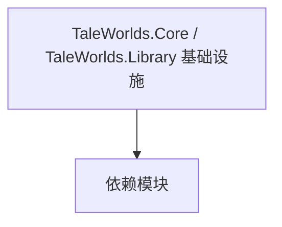

# TaleWorlds.Core / TaleWorlds.Library 基础设施

**一句话职责：** 本页以家族索引形式覆盖 `TaleWorlds.Core / TaleWorlds.Library 基础设施` 下全部 2 个业务类型，逐类给出命名空间、职责与典型时机，便于按模块而不是按字母表查阅。

## 心智模型

TaleWorlds.Core 与 TaleWorlds.Library 是最底层的公共基础设施：数学（向量/矩阵）、集合、序列化基元、通用算法与引擎全局常量。几乎所有上层命名空间都依赖它们，但它们自身不依赖任何玩法逻辑，是纯粹的「工具箱」。

## 何时使用

需要通用数学/集合/序列化能力时直接使用；不要在基础设施里塞业务规则。

## 依赖关系

`TaleWorlds.Core / TaleWorlds.Library 基础设施` 的类型依赖以下模块；缺其中任一都会导致编译或运行期失败。

- [MBSubModuleBase 模块入口](../../core/MBSubModuleBase)
- [API 总览](../../_index)

## 类型清单

| Type | Namespace | Purpose | Timing |
| --- | --- | --- | --- |
| `EquipmentCategories` | TaleWorlds.Core | 该命名空间下的业务类型，承担其派生约定职责；调用前确认其生命周期与所属系统，不要在错误阶段引用未就绪的实例。 | 运行期 |
| `AssemblyLoadResult` | TaleWorlds.Library | 该命名空间下的业务类型，承担其派生约定职责；调用前确认其生命周期与所属系统，不要在错误阶段引用未就绪的实例。 | 运行期 |

## 风险与边界

基础设施被全局依赖，改动影响面极大；任何破坏性变更会波及全部上层类型。新增类型要无副作用、可单测。

## 参见

- [MBSubModuleBase 模块入口](../../core/MBSubModuleBase)
- [API 总览](../../_index)
