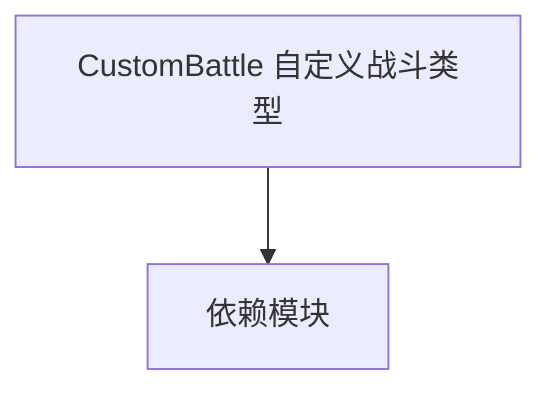

# CustomBattle 自定义战斗类型

**一句话职责：** 本页以家族索引形式覆盖 `CustomBattle 自定义战斗类型` 下全部 24 个业务类型，逐类给出命名空间、职责与典型时机，便于按模块而不是按字母表查阅。

## 心智模型

CustomBattle 命名空间实现「自定义战斗」模式：玩家自由编队、选择场景与规则进行非剧情对战。CustomBattle 是战斗配置的聚合根，SelectionItem 描述可被选择的单位/编队条目，CustomBattleObjects 承载自定义战斗的实体与参数，Views 提供对应的界面层。整簇以自包含的对战循环运行，通过战斗管理器与 Mission 桥接。

## 何时使用

扩展或新增自定义战斗的单位选择/编队/规则时，从对应 SelectionItem/CustomBattleObjects 派生；界面层只暴露状态，写入须经战斗管理器。

## 依赖关系

`CustomBattle 自定义战斗类型` 的类型依赖以下模块；缺其中任一都会导致编译或运行期失败。

- [Mission 战斗场景](../../mission/Mission)
- [MBSubModuleBase 模块入口](../../core/MBSubModuleBase)
- [API 总览](../../_index)

## 类型清单

| Type | Namespace | Purpose | Timing |
| --- | --- | --- | --- |
| `CustomBattleCompositionData` | TaleWorlds.MountAndBlade.CustomBattle.CustomBattle | 该命名空间下的业务类型，承担其派生约定职责；调用前确认其生命周期与所属系统，不要在错误阶段引用未就绪的实例。 | 自定义/多人会话期 |
| `CustomBattleData` | TaleWorlds.MountAndBlade.CustomBattle.CustomBattle | 该命名空间下的业务类型，承担其派生约定职责；调用前确认其生命周期与所属系统，不要在错误阶段引用未就绪的实例。 | 自定义/多人会话期 |
| `CustomBattleHelper` | TaleWorlds.MountAndBlade.CustomBattle.CustomBattle | 该命名空间下的业务类型，承担其派生约定职责；调用前确认其生命周期与所属系统，不要在错误阶段引用未就绪的实例。 | 自定义/多人会话期 |
| `CustomBattlePlayerSide` | TaleWorlds.MountAndBlade.CustomBattle.CustomBattle | 该命名空间下的业务类型，承担其派生约定职责；调用前确认其生命周期与所属系统，不要在错误阶段引用未就绪的实例。 | 自定义/多人会话期 |
| `CustomBattlePlayerType` | TaleWorlds.MountAndBlade.CustomBattle.CustomBattle | 该命名空间下的业务类型，承担其派生约定职责；调用前确认其生命周期与所属系统，不要在错误阶段引用未就绪的实例。 | 自定义/多人会话期 |
| `CustomBattleProvider` | TaleWorlds.MountAndBlade.CustomBattle.CustomBattle | Gauntlet 图像源抽象，把实体/概念解析成实际纹理并缓存；首帧可能为空，需处理加载态。 | 自定义/多人会话期 |
| `CustomBattleSiegeMachineVM` | TaleWorlds.MountAndBlade.CustomBattle.CustomBattle | Gauntlet UI 数据视图模型，向界面暴露属性与命令、响应输入并通知刷新；VM 只是状态投影，命令应只触发 Action/Behavior。 | 自定义/多人会话期 |
| `CustomBattleTimeOfDay` | TaleWorlds.MountAndBlade.CustomBattle.CustomBattle | 该命名空间下的业务类型，承担其派生约定职责；调用前确认其生命周期与所属系统，不要在错误阶段引用未就绪的实例。 | 自定义/多人会话期 |
| `GameTypeSelectionGroupVM` | TaleWorlds.MountAndBlade.CustomBattle.CustomBattle | Gauntlet UI 数据视图模型，向界面暴露属性与命令、响应输入并通知刷新；VM 只是状态投影，命令应只触发 Action/Behavior。 | 自定义/多人会话期 |
| `MapSelectionGroupVM` | TaleWorlds.MountAndBlade.CustomBattle.CustomBattle | Gauntlet UI 数据视图模型，向界面暴露属性与命令、响应输入并通知刷新；VM 只是状态投影，命令应只触发 Action/Behavior。 | 自定义/多人会话期 |
| `TroopTypeSelectionPopUpVM` | TaleWorlds.MountAndBlade.CustomBattle.CustomBattle | Gauntlet UI 数据视图模型，向界面暴露属性与命令、响应输入并通知刷新；VM 只是状态投影，命令应只触发 Action/Behavior。 | 自定义/多人会话期 |
| `CharacterItemVM` | TaleWorlds.MountAndBlade.CustomBattle.CustomBattle.SelectionItem | Gauntlet UI 数据视图模型，向界面暴露属性与命令、响应输入并通知刷新；VM 只是状态投影，命令应只触发 Action/Behavior。 | 自定义/多人会话期 |
| `CustomBattleFactionSelectionVM` | TaleWorlds.MountAndBlade.CustomBattle.CustomBattle.SelectionItem | Gauntlet UI 数据视图模型，向界面暴露属性与命令、响应输入并通知刷新；VM 只是状态投影，命令应只触发 Action/Behavior。 | 自定义/多人会话期 |
| `FactionItemVM` | TaleWorlds.MountAndBlade.CustomBattle.CustomBattle.SelectionItem | Gauntlet UI 数据视图模型，向界面暴露属性与命令、响应输入并通知刷新；VM 只是状态投影，命令应只触发 Action/Behavior。 | 自定义/多人会话期 |
| `GameTypeItemVM` | TaleWorlds.MountAndBlade.CustomBattle.CustomBattle.SelectionItem | Gauntlet UI 数据视图模型，向界面暴露属性与命令、响应输入并通知刷新；VM 只是状态投影，命令应只触发 Action/Behavior。 | 自定义/多人会话期 |
| `MapItemVM` | TaleWorlds.MountAndBlade.CustomBattle.CustomBattle.SelectionItem | Gauntlet UI 数据视图模型，向界面暴露属性与命令、响应输入并通知刷新；VM 只是状态投影，命令应只触发 Action/Behavior。 | 自定义/多人会话期 |
| `PlayerSideItemVM` | TaleWorlds.MountAndBlade.CustomBattle.CustomBattle.SelectionItem | Gauntlet UI 数据视图模型，向界面暴露属性与命令、响应输入并通知刷新；VM 只是状态投影，命令应只触发 Action/Behavior。 | 自定义/多人会话期 |
| `PlayerTypeItemVM` | TaleWorlds.MountAndBlade.CustomBattle.CustomBattle.SelectionItem | Gauntlet UI 数据视图模型，向界面暴露属性与命令、响应输入并通知刷新；VM 只是状态投影，命令应只触发 Action/Behavior。 | 自定义/多人会话期 |
| `SceneLevelItemVM` | TaleWorlds.MountAndBlade.CustomBattle.CustomBattle.SelectionItem | Gauntlet UI 数据视图模型，向界面暴露属性与命令、响应输入并通知刷新；VM 只是状态投影，命令应只触发 Action/Behavior。 | 自定义/多人会话期 |
| `SeasonItemVM` | TaleWorlds.MountAndBlade.CustomBattle.CustomBattle.SelectionItem | Gauntlet UI 数据视图模型，向界面暴露属性与命令、响应输入并通知刷新；VM 只是状态投影，命令应只触发 Action/Behavior。 | 自定义/多人会话期 |
| `TimeOfDayItemVM` | TaleWorlds.MountAndBlade.CustomBattle.CustomBattle.SelectionItem | Gauntlet UI 数据视图模型，向界面暴露属性与命令、响应输入并通知刷新；VM 只是状态投影，命令应只触发 Action/Behavior。 | 自定义/多人会话期 |
| `WallHitpointItemVM` | TaleWorlds.MountAndBlade.CustomBattle.CustomBattle.SelectionItem | Gauntlet UI 数据视图模型，向界面暴露属性与命令、响应输入并通知刷新；VM 只是状态投影，命令应只触发 Action/Behavior。 | 自定义/多人会话期 |
| `CustomBattleBannerEffects` | TaleWorlds.MountAndBlade.CustomBattle.CustomBattleObjects | 该命名空间下的业务类型，承担其派生约定职责；调用前确认其生命周期与所属系统，不要在错误阶段引用未就绪的实例。 | 自定义/多人会话期 |
| `GauntletCustomBattleMissionCheatView` | TaleWorlds.MountAndBlade.CustomBattle.Views | 调试作弊项，通过控制台或菜单触发开发期效果；生产构建应禁用或空实现，避免误触发改坏存档。 | 界面打开时 |

## 风险与边界

自定义战斗状态必须可完整序列化以支持中途存档；SelectionItem 与实体映射要保持一致，引用已卸载的单位会得到空。多人/单人共享规则时留意分支差异。

## 参见

- [Mission 战斗场景](../../mission/Mission)
- [MBSubModuleBase 模块入口](../../core/MBSubModuleBase)
- [API 总览](../../_index)
