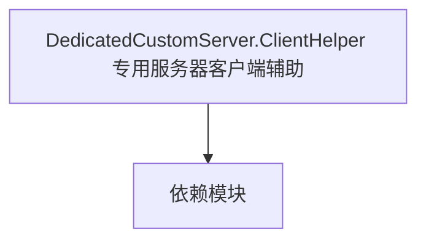

# DedicatedCustomServer.ClientHelper 专用服务器客户端辅助

**一句话职责：** 本页以家族索引形式覆盖 `DedicatedCustomServer.ClientHelper 专用服务器客户端辅助` 下全部 6 个业务类型，逐类给出命名空间、职责与典型时机，便于按模块而不是按字母表查阅。

## 心智模型

DedicatedCustomServer.ClientHelper 提供专用服务器（dedicated server）场景下的客户端辅助类型，负责把服务器端的战斗/对战状态桥接给客户端表现层。它只在专用服务器构建与对应客户端会话中存在，是多人部署的胶水层，不参与单人剧情。

## 何时使用

在专用服务器部署下需要桥接战斗状态到客户端表现时，使用这里的辅助类型；单人路径不应引用。

## 依赖关系

`DedicatedCustomServer.ClientHelper 专用服务器客户端辅助` 的类型依赖以下模块；缺其中任一都会导致编译或运行期失败。

- [Mission 战斗场景](../../mission/Mission)
- [MBSubModuleBase 模块入口](../../core/MBSubModuleBase)
- [API 总览](../../_index)

## 类型清单

| Type | Namespace | Purpose | Timing |
| --- | --- | --- | --- |
| `DCSHelperMapItemVM` | TaleWorlds.MountAndBlade.DedicatedCustomServer.ClientHelper | Gauntlet UI 数据视图模型，向界面暴露属性与命令、响应输入并通知刷新；VM 只是状态投影，命令应只触发 Action/Behavior。 | 自定义/多人会话期 |
| `DCSHelperVM` | TaleWorlds.MountAndBlade.DedicatedCustomServer.ClientHelper | Gauntlet UI 数据视图模型，向界面暴露属性与命令、响应输入并通知刷新；VM 只是状态投影，命令应只触发 Action/Behavior。 | 自定义/多人会话期 |
| `DedicatedCustomServerClientHelperSubModule` | TaleWorlds.MountAndBlade.DedicatedCustomServer.ClientHelper | 模块入口基类，注册行为与覆盖点；生命周期贯穿全程，不要在错误阶段（如加载前）取还没就绪的系统。 | 自定义/多人会话期 |
| `ModHelpers` | TaleWorlds.MountAndBlade.DedicatedCustomServer.ClientHelper | 该命名空间下的业务类型，承担其派生约定职责；调用前确认其生命周期与所属系统，不要在错误阶段引用未就绪的实例。 | 自定义/多人会话期 |
| `ModLogger` | TaleWorlds.MountAndBlade.DedicatedCustomServer.ClientHelper | 该命名空间下的业务类型，承担其派生约定职责；调用前确认其生命周期与所属系统，不要在错误阶段引用未就绪的实例。 | 自定义/多人会话期 |
| `ProgressUpdate` | TaleWorlds.MountAndBlade.DedicatedCustomServer.ClientHelper | 该命名空间下的业务类型，承担其派生约定职责；调用前确认其生命周期与所属系统，不要在错误阶段引用未就绪的实例。 | 自定义/多人会话期 |

## 风险与边界

仅在专用服务器构建有效，单人/编辑器引用会得到空或报错；跨构建引用需加宏隔离。客户端辅助不持有权威状态，权威判定在服务端。

## 参见

- [Mission 战斗场景](../../mission/Mission)
- [MBSubModuleBase 模块入口](../../core/MBSubModuleBase)
- [API 总览](../../_index)
