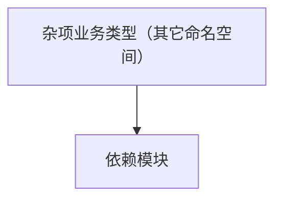

# 杂项业务类型（其它命名空间）

**一句话职责：** 本页以家族索引形式覆盖 `杂项业务类型（其它命名空间）` 下全部 1 个业务类型，逐类给出命名空间、职责与典型时机，便于按模块而不是按字母表查阅。

## 心智模型

本页覆盖尚未归入专题的零散业务类型。它们分属不同子系统（视图/界面/任务/平台等），各自承担其派生约定职责。调用前请确认所属系统的生命周期与依赖，不要在错误阶段引用未就绪的实例，世界状态变更应走对应的 Action/Behavior 而非直接改字段。

## 何时使用

按类型名与命名空间定位到具体子系统后取用；核心玩法规则仍在 Campaign/Mission 子系统。

## 依赖关系

`杂项业务类型（其它命名空间）` 的类型依赖以下模块；缺其中任一都会导致编译或运行期失败。

- [Campaign 战役](../../campaign/Campaign)
- [Mission 战斗场景](../../mission/Mission)
- [API 总览](../../_index)

## 类型清单

| Type | Namespace | Purpose | Timing |
| --- | --- | --- | --- |
| `BoardGameAgentBehavior` | SandBox.Source.Missions.AgentBehaviors | 战斗智能体 AI 行为，在 Mission 中做决策并执行动作；生命周期随 Agent 生死，需处理 Agent 死亡后的清理。 | 战斗/任务加载时 |

## 风险与边界

零散类型生命周期各异，引用前确认其所属系统与加载阶段；跨构建/跨端类型需加宏隔离。状态变更走 Action/Behavior 以免跳过事件级联坏档。

## 参见

- [Campaign 战役](../../campaign/Campaign)
- [Mission 战斗场景](../../mission/Mission)
- [API 总览](../../_index)
