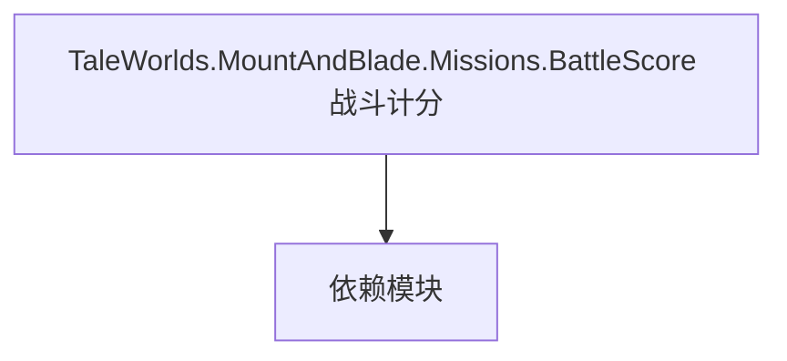

# TaleWorlds.MountAndBlade.Missions.BattleScore 战斗计分

**一句话职责：** 本页以家族索引形式覆盖 `TaleWorlds.MountAndBlade.Missions.BattleScore 战斗计分` 下全部 2 个业务类型，逐类给出命名空间、职责与典型时机，便于按模块而不是按字母表查阅。

## 心智模型

Missions.BattleScore 提供战斗计分的数据与规则结构，统计并结算一场战斗的表现得分（击杀/受伤/目标完成等）。计分逻辑须可重入，供战斗结束后的奖励与统计使用，与具体玩法胜负解耦。

## 何时使用

需要自定义战斗得分统计或读取战斗结果时，使用这里的计分类型；不要在计分里混入侵略性状态变更。

## 依赖关系

`TaleWorlds.MountAndBlade.Missions.BattleScore 战斗计分` 的类型依赖以下模块；缺其中任一都会导致编译或运行期失败。

- [Mission 战斗场景](../../mission/Mission)
- [API 总览](../../_index)

## 类型清单

| Type | Namespace | Purpose | Timing |
| --- | --- | --- | --- |
| `BattleScoreContext` | TaleWorlds.MountAndBlade.Missions.BattleScore | 战斗计分规则/数据，统计并结算战斗表现得分；计分要可重入，避免中途重算错位。 | 战斗/任务加载时 |
| `CustomBattleScoreContext` | TaleWorlds.MountAndBlade.Missions.BattleScore | 战斗计分规则/数据，统计并结算战斗表现得分；计分要可重入，避免中途重算错位。 | 战斗/任务加载时 |

## 风险与边界

计分要在战斗结束前稳定可重入；中途重算会错位。计分数据需可序列化以支撑战后结算与回放。

## 参见

- [Mission 战斗场景](../../mission/Mission)
- [API 总览](../../_index)
