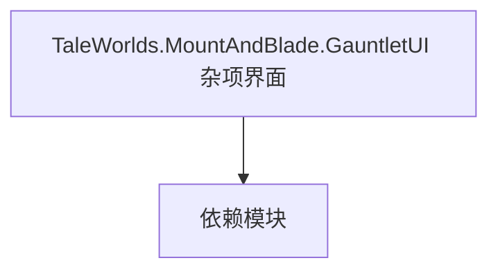

# TaleWorlds.MountAndBlade.GauntletUI 杂项界面

**一句话职责：** 本页以家族索引形式覆盖 `TaleWorlds.MountAndBlade.GauntletUI 杂项界面` 下全部 4 个业务类型，逐类给出命名空间、职责与典型时机，便于按模块而不是按字母表查阅。

## 心智模型

这里收敛核心 GauntletUI 下两个特定辅助：BodyGenerator 负责角色体型/外观的程序化生成与取用，SceneNotification 把场景事件投影成界面通知。二者都是界面构建的支撑类型，不直接承载玩法规则。

## 何时使用

需要程序化生成角色外观或把场景事件转成界面提示时，使用对应类型；生成结果要可缓存以控内存。

## 依赖关系

`TaleWorlds.MountAndBlade.GauntletUI 杂项界面` 的类型依赖以下模块；缺其中任一都会导致编译或运行期失败。

- [ViewModel 视图模型](../../core-extra/ViewModel)
- [MBSubModuleBase 模块入口](../../core/MBSubModuleBase)
- [API 总览](../../_index)

## 类型清单

| Type | Namespace | Purpose | Timing |
| --- | --- | --- | --- |
| `BodyGeneratorView` | TaleWorlds.MountAndBlade.GauntletUI.BodyGenerator | 该命名空间下的业务类型，承担其派生约定职责；调用前确认其生命周期与所属系统，不要在错误阶段引用未就绪的实例。 | 界面打开时 |
| `GauntletBodyGeneratorScreen` | TaleWorlds.MountAndBlade.GauntletUI.BodyGenerator | 界面屏幕/图层基类，承载 Gauntlet UI 的显示与输入；命令只触发 Action/Behavior，不直接改状态。 | 界面打开时 |
| `GauntletSceneNotification` | TaleWorlds.MountAndBlade.GauntletUI.SceneNotification | 通知项类型，描述一条地图/事件提示的数据；只承载展示数据，触发逻辑在 Behavior。 | 界面打开时 |
| `NativeSceneNotificationContextProvider` | TaleWorlds.MountAndBlade.GauntletUI.SceneNotification | Gauntlet 图像源抽象，把实体/概念解析成实际纹理并缓存；首帧可能为空，需处理加载态。 | 界面打开时 |

## 风险与边界

外观生成是重量操作，应缓存结果避免每帧重算；通知订阅要记得退订以防泄漏。

## 参见

- [ViewModel 视图模型](../../core-extra/ViewModel)
- [MBSubModuleBase 模块入口](../../core/MBSubModuleBase)
- [API 总览](../../_index)
