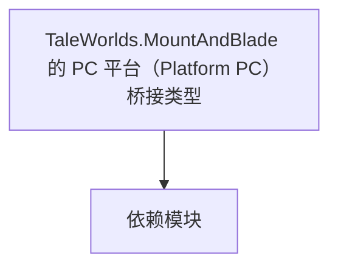

# TaleWorlds.MountAndBlade 的 PC 平台（Platform PC）桥接类型

**一句话职责：** 本页以家族索引形式覆盖 `TaleWorlds.MountAndBlade 的 PC 平台（Platform PC）桥接类型` 下全部 1 个业务类型，逐类给出命名空间、职责与典型时机，便于按模块而不是按字母表查阅。

## 心智模型

Platform.PC 是 PC 平台的桥接层，把引擎对平台能力（存档路径、输入、系统对话框、文件选择等）的调用映射到具体 PC 实现。它是平台抽象的一部分，使上层逻辑不依赖具体操作系统；mod 应始终通过平台抽象接口取用能力，而不是直接写 PC 特定的 Win32/文件系统代码，否则在其它平台（主机/云）构建会失败或行为不一致。

## 何时使用

需要取用平台相关能力（如确定存档目录、弹系统对话框）时通过平台抽象，不要直接写平台特定代码。

## 依赖关系

`TaleWorlds.MountAndBlade 的 PC 平台（Platform PC）桥接类型` 的类型依赖以下模块；缺其中任一都会导致编译或运行期失败。

- [MBSubModuleBase 模块入口](../../core/MBSubModuleBase)
- [SaveManager 存档](../../save-system/SaveManager)
- [API 总览](../../_index)

## 类型清单

| Type | Namespace | Purpose | Timing |
| --- | --- | --- | --- |
| `PlatformPCSubModule` | TaleWorlds.MountAndBlade.Platform.PC | 模块入口基类，注册行为与覆盖点；生命周期贯穿全程，不要在错误阶段（如加载前）取还没就绪的系统。 | 运行期 |

## 风险与边界

平台桥接只在 PC 构建有效；跨平台（主机/移动）引用需加宏隔离或走平台抽象接口，否则其它平台构建失败。

## 参见

- [MBSubModuleBase 模块入口](../../core/MBSubModuleBase)
- [SaveManager 存档](../../save-system/SaveManager)
- [API 总览](../../_index)
