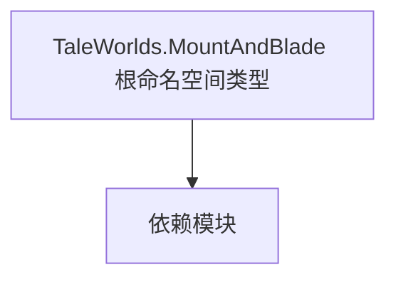

# TaleWorlds.MountAndBlade 根命名空间类型

**一句话职责：** 本页以家族索引形式覆盖 `TaleWorlds.MountAndBlade 根命名空间类型` 下全部 39 个业务类型，逐类给出命名空间、职责与典型时机，便于按模块而不是按字母表查阅。

## 心智模型

TaleWorlds.MountAndBlade 是骑马与砍杀核心程序集的根命名空间，收敛了一批不属于更具体子系统（Campaign/Mission/View/UI）的全局类型：订单系统（Order/VisualOrder）、战斗计分（BattleScore）、平台桥接（Platform.PC）、专用服务器客户端辅助等。它们是跨层基础设施，被战役与战斗逻辑在运行期直接引用，是「引擎与玩法之间的胶水」，本身不持有核心玩法规则。

## 何时使用

需要理解订单/战斗计分/平台桥接等核心机制时从这里取用对应类型；不要把它当成业务玩法规则库，核心规则仍在 Campaign/Mission 子系统。

## 依赖关系

`TaleWorlds.MountAndBlade 根命名空间类型` 的类型依赖以下模块；缺其中任一都会导致编译或运行期失败。

- [Campaign 战役](../../campaign/Campaign)
- [Mission 战斗场景](../../mission/Mission)
- [API 总览](../../_index)

## 类型清单

| Type | Namespace | Purpose | Timing |
| --- | --- | --- | --- |
| `BattleSpawnFrameBehavior` | TaleWorlds.MountAndBlade | 棋盘/棋子描述，含属性与移动规则；状态须可完整序列化以复原对局。 | 运行期 |
| `ConsoleMatchStartEndHandler` | TaleWorlds.MountAndBlade | 该命名空间下的业务类型，承担其派生约定职责；调用前确认其生命周期与所属系统，不要在错误阶段引用未就绪的实例。 | 运行期 |
| `CustomServerAction` | TaleWorlds.MountAndBlade | 游戏动作，封装一次状态变更并通过 Action 体系执行；必须用 Apply 而非直接改字段，否则跳过事件级联会坏档。 | 运行期 |
| `DebugAgentScaleOnNetworkTestComponent` | TaleWorlds.MountAndBlade | 该命名空间下的业务类型，承担其派生约定职责；调用前确认其生命周期与所属系统，不要在错误阶段引用未就绪的实例。 | 运行期 |
| `DedicatedServerConsoleCommandManager` | TaleWorlds.MountAndBlade | 该命名空间下的业务类型，承担其派生约定职责；调用前确认其生命周期与所属系统，不要在错误阶段引用未就绪的实例。 | 运行期 |
| `DefaultBattleMissionAgentSpawnLogic` | TaleWorlds.MountAndBlade | 棋盘/棋子描述，含属性与移动规则；状态须可完整序列化以复原对局。 | 运行期 |
| `DuelSpawnFrameBehavior` | TaleWorlds.MountAndBlade | 棋盘/棋子描述，含属性与移动规则；状态须可完整序列化以复原对局。 | 运行期 |
| `DuelSpawningBehavior` | TaleWorlds.MountAndBlade | 棋盘/棋子描述，含属性与移动规则；状态须可完整序列化以复原对局。 | 运行期 |
| `GameNetworkHandler` | TaleWorlds.MountAndBlade | 该命名空间下的业务类型，承担其派生约定职责；调用前确认其生命周期与所属系统，不要在错误阶段引用未就绪的实例。 | 运行期 |
| `HitType` | TaleWorlds.MountAndBlade | 该命名空间下的业务类型，承担其派生约定职责；调用前确认其生命周期与所属系统，不要在错误阶段引用未就绪的实例。 | 运行期 |
| `IBattleMissionAgentSpawnLogic` | TaleWorlds.MountAndBlade | 棋盘/棋子描述，含属性与移动规则；状态须可完整序列化以复原对局。 | 运行期 |
| `ILobbyStateHandler` | TaleWorlds.MountAndBlade | 该命名空间下的业务类型，承担其派生约定职责；调用前确认其生命周期与所属系统，不要在错误阶段引用未就绪的实例。 | 运行期 |
| `IScreenFadeHandler` | TaleWorlds.MountAndBlade | 该命名空间下的业务类型，承担其派生约定职责；调用前确认其生命周期与所属系统，不要在错误阶段引用未就绪的实例。 | 运行期 |
| `ITeamDeploymentPlan` | TaleWorlds.MountAndBlade | 该命名空间下的业务类型，承担其派生约定职责；调用前确认其生命周期与所属系统，不要在错误阶段引用未就绪的实例。 | 运行期 |
| `MissionBattleSideSpawnContext` | TaleWorlds.MountAndBlade | 棋盘/棋子描述，含属性与移动规则；状态须可完整序列化以复原对局。 | 运行期 |
| `MissionFormationSpawnData` | TaleWorlds.MountAndBlade | 棋盘/棋子描述，含属性与移动规则；状态须可完整序列化以复原对局。 | 运行期 |
| `MissionMatchHistoryComponent` | TaleWorlds.MountAndBlade | 该命名空间下的业务类型，承担其派生约定职责；调用前确认其生命周期与所属系统，不要在错误阶段引用未就绪的实例。 | 运行期 |
| `MissionRecentPlayersComponent` | TaleWorlds.MountAndBlade | 该命名空间下的业务类型，承担其派生约定职责；调用前确认其生命周期与所属系统，不要在错误阶段引用未就绪的实例。 | 运行期 |
| `MissionSpawnPhase` | TaleWorlds.MountAndBlade | 棋盘/棋子描述，含属性与移动规则；状态须可完整序列化以复原对局。 | 运行期 |
| `MPCombatPerkEffect` | TaleWorlds.MountAndBlade | 该命名空间下的业务类型，承担其派生约定职责；调用前确认其生命周期与所属系统，不要在错误阶段引用未就绪的实例。 | 运行期 |
| `MultiplayerAchievementComponent` | TaleWorlds.MountAndBlade | 任务逻辑，定义该任务的流程与胜负条件，由 Mission 在加载时装配；胜负判定应幂等，重复触发不重复结算。 | 运行期 |
| `MultiplayerAdminComponent` | TaleWorlds.MountAndBlade | 该命名空间下的业务类型，承担其派生约定职责；调用前确认其生命周期与所属系统，不要在错误阶段引用未就绪的实例。 | 运行期 |
| `MultiplayerData` | TaleWorlds.MountAndBlade | 该命名空间下的业务类型，承担其派生约定职责；调用前确认其生命周期与所属系统，不要在错误阶段引用未就绪的实例。 | 运行期 |
| `MultiplayerGame` | TaleWorlds.MountAndBlade | 该命名空间下的业务类型，承担其派生约定职责；调用前确认其生命周期与所属系统，不要在错误阶段引用未就绪的实例。 | 运行期 |
| `MultiplayerGameLogger` | TaleWorlds.MountAndBlade | 该命名空间下的业务类型，承担其派生约定职责；调用前确认其生命周期与所属系统，不要在错误阶段引用未就绪的实例。 | 运行期 |
| `MultiplayerGameManager` | TaleWorlds.MountAndBlade | 该命名空间下的业务类型，承担其派生约定职责；调用前确认其生命周期与所属系统，不要在错误阶段引用未就绪的实例。 | 运行期 |
| `MultiplayerInfo` | TaleWorlds.MountAndBlade | 该命名空间下的业务类型，承担其派生约定职责；调用前确认其生命周期与所属系统，不要在错误阶段引用未就绪的实例。 | 运行期 |
| `MultiplayerPermissionHandler` | TaleWorlds.MountAndBlade | 该命名空间下的业务类型，承担其派生约定职责；调用前确认其生命周期与所属系统，不要在错误阶段引用未就绪的实例。 | 运行期 |
| `MultiplayerPreloadHelper` | TaleWorlds.MountAndBlade | 该命名空间下的业务类型，承担其派生约定职责；调用前确认其生命周期与所属系统，不要在错误阶段引用未就绪的实例。 | 运行期 |
| `MultiplayerRidingModel` | TaleWorlds.MountAndBlade | 领域模型，聚合规则与计算供 Behavior 调用；替换模型要提供同等契约，空替换会让依赖方拿到 null。 | 运行期 |
| `MultiplayerStarter` | TaleWorlds.MountAndBlade | 该命名空间下的业务类型，承担其派生约定职责；调用前确认其生命周期与所属系统，不要在错误阶段引用未就绪的实例。 | 运行期 |
| `MultiplayerStrikeMagnitudeModel` | TaleWorlds.MountAndBlade | 领域模型，聚合规则与计算供 Behavior 调用；替换模型要提供同等契约，空替换会让依赖方拿到 null。 | 运行期 |
| `NetworkStatusReplicationComponent` | TaleWorlds.MountAndBlade | 该命名空间下的业务类型，承担其派生约定职责；调用前确认其生命周期与所属系统，不要在错误阶段引用未就绪的实例。 | 运行期 |
| `SceneProblemsLogger` | TaleWorlds.MountAndBlade | 该命名空间下的业务类型，承担其派生约定职责；调用前确认其生命周期与所属系统，不要在错误阶段引用未就绪的实例。 | 运行期 |
| `ScreenFadeController` | TaleWorlds.MountAndBlade | 该命名空间下的业务类型，承担其派生约定职责；调用前确认其生命周期与所属系统，不要在错误阶段引用未就绪的实例。 | 运行期 |
| `ScreenFadeState` | TaleWorlds.MountAndBlade | 该命名空间下的业务类型，承担其派生约定职责；调用前确认其生命周期与所属系统，不要在错误阶段引用未就绪的实例。 | 运行期 |
| `SearchDirection` | TaleWorlds.MountAndBlade | 该命名空间下的业务类型，承担其派生约定职责；调用前确认其生命周期与所属系统，不要在错误阶段引用未就绪的实例。 | 运行期 |
| `TeamDeathmatchSpawnFrameBehavior` | TaleWorlds.MountAndBlade | 棋盘/棋子描述，含属性与移动规则；状态须可完整序列化以复原对局。 | 运行期 |
| `TeamDeathmatchSpawningBehavior` | TaleWorlds.MountAndBlade | 棋盘/棋子描述，含属性与移动规则；状态须可完整序列化以复原对局。 | 运行期 |

## 风险与边界

根命名空间类型跨战役与战斗共享，生命周期贯穿全程；平台桥接类通常只在对应平台构建有效，跨平台引用需加宏隔离。订单/计分状态由上层系统持有，不要自行 new 后脱离管理体系，否则不会被 Tick 与存档纳入。

## 参见

- [Campaign 战役](../../campaign/Campaign)
- [Mission 战斗场景](../../mission/Mission)
- [API 总览](../../_index)
