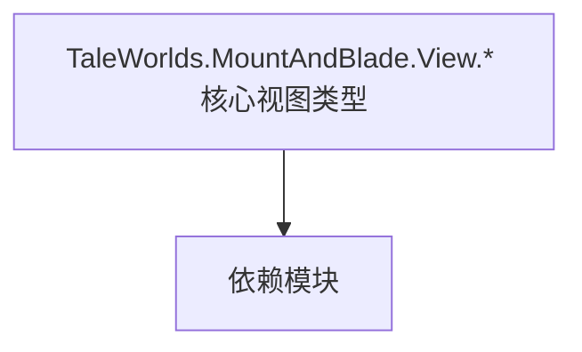

# TaleWorlds.MountAndBlade.View.* 核心视图类型

**一句话职责：** 本页以家族索引形式覆盖 `TaleWorlds.MountAndBlade.View.* 核心视图类型` 下全部 11 个业务类型，逐类给出命名空间、职责与典型时机，便于按模块而不是按字母表查阅。

## 心智模型

TaleWorlds.MountAndBlade.View 下的其余视图类型（场景通知、自定义战斗视图、视觉指令集、屏幕脚本等）是战斗/场景表现层的补充。它们沿用 MissionView/ScriptComponent 体系，但专注于特定表现：SceneNotification 把场景事件投影成 HUD 提示，VisualOrders 描述编队指令的可视化，Screens.Scripts 提供屏幕级脚本钩子。视图只读取状态、不写规则。

## 何时使用

需要定制战斗期 HUD 提示、编队指令可视化或屏幕级脚本时，从对应类型派生并由 MissionBehavior 注册；命令只触发逻辑。

## 依赖关系

`TaleWorlds.MountAndBlade.View.* 核心视图类型` 的类型依赖以下模块；缺其中任一都会导致编译或运行期失败。

- [Mission 战斗场景](../../mission/Mission)
- [MBSubModuleBase 模块入口](../../core/MBSubModuleBase)
- [API 总览](../../_index)

## 类型清单

| Type | Namespace | Purpose | Timing |
| --- | --- | --- | --- |
| `CustomBattleFactory` | TaleWorlds.MountAndBlade.View.CustomBattle | 该命名空间下的业务类型，承担其派生约定职责；调用前确认其生命周期与所属系统，不要在错误阶段引用未就绪的实例。 | 界面打开时 |
| `ICustomBattleProvider` | TaleWorlds.MountAndBlade.View.CustomBattle | Gauntlet 图像源抽象，把实体/概念解析成实际纹理并缓存；首帧可能为空，需处理加载态。 | 界面打开时 |
| `PopupSceneBanner` | TaleWorlds.MountAndBlade.View.SceneNotification | 挂载到场景 GameObject 的脚本组件，把场景状态暴露给逻辑层；依赖场景加载顺序，未就绪时字段为空。 | 界面打开时 |
| `PopupSceneShipSpawnPoint` | TaleWorlds.MountAndBlade.View.SceneNotification | 挂载到场景 GameObject 的脚本组件，把场景状态暴露给逻辑层；依赖场景加载顺序，未就绪时字段为空。 | 界面打开时 |
| `MultiThreadedStressTestsScreen` | TaleWorlds.MountAndBlade.View.Screens.Scripts | 界面屏幕/图层基类，承载 Gauntlet UI 的显示与输入；命令只触发 Action/Behavior，不直接改状态。 | 界面打开时 |
| `MultiThreadedTestFunctions` | TaleWorlds.MountAndBlade.View.Screens.Scripts | 该命名空间下的业务类型，承担其派生约定职责；调用前确认其生命周期与所属系统，不要在错误阶段引用未就绪的实例。 | 界面打开时 |
| `DefaultVisualOrderProvider` | TaleWorlds.MountAndBlade.View.VisualOrders | 战斗指令/编队顺序，描述部队的阵型与移动意图；由 Order 系统解释执行。 | 界面打开时 |
| `SingleVisualOrder` | TaleWorlds.MountAndBlade.View.VisualOrders.Orders | 战斗指令/编队顺序，描述部队的阵型与移动意图；由 Order 系统解释执行。 | 界面打开时 |
| `ToggleFacingVisualOrder` | TaleWorlds.MountAndBlade.View.VisualOrders.Orders.ToggleOrders | 战斗指令/编队顺序，描述部队的阵型与移动意图；由 Order 系统解释执行。 | 界面打开时 |
| `GenericVisualOrderSet` | TaleWorlds.MountAndBlade.View.VisualOrders.OrderSets | 战斗指令/编队顺序，描述部队的阵型与移动意图；由 Order 系统解释执行。 | 界面打开时 |
| `SingleVisualOrderSet` | TaleWorlds.MountAndBlade.View.VisualOrders.OrderSets | 战斗指令/编队顺序，描述部队的阵型与移动意图；由 Order 系统解释执行。 | 界面打开时 |

## 风险与边界

视图只呈现不判定；在 OnMissionTick 中做重活会拖帧。同名视图在单/多人分支可能分属不同派生类，复用前先确认基类。

## 参见

- [Mission 战斗场景](../../mission/Mission)
- [MBSubModuleBase 模块入口](../../core/MBSubModuleBase)
- [API 总览](../../_index)
