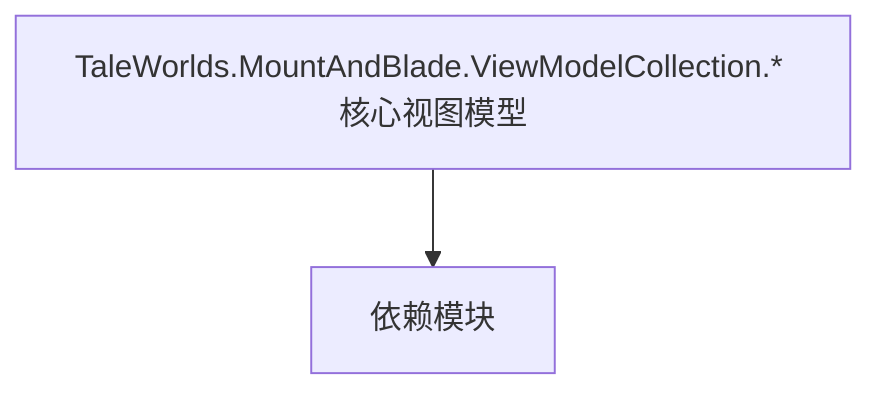

# TaleWorlds.MountAndBlade.ViewModelCollection.* 核心视图模型

**一句话职责：** 本页以家族索引形式覆盖 `TaleWorlds.MountAndBlade.ViewModelCollection.* 核心视图模型` 下全部 10 个业务类型，逐类给出命名空间、职责与典型时机，便于按模块而不是按字母表查阅。

## 心智模型

TaleWorlds.MountAndBlade.ViewModelCollection 下的核心视图模型（订单/编队 VM、初始菜单 VM 等）把战斗与菜单逻辑状态投影成可绑定的界面数据。订单相关 VM（MovementOrders/FormOrders/ToggleOrders）描述部队的阵型与移动指令，InitialMenu 管理开局菜单。VM 只是状态投影，命令应只触发 Action/Behavior。

## 何时使用

定制战斗指令面板或初始菜单时，继承对应 VM；交互命令只触发逻辑，不要在 VM 里直接改游戏状态。

## 依赖关系

`TaleWorlds.MountAndBlade.ViewModelCollection.* 核心视图模型` 的类型依赖以下模块；缺其中任一都会导致编译或运行期失败。

- [ViewModel 视图模型](../../core-extra/ViewModel)
- [MBSubModuleBase 模块入口](../../core/MBSubModuleBase)
- [API 总览](../../_index)

## 类型清单

| Type | Namespace | Purpose | Timing |
| --- | --- | --- | --- |
| `InitialMenuAnnouncementVM` | TaleWorlds.MountAndBlade.ViewModelCollection.InitialMenu | Gauntlet UI 数据视图模型，向界面暴露属性与命令、响应输入并通知刷新；VM 只是状态投影，命令应只触发 Action/Behavior。 | 界面打开时 |
| `ArrangementVisualOrder` | TaleWorlds.MountAndBlade.ViewModelCollection.Order.Visual.Default.Orders.FormOrders | 战斗指令/编队顺序，描述部队的阵型与移动意图；由 Order 系统解释执行。 | 界面打开时 |
| `AdvanceVisualOrder` | TaleWorlds.MountAndBlade.ViewModelCollection.Order.Visual.Default.Orders.MovementOrders | 战斗指令/编队顺序，描述部队的阵型与移动意图；由 Order 系统解释执行。 | 界面打开时 |
| `ChargeVisualOrder` | TaleWorlds.MountAndBlade.ViewModelCollection.Order.Visual.Default.Orders.MovementOrders | 战斗指令/编队顺序，描述部队的阵型与移动意图；由 Order 系统解释执行。 | 界面打开时 |
| `FallbackVisualOrder` | TaleWorlds.MountAndBlade.ViewModelCollection.Order.Visual.Default.Orders.MovementOrders | 战斗指令/编队顺序，描述部队的阵型与移动意图；由 Order 系统解释执行。 | 界面打开时 |
| `FollowMeVisualOrder` | TaleWorlds.MountAndBlade.ViewModelCollection.Order.Visual.Default.Orders.MovementOrders | 战斗指令/编队顺序，描述部队的阵型与移动意图；由 Order 系统解释执行。 | 界面打开时 |
| `MoveVisualOrder` | TaleWorlds.MountAndBlade.ViewModelCollection.Order.Visual.Default.Orders.MovementOrders | 战斗指令/编队顺序，描述部队的阵型与移动意图；由 Order 系统解释执行。 | 界面打开时 |
| `RetreatVisualOrder` | TaleWorlds.MountAndBlade.ViewModelCollection.Order.Visual.Default.Orders.MovementOrders | 战斗指令/编队顺序，描述部队的阵型与移动意图；由 Order 系统解释执行。 | 界面打开时 |
| `StopVisualOrder` | TaleWorlds.MountAndBlade.ViewModelCollection.Order.Visual.Default.Orders.MovementOrders | 战斗指令/编队顺序，描述部队的阵型与移动意图；由 Order 系统解释执行。 | 界面打开时 |
| `GenericToggleVisualOrder` | TaleWorlds.MountAndBlade.ViewModelCollection.Order.Visual.Default.Orders.ToggleOrders | 战斗指令/编队顺序，描述部队的阵型与移动意图；由 Order 系统解释执行。 | 界面打开时 |

## 风险与边界

VM 不持有规则；在 VM 中直接改状态会破坏单一数据源。频繁刷新属性要节流，避免每帧通知造成 GC 压力。

## 参见

- [ViewModel 视图模型](../../core-extra/ViewModel)
- [MBSubModuleBase 模块入口](../../core/MBSubModuleBase)
- [API 总览](../../_index)
