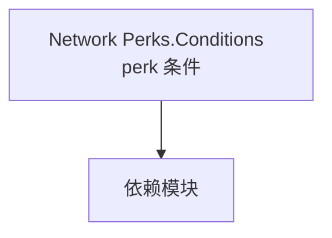

# Network Perks.Conditions  perk 条件

**一句话职责：** 本页以家族索引形式覆盖 `Network Perks.Conditions  perk 条件` 下全部 12 个业务类型，逐类给出命名空间、职责与典型时机，便于按模块而不是按字母表查阅。

## 心智模型

Perks.Conditions 是多人模式下 perk（特长）的「生效条件」集合：每个 MPPerkCondition 派生类判断某个 perk 在当前战斗情境下是否满足（如特定武器/兵种/地形）。条件只做判定、不改状态，由 perk 系统在结算加成前求值。它们与单人 perk 体系解耦，专为多人平衡设计。

## 何时使用

新增或调整多人 perk 的触发条件时，继承 MPPerkCondition 并在 perk 定义里登记；条件必须是纯判定、可重入。

## 依赖关系

`Network Perks.Conditions  perk 条件` 的类型依赖以下模块；缺其中任一都会导致编译或运行期失败。

- [Mission 战斗场景](../../mission/Mission)
- [API 总览](../../_index)

## 类型清单

| Type | Namespace | Purpose | Timing |
| --- | --- | --- | --- |
| `AgentStatusCondition` | TaleWorlds.MountAndBlade.Network.Gameplay.Perks.Conditions | 该命名空间下的业务类型，承担其派生约定职责；调用前确认其生命周期与所属系统，不要在错误阶段引用未就绪的实例。 | 自定义/多人会话期 |
| `ClosestFlagCondition` | TaleWorlds.MountAndBlade.Network.Gameplay.Perks.Conditions | 该命名空间下的业务类型，承担其派生约定职责；调用前确认其生命周期与所属系统，不要在错误阶段引用未就绪的实例。 | 自定义/多人会话期 |
| `ControllerCondition` | TaleWorlds.MountAndBlade.Network.Gameplay.Perks.Conditions | 该命名空间下的业务类型，承担其派生约定职责；调用前确认其生命周期与所属系统，不要在错误阶段引用未就绪的实例。 | 自定义/多人会话期 |
| `FlagDominationStatusCondition` | TaleWorlds.MountAndBlade.Network.Gameplay.Perks.Conditions | 该命名空间下的业务类型，承担其派生约定职责；调用前确认其生命周期与所属系统，不要在错误阶段引用未就绪的实例。 | 自定义/多人会话期 |
| `HealthCondition` | TaleWorlds.MountAndBlade.Network.Gameplay.Perks.Conditions | 该命名空间下的业务类型，承担其派生约定职责；调用前确认其生命周期与所属系统，不要在错误阶段引用未就绪的实例。 | 自定义/多人会话期 |
| `LastManStandingCondition` | TaleWorlds.MountAndBlade.Network.Gameplay.Perks.Conditions | 该命名空间下的业务类型，承担其派生约定职责；调用前确认其生命周期与所属系统，不要在错误阶段引用未就绪的实例。 | 自定义/多人会话期 |
| `LastRemainingFlagCondition` | TaleWorlds.MountAndBlade.Network.Gameplay.Perks.Conditions | AI 决策实现，需可中断、可序列化以支持存档与悔棋；搜索要限制深度/超时避免卡顿。 | 自定义/多人会话期 |
| `MoraleCondition` | TaleWorlds.MountAndBlade.Network.Gameplay.Perks.Conditions | 该命名空间下的业务类型，承担其派生约定职责；调用前确认其生命周期与所属系统，不要在错误阶段引用未就绪的实例。 | 自定义/多人会话期 |
| `MountHealthCondition` | TaleWorlds.MountAndBlade.Network.Gameplay.Perks.Conditions | 该命名空间下的业务类型，承担其派生约定职责；调用前确认其生命周期与所属系统，不要在错误阶段引用未就绪的实例。 | 自定义/多人会话期 |
| `OwnedFlagCountCondition` | TaleWorlds.MountAndBlade.Network.Gameplay.Perks.Conditions | 该命名空间下的业务类型，承担其派生约定职责；调用前确认其生命周期与所属系统，不要在错误阶段引用未就绪的实例。 | 自定义/多人会话期 |
| `TroopCountCondition` | TaleWorlds.MountAndBlade.Network.Gameplay.Perks.Conditions | 该命名空间下的业务类型，承担其派生约定职责；调用前确认其生命周期与所属系统，不要在错误阶段引用未就绪的实例。 | 自定义/多人会话期 |
| `TroopRoleCondition` | TaleWorlds.MountAndBlade.Network.Gameplay.Perks.Conditions | 该命名空间下的业务类型，承担其派生约定职责；调用前确认其生命周期与所属系统，不要在错误阶段引用未就绪的实例。 | 自定义/多人会话期 |

## 风险与边界

条件判定会在战斗热路径频繁调用，要保持轻量；不要在其中写状态变更。多人条件依赖联网上下文，离线/单人路径下可能永不触发，测试需覆盖。

## 参见

- [Mission 战斗场景](../../mission/Mission)
- [API 总览](../../_index)
