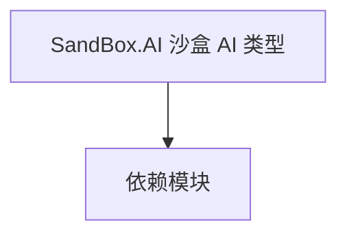

# SandBox.AI 沙盒 AI 类型

**一句话职责：** 本页以家族索引形式覆盖 `SandBox.AI 沙盒 AI 类型` 下全部 3 个业务类型，逐类给出命名空间、职责与典型时机，便于按模块而不是按字母表查阅。

## 心智模型

SandBox.AI 是沙盒模块的 AI 相关类型（如 AgentBehaviorManager 协调战斗智能体的行为装配）。它把 AI 行为的注册、管理与具体决策实现解耦，是「行为装配中枢」，被 Mission 在加载时用来挂接智能体逻辑。

## 何时使用

需要集中管理战斗 AI 行为或新增智能体决策时，通过这里的协调类型；行为实现要可序列化、可中断。

## 依赖关系

`SandBox.AI 沙盒 AI 类型` 的类型依赖以下模块；缺其中任一都会导致编译或运行期失败。

- [Mission 战斗场景](../../mission/Mission)
- [CampaignBehaviorBase](../../campaign-ext/CampaignBehaviorBase)
- [API 总览](../../_index)

## 类型清单

| Type | Namespace | Purpose | Timing |
| --- | --- | --- | --- |
| `AgentBehaviorManager` | SandBox.AI | 战斗智能体 AI 行为，在 Mission 中做决策并执行动作；生命周期随 Agent 生死，需处理 Agent 死亡后的清理。 | 战役初始化期 |
| `PassageAI` | SandBox.AI | 场景可用装置，玩家交互时触发对应动作或菜单；交互逻辑需幂等，状态需可序列化以支持存档。 | 战役初始化期 |
| `UsablePlaceAI` | SandBox.AI | 场景可用装置，玩家交互时触发对应动作或菜单；交互逻辑需幂等，状态需可序列化以支持存档。 | 战役初始化期 |

## 风险与边界

AI 装配依赖 Mission 加载顺序，未就绪时引用会得到空；行为搜索要限制深度/超时避免卡顿。Agent 死亡后对应行为必须清理，否则悬空引用会崩溃。

## 参见

- [Mission 战斗场景](../../mission/Mission)
- [CampaignBehaviorBase](../../campaign-ext/CampaignBehaviorBase)
- [API 总览](../../_index)
