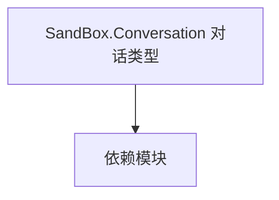

# SandBox.Conversation 对话类型

**一句话职责：** 本页以家族索引形式覆盖 `SandBox.Conversation 对话类型` 下全部 3 个业务类型，逐类给出命名空间、职责与典型时机，便于按模块而不是按字母表查阅。

## 心智模型

SandBox.Conversation 是沙盒对话系统的类型：对话树与表演控制（Conversation），以及任务中的对话逻辑（Conversation.MissionLogics）。它们把 NPC 交互组织成可分支、可本地化的对话流程，并通过 MissionBehavior 在合适场景触发。

## 何时使用

扩展 NPC 对话线或任务内对话表演时，从对应类型派生并接入对话系统；分支与本地化要完整。

## 依赖关系

`SandBox.Conversation 对话类型` 的类型依赖以下模块；缺其中任一都会导致编译或运行期失败。

- [Campaign 战役](../../campaign/Campaign)
- [CampaignBehaviorBase](../../campaign-ext/CampaignBehaviorBase)
- [API 总览](../../_index)

## 类型清单

| Type | Namespace | Purpose | Timing |
| --- | --- | --- | --- |
| `ConversationMission` | SandBox.Conversation | 对话相关类型，参与对话树与表演；对话线改动需注意分支与本地化。 | 战役初始化期 |
| `ConversationMissionLogic` | SandBox.Conversation.MissionLogics | 任务逻辑，定义该任务的流程与胜负条件，由 Mission 在加载时装配；胜负判定应幂等，重复触发不重复结算。 | 战斗/任务加载时 |
| `MissionConversationLogic` | SandBox.Conversation.MissionLogics | 任务逻辑，定义该任务的流程与胜负条件，由 Mission 在加载时装配；胜负判定应幂等，重复触发不重复结算。 | 战斗/任务加载时 |

## 风险与边界

对话线改动需注意分支闭合与本地化；对话逻辑依赖监听注册顺序，未就绪时对话不会触发。对话中触发的状态变更要走 Action/Behavior，不要直接改字段。

## 参见

- [Campaign 战役](../../campaign/Campaign)
- [CampaignBehaviorBase](../../campaign-ext/CampaignBehaviorBase)
- [API 总览](../../_index)
