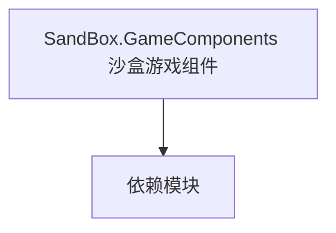

# SandBox.GameComponents 沙盒游戏组件

**一句话职责：** 本页以家族索引形式覆盖 `SandBox.GameComponents 沙盒游戏组件` 下全部 11 个业务类型，逐类给出命名空间、职责与典型时机，便于按模块而不是按字母表查阅。

## 心智模型

SandBox.GameComponents 是沙盒模块挂载到游戏实体的组件类型，为实体附加特定能力（如场景物件行为、玩法小机关）。组件与实体解耦，可组合复用，是沙盒「组合优于继承」的体现；组件状态需可序列化。

## 何时使用

需要给实体附加可复用能力时，从对应 GameComponent 派生并挂载；组件间不要互相强依赖。

## 依赖关系

`SandBox.GameComponents 沙盒游戏组件` 的类型依赖以下模块；缺其中任一都会导致编译或运行期失败。

- [Campaign 战役](../../campaign/Campaign)
- [CampaignBehaviorBase](../../campaign-ext/CampaignBehaviorBase)
- [API 总览](../../_index)

## 类型清单

| Type | Namespace | Purpose | Timing |
| --- | --- | --- | --- |
| `IMissionPlayerFollowerHandler` | SandBox.GameComponents | 该命名空间下的业务类型，承担其派生约定职责；调用前确认其生命周期与所属系统，不要在错误阶段引用未就绪的实例。 | 战役初始化期 |
| `SandboxAgentApplyDamageModel` | SandBox.GameComponents | 领域模型，聚合规则与计算供 Behavior 调用；替换模型要提供同等契约，空替换会让依赖方拿到 null。 | 战役初始化期 |
| `SandboxAgentDecideKilledOrUnconsciousModel` | SandBox.GameComponents | 领域模型，聚合规则与计算供 Behavior 调用；替换模型要提供同等契约，空替换会让依赖方拿到 null。 | 战役初始化期 |
| `SandboxAgentStatCalculateModel` | SandBox.GameComponents | 领域模型，聚合规则与计算供 Behavior 调用；替换模型要提供同等契约，空替换会让依赖方拿到 null。 | 战役初始化期 |
| `SandboxApplyWeatherEffectsModel` | SandBox.GameComponents | 领域模型，聚合规则与计算供 Behavior 调用；替换模型要提供同等契约，空替换会让依赖方拿到 null。 | 战役初始化期 |
| `SandboxAutoBlockModel` | SandBox.GameComponents | 领域模型，聚合规则与计算供 Behavior 调用；替换模型要提供同等契约，空替换会让依赖方拿到 null。 | 战役初始化期 |
| `SandboxBattleInitializationModel` | SandBox.GameComponents | 领域模型，聚合规则与计算供 Behavior 调用；替换模型要提供同等契约，空替换会让依赖方拿到 null。 | 战役初始化期 |
| `SandboxBattleMoraleModel` | SandBox.GameComponents | 领域模型，聚合规则与计算供 Behavior 调用；替换模型要提供同等契约，空替换会让依赖方拿到 null。 | 战役初始化期 |
| `SandboxBattleSpawnModel` | SandBox.GameComponents | 领域模型，聚合规则与计算供 Behavior 调用；替换模型要提供同等契约，空替换会让依赖方拿到 null。 | 战役初始化期 |
| `SandboxMissionDifficultyModel` | SandBox.GameComponents | 领域模型，聚合规则与计算供 Behavior 调用；替换模型要提供同等契约，空替换会让依赖方拿到 null。 | 战役初始化期 |
| `SandboxStrikeMagnitudeModel` | SandBox.GameComponents | 领域模型，聚合规则与计算供 Behavior 调用；替换模型要提供同等契约，空替换会让依赖方拿到 null。 | 战役初始化期 |

## 风险与边界

组件依赖挂载顺序，未挂载时访问会得到空；组件状态必须可序列化，否则存档后无法复原。组件释放要与实体生命周期配对。

## 参见

- [Campaign 战役](../../campaign/Campaign)
- [CampaignBehaviorBase](../../campaign-ext/CampaignBehaviorBase)
- [API 总览](../../_index)
