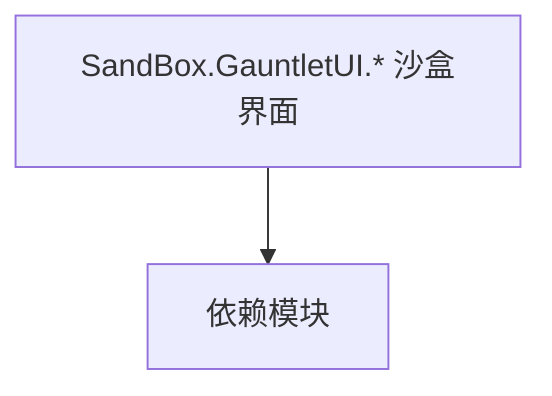

# SandBox.GauntletUI.* 沙盒界面

**一句话职责：** 本页以家族索引形式覆盖 `SandBox.GauntletUI.* 沙盒界面` 下全部 53 个业务类型，逐类给出命名空间、职责与典型时机，便于按模块而不是按字母表查阅。

## 心智模型

SandBox.GauntletUI.* 是沙盒模块的 Gauntlet 界面层：城镇/酒馆/角色创建/百科/旗帜编辑器/教程等界面及其 Widget、ViewModel。它们把沙盒逻辑状态投影成可点击、可绑定的界面元素，是玩家与战略/社交层交互的主要入口；界面层只暴露状态，交互通过事件上抛给逻辑。

## 何时使用

定制沙盒内某个界面（城镇/酒馆/角色创建/百科/教程）时，继承对应 Widget/VM 并由 MissionBehavior/逻辑层打开；命令只触发 Action/Behavior。

## 依赖关系

`SandBox.GauntletUI.* 沙盒界面` 的类型依赖以下模块；缺其中任一都会导致编译或运行期失败。

- [ViewModel 视图模型](../../core-extra/ViewModel)
- [Campaign 战役](../../campaign/Campaign)
- [API 总览](../../_index)

## 类型清单

| Type | Namespace | Purpose | Timing |
| --- | --- | --- | --- |
| `GauntletBarberScreen` | SandBox.GauntletUI | 界面屏幕/图层基类，承载 Gauntlet UI 的显示与输入；命令只触发 Action/Behavior，不直接改状态。 | 战役初始化期 |
| `GauntletCharacterDeveloperScreen` | SandBox.GauntletUI | 界面屏幕/图层基类，承载 Gauntlet UI 的显示与输入；命令只触发 Action/Behavior，不直接改状态。 | 战役初始化期 |
| `GauntletClanScreen` | SandBox.GauntletUI | 界面屏幕/图层基类，承载 Gauntlet UI 的显示与输入；命令只触发 Action/Behavior，不直接改状态。 | 战役初始化期 |
| `GauntletCraftingScreen` | SandBox.GauntletUI | 界面屏幕/图层基类，承载 Gauntlet UI 的显示与输入；命令只触发 Action/Behavior，不直接改状态。 | 战役初始化期 |
| `GauntletEducationScreen` | SandBox.GauntletUI | 界面屏幕/图层基类，承载 Gauntlet UI 的显示与输入；命令只触发 Action/Behavior，不直接改状态。 | 战役初始化期 |
| `GauntletGameOverScreen` | SandBox.GauntletUI | 界面屏幕/图层基类，承载 Gauntlet UI 的显示与输入；命令只触发 Action/Behavior，不直接改状态。 | 战役初始化期 |
| `GauntletInventoryScreen` | SandBox.GauntletUI | 界面屏幕/图层基类，承载 Gauntlet UI 的显示与输入；命令只触发 Action/Behavior，不直接改状态。 | 战役初始化期 |
| `GauntletKingdomScreen` | SandBox.GauntletUI | 界面屏幕/图层基类，承载 Gauntlet UI 的显示与输入；命令只触发 Action/Behavior，不直接改状态。 | 战役初始化期 |
| `GauntletPartyScreen` | SandBox.GauntletUI | 界面屏幕/图层基类，承载 Gauntlet UI 的显示与输入；命令只触发 Action/Behavior，不直接改状态。 | 战役初始化期 |
| `GauntletQuestsScreen` | SandBox.GauntletUI | 界面屏幕/图层基类，承载 Gauntlet UI 的显示与输入；命令只触发 Action/Behavior，不直接改状态。 | 战役初始化期 |
| `GauntletSaveLoadScreen` | SandBox.GauntletUI | 界面屏幕/图层基类，承载 Gauntlet UI 的显示与输入；命令只触发 Action/Behavior，不直接改状态。 | 战役初始化期 |
| `MapConversationTextureProvider` | SandBox.GauntletUI | Gauntlet 图像源抽象，把实体/概念解析成实际纹理并缓存；首帧可能为空，需处理加载态。 | 战役初始化期 |
| `SandBoxGauntletGameNotification` | SandBox.GauntletUI | 通知项类型，描述一条地图/事件提示的数据；只承载展示数据，触发逻辑在 Behavior。 | 战役初始化期 |
| `SandBoxGauntletUISubModule` | SandBox.GauntletUI | 模块入口基类，注册行为与覆盖点；生命周期贯穿全程，不要在错误阶段（如加载前）取还没就绪的系统。 | 战役初始化期 |
| `SandboxSceneNotificationContextProvider` | SandBox.GauntletUI | Gauntlet 图像源抽象，把实体/概念解析成实际纹理并缓存；首帧可能为空，需处理加载态。 | 战役初始化期 |
| `BannerEditorView` | SandBox.GauntletUI.BannerEditor | 该命名空间下的业务类型，承担其派生约定职责；调用前确认其生命周期与所属系统，不要在错误阶段引用未就绪的实例。 | 战役初始化期 |
| `GauntletBannerEditorScreen` | SandBox.GauntletUI.BannerEditor | 界面屏幕/图层基类，承载 Gauntlet UI 的显示与输入；命令只触发 Action/Behavior，不直接改状态。 | 战役初始化期 |
| `CharacterCreationBannerEditorView` | SandBox.GauntletUI.CharacterCreation | 该命名空间下的业务类型，承担其派生约定职责；调用前确认其生命周期与所属系统，不要在错误阶段引用未就绪的实例。 | 战役初始化期 |
| `CharacterCreationClanNamingStageView` | SandBox.GauntletUI.CharacterCreation | 该命名空间下的业务类型，承担其派生约定职责；调用前确认其生命周期与所属系统，不要在错误阶段引用未就绪的实例。 | 战役初始化期 |
| `CharacterCreationCultureStageView` | SandBox.GauntletUI.CharacterCreation | 该命名空间下的业务类型，承担其派生约定职责；调用前确认其生命周期与所属系统，不要在错误阶段引用未就绪的实例。 | 战役初始化期 |
| `CharacterCreationFaceGeneratorView` | SandBox.GauntletUI.CharacterCreation | 该命名空间下的业务类型，承担其派生约定职责；调用前确认其生命周期与所属系统，不要在错误阶段引用未就绪的实例。 | 战役初始化期 |
| `CharacterCreationNarrativeStageView` | SandBox.GauntletUI.CharacterCreation | 该命名空间下的业务类型，承担其派生约定职责；调用前确认其生命周期与所属系统，不要在错误阶段引用未就绪的实例。 | 战役初始化期 |
| `CharacterCreationOptionsStageView` | SandBox.GauntletUI.CharacterCreation | 该命名空间下的业务类型，承担其派生约定职责；调用前确认其生命周期与所属系统，不要在错误阶段引用未就绪的实例。 | 战役初始化期 |
| `CharacterCreationReviewStageView` | SandBox.GauntletUI.CharacterCreation | 该命名空间下的业务类型，承担其派生约定职责；调用前确认其生命周期与所属系统，不要在错误阶段引用未就绪的实例。 | 战役初始化期 |
| `EncyclopediaData` | SandBox.GauntletUI.Encyclopedia | 该命名空间下的业务类型，承担其派生约定职责；调用前确认其生命周期与所属系统，不要在错误阶段引用未就绪的实例。 | 战役初始化期 |
| `EncyclopediaListViewDataController` | SandBox.GauntletUI.Encyclopedia | 该命名空间下的业务类型，承担其派生约定职责；调用前确认其生命周期与所属系统，不要在错误阶段引用未就绪的实例。 | 战役初始化期 |
| `GauntletMapEncyclopediaView` | SandBox.GauntletUI.Encyclopedia | 该命名空间下的业务类型，承担其派生约定职责；调用前确认其生命周期与所属系统，不要在错误阶段引用未就绪的实例。 | 战役初始化期 |
| `GauntletMenuBackground` | SandBox.GauntletUI.Menu | 该命名空间下的业务类型，承担其派生约定职责；调用前确认其生命周期与所属系统，不要在错误阶段引用未就绪的实例。 | 战役初始化期 |
| `GauntletMenuBaseView` | SandBox.GauntletUI.Menu | 该命名空间下的业务类型，承担其派生约定职责；调用前确认其生命周期与所属系统，不要在错误阶段引用未就绪的实例。 | 战役初始化期 |
| `GauntletMenuOverlayBaseView` | SandBox.GauntletUI.Menu | 该命名空间下的业务类型，承担其派生约定职责；调用前确认其生命周期与所属系统，不要在错误阶段引用未就绪的实例。 | 战役初始化期 |
| `GauntletMenuRecruitVolunteersView` | SandBox.GauntletUI.Menu | 该命名空间下的业务类型，承担其派生约定职责；调用前确认其生命周期与所属系统，不要在错误阶段引用未就绪的实例。 | 战役初始化期 |
| `GauntletMenuTournamentLeaderboardView` | SandBox.GauntletUI.Menu | 锦标赛相关类型，组织赛事报名、对阵与奖励结算；状态需可序列化。 | 战役初始化期 |
| `GauntletMenuTownManagementView` | SandBox.GauntletUI.Menu | 该命名空间下的业务类型，承担其派生约定职责；调用前确认其生命周期与所属系统，不要在错误阶段引用未就绪的实例。 | 战役初始化期 |
| `GauntletMenuTroopSelectionView` | SandBox.GauntletUI.Menu | 选举/表决机制，用于王国决策等集体投票；注意投票时机与平票处理。 | 战役初始化期 |
| `MissionGauntletAgentAlarmStateView` | SandBox.GauntletUI.Missions | 该命名空间下的业务类型，承担其派生约定职责；调用前确认其生命周期与所属系统，不要在错误阶段引用未就绪的实例。 | 战斗/任务加载时 |
| `MissionGauntletArenaPracticeFightView` | SandBox.GauntletUI.Missions | 战斗场景可视化视图，订阅 Mission 事件并在每帧从游戏状态刷新表现层（相机/特效/HUD 叠加），视图只读状态、不写规则。 | 战斗/任务加载时 |
| `MissionGauntletBarterView` | SandBox.GauntletUI.Missions | 战斗场景可视化视图，订阅 Mission 事件并在每帧从游戏状态刷新表现层（相机/特效/HUD 叠加），视图只读状态、不写规则。 | 战斗/任务加载时 |
| `MissionGauntletBoardGameView` | SandBox.GauntletUI.Missions | 战斗场景可视化视图，订阅 Mission 事件并在每帧从游戏状态刷新表现层（相机/特效/HUD 叠加），视图只读状态、不写规则。 | 战斗/任务加载时 |
| `MissionGauntletCheatView` | SandBox.GauntletUI.Missions | 调试作弊项，通过控制台或菜单触发开发期效果；生产构建应禁用或空实现，避免误触发改坏存档。 | 战斗/任务加载时 |
| `MissionGauntletConversationView` | SandBox.GauntletUI.Missions | 战斗场景可视化视图，订阅 Mission 事件并在每帧从游戏状态刷新表现层（相机/特效/HUD 叠加），视图只读状态、不写规则。 | 战斗/任务加载时 |
| `MissionGauntletEavesdroppingCameraView` | SandBox.GauntletUI.Missions | 该命名空间下的业务类型，承担其派生约定职责；调用前确认其生命周期与所属系统，不要在错误阶段引用未就绪的实例。 | 战斗/任务加载时 |
| `MissionGauntletHideoutAmbushCinematicView` | SandBox.GauntletUI.Missions | 该命名空间下的业务类型，承担其派生约定职责；调用前确认其生命周期与所属系统，不要在错误阶段引用未就绪的实例。 | 战斗/任务加载时 |
| `MissionGauntletNameMarkerView` | SandBox.GauntletUI.Missions | 该命名空间下的业务类型，承担其派生约定职责；调用前确认其生命周期与所属系统，不要在错误阶段引用未就绪的实例。 | 战斗/任务加载时 |
| `MissionGauntletObjectiveView` | SandBox.GauntletUI.Missions | 该命名空间下的业务类型，承担其派生约定职责；调用前确认其生命周期与所属系统，不要在错误阶段引用未就绪的实例。 | 战斗/任务加载时 |
| `MissionGauntletQuestBarView` | SandBox.GauntletUI.Missions | 该命名空间下的业务类型，承担其派生约定职责；调用前确认其生命周期与所属系统，不要在错误阶段引用未就绪的实例。 | 战斗/任务加载时 |
| `MissionGauntletStealthFailCounterView` | SandBox.GauntletUI.Missions | AI 决策实现，需可中断、可序列化以支持存档与悔棋；搜索要限制深度/超时避免卡顿。 | 战斗/任务加载时 |
| `MissionGauntletStoryModeCheatView` | SandBox.GauntletUI.Missions | 调试作弊项，通过控制台或菜单触发开发期效果；生产构建应禁用或空实现，避免误触发改坏存档。 | 战斗/任务加载时 |
| `MissionGauntletTournamentView` | SandBox.GauntletUI.Missions | 战斗场景可视化视图，订阅 Mission 事件并在每帧从游戏状态刷新表现层（相机/特效/HUD 叠加），视图只读状态、不写规则。 | 战斗/任务加载时 |
| `GauntletTutorialSystem` | SandBox.GauntletUI.Tutorial | 该命名空间下的业务类型，承担其派生约定职责；调用前确认其生命周期与所属系统，不要在错误阶段引用未就绪的实例。 | 战役初始化期 |
| `TutorialAttribute` | SandBox.GauntletUI.Tutorial | 该命名空间下的业务类型，承担其派生约定职责；调用前确认其生命周期与所属系统，不要在错误阶段引用未就绪的实例。 | 战役初始化期 |
| `TutorialHelper` | SandBox.GauntletUI.Tutorial | 该命名空间下的业务类型，承担其派生约定职责；调用前确认其生命周期与所属系统，不要在错误阶段引用未就绪的实例。 | 战役初始化期 |
| `TutorialItemBase` | SandBox.GauntletUI.Tutorial | 该命名空间下的业务类型，承担其派生约定职责；调用前确认其生命周期与所属系统，不要在错误阶段引用未就绪的实例。 | 战役初始化期 |
| `GauntletMainAgentDetectionView` | Sandobx.GauntletUI.Missions | AI 决策实现，需可中断、可序列化以支持存档与悔棋；搜索要限制深度/超时避免卡顿。 | 战斗/任务加载时 |

## 风险与边界

界面层只读逻辑状态，写入须经逻辑层以免状态分歧；频繁刷新属性要节流。注意命名空间拼写（存在 SandBox 与个别 Sandobx 历史笔误页），引用以实际命名空间为准。

## 参见

- [ViewModel 视图模型](../../core-extra/ViewModel)
- [Campaign 战役](../../campaign/Campaign)
- [API 总览](../../_index)
