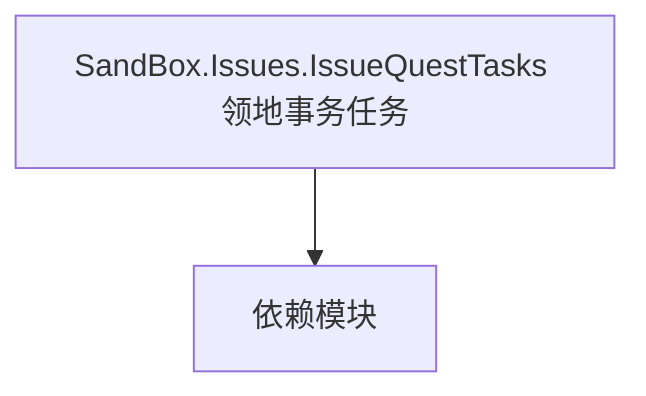

# SandBox.Issues.IssueQuestTasks 领地事务任务

**一句话职责：** 本页以家族索引形式覆盖 `SandBox.Issues.IssueQuestTasks 领地事务任务` 下全部 3 个业务类型，逐类给出命名空间、职责与典型时机，便于按模块而不是按字母表查阅。

## 心智模型

SandBox.Issues.IssueQuestTasks 是领地事务（Issue）所附的任务步骤类型，描述一个 Issue 被接取后需要完成的子目标与结算。它与 Issue 主体配合，把「领地问题」拆成可执行、可结算的步骤；条件判定需幂等。

## 何时使用

扩展或新增 Issue 的完成步骤时，从对应 IssueQuestTask 派生并在 Issue 中登记；步骤完成要幂等，避免重复奖励。

## 依赖关系

`SandBox.Issues.IssueQuestTasks 领地事务任务` 的类型依赖以下模块；缺其中任一都会导致编译或运行期失败。

- [Campaign 战役](../../campaign/Campaign)
- [CampaignBehaviorBase](../../campaign-ext/CampaignBehaviorBase)
- [API 总览](../../_index)

## 类型清单

| Type | Namespace | Purpose | Timing |
| --- | --- | --- | --- |
| `ArenaDuelQuestTask` | SandBox.Issues.IssueQuestTasks | 任务阶段子目标，定义一步完成条件与结算；条件判定需幂等，重复完成不重复奖励。 | 战役初始化期 |
| `BeginConversationInitiatedByAIQuestTask` | SandBox.Issues.IssueQuestTasks | 任务阶段子目标，定义一步完成条件与结算；条件判定需幂等，重复完成不重复奖励。 | 战役初始化期 |
| `FollowAgentQuestTask` | SandBox.Issues.IssueQuestTasks | 任务阶段子目标，定义一步完成条件与结算；条件判定需幂等，重复完成不重复奖励。 | 战役初始化期 |

## 风险与边界

任务步骤完成要幂等，重复触发会导致奖励翻倍或状态错乱；跨步骤状态需注意存档兼容，新增字段必须带默认值。

## 参见

- [Campaign 战役](../../campaign/Campaign)
- [CampaignBehaviorBase](../../campaign-ext/CampaignBehaviorBase)
- [API 总览](../../_index)
