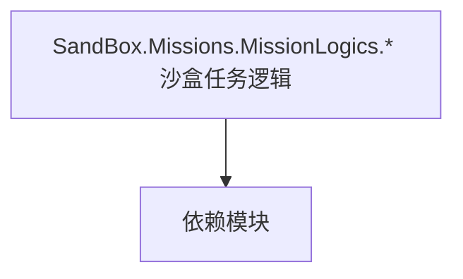

# SandBox.Missions.MissionLogics.* 沙盒任务逻辑

**一句话职责：** 本页以家族索引形式覆盖 `SandBox.Missions.MissionLogics.* 沙盒任务逻辑` 下全部 21 个业务类型，逐类给出命名空间、职责与典型时机，便于按模块而不是按字母表查阅。

## 心智模型

SandBox.Missions.MissionLogics.* 是沙盒各玩法的任务逻辑实现：Hideout（剿匪据点，含 Objectives 子目标）、Arena（竞技场）、Towns（城镇玩法）等。每个 MissionLogic 派生类定义该玩法的流程与胜负条件，由对应 Mission 在加载时装配；逻辑与表现通过 MissionBehavior 桥接。

## 何时使用

扩展某个沙盒玩法（剿匪/竞技场/城镇）的流程时，继承对应 MissionLogic 并由 Mission 注册；胜负与结算要幂等。

## 依赖关系

`SandBox.Missions.MissionLogics.* 沙盒任务逻辑` 的类型依赖以下模块；缺其中任一都会导致编译或运行期失败。

- [Mission 战斗场景](../../mission/Mission)
- [CampaignBehaviorBase](../../campaign-ext/CampaignBehaviorBase)
- [API 总览](../../_index)

## 类型清单

| Type | Namespace | Purpose | Timing |
| --- | --- | --- | --- |
| `ArenaAgentStateDeciderLogic` | SandBox.Missions.MissionLogics.Arena | 任务逻辑，定义该任务的流程与胜负条件，由 Mission 在加载时装配；胜负判定应幂等，重复触发不重复结算。 | 战斗/任务加载时 |
| `ArenaDuelMissionBehavior` | SandBox.Missions.MissionLogics.Arena | 任务逻辑，定义该任务的流程与胜负条件，由 Mission 在加载时装配；胜负判定应幂等，重复触发不重复结算。 | 战斗/任务加载时 |
| `ArenaDuelMissionController` | SandBox.Missions.MissionLogics.Arena | 任务逻辑，定义该任务的流程与胜负条件，由 Mission 在加载时装配；胜负判定应幂等，重复触发不重复结算。 | 战斗/任务加载时 |
| `ArenaPracticeFightMissionController` | SandBox.Missions.MissionLogics.Arena | 任务逻辑，定义该任务的流程与胜负条件，由 Mission 在加载时装配；胜负判定应幂等，重复触发不重复结算。 | 战斗/任务加载时 |
| `HideoutAgentType` | SandBox.Missions.MissionLogics.Hideout | 该命名空间下的业务类型，承担其派生约定职责；调用前确认其生命周期与所属系统，不要在错误阶段引用未就绪的实例。 | 战斗/任务加载时 |
| `HideoutAmbushBossFightCinematicController` | SandBox.Missions.MissionLogics.Hideout | 任务逻辑，定义该任务的流程与胜负条件，由 Mission 在加载时装配；胜负判定应幂等，重复触发不重复结算。 | 战斗/任务加载时 |
| `HideoutAmbushMissionController` | SandBox.Missions.MissionLogics.Hideout | 任务逻辑，定义该任务的流程与胜负条件，由 Mission 在加载时装配；胜负判定应幂等，重复触发不重复结算。 | 战斗/任务加载时 |
| `HideoutCinematicAgentInfo` | SandBox.Missions.MissionLogics.Hideout | 该命名空间下的业务类型，承担其派生约定职责；调用前确认其生命周期与所属系统，不要在错误阶段引用未就绪的实例。 | 战斗/任务加载时 |
| `HideoutCinematicController` | SandBox.Missions.MissionLogics.Hideout | 任务逻辑，定义该任务的流程与胜负条件，由 Mission 在加载时装配；胜负判定应幂等，重复触发不重复结算。 | 战斗/任务加载时 |
| `HideoutCinematicState` | SandBox.Missions.MissionLogics.Hideout | 该命名空间下的业务类型，承担其派生约定职责；调用前确认其生命周期与所属系统，不要在错误阶段引用未就绪的实例。 | 战斗/任务加载时 |
| `HideoutMissionController` | SandBox.Missions.MissionLogics.Hideout | 任务逻辑，定义该任务的流程与胜负条件，由 Mission 在加载时装配；胜负判定应幂等，重复触发不重复结算。 | 战斗/任务加载时 |
| `HideoutPostCinematicPhase` | SandBox.Missions.MissionLogics.Hideout | 该命名空间下的业务类型，承担其派生约定职责；调用前确认其生命周期与所属系统，不要在错误阶段引用未就绪的实例。 | 战斗/任务加载时 |
| `HideoutPreCinematicPhase` | SandBox.Missions.MissionLogics.Hideout | 该命名空间下的业务类型，承担其派生约定职责；调用前确认其生命周期与所属系统，不要在错误阶段引用未就绪的实例。 | 战斗/任务加载时 |
| `TroopData` | SandBox.Missions.MissionLogics.Hideout | 该命名空间下的业务类型，承担其派生约定职责；调用前确认其生命周期与所属系统，不要在错误阶段引用未就绪的实例。 | 战斗/任务加载时 |
| `ClearTheMainCampObjective` | SandBox.Missions.MissionLogics.Hideout.Objectives | AI 决策实现，需可中断、可序列化以支持存档与悔棋；搜索要限制深度/超时避免卡顿。 | 战斗/任务加载时 |
| `DefeatHideoutBossObjective` | SandBox.Missions.MissionLogics.Hideout.Objectives | 该命名空间下的业务类型，承担其派生约定职责；调用前确认其生命周期与所属系统，不要在错误阶段引用未就绪的实例。 | 战斗/任务加载时 |
| `LocateTheMainCampObjective` | SandBox.Missions.MissionLogics.Hideout.Objectives | AI 决策实现，需可中断、可序列化以支持存档与悔棋；搜索要限制深度/超时避免卡顿。 | 战斗/任务加载时 |
| `AlleyFightMissionHandler` | SandBox.Missions.MissionLogics.Towns | 任务逻辑，定义该任务的流程与胜负条件，由 Mission 在加载时装配；胜负判定应幂等，重复触发不重复结算。 | 战斗/任务加载时 |
| `PrisonBreakMissionController` | SandBox.Missions.MissionLogics.Towns | 任务逻辑，定义该任务的流程与胜负条件，由 Mission 在加载时装配；胜负判定应幂等，重复触发不重复结算。 | 战斗/任务加载时 |
| `TownCenterMissionController` | SandBox.Missions.MissionLogics.Towns | 任务逻辑，定义该任务的流程与胜负条件，由 Mission 在加载时装配；胜负判定应幂等，重复触发不重复结算。 | 战斗/任务加载时 |
| `WorkshopMissionHandler` | SandBox.Missions.MissionLogics.Towns | 任务逻辑，定义该任务的流程与胜负条件，由 Mission 在加载时装配；胜负判定应幂等，重复触发不重复结算。 | 战斗/任务加载时 |

## 风险与边界

任务逻辑依赖场景与监听注册顺序；未就绪时事件会丢失。子目标（Objectives）完成要幂等，重复完成不重复结算。状态需可序列化以支持中途存档。

## 参见

- [Mission 战斗场景](../../mission/Mission)
- [CampaignBehaviorBase](../../campaign-ext/CampaignBehaviorBase)
- [API 总览](../../_index)
