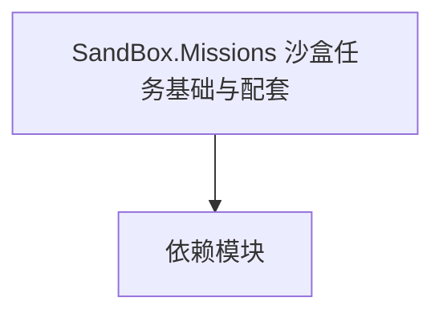

# SandBox.Missions 沙盒任务基础与配套

**一句话职责：** 本页以家族索引形式覆盖 `SandBox.Missions 沙盒任务基础与配套` 下全部 16 个业务类型，逐类给出命名空间、职责与典型时机，便于按模块而不是按字母表查阅。

## 心智模型

SandBox.Missions 是沙盒模块任务系统的基础与配套类型：任务基类（Mission）、战斗计分（BattleScore）、任务事件（MissionEvents）、对话任务逻辑（Conversation.MissionLogics）、以及 Agent 行为（Source.Missions.AgentBehaviors）。它们定义任务的生命周期、事件流与智能体协作，是 Mission 玩法逻辑的骨架。

## 何时使用

扩展沙盒任务流程/事件/对话逻辑或新增 Agent 行为时，从对应类型派生并在 Mission 加载时装配；胜负判定要幂等。

## 依赖关系

`SandBox.Missions 沙盒任务基础与配套` 的类型依赖以下模块；缺其中任一都会导致编译或运行期失败。

- [Mission 战斗场景](../../mission/Mission)
- [CampaignBehaviorBase](../../campaign-ext/CampaignBehaviorBase)
- [API 总览](../../_index)

## 类型清单

| Type | Namespace | Purpose | Timing |
| --- | --- | --- | --- |
| `CameraJumpScript` | SandBox.Missions | 挂载到场景 GameObject 的脚本组件，把场景状态暴露给逻辑层；依赖场景加载顺序，未就绪时字段为空。 | 战斗/任务加载时 |
| `ChangeLightIntensityScript` | SandBox.Missions | 挂载到场景 GameObject 的脚本组件，把场景状态暴露给逻辑层；依赖场景加载顺序，未就绪时字段为空。 | 战斗/任务加载时 |
| `CheckpointLoadedMissionEvent` | SandBox.Missions | 事件或事件处理器，承载一次发生的事情的数据；订阅要记得在卸载时退订以防泄漏。 | 战斗/任务加载时 |
| `CheckpointMissionLogic` | SandBox.Missions | 任务逻辑，定义该任务的流程与胜负条件，由 Mission 在加载时装配；胜负判定应幂等，重复触发不重复结算。 | 战斗/任务加载时 |
| `CivilianPortShipSpawnMissionLogic` | SandBox.Missions | 任务逻辑，定义该任务的流程与胜负条件，由 Mission 在加载时装配；胜负判定应幂等，重复触发不重复结算。 | 战斗/任务加载时 |
| `CoverAnimalAgentComponent` | SandBox.Missions | 该命名空间下的业务类型，承担其派生约定职责；调用前确认其生命周期与所属系统，不要在错误阶段引用未就绪的实例。 | 战斗/任务加载时 |
| `EavesdropSound` | SandBox.Missions | 该命名空间下的业务类型，承担其派生约定职责；调用前确认其生命周期与所属系统，不要在错误阶段引用未就绪的实例。 | 战斗/任务加载时 |
| `OnStealthMissionCounterFailedEvent` | SandBox.Missions | AI 决策实现，需可中断、可序列化以支持存档与悔棋；搜索要限制深度/超时避免卡顿。 | 战斗/任务加载时 |
| `RotateObjectScript` | SandBox.Missions | 挂载到场景 GameObject 的脚本组件，把场景状态暴露给逻辑层；依赖场景加载顺序，未就绪时字段为空。 | 战斗/任务加载时 |
| `SabotageMissionController` | SandBox.Missions | 任务逻辑，定义该任务的流程与胜负条件，由 Mission 在加载时装配；胜负判定应幂等，重复触发不重复结算。 | 战斗/任务加载时 |
| `StealthFailCounterMissionLogic` | SandBox.Missions | 任务逻辑，定义该任务的流程与胜负条件，由 Mission 在加载时装配；胜负判定应幂等，重复触发不重复结算。 | 战斗/任务加载时 |
| `SandboxMissionBattleScoreContext` | SandBox.Missions.BattleScore | 战斗计分规则/数据，统计并结算战斗表现得分；计分要可重入，避免中途重算错位。 | 战斗/任务加载时 |
| `SandboxSimulationBattleScoreContext` | SandBox.Missions.BattleScore | 战斗计分规则/数据，统计并结算战斗表现得分；计分要可重入，避免中途重算错位。 | 战斗/任务加载时 |
| `MissionAIActivationDeactivationEventListenerLogic` | SandBox.Missions.MissionEvents | 任务逻辑，定义该任务的流程与胜负条件，由 Mission 在加载时装配；胜负判定应幂等，重复触发不重复结算。 | 战斗/任务加载时 |
| `OpenInventoryWithGivenItemsEventListenerLogic` | SandBox.Missions.MissionEvents | 任务逻辑，定义该任务的流程与胜负条件，由 Mission 在加载时装配；胜负判定应幂等，重复触发不重复结算。 | 战斗/任务加载时 |
| `ShowQuickInformationEventListenerLogic` | SandBox.Missions.MissionEvents | 任务逻辑，定义该任务的流程与胜负条件，由 Mission 在加载时装配；胜负判定应幂等，重复触发不重复结算。 | 战斗/任务加载时 |

## 风险与边界

任务逻辑依赖 Mission 加载与监听注册顺序；未就绪时事件会丢失。Agent 死亡后其行为必须清理，悬空引用会崩溃。计分/事件数据需可序列化。

## 参见

- [Mission 战斗场景](../../mission/Mission)
- [CampaignBehaviorBase](../../campaign-ext/CampaignBehaviorBase)
- [API 总览](../../_index)
