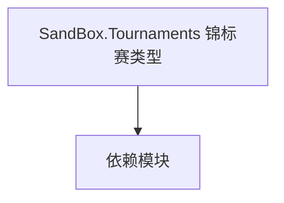

# SandBox.Tournaments 锦标赛类型

**一句话职责：** 本页以家族索引形式覆盖 `SandBox.Tournaments 锦标赛类型` 下全部 12 个业务类型，逐类给出命名空间、职责与典型时机，便于按模块而不是按字母表查阅。

## 心智模型

SandBox.Tournaments 实现游戏内锦标赛系统：Tournaments 是锦标赛流程聚合，MissionLogics 驱动赛事对局，AgentControllers 控制参赛 AI 的行为。三者协作组织报名、对阵、对局与奖励结算，状态需可序列化。

## 何时使用

扩展或新增锦标赛阶段/对局/AI 对手时，从对应类型派生并在锦标赛管理器注册；流程要幂等。

## 依赖关系

`SandBox.Tournaments 锦标赛类型` 的类型依赖以下模块；缺其中任一都会导致编译或运行期失败。

- [Campaign 战役](../../campaign/Campaign)
- [Mission 战斗场景](../../mission/Mission)
- [API 总览](../../_index)

## 类型清单

| Type | Namespace | Purpose | Timing |
| --- | --- | --- | --- |
| `ITournamentGameBehavior` | SandBox.Tournaments | 锦标赛相关类型，组织赛事报名、对阵与奖励结算；状态需可序列化。 | 战役初始化期 |
| `TournamentMissionStarter` | SandBox.Tournaments | 锦标赛相关类型，组织赛事报名、对阵与奖励结算；状态需可序列化。 | 战役初始化期 |
| `ArcheryTournamentAgentController` | SandBox.Tournaments.AgentControllers | 锦标赛相关类型，组织赛事报名、对阵与奖励结算；状态需可序列化。 | 战役初始化期 |
| `JoustingAgentController` | SandBox.Tournaments.AgentControllers | 锦标赛相关类型，组织赛事报名、对阵与奖励结算；状态需可序列化。 | 战役初始化期 |
| `JoustingAgentState` | SandBox.Tournaments.AgentControllers | 锦标赛相关类型，组织赛事报名、对阵与奖励结算；状态需可序列化。 | 战役初始化期 |
| `TownHorseRaceAgentController` | SandBox.Tournaments.AgentControllers | 锦标赛相关类型，组织赛事报名、对阵与奖励结算；状态需可序列化。 | 战役初始化期 |
| `CheckPoint` | SandBox.Tournaments.MissionLogics | 锦标赛相关类型，组织赛事报名、对阵与奖励结算；状态需可序列化。 | 战斗/任务加载时 |
| `TournamentArcheryMissionController` | SandBox.Tournaments.MissionLogics | 任务逻辑，定义该任务的流程与胜负条件，由 Mission 在加载时装配；胜负判定应幂等，重复触发不重复结算。 | 战斗/任务加载时 |
| `TournamentBehavior` | SandBox.Tournaments.MissionLogics | 任务逻辑，定义该任务的流程与胜负条件，由 Mission 在加载时装配；胜负判定应幂等，重复触发不重复结算。 | 战斗/任务加载时 |
| `TournamentFightMissionController` | SandBox.Tournaments.MissionLogics | 任务逻辑，定义该任务的流程与胜负条件，由 Mission 在加载时装配；胜负判定应幂等，重复触发不重复结算。 | 战斗/任务加载时 |
| `TournamentJoustingMissionController` | SandBox.Tournaments.MissionLogics | 任务逻辑，定义该任务的流程与胜负条件，由 Mission 在加载时装配；胜负判定应幂等，重复触发不重复结算。 | 战斗/任务加载时 |
| `TownHorseRaceMissionController` | SandBox.Tournaments.MissionLogics | 任务逻辑，定义该任务的流程与胜负条件，由 Mission 在加载时装配；胜负判定应幂等，重复触发不重复结算。 | 战斗/任务加载时 |

## 风险与边界

锦标赛状态必须可序列化以支持存档；AgentControllers 随参赛单位生死，需处理 Agent 死亡后的清理。对阵与奖励结算要避免重复触发。

## 参见

- [Campaign 战役](../../campaign/Campaign)
- [Mission 战斗场景](../../mission/Mission)
- [API 总览](../../_index)
