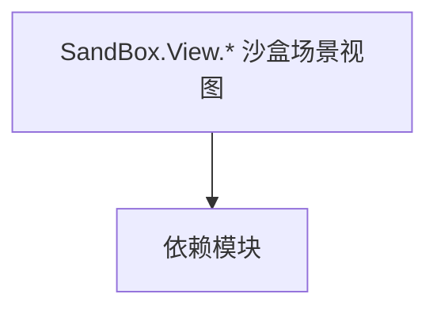

# SandBox.View.* 沙盒场景视图

**一句话职责：** 本页以家族索引形式覆盖 `SandBox.View.* 沙盒场景视图` 下全部 50 个业务类型，逐类给出命名空间、职责与典型时机，便于按模块而不是按字母表查阅。

## 心智模型

SandBox.View.* 是沙盒模块的场景视图层：大地图视觉（Map.Visuals/Managers）、地图导航元素（Map.Navigation.*）、菜单视图（Menu）、角色创建视图（CharacterCreation）、对话视图（Conversation）、订单提供（OrderProviders）、overlay（Overlay）等。它们把游戏状态投影成场景表现，视图只读取状态、不写规则，便于与逻辑解耦。

## 何时使用

需要定制大地图元素、菜单/对话/角色创建表现或场景 overlay 时，继承对应视图并由 MissionBehavior/逻辑层注册；写入须经逻辑层。

## 依赖关系

`SandBox.View.* 沙盒场景视图` 的类型依赖以下模块；缺其中任一都会导致编译或运行期失败。

- [Mission 战斗场景](../../mission/Mission)
- [ViewModel 视图模型](../../core-extra/ViewModel)
- [API 总览](../../_index)

## 类型清单

| Type | Namespace | Purpose | Timing |
| --- | --- | --- | --- |
| `CampaignMusicHandler` | SandBox.View | AI 决策实现，需可中断、可序列化以支持存档与悔棋；搜索要限制深度/超时避免卡顿。 | 战役初始化期 |
| `IChangeableScreen` | SandBox.View | 该命名空间下的业务类型，承担其派生约定职责；调用前确认其生命周期与所属系统，不要在错误阶段引用未就绪的实例。 | 战役初始化期 |
| `MainHeroSaveVisualSupplier` | SandBox.View | AI 决策实现，需可中断、可序列化以支持存档与悔棋；搜索要限制深度/超时避免卡顿。 | 战役初始化期 |
| `PreloadScreen` | SandBox.View | 界面屏幕/图层基类，承载 Gauntlet UI 的显示与输入；命令只触发 Action/Behavior，不直接改状态。 | 战役初始化期 |
| `SandboxView` | SandBox.View | 该命名空间下的业务类型，承担其派生约定职责；调用前确认其生命周期与所属系统，不要在错误阶段引用未就绪的实例。 | 战役初始化期 |
| `SandBoxViewCheats` | SandBox.View | 调试作弊项，通过控制台或菜单触发开发期效果；生产构建应禁用或空实现，避免误触发改坏存档。 | 战役初始化期 |
| `SandBoxViewCreator` | SandBox.View | 该命名空间下的业务类型，承担其派生约定职责；调用前确认其生命周期与所属系统，不要在错误阶段引用未就绪的实例。 | 战役初始化期 |
| `SandBoxViewSubModule` | SandBox.View | 模块入口基类，注册行为与覆盖点；生命周期贯穿全程，不要在错误阶段（如加载前）取还没就绪的系统。 | 战役初始化期 |
| `SandBoxViewVisualManager` | SandBox.View | 该命名空间下的业务类型，承担其派生约定职责；调用前确认其生命周期与所属系统，不要在错误阶段引用未就绪的实例。 | 战役初始化期 |
| `SaveLoadScreen` | SandBox.View | 界面屏幕/图层基类，承载 Gauntlet UI 的显示与输入；命令只触发 Action/Behavior，不直接改状态。 | 战役初始化期 |
| `CharacterCreationScreen` | SandBox.View.CharacterCreation | 界面屏幕/图层基类，承载 Gauntlet UI 的显示与输入；命令只触发 Action/Behavior，不直接改状态。 | 战役初始化期 |
| `CharacterCreationStageViewAttribute` | SandBox.View.CharacterCreation | 该命名空间下的业务类型，承担其派生约定职责；调用前确认其生命周期与所属系统，不要在错误阶段引用未就绪的实例。 | 战役初始化期 |
| `CharacterCreationStageViewBase` | SandBox.View.CharacterCreation | 该命名空间下的业务类型，承担其派生约定职责；调用前确认其生命周期与所属系统，不要在错误阶段引用未就绪的实例。 | 战役初始化期 |
| `ConversationViewEventHandler` | SandBox.View.Conversation | 事件或事件处理器，承载一次发生的事情的数据；订阅要记得在卸载时退订以防泄漏。 | 战役初始化期 |
| `ConversationViewManager` | SandBox.View.Conversation | 对话相关类型，参与对话树与表演；对话线改动需注意分支与本地化。 | 战役初始化期 |
| `EventType` | SandBox.View.Conversation | 事件或事件处理器，承载一次发生的事情的数据；订阅要记得在卸载时退订以防泄漏。 | 战役初始化期 |
| `EntityVisualManagerBase` | SandBox.View.Map.Managers | 该命名空间下的业务类型，承担其派生约定职责；调用前确认其生命周期与所属系统，不要在错误阶段引用未就绪的实例。 | 战役初始化期 |
| `MapAudioManager` | SandBox.View.Map.Managers | 该命名空间下的业务类型，承担其派生约定职责；调用前确认其生命周期与所属系统，不要在错误阶段引用未就绪的实例。 | 战役初始化期 |
| `MapTracksVisualManager` | SandBox.View.Map.Managers | 该命名空间下的业务类型，承担其派生约定职责；调用前确认其生命周期与所属系统，不要在错误阶段引用未就绪的实例。 | 战役初始化期 |
| `MapWeatherVisualManager` | SandBox.View.Map.Managers | 该命名空间下的业务类型，承担其派生约定职责；调用前确认其生命周期与所属系统，不要在错误阶段引用未就绪的实例。 | 战役初始化期 |
| `MobilePartyVisualManager` | SandBox.View.Map.Managers | 该命名空间下的业务类型，承担其派生约定职责；调用前确认其生命周期与所属系统，不要在错误阶段引用未就绪的实例。 | 战役初始化期 |
| `SettlementVisualManager` | SandBox.View.Map.Managers | 该命名空间下的业务类型，承担其派生约定职责；调用前确认其生命周期与所属系统，不要在错误阶段引用未就绪的实例。 | 战役初始化期 |
| `MapNavigationElementBase` | SandBox.View.Map.Navigation | 大地图事件/导航元素，描述地图拓扑或移动相关数据结构；改动要同步地图逻辑与导航网格。 | 战役初始化期 |
| `MapNavigationHandler` | SandBox.View.Map.Navigation | 大地图事件/导航元素，描述地图拓扑或移动相关数据结构；改动要同步地图逻辑与导航网格。 | 战役初始化期 |
| `MapNavigationHelper` | SandBox.View.Map.Navigation | 大地图事件/导航元素，描述地图拓扑或移动相关数据结构；改动要同步地图逻辑与导航网格。 | 战役初始化期 |
| `CharacterDeveloperNavigationElement` | SandBox.View.Map.Navigation.NavigationElements | 大地图事件/导航元素，描述地图拓扑或移动相关数据结构；改动要同步地图逻辑与导航网格。 | 战役初始化期 |
| `ClanNavigationElement` | SandBox.View.Map.Navigation.NavigationElements | 大地图事件/导航元素，描述地图拓扑或移动相关数据结构；改动要同步地图逻辑与导航网格。 | 战役初始化期 |
| `ClanScreenPermissionEvent` | SandBox.View.Map.Navigation.NavigationElements | 事件或事件处理器，承载一次发生的事情的数据；订阅要记得在卸载时退订以防泄漏。 | 战役初始化期 |
| `EscapeMenuNavigationElement` | SandBox.View.Map.Navigation.NavigationElements | 大地图事件/导航元素，描述地图拓扑或移动相关数据结构；改动要同步地图逻辑与导航网格。 | 战役初始化期 |
| `InventoryNavigationElement` | SandBox.View.Map.Navigation.NavigationElements | 大地图事件/导航元素，描述地图拓扑或移动相关数据结构；改动要同步地图逻辑与导航网格。 | 战役初始化期 |
| `KingdomNavigationElement` | SandBox.View.Map.Navigation.NavigationElements | 大地图事件/导航元素，描述地图拓扑或移动相关数据结构；改动要同步地图逻辑与导航网格。 | 战役初始化期 |
| `PartyNavigationElement` | SandBox.View.Map.Navigation.NavigationElements | 大地图事件/导航元素，描述地图拓扑或移动相关数据结构；改动要同步地图逻辑与导航网格。 | 战役初始化期 |
| `QuestsNavigationElement` | SandBox.View.Map.Navigation.NavigationElements | 大地图事件/导航元素，描述地图拓扑或移动相关数据结构；改动要同步地图逻辑与导航网格。 | 战役初始化期 |
| `MapEntityVisual` | SandBox.View.Map.Visuals | 该命名空间下的业务类型，承担其派生约定职责；调用前确认其生命周期与所属系统，不要在错误阶段引用未就绪的实例。 | 战役初始化期 |
| `MapWeatherVisual` | SandBox.View.Map.Visuals | 该命名空间下的业务类型，承担其派生约定职责；调用前确认其生命周期与所属系统，不要在错误阶段引用未就绪的实例。 | 战役初始化期 |
| `MobilePartyVisual` | SandBox.View.Map.Visuals | 该命名空间下的业务类型，承担其派生约定职责；调用前确认其生命周期与所属系统，不要在错误阶段引用未就绪的实例。 | 战役初始化期 |
| `SettlementVisual` | SandBox.View.Map.Visuals | 该命名空间下的业务类型，承担其派生约定职责；调用前确认其生命周期与所属系统，不要在错误阶段引用未就绪的实例。 | 战役初始化期 |
| `TrackVisual` | SandBox.View.Map.Visuals | 该命名空间下的业务类型，承担其派生约定职责；调用前确认其生命周期与所属系统，不要在错误阶段引用未就绪的实例。 | 战役初始化期 |
| `MenuBackgroundView` | SandBox.View.Menu | 该命名空间下的业务类型，承担其派生约定职责；调用前确认其生命周期与所属系统，不要在错误阶段引用未就绪的实例。 | 战役初始化期 |
| `MenuBaseView` | SandBox.View.Menu | 该命名空间下的业务类型，承担其派生约定职责；调用前确认其生命周期与所属系统，不要在错误阶段引用未就绪的实例。 | 战役初始化期 |
| `MenuOverlayBaseView` | SandBox.View.Menu | 该命名空间下的业务类型，承担其派生约定职责；调用前确认其生命周期与所属系统，不要在错误阶段引用未就绪的实例。 | 战役初始化期 |
| `MenuRecruitVolunteersView` | SandBox.View.Menu | 该命名空间下的业务类型，承担其派生约定职责；调用前确认其生命周期与所属系统，不要在错误阶段引用未就绪的实例。 | 战役初始化期 |
| `MenuTournamentLeaderboardView` | SandBox.View.Menu | 锦标赛相关类型，组织赛事报名、对阵与奖励结算；状态需可序列化。 | 战役初始化期 |
| `MenuTownManagementView` | SandBox.View.Menu | 该命名空间下的业务类型，承担其派生约定职责；调用前确认其生命周期与所属系统，不要在错误阶段引用未就绪的实例。 | 战役初始化期 |
| `MenuTroopSelectionView` | SandBox.View.Menu | 选举/表决机制，用于王国决策等集体投票；注意投票时机与平票处理。 | 战役初始化期 |
| `MenuView` | SandBox.View.Menu | 菜单界面视图，组织菜单项与导航；交互通过事件上抛，不在视图里写规则。 | 战役初始化期 |
| `MenuViewContext` | SandBox.View.Menu | 菜单界面视图，组织菜单项与导航；交互通过事件上抛，不在视图里写规则。 | 战役初始化期 |
| `TutorialScreen` | SandBox.View.Menu | 界面屏幕/图层基类，承载 Gauntlet UI 的显示与输入；命令只触发 Action/Behavior，不直接改状态。 | 战役初始化期 |
| `HideoutVisualOrderProvider` | SandBox.View.OrderProviders | 战斗指令/编队顺序，描述部队的阵型与移动意图；由 Order 系统解释执行。 | 战役初始化期 |
| `DefaultGameMenuOverlayProvider` | SandBox.View.Overlay | Gauntlet 图像源抽象，把实体/概念解析成实际纹理并缓存；首帧可能为空，需处理加载态。 | 战役初始化期 |

## 风险与边界

视图只呈现不判定；在每帧热路径做重活会拖帧。地图元素数量大，绑定要虚拟化控内存。同名视图在单/多人分支可能并存，引用时确认命名空间。

## 参见

- [Mission 战斗场景](../../mission/Mission)
- [ViewModel 视图模型](../../core-extra/ViewModel)
- [API 总览](../../_index)
