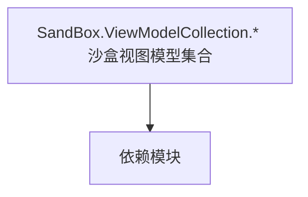

# SandBox.ViewModelCollection.* 沙盒视图模型集合

**一句话职责：** 本页以家族索引形式覆盖 `SandBox.ViewModelCollection.* 沙盒视图模型集合` 下全部 94 个业务类型，逐类给出命名空间、职责与典型时机，便于按模块而不是按字母表查阅。

## 心智模型

SandBox.ViewModelCollection.* 是沙盒模块最庞大的视图模型集合，覆盖地图（MapSiege/Map.Tracker/Map.Cheat/Map.Incidents/Map）、任务（Missions/NameMarker/MainAgentDetection/NameMarker.Targets/Targets.Hideout）、名牌通知（Nameplate/SettlementNotificationTypes）、存档读档（SaveLoad）、游戏结束（GameOver）、锦标赛（Tournament）、桌面游戏（BoardGame）、教程（Tutorial）、输入（Input）等。它们把沙盒各子系统的状态投影成可绑定的界面数据，VM 只是状态投影，命令应只触发 Action/Behavior。

## 何时使用

定制沙盒内任意界面的数据时，从对应 ViewModelCollection 派生；集合型 VM（地图元素/名牌）要虚拟化与按需加载以控内存。命令只触发逻辑。

## 依赖关系

`SandBox.ViewModelCollection.* 沙盒视图模型集合` 的类型依赖以下模块；缺其中任一都会导致编译或运行期失败。

- [ViewModel 视图模型](../../core-extra/ViewModel)
- [Campaign 战役](../../campaign/Campaign)
- [API 总览](../../_index)

## 类型清单

| Type | Namespace | Purpose | Timing |
| --- | --- | --- | --- |
| `MapEventVisualTypes` | SandBox.ViewModelCollection | 事件或事件处理器，承载一次发生的事情的数据；订阅要记得在卸载时退订以防泄漏。 | 战役初始化期 |
| `PerkObjectComparer` | SandBox.ViewModelCollection | 该命名空间下的业务类型，承担其派生约定职责；调用前确认其生命周期与所属系统，不要在错误阶段引用未就绪的实例。 | 战役初始化期 |
| `SandBoxUIHelper` | SandBox.ViewModelCollection | 该命名空间下的业务类型，承担其派生约定职责；调用前确认其生命周期与所属系统，不要在错误阶段引用未就绪的实例。 | 战役初始化期 |
| `SortState` | SandBox.ViewModelCollection | 该命名空间下的业务类型，承担其派生约定职责；调用前确认其生命周期与所属系统，不要在错误阶段引用未就绪的实例。 | 战役初始化期 |
| `SPOrderOfBattleVM` | SandBox.ViewModelCollection | Gauntlet UI 数据视图模型，向界面暴露属性与命令、响应输入并通知刷新；VM 只是状态投影，命令应只触发 Action/Behavior。 | 战役初始化期 |
| `SPScoreboardVM` | SandBox.ViewModelCollection | Gauntlet UI 数据视图模型，向界面暴露属性与命令、响应输入并通知刷新；VM 只是状态投影，命令应只触发 Action/Behavior。 | 战役初始化期 |
| `TournamentRewardVM` | SandBox.ViewModelCollection | Gauntlet UI 数据视图模型，向界面暴露属性与命令、响应输入并通知刷新；VM 只是状态投影，命令应只触发 Action/Behavior。 | 战役初始化期 |
| `BoardGameInstructionsVM` | SandBox.ViewModelCollection.BoardGame | Gauntlet UI 数据视图模型，向界面暴露属性与命令、响应输入并通知刷新；VM 只是状态投影，命令应只触发 Action/Behavior。 | 战役初始化期 |
| `BoardGameInstructionVM` | SandBox.ViewModelCollection.BoardGame | Gauntlet UI 数据视图模型，向界面暴露属性与命令、响应输入并通知刷新；VM 只是状态投影，命令应只触发 Action/Behavior。 | 战役初始化期 |
| `BoardGameVM` | SandBox.ViewModelCollection.BoardGame | Gauntlet UI 数据视图模型，向界面暴露属性与命令、响应输入并通知刷新；VM 只是状态投影，命令应只触发 Action/Behavior。 | 战役初始化期 |
| `GameOverStatCategoryVM` | SandBox.ViewModelCollection.GameOver | Gauntlet UI 数据视图模型，向界面暴露属性与命令、响应输入并通知刷新；VM 只是状态投影，命令应只触发 Action/Behavior。 | 战役初始化期 |
| `GameOverStatItemVM` | SandBox.ViewModelCollection.GameOver | Gauntlet UI 数据视图模型，向界面暴露属性与命令、响应输入并通知刷新；VM 只是状态投影，命令应只触发 Action/Behavior。 | 战役初始化期 |
| `GameOverStatsProvider` | SandBox.ViewModelCollection.GameOver | Gauntlet 图像源抽象，把实体/概念解析成实际纹理并缓存；首帧可能为空，需处理加载态。 | 战役初始化期 |
| `GameOverVM` | SandBox.ViewModelCollection.GameOver | Gauntlet UI 数据视图模型，向界面暴露属性与命令、响应输入并通知刷新；VM 只是状态投影，命令应只触发 Action/Behavior。 | 战役初始化期 |
| `StatCategory` | SandBox.ViewModelCollection.GameOver | 该命名空间下的业务类型，承担其派生约定职责；调用前确认其生命周期与所属系统，不要在错误阶段引用未就绪的实例。 | 战役初始化期 |
| `StatItem` | SandBox.ViewModelCollection.GameOver | 该命名空间下的业务类型，承担其派生约定职责；调用前确认其生命周期与所属系统，不要在错误阶段引用未就绪的实例。 | 战役初始化期 |
| `StatType` | SandBox.ViewModelCollection.GameOver | 该命名空间下的业务类型，承担其派生约定职责；调用前确认其生命周期与所属系统，不要在错误阶段引用未就绪的实例。 | 战役初始化期 |
| `InputKeyItemVM` | SandBox.ViewModelCollection.Input | Gauntlet UI 数据视图模型，向界面暴露属性与命令、响应输入并通知刷新；VM 只是状态投影，命令应只触发 Action/Behavior。 | 战役初始化期 |
| `MapEventVisualItemVM` | SandBox.ViewModelCollection.Map | Gauntlet UI 数据视图模型，向界面暴露属性与命令、响应输入并通知刷新；VM 只是状态投影，命令应只触发 Action/Behavior。 | 战役初始化期 |
| `MapEventVisualsVM` | SandBox.ViewModelCollection.Map | Gauntlet UI 数据视图模型，向界面暴露属性与命令、响应输入并通知刷新；VM 只是状态投影，命令应只触发 Action/Behavior。 | 战役初始化期 |
| `CheatActionItemVM` | SandBox.ViewModelCollection.Map.Cheat | Gauntlet UI 数据视图模型，向界面暴露属性与命令、响应输入并通知刷新；VM 只是状态投影，命令应只触发 Action/Behavior。 | 战役初始化期 |
| `CheatGroupItemVM` | SandBox.ViewModelCollection.Map.Cheat | Gauntlet UI 数据视图模型，向界面暴露属性与命令、响应输入并通知刷新；VM 只是状态投影，命令应只触发 Action/Behavior。 | 战役初始化期 |
| `CheatItemBaseVM` | SandBox.ViewModelCollection.Map.Cheat | Gauntlet UI 数据视图模型，向界面暴露属性与命令、响应输入并通知刷新；VM 只是状态投影，命令应只触发 Action/Behavior。 | 战役初始化期 |
| `GameplayCheatsVM` | SandBox.ViewModelCollection.Map.Cheat | Gauntlet UI 数据视图模型，向界面暴露属性与命令、响应输入并通知刷新；VM 只是状态投影，命令应只触发 Action/Behavior。 | 战役初始化期 |
| `MapIncidentOptionVM` | SandBox.ViewModelCollection.Map.Incidents | Gauntlet UI 数据视图模型，向界面暴露属性与命令、响应输入并通知刷新；VM 只是状态投影，命令应只触发 Action/Behavior。 | 战役初始化期 |
| `MapIncidentVM` | SandBox.ViewModelCollection.Map.Incidents | Gauntlet UI 数据视图模型，向界面暴露属性与命令、响应输入并通知刷新；VM 只是状态投影，命令应只触发 Action/Behavior。 | 战役初始化期 |
| `MapArmyTrackItemVM` | SandBox.ViewModelCollection.Map.Tracker | Gauntlet UI 数据视图模型，向界面暴露属性与命令、响应输入并通知刷新；VM 只是状态投影，命令应只触发 Action/Behavior。 | 战役初始化期 |
| `MapMarkerTrackerItemVM` | SandBox.ViewModelCollection.Map.Tracker | Gauntlet UI 数据视图模型，向界面暴露属性与命令、响应输入并通知刷新；VM 只是状态投影，命令应只触发 Action/Behavior。 | 战役初始化期 |
| `MapMobilePartyTrackItemVM` | SandBox.ViewModelCollection.Map.Tracker | Gauntlet UI 数据视图模型，向界面暴露属性与命令、响应输入并通知刷新；VM 只是状态投影，命令应只触发 Action/Behavior。 | 战役初始化期 |
| `MapTrackerCollectionVM` | SandBox.ViewModelCollection.Map.Tracker | Gauntlet UI 数据视图模型，向界面暴露属性与命令、响应输入并通知刷新；VM 只是状态投影，命令应只触发 Action/Behavior。 | 战役初始化期 |
| `MapTrackerProvider` | SandBox.ViewModelCollection.Map.Tracker | Gauntlet 图像源抽象，把实体/概念解析成实际纹理并缓存；首帧可能为空，需处理加载态。 | 战役初始化期 |
| `MachineTypes` | SandBox.ViewModelCollection.MapSiege | 该命名空间下的业务类型，承担其派生约定职责；调用前确认其生命周期与所属系统，不要在错误阶段引用未就绪的实例。 | 战役初始化期 |
| `MapSiegePOIVM` | SandBox.ViewModelCollection.MapSiege | Gauntlet UI 数据视图模型，向界面暴露属性与命令、响应输入并通知刷新；VM 只是状态投影，命令应只触发 Action/Behavior。 | 战役初始化期 |
| `MapSiegeProductionMachineVM` | SandBox.ViewModelCollection.MapSiege | Gauntlet UI 数据视图模型，向界面暴露属性与命令、响应输入并通知刷新；VM 只是状态投影，命令应只触发 Action/Behavior。 | 战役初始化期 |
| `MapSiegeProductionVM` | SandBox.ViewModelCollection.MapSiege | Gauntlet UI 数据视图模型，向界面暴露属性与命令、响应输入并通知刷新；VM 只是状态投影，命令应只触发 Action/Behavior。 | 战役初始化期 |
| `MapSiegeVM` | SandBox.ViewModelCollection.MapSiege | Gauntlet UI 数据视图模型，向界面暴露属性与命令、响应输入并通知刷新；VM 只是状态投影，命令应只触发 Action/Behavior。 | 战役初始化期 |
| `PlayerStartEngineConstructionEvent` | SandBox.ViewModelCollection.MapSiege | 事件或事件处理器，承载一次发生的事情的数据；订阅要记得在卸载时退订以防泄漏。 | 战役初始化期 |
| `POIType` | SandBox.ViewModelCollection.MapSiege | 该命名空间下的业务类型，承担其派生约定职责；调用前确认其生命周期与所属系统，不要在错误阶段引用未就绪的实例。 | 战役初始化期 |
| `SiegePOIDistanceComparer` | SandBox.ViewModelCollection.MapSiege | 该命名空间下的业务类型，承担其派生约定职责；调用前确认其生命周期与所属系统，不要在错误阶段引用未就绪的实例。 | 战役初始化期 |
| `MissionAgentAlarmStateVM` | SandBox.ViewModelCollection.Missions | Gauntlet UI 数据视图模型，向界面暴露属性与命令、响应输入并通知刷新；VM 只是状态投影，命令应只触发 Action/Behavior。 | 战斗/任务加载时 |
| `MissionAgentAlarmTargetVM` | SandBox.ViewModelCollection.Missions | Gauntlet UI 数据视图模型，向界面暴露属性与命令、响应输入并通知刷新；VM 只是状态投影，命令应只触发 Action/Behavior。 | 战斗/任务加载时 |
| `MissionArenaPracticeFightVM` | SandBox.ViewModelCollection.Missions | Gauntlet UI 数据视图模型，向界面暴露属性与命令、响应输入并通知刷新；VM 只是状态投影，命令应只触发 Action/Behavior。 | 战斗/任务加载时 |
| `MissionQuestBarVM` | SandBox.ViewModelCollection.Missions | Gauntlet UI 数据视图模型，向界面暴露属性与命令、响应输入并通知刷新；VM 只是状态投影，命令应只触发 Action/Behavior。 | 战斗/任务加载时 |
| `AgentAlarmStateEnum` | SandBox.ViewModelCollection.Missions.MainAgentDetection | 该命名空间下的业务类型，承担其派生约定职责；调用前确认其生命周期与所属系统，不要在错误阶段引用未就绪的实例。 | 战斗/任务加载时 |
| `AgentStealthOffenseType` | SandBox.ViewModelCollection.Missions.MainAgentDetection | 该命名空间下的业务类型，承担其派生约定职责；调用前确认其生命周期与所属系统，不要在错误阶段引用未就绪的实例。 | 战斗/任务加载时 |
| `MainAgentDetectionVM` | SandBox.ViewModelCollection.Missions.MainAgentDetection | Gauntlet UI 数据视图模型，向界面暴露属性与命令、响应输入并通知刷新；VM 只是状态投影，命令应只触发 Action/Behavior。 | 战斗/任务加载时 |
| `MissionDisguiseMarkerItemVM` | SandBox.ViewModelCollection.Missions.MainAgentDetection | Gauntlet UI 数据视图模型，向界面暴露属性与命令、响应输入并通知刷新；VM 只是状态投影，命令应只触发 Action/Behavior。 | 战斗/任务加载时 |
| `MissionDisguiseMarkersVM` | SandBox.ViewModelCollection.Missions.MainAgentDetection | Gauntlet UI 数据视图模型，向界面暴露属性与命令、响应输入并通知刷新；VM 只是状态投影，命令应只触发 Action/Behavior。 | 战斗/任务加载时 |
| `MissionLosingTargetVM` | SandBox.ViewModelCollection.Missions.MainAgentDetection | Gauntlet UI 数据视图模型，向界面暴露属性与命令、响应输入并通知刷新；VM 只是状态投影，命令应只触发 Action/Behavior。 | 战斗/任务加载时 |
| `INameMarkerProviderContext` | SandBox.ViewModelCollection.Missions.NameMarker | Gauntlet 图像源抽象，把实体/概念解析成实际纹理并缓存；首帧可能为空，需处理加载态。 | 战斗/任务加载时 |
| `MissionNameMarkerFactory` | SandBox.ViewModelCollection.Missions.NameMarker | 该命名空间下的业务类型，承担其派生约定职责；调用前确认其生命周期与所属系统，不要在错误阶段引用未就绪的实例。 | 战斗/任务加载时 |
| `MissionNameMarkerHelper` | SandBox.ViewModelCollection.Missions.NameMarker | 该命名空间下的业务类型，承担其派生约定职责；调用前确认其生命周期与所属系统，不要在错误阶段引用未就绪的实例。 | 战斗/任务加载时 |
| `MissionNameMarkerProvider` | SandBox.ViewModelCollection.Missions.NameMarker | Gauntlet 图像源抽象，把实体/概念解析成实际纹理并缓存；首帧可能为空，需处理加载态。 | 战斗/任务加载时 |
| `MissionNameMarkerTargetBaseVM` | SandBox.ViewModelCollection.Missions.NameMarker | Gauntlet UI 数据视图模型，向界面暴露属性与命令、响应输入并通知刷新；VM 只是状态投影，命令应只触发 Action/Behavior。 | 战斗/任务加载时 |
| `MissionNameMarkerTargetVM` | SandBox.ViewModelCollection.Missions.NameMarker | Gauntlet UI 数据视图模型，向界面暴露属性与命令、响应输入并通知刷新；VM 只是状态投影，命令应只触发 Action/Behavior。 | 战斗/任务加载时 |
| `MissionNameMarkerToggleEvent` | SandBox.ViewModelCollection.Missions.NameMarker | 事件或事件处理器，承载一次发生的事情的数据；订阅要记得在卸载时退订以防泄漏。 | 战斗/任务加载时 |
| `MissionNameMarkerVM` | SandBox.ViewModelCollection.Missions.NameMarker | Gauntlet UI 数据视图模型，向界面暴露属性与命令、响应输入并通知刷新；VM 只是状态投影，命令应只触发 Action/Behavior。 | 战斗/任务加载时 |
| `MissionAgentMarkerTargetVM` | SandBox.ViewModelCollection.Missions.NameMarker.Targets | Gauntlet UI 数据视图模型，向界面暴露属性与命令、响应输入并通知刷新；VM 只是状态投影，命令应只触发 Action/Behavior。 | 战斗/任务加载时 |
| `MissionAnimatedBasicAreaIndicatorMarkerTargetVM` | SandBox.ViewModelCollection.Missions.NameMarker.Targets | Gauntlet UI 数据视图模型，向界面暴露属性与命令、响应输入并通知刷新；VM 只是状态投影，命令应只触发 Action/Behavior。 | 战斗/任务加载时 |
| `MissionBasicAreaIndicatorMarkerTargetVM` | SandBox.ViewModelCollection.Missions.NameMarker.Targets | Gauntlet UI 数据视图模型，向界面暴露属性与命令、响应输入并通知刷新；VM 只是状态投影，命令应只触发 Action/Behavior。 | 战斗/任务加载时 |
| `MissionCommonAreaMarkerTargetVM` | SandBox.ViewModelCollection.Missions.NameMarker.Targets | Gauntlet UI 数据视图模型，向界面暴露属性与命令、响应输入并通知刷新；VM 只是状态投影，命令应只触发 Action/Behavior。 | 战斗/任务加载时 |
| `MissionGenericMarkerTargetVM` | SandBox.ViewModelCollection.Missions.NameMarker.Targets | Gauntlet UI 数据视图模型，向界面暴露属性与命令、响应输入并通知刷新；VM 只是状态投影，命令应只触发 Action/Behavior。 | 战斗/任务加载时 |
| `MissionPassageUsePointNameMarkerTargetVM` | SandBox.ViewModelCollection.Missions.NameMarker.Targets | Gauntlet UI 数据视图模型，向界面暴露属性与命令、响应输入并通知刷新；VM 只是状态投影，命令应只触发 Action/Behavior。 | 战斗/任务加载时 |
| `MissionWorkshopNameMarkerTargetVM` | SandBox.ViewModelCollection.Missions.NameMarker.Targets | Gauntlet UI 数据视图模型，向界面暴露属性与命令、响应输入并通知刷新；VM 只是状态投影，命令应只触发 Action/Behavior。 | 战斗/任务加载时 |
| `MissionStealthAreaNameMarkerTargetVM` | SandBox.ViewModelCollection.Missions.NameMarker.Targets.Hideout | Gauntlet UI 数据视图模型，向界面暴露属性与命令、响应输入并通知刷新；VM 只是状态投影，命令应只触发 Action/Behavior。 | 战斗/任务加载时 |
| `MissionStealthAreaUsePointNameMarkerTargetVM` | SandBox.ViewModelCollection.Missions.NameMarker.Targets.Hideout | Gauntlet UI 数据视图模型，向界面暴露属性与命令、响应输入并通知刷新；VM 只是状态投影，命令应只触发 Action/Behavior。 | 战斗/任务加载时 |
| `MissionStealthFailCounterVM` | SandBox.ViewModelCollection.Missions.NameMarker.Targets.Hideout | Gauntlet UI 数据视图模型，向界面暴露属性与命令、响应输入并通知刷新；VM 只是状态投影，命令应只触发 Action/Behavior。 | 战斗/任务加载时 |
| `MissionStealthSentryNameMarkerTargetVM` | SandBox.ViewModelCollection.Missions.NameMarker.Targets.Hideout | Gauntlet UI 数据视图模型，向界面暴露属性与命令、响应输入并通知刷新；VM 只是状态投影，命令应只触发 Action/Behavior。 | 战斗/任务加载时 |
| `SettlementNotificationItemBaseVM` | SandBox.ViewModelCollection.Nameplate.NameplateNotifications | Gauntlet UI 数据视图模型，向界面暴露属性与命令、响应输入并通知刷新；VM 只是状态投影，命令应只触发 Action/Behavior。 | 战役初始化期 |
| `CaravanTransactionNotificationItemVM` | SandBox.ViewModelCollection.Nameplate.NameplateNotifications.SettlementNotificationTypes | Gauntlet UI 数据视图模型，向界面暴露属性与命令、响应输入并通知刷新；VM 只是状态投影，命令应只触发 Action/Behavior。 | 战役初始化期 |
| `IssueSolvedByLordNotificationItemVM` | SandBox.ViewModelCollection.Nameplate.NameplateNotifications.SettlementNotificationTypes | Gauntlet UI 数据视图模型，向界面暴露属性与命令、响应输入并通知刷新；VM 只是状态投影，命令应只触发 Action/Behavior。 | 战役初始化期 |
| `ItemSoldNotificationItemVM` | SandBox.ViewModelCollection.Nameplate.NameplateNotifications.SettlementNotificationTypes | Gauntlet UI 数据视图模型，向界面暴露属性与命令、响应输入并通知刷新；VM 只是状态投影，命令应只触发 Action/Behavior。 | 战役初始化期 |
| `PrisonerSoldNotificationItemVM` | SandBox.ViewModelCollection.Nameplate.NameplateNotifications.SettlementNotificationTypes | Gauntlet UI 数据视图模型，向界面暴露属性与命令、响应输入并通知刷新；VM 只是状态投影，命令应只触发 Action/Behavior。 | 战役初始化期 |
| `SettlementNameplateNotificationsVM` | SandBox.ViewModelCollection.Nameplate.NameplateNotifications.SettlementNotificationTypes | Gauntlet UI 数据视图模型，向界面暴露属性与命令、响应输入并通知刷新；VM 只是状态投影，命令应只触发 Action/Behavior。 | 战役初始化期 |
| `ShipSoldNotificationItemVM` | SandBox.ViewModelCollection.Nameplate.NameplateNotifications.SettlementNotificationTypes | Gauntlet UI 数据视图模型，向界面暴露属性与命令、响应输入并通知刷新；VM 只是状态投影，命令应只触发 Action/Behavior。 | 战役初始化期 |
| `TroopGivenToSettlementNotificationItemVM` | SandBox.ViewModelCollection.Nameplate.NameplateNotifications.SettlementNotificationTypes | Gauntlet UI 数据视图模型，向界面暴露属性与命令、响应输入并通知刷新；VM 只是状态投影，命令应只触发 Action/Behavior。 | 战役初始化期 |
| `TroopRecruitmentNotificationItemVM` | SandBox.ViewModelCollection.Nameplate.NameplateNotifications.SettlementNotificationTypes | Gauntlet UI 数据视图模型，向界面暴露属性与命令、响应输入并通知刷新；VM 只是状态投影，命令应只触发 Action/Behavior。 | 战役初始化期 |
| `MapSaveVM` | SandBox.ViewModelCollection.SaveLoad | Gauntlet UI 数据视图模型，向界面暴露属性与命令、响应输入并通知刷新；VM 只是状态投影，命令应只触发 Action/Behavior。 | 战役初始化期 |
| `SavedGameGroupVM` | SandBox.ViewModelCollection.SaveLoad | Gauntlet UI 数据视图模型，向界面暴露属性与命令、响应输入并通知刷新；VM 只是状态投影，命令应只触发 Action/Behavior。 | 战役初始化期 |
| `SavedGameModuleInfoVM` | SandBox.ViewModelCollection.SaveLoad | Gauntlet UI 数据视图模型，向界面暴露属性与命令、响应输入并通知刷新；VM 只是状态投影，命令应只触发 Action/Behavior。 | 战役初始化期 |
| `SavedGameProperty` | SandBox.ViewModelCollection.SaveLoad | 该命名空间下的业务类型，承担其派生约定职责；调用前确认其生命周期与所属系统，不要在错误阶段引用未就绪的实例。 | 战役初始化期 |
| `SavedGamePropertyVM` | SandBox.ViewModelCollection.SaveLoad | Gauntlet UI 数据视图模型，向界面暴露属性与命令、响应输入并通知刷新；VM 只是状态投影，命令应只触发 Action/Behavior。 | 战役初始化期 |
| `SavedGameVM` | SandBox.ViewModelCollection.SaveLoad | Gauntlet UI 数据视图模型，向界面暴露属性与命令、响应输入并通知刷新；VM 只是状态投影，命令应只触发 Action/Behavior。 | 战役初始化期 |
| `SaveLoadVM` | SandBox.ViewModelCollection.SaveLoad | Gauntlet UI 数据视图模型，向界面暴露属性与命令、响应输入并通知刷新；VM 只是状态投影，命令应只触发 Action/Behavior。 | 战役初始化期 |
| `TournamentMatchState` | SandBox.ViewModelCollection.Tournament | 锦标赛相关类型，组织赛事报名、对阵与奖励结算；状态需可序列化。 | 战役初始化期 |
| `TournamentMatchVM` | SandBox.ViewModelCollection.Tournament | Gauntlet UI 数据视图模型，向界面暴露属性与命令、响应输入并通知刷新；VM 只是状态投影，命令应只触发 Action/Behavior。 | 战役初始化期 |
| `TournamentParticipantVM` | SandBox.ViewModelCollection.Tournament | Gauntlet UI 数据视图模型，向界面暴露属性与命令、响应输入并通知刷新；VM 只是状态投影，命令应只触发 Action/Behavior。 | 战役初始化期 |
| `TournamentPlayerState` | SandBox.ViewModelCollection.Tournament | 锦标赛相关类型，组织赛事报名、对阵与奖励结算；状态需可序列化。 | 战役初始化期 |
| `TournamentRoundVM` | SandBox.ViewModelCollection.Tournament | Gauntlet UI 数据视图模型，向界面暴露属性与命令、响应输入并通知刷新；VM 只是状态投影，命令应只触发 Action/Behavior。 | 战役初始化期 |
| `TournamentTeamVM` | SandBox.ViewModelCollection.Tournament | Gauntlet UI 数据视图模型，向界面暴露属性与命令、响应输入并通知刷新；VM 只是状态投影，命令应只触发 Action/Behavior。 | 战役初始化期 |
| `TournamentVM` | SandBox.ViewModelCollection.Tournament | Gauntlet UI 数据视图模型，向界面暴露属性与命令、响应输入并通知刷新；VM 只是状态投影，命令应只触发 Action/Behavior。 | 战役初始化期 |
| `ItemPlacements` | SandBox.ViewModelCollection.Tutorial | 该命名空间下的业务类型，承担其派生约定职责；调用前确认其生命周期与所属系统，不要在错误阶段引用未就绪的实例。 | 战役初始化期 |
| `TutorialItemVM` | SandBox.ViewModelCollection.Tutorial | Gauntlet UI 数据视图模型，向界面暴露属性与命令、响应输入并通知刷新；VM 只是状态投影，命令应只触发 Action/Behavior。 | 战役初始化期 |
| `TutorialVM` | SandBox.ViewModelCollection.Tutorial | Gauntlet UI 数据视图模型，向界面暴露属性与命令、响应输入并通知刷新；VM 只是状态投影，命令应只触发 Action/Behavior。 | 战役初始化期 |

## 风险与边界

VM 不持有规则；在 VM 中直接改状态会破坏单一数据源。地图/名牌等大量元素逐个绑定 VM 会有性能与内存压力，应虚拟化。频繁刷新属性要节流，避免每帧通知造成 GC 压力。

## 参见

- [ViewModel 视图模型](../../core-extra/ViewModel)
- [Campaign 战役](../../campaign/Campaign)
- [API 总览](../../_index)
