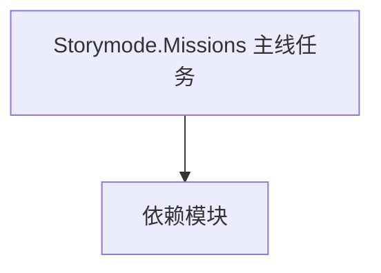

# Storymode.Missions 主线任务

**一句话职责：** 本页以家族索引形式覆盖 `Storymode.Missions 主线任务` 下全部 2 个业务类型，逐类给出命名空间、职责与典型时机，便于按模块而不是按字母表查阅。

## 心智模型

Storymode.Missions 是主线剧情（StoryMode）的任务相关类型，定义主线推进中的任务阶段、目标与结算。它与 CampaignBehavior 协作驱动叙事，但不直接写规则；任务流转通过事件与 Behavior 联动。

## 何时使用

扩展或新增主线任务阶段时，从对应任务类型派生并在 QuestManager 注册；任务流转通过事件与 Behavior 联动。

## 依赖关系

`Storymode.Missions 主线任务` 的类型依赖以下模块；缺其中任一都会导致编译或运行期失败。

- [Campaign 战役](../../campaign/Campaign)
- [CampaignBehaviorBase](../../campaign-ext/CampaignBehaviorBase)
- [API 总览](../../_index)

## 类型清单

| Type | Namespace | Purpose | Timing |
| --- | --- | --- | --- |
| `MissionState` | Storymode.Missions | 该命名空间下的业务类型，承担其派生约定职责；调用前确认其生命周期与所属系统，不要在错误阶段引用未就绪的实例。 | 战斗/任务加载时 |
| `SneakIntoTheVillaMissionController` | Storymode.Missions | 任务逻辑，定义该任务的流程与胜负条件，由 Mission 在加载时装配；胜负判定应幂等，重复触发不重复结算。 | 战斗/任务加载时 |

## 风险与边界

任务条件判定要幂等，重复触发会导致奖励翻倍或状态错乱；跨阶段任务需注意存档兼容，新增字段必须带默认值，否则旧档反序列化失败。

## 参见

- [Campaign 战役](../../campaign/Campaign)
- [CampaignBehaviorBase](../../campaign-ext/CampaignBehaviorBase)
- [API 总览](../../_index)
