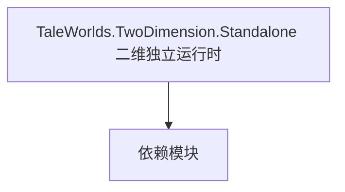

# TaleWorlds.TwoDimension.Standalone 二维独立运行时

**一句话职责：** 本页以家族索引形式覆盖 `TaleWorlds.TwoDimension.Standalone 二维独立运行时` 下全部 2 个业务类型，逐类给出命名空间、职责与典型时机，便于按模块而不是按字母表查阅。

## 心智模型

TwoDimension.Standalone 是引擎的二维独立运行时支撑类型，用于不依赖完整 3D 场景的二维界面/overlay 场景（如某些菜单背景、独立 2D 表现）。它把 2D 渲染与输入从 3D 管线中抽离，供特定界面复用。

## 何时使用

需要独立 2D 表现层（非 3D 场景）时从这里取用；不要把 3D 场景逻辑混入 2D 运行时。

## 依赖关系

`TaleWorlds.TwoDimension.Standalone 二维独立运行时` 的类型依赖以下模块；缺其中任一都会导致编译或运行期失败。

- [ViewModel 视图模型](../../core-extra/ViewModel)
- [MBSubModuleBase 模块入口](../../core/MBSubModuleBase)
- [API 总览](../../_index)

## 类型清单

| Type | Namespace | Purpose | Timing |
| --- | --- | --- | --- |
| `MatrixExtensions` | TaleWorlds.TwoDimension.Standalone | 该命名空间下的业务类型，承担其派生约定职责；调用前确认其生命周期与所属系统，不要在错误阶段引用未就绪的实例。 | 运行期 |
| `StandaloneApplicationUtility` | TaleWorlds.TwoDimension.Standalone | 该命名空间下的业务类型，承担其派生约定职责；调用前确认其生命周期与所属系统，不要在错误阶段引用未就绪的实例。 | 运行期 |

## 风险与边界

2D 运行时与 3D 场景生命周期不同，混用会导致上下文错乱；资源释放要成对，避免 2D 纹理长期驻留。

## 参见

- [ViewModel 视图模型](../../core-extra/ViewModel)
- [MBSubModuleBase 模块入口](../../core/MBSubModuleBase)
- [API 总览](../../_index)
