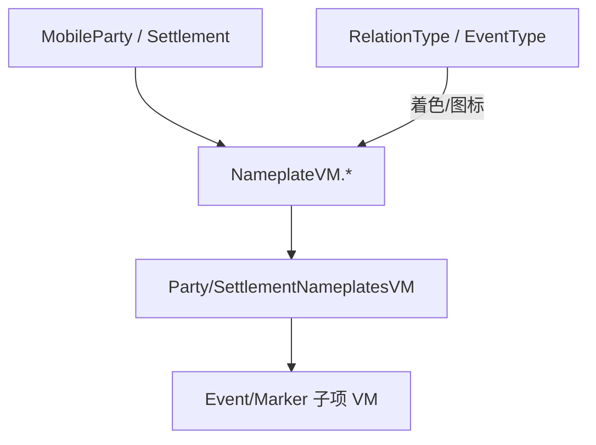

# Nameplates 家族手册

**一句话职责：** `SandBox.ViewModelCollection.Nameplate` 是战役地图（大地图）上的「浮动名称牌」视图模型层。单个 `NameplateVM` 承载一个地图对象（队伍或据点）的标签文本与样式；`PartyNameplatesVM`/`SettlementNameplatesVM` 聚合所有标签；`RelationType`/`SettlementEventType` 等枚举决定颜色与图标。它们只把已有的战役状态「翻译」成 UI 标签，不直接修改世界。

## 心智模型

把大地图上的每个队伍/据点想成「一个 NameplateVM + 一组事件/标记子项」。每帧或每次状态变化，`PartyNameplatesVM`/`SettlementNameplatesVM` 从 `MobileParty`/`Settlement` 拉取最新名称、势力关系与挂起事件，刷新对应 `NameplateVM` 的文本与颜色（`RelationType` 区分敌/友/中立）。子视图模型（`*EventItemVM`/`*PartyMarkerItemVM`）负责标签上的徽标列表。阅读顺序：先看 [GUI 总索引](../../gui/_index) 与 [View 总索引](../../view/_index) 了解 UI 分层，再看 [CampaignBehaviorBase](../../campaign-ext/CampaignBehaviorBase) 了解地图实体来源，最后回到本页按「聚合 / 队伍 / 据点 / 枚举」找类型。

## 何时使用

- 你要定制地图标签的显示（文本、颜色、事件图标）——改对应 `*VM` 的绑定，不要直接改 `MobileParty`/`Settlement` 字段。
- 新增一类地图标记——扩展对应子项 VM 与枚举（如 `SettlementEventType`），保持数据驱动。
- 名称牌是纯表现层；世界状态变更必须走战役层（`*Action`/Behavior），否则标签与真实状态会脱钩。

## 依赖关系

- 上游：[CampaignBehaviorBase](../../campaign-ext/CampaignBehaviorBase) 与战役实体（`MobileParty`/`Settlement`）提供名称牌数据源。
- 下游：标签由 Gauntlet 地图层渲染；[GUI 总索引](../../gui/_index) 与 [View 总索引](../../view/_index) 承载宿主界面。
- 邻接模块：[mission-ext 总索引](../_index)。

## Nameplate 类型（SandBox.ViewModelCollection.Nameplate）

| Type | Namespace | Purpose | Timing |
| --- | --- | --- | --- |
| `IssueTypes` | SandBox.ViewModelCollection.Nameplate | 地图上问题（Issue）名称牌类型枚举，区分不同任务提示样式。 | 标签渲染 |
| `MainQuestTypes` | SandBox.ViewModelCollection.Nameplate | 主线任务名称牌类型枚举，区分主线提示样式。 | 标签渲染 |
| `NameplateSize` | SandBox.ViewModelCollection.Nameplate | 名称牌尺寸数据/枚举，控制标签的显示大小。 | 布局时 |
| `NameplateVM` | SandBox.ViewModelCollection.Nameplate | 名称牌视图模型基类，承载一个地图对象的浮动标签文本与样式。 | 状态刷新 |
| `PartyMarkerItemComparer` | SandBox.ViewModelCollection.Nameplate | 队伍标记项的比较器，用于名称牌列表排序。 | 列表排序 |
| `PartyNameplatesVM` | SandBox.ViewModelCollection.Nameplate | 地图上所有队伍（Party）名称牌的集合视图模型。 | 每帧/变化 |
| `PartyNameplateVM` | SandBox.ViewModelCollection.Nameplate | 单个队伍（Party）名称牌视图模型（显示队伍名/领主）。 | 状态刷新 |
| `PartyPlayerNameplateVM` | SandBox.ViewModelCollection.Nameplate | 玩家队伍名称牌视图模型，高亮玩家自身标签。 | 状态刷新 |
| `RelationType` | SandBox.ViewModelCollection.Nameplate | 关系类型枚举（敌/友/中立），控制名称牌颜色。 | 着色时 |
| `SettlementEventType` | SandBox.ViewModelCollection.Nameplate | 据点事件类型枚举，区分名称牌上的事件图标。 | 图标选择 |
| `SettlementNameplateEventItemVM` | SandBox.ViewModelCollection.Nameplate | 据点名称牌上单个事件项的视图模型。 | 事件刷新 |
| `SettlementNameplatesVM` | SandBox.ViewModelCollection.Nameplate | 据点名称牌集合视图模型，管理所有据点标签。 | 每帧/变化 |
| `SettlementNameplateEventsVM` | SandBox.ViewModelCollection.Nameplate | 据点名称牌事件区的视图模型（事件图标列表）。 | 事件刷新 |
| `SettlementNameplatePartyMarkerItemVM` | SandBox.ViewModelCollection.Nameplate | 据点名称牌上队伍标记项的视图模型。 | 标记刷新 |
| `SettlementNameplatePartyMarkersVM` | SandBox.ViewModelCollection.Nameplate | 据点名称牌上队伍标记集合视图模型。 | 标记刷新 |
| `SettlementNameplateVM` | SandBox.ViewModelCollection.Nameplate | 单个据点名称牌视图模型（显示据点名/势力/事件）。 | 状态刷新 |
| `Type` | SandBox.ViewModelCollection.Nameplate | 名称牌类型枚举（区分 party/settlement/event），决定渲染分支。 | 渲染分支 |

## 风险与边界

- **表现层不写逻辑**：名称牌只翻译已有状态；在这里改 `MobileParty`/`Settlement` 会绕过实体不变量与存档边界。
- **刷新频率**：聚合 VM 每帧刷新所有标签在大地图实体多时开销大，应基于状态变化增量更新而非全量重建。
- **枚举扩展一致**：新增 `SettlementEventType`/`Type` 等枚举值必须同步 UI 分支，否则新标记不显示或报错。
- **引用失效**：队伍/据点被销毁（如解散/陷落）后，对应 VM 必须及时移除，避免悬空引用与残留标签。

## 参见

- UI 分层：[GUI 总索引](../../gui/_index)、[View 总索引](../../view/_index)
- 地图实体来源：[CampaignBehaviorBase](../../campaign-ext/CampaignBehaviorBase)
