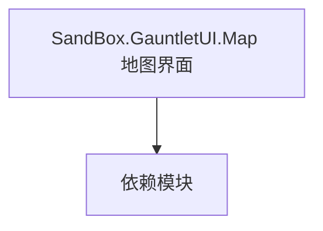

# SandBox.GauntletUI.Map 地图界面

**一句话职责：** 本页以家族索引形式覆盖 `SandBox.GauntletUI.Map 地图界面` 下全部 25 个业务类型，逐类给出命名空间、职责与典型时机，便于按模块而不是按字母表查阅。

## 心智模型

SandBox.GauntletUI.Map 是沙盒大地图（Campaign Map）的 Gauntlet 界面层：村庄/派系/部队等地图元素的 Widget 与 ViewModel。它把地图逻辑状态（来自 SandBox.View.Map）投影成可点击、可绑定的界面元素，是玩家与战略层交互的主要入口。

## 何时使用

定制大地图元素的交互/外观时，继承对应地图 Widget/VM；交互应通过事件上抛给地图逻辑，不要在界面里改战略状态。

## 依赖关系

`SandBox.GauntletUI.Map 地图界面` 的类型依赖以下模块；缺其中任一都会导致编译或运行期失败。

- [MapView 地图视图](../../campaign-ext/MapView/_index)
- [GauntletUI 总览](../_index)
- [Campaign 战役](../../campaign/Campaign)

## 类型清单

| Type | Namespace | Purpose | Timing |
| --- | --- | --- | --- |
| `GauntletHeirSelectionPopupView` | SandBox.GauntletUI.Map | Gauntlet UI 相关类型，参与界面构建与数据绑定 | 战役初始化期 |
| `GauntletMapBarGlobalLayer` | SandBox.GauntletUI.Map | Gauntlet UI 相关类型，参与界面构建与数据绑定 | 战役初始化期 |
| `GauntletMapBarView` | SandBox.GauntletUI.Map | Gauntlet UI 相关类型，参与界面构建与数据绑定 | 战役初始化期 |
| `GauntletMapBasicView` | SandBox.GauntletUI.Map | Gauntlet UI 相关类型，参与界面构建与数据绑定 | 战役初始化期 |
| `GauntletMapBattleSimulationView` | SandBox.GauntletUI.Map | Gauntlet UI 相关类型，参与界面构建与数据绑定 | 战役初始化期 |
| `GauntletMapCampaignOptionsView` | SandBox.GauntletUI.Map | Gauntlet UI 相关类型，参与界面构建与数据绑定 | 战役初始化期 |
| `GauntletMapCheatsView` | SandBox.GauntletUI.Map | 调试作弊项，通过控制台或菜单触发开发期效果 | 战役初始化期 |
| `GauntletMapConversationBarterView` | SandBox.GauntletUI.Map | Gauntlet UI 相关类型，参与界面构建与数据绑定 | 战役初始化期 |
| `GauntletMapConversationView` | SandBox.GauntletUI.Map | Gauntlet UI 相关类型，参与界面构建与数据绑定 | 战役初始化期 |
| `GauntletMapEscapeMenuView` | SandBox.GauntletUI.Map | Gauntlet UI 相关类型，参与界面构建与数据绑定 | 战役初始化期 |
| `GauntletMapEventVisual` | SandBox.GauntletUI.Map | Gauntlet UI 相关类型，参与界面构建与数据绑定 | 战役初始化期 |
| `GauntletMapEventVisualCreator` | SandBox.GauntletUI.Map | Gauntlet UI 相关类型，参与界面构建与数据绑定 | 战役初始化期 |
| `GauntletMapEventVisualsView` | SandBox.GauntletUI.Map | Gauntlet UI 相关类型，参与界面构建与数据绑定 | 战役初始化期 |
| `GauntletMapIncidentView` | SandBox.GauntletUI.Map | Gauntlet UI 相关类型，参与界面构建与数据绑定 | 战役初始化期 |
| `GauntletMapNotificationView` | SandBox.GauntletUI.Map | Gauntlet UI 相关类型，参与界面构建与数据绑定 | 战役初始化期 |
| `GauntletMapOverlayView` | SandBox.GauntletUI.Map | Gauntlet UI 相关类型，参与界面构建与数据绑定 | 战役初始化期 |
| `GauntletMapParleyAnimationView` | SandBox.GauntletUI.Map | Gauntlet UI 相关类型，参与界面构建与数据绑定 | 战役初始化期 |
| `GauntletMapPartyNameplateView` | SandBox.GauntletUI.Map | Gauntlet UI 相关类型，参与界面构建与数据绑定 | 战役初始化期 |
| `GauntletMapReadyView` | SandBox.GauntletUI.Map | Gauntlet UI 相关类型，参与界面构建与数据绑定 | 战役初始化期 |
| `GauntletMapSaveView` | SandBox.GauntletUI.Map | Gauntlet UI 相关类型，参与界面构建与数据绑定 | 战役初始化期 |
| `GauntletMapSettlementNameplateView` | SandBox.GauntletUI.Map | Gauntlet UI 相关类型，参与界面构建与数据绑定 | 战役初始化期 |
| `GauntletMapSiegeOverlayView` | SandBox.GauntletUI.Map | Gauntlet UI 相关类型，参与界面构建与数据绑定 | 战役初始化期 |
| `GauntletMapTrackersView` | SandBox.GauntletUI.Map | Gauntlet UI 相关类型，参与界面构建与数据绑定 | 战役初始化期 |
| `GauntletMarriageOfferPopupView` | SandBox.GauntletUI.Map | Gauntlet UI 相关类型，参与界面构建与数据绑定 | 战役初始化期 |
| `IGauntletMapEventVisualHandler` | SandBox.GauntletUI.Map | Gauntlet UI 相关类型，参与界面构建与数据绑定 | 战役初始化期 |

## 风险与边界

地图元素数量大，逐个绑定 VM 会有性能与内存压力；应虚拟化与按需加载。界面层只读地图状态，写入须经地图逻辑以避免状态分歧。

## 参见

- [MapView 地图视图](../../campaign-ext/MapView/_index)
- [GauntletUI 总览](../_index)
- [Campaign 战役](../../campaign/Campaign)
