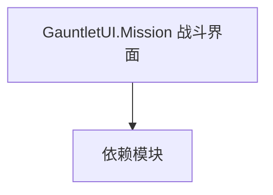

# GauntletUI.Mission 战斗界面

**一句话职责：** 本页以家族索引形式覆盖 `GauntletUI.Mission 战斗界面` 下全部 21 个业务类型，逐类给出命名空间、职责与典型时机，便于按模块而不是按字母表查阅。

## 心智模型

GauntletUI.Mission 承载战斗/任务期间的 Gauntlet 界面（HUD、击杀提示、任务目标条等）。它们以 ScreenBase + ViewModel 形式存在，由 MissionBehavior 在合适时机打开，并向玩家暴露战斗状态。界面层不持有规则，只通过 VM 属性与命令与逻辑通信。

## 何时使用

需要战斗期自定义 HUD 或提示面板时，继承对应 ScreenBase 并在 MissionBehavior 中 OpenScreen；命令应只触发 Action/Behavior，不直接改状态。

## 依赖关系

`GauntletUI.Mission 战斗界面` 的类型依赖以下模块；缺其中任一都会导致编译或运行期失败。

- [Mission 战斗场景](../../mission/Mission)
- [MBSubModuleBase](../../core/MBSubModuleBase)
- [GauntletUI 总览](../_index)

## 类型清单

| Type | Namespace | Purpose | Timing |
| --- | --- | --- | --- |
| `MissionGauntletAgentStatus` | TaleWorlds.MountAndBlade.GauntletUI.Mission | Gauntlet UI 相关类型，参与界面构建与数据绑定 | 战斗/任务加载时 |
| `MissionGauntletBoundaryCrossingView` | TaleWorlds.MountAndBlade.GauntletUI.Mission | Gauntlet UI 相关类型，参与界面构建与数据绑定 | 战斗/任务加载时 |
| `MissionGauntletCategoryLoadManager` | TaleWorlds.MountAndBlade.GauntletUI.Mission | 战斗场景可视化视图，订阅 Mission 事件并在每帧刷新表现层 | 战斗/任务加载时 |
| `MissionGauntletCrosshair` | TaleWorlds.MountAndBlade.GauntletUI.Mission | Gauntlet UI 相关类型，参与界面构建与数据绑定 | 战斗/任务加载时 |
| `MissionGauntletEscapeMenuBase` | TaleWorlds.MountAndBlade.GauntletUI.Mission | Gauntlet UI 相关类型，参与界面构建与数据绑定 | 战斗/任务加载时 |
| `MissionGauntletMainAgentCheerControllerView` | TaleWorlds.MountAndBlade.GauntletUI.Mission | 战斗场景可视化视图，订阅 Mission 事件并在每帧刷新表现层 | 战斗/任务加载时 |
| `MissionGauntletMainAgentControlModeView` | TaleWorlds.MountAndBlade.GauntletUI.Mission | 战斗场景可视化视图，订阅 Mission 事件并在每帧刷新表现层 | 战斗/任务加载时 |
| `MissionGauntletMainAgentEquipDropView` | TaleWorlds.MountAndBlade.GauntletUI.Mission | 战斗场景可视化视图，订阅 Mission 事件并在每帧刷新表现层 | 战斗/任务加载时 |
| `MissionGauntletMainAgentEquipmentControllerView` | TaleWorlds.MountAndBlade.GauntletUI.Mission | 战斗场景可视化视图，订阅 Mission 事件并在每帧刷新表现层 | 战斗/任务加载时 |
| `MissionGauntletOptionsUIHandler` | TaleWorlds.MountAndBlade.GauntletUI.Mission | 战斗场景可视化视图，订阅 Mission 事件并在每帧刷新表现层 | 战斗/任务加载时 |
| `MissionGauntletAgentLockVisualizerView` | TaleWorlds.MountAndBlade.GauntletUI.Mission.Singleplayer | Gauntlet UI 相关类型，参与界面构建与数据绑定 | 战斗/任务加载时 |
| `MissionGauntletBattleScore` | TaleWorlds.MountAndBlade.GauntletUI.Mission.Singleplayer | 战斗场景可视化视图，订阅 Mission 事件并在每帧刷新表现层 | 战斗/任务加载时 |
| `MissionGauntletFormationMarker` | TaleWorlds.MountAndBlade.GauntletUI.Mission.Singleplayer | Gauntlet UI 相关类型，参与界面构建与数据绑定 | 战斗/任务加载时 |
| `MissionGauntletKillNotificationSingleplayerUIHandler` | TaleWorlds.MountAndBlade.GauntletUI.Mission.Singleplayer | Gauntlet UI 相关类型，参与界面构建与数据绑定 | 战斗/任务加载时 |
| `MissionGauntletLeaveView` | TaleWorlds.MountAndBlade.GauntletUI.Mission.Singleplayer | 战斗场景可视化视图，订阅 Mission 事件并在每帧刷新表现层 | 战斗/任务加载时 |
| `MissionGauntletOrderOfBattleUIHandler` | TaleWorlds.MountAndBlade.GauntletUI.Mission.Singleplayer | 战斗场景可视化视图，订阅 Mission 事件并在每帧刷新表现层 | 战斗/任务加载时 |
| `MissionGauntletPhotoMode` | TaleWorlds.MountAndBlade.GauntletUI.Mission.Singleplayer | 战斗场景可视化视图，订阅 Mission 事件并在每帧刷新表现层 | 战斗/任务加载时 |
| `MissionGauntletSiegeEngineMarker` | TaleWorlds.MountAndBlade.GauntletUI.Mission.Singleplayer | Gauntlet UI 相关类型，参与界面构建与数据绑定 | 战斗/任务加载时 |
| `MissionGauntletSingleplayerEscapeMenu` | TaleWorlds.MountAndBlade.GauntletUI.Mission.Singleplayer | Gauntlet UI 相关类型，参与界面构建与数据绑定 | 战斗/任务加载时 |
| `MissionGauntletSingleplayerOrderUIHandler` | TaleWorlds.MountAndBlade.GauntletUI.Mission.Singleplayer | Gauntlet UI 相关类型，参与界面构建与数据绑定 | 战斗/任务加载时 |
| `MissionGauntletSpectatorControl` | TaleWorlds.MountAndBlade.GauntletUI.Mission.Singleplayer | 战斗场景可视化视图，订阅 Mission 事件并在每帧刷新表现层 | 战斗/任务加载时 |

## 风险与边界

界面层只暴露状态、不写规则；在 VM 中直接改游戏状态会破坏单一数据源。战斗期频繁刷新属性要节流，避免每帧通知造成 GC 压力。

## 参见

- [Mission 战斗场景](../../mission/Mission)
- [MBSubModuleBase](../../core/MBSubModuleBase)
- [GauntletUI 总览](../_index)
