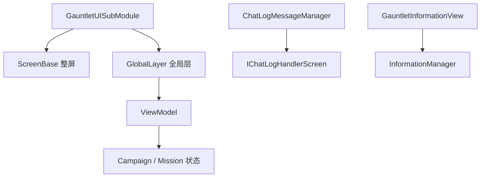

# 核心 Gauntlet UI 家族手册

**一句话职责：** `TaleWorlds.MountAndBlade.GauntletUI` 收纳核心模块用 Gauntlet（UI 框架）实现的那一层「屏幕与全局层」：整屏（`ScreenBase`，如主菜单、选项、旗帜编辑器、视频播放）、常驻全局叠加层（`GlobalLayer`，如加载窗口、聊天日志、信息提示、通知、手柄光标）、以及配套的视图模型（`ViewModel`）与消息管理器。它们把游戏状态包装成可绑定的 UI，是玩家与战役/任务系统之间的前台界面。

## 心智模型

把 UI 想成「状态 → 视图模型（ViewModel） → Gauntlet 屏幕/层」。核心 Gauntlet UI 的类型分成三族：① 整屏（`*Screen` : `ScreenBase`），独占整个画面、带自己的 Gauntlet 电影（movie）与导航，用于主菜单、设置、旗帜编辑、视频、档案选择；② 全局层（`*View` : `GlobalLayer`），叠在游戏画面上方、常驻或多实例，用于加载窗口、聊天、信息提示、通知、摄像机淡变、版本号等；③ 视图模型（`*VM` : `ViewModel`）与消息管理器（`ChatLogMessageManager`），为上面两类提供可绑定的数据与消息队列。所有这些 UI 由 `GauntletUISubModule`（MBSubModuleBase）在模块加载时注册。阅读顺序：先看 [GauntletUISubModule](../../core/MBSubModuleBase) 与 [ViewModel 总览](../../viewmodel/) 了解 UI 如何被注册与数据如何绑定，再回本页按「整屏 / 全局层 / 视图模型」三族找具体类；需要触发文本提示时参见 [InformationManager](../../core-extra/InformationManager)。

## 何时使用

- 你要新增的是「玩家看到的整屏或叠加界面」，而不是游戏逻辑——逻辑应放在 CampaignBehavior / MissionLogic / Action 里，UI 只负责呈现与收集输入。
- 整屏之间用 GameState/GameStateManager 切换；全局层用 `GlobalLayer` 叠加，不要为常驻提示新开整屏。
- 不要在 UI 层直接改战役字段；玩家操作先回传逻辑层，由 `*Action` 或 Behavior 落地，避免绕过存档与事件边界。

## 依赖关系

- 上游：[MBSubModuleBase](../../core/MBSubModuleBase) 提供注册入口；[Campaign](../../campaign/Campaign) / [Mission](../../mission/Mission) 提供状态。
- 下游：屏幕与层由 Gauntlet 渲染；文本提示经 [InformationManager](../../core-extra/InformationManager) 汇入 `GauntletInformationView`。
- 邻接模块：[ViewModel 总览](../../viewmodel/)、[存档系统](../../save-system/SaveManager)。

## 整屏与全局层（TaleWorlds.MountAndBlade.GauntletUI）

| Type | Namespace | Purpose | Timing |
| --- | --- | --- | --- |
| `ChatLineData` | TaleWorlds.MountAndBlade.GauntletUI | 聊天消息行数据结构（文本+颜色），供聊天日志视图单行显示 | 收到聊天消息时 |
| `ChatLogMessageManager` | TaleWorlds.MountAndBlade.GauntletUI | 联机聊天消息管理器，接收、排队并按屏（IChatLogHandlerScreen）展示聊天行 | 联机聊天消息到达时 |
| `DebugStatsVM` | TaleWorlds.MountAndBlade.GauntletUI | 调试统计视图模型，暴露 FPS、内存、单位数等指标供调试 HUD 绑定 | 调试 HUD 显示时 |
| `GamepadCursorViewModel` | TaleWorlds.MountAndBlade.GauntletUI | 手柄光标视图模型，在用手柄时提供屏幕光标的移动与选中状态 | 手柄光标移动时 |
| `GauntletBannerBuilderScreen` | TaleWorlds.MountAndBlade.GauntletUI | 旗帜编辑器整屏，用 Gauntlet 提供旗帜纹章的可视化编辑与预览 | 打开旗帜编辑器时 |
| `GauntletCameraFadeView` | TaleWorlds.MountAndBlade.GauntletUI | 全局摄像机淡入淡出层，实现场景切换/过场的黑屏过渡 | 过场/淡变时 |
| `GauntletChatLogView` | TaleWorlds.MountAndBlade.GauntletUI | 全局聊天日志叠加层，在游戏画面上方显示联机聊天记录 | 联机对局中常驻 |
| `GauntletCreditsScreen` | TaleWorlds.MountAndBlade.GauntletUI | 制作人员名单整屏 | 查看制作名单时 |
| `GauntletDebugStats` | TaleWorlds.MountAndBlade.GauntletUI | 调试统计全局层，承载 DebugStatsVM 的 Gauntlet 叠加显示 | 调试叠加开启时 |
| `GauntletDefaultLoadingWindowManager` | TaleWorlds.MountAndBlade.GauntletUI | 默认加载窗口管理器，在场景/存档加载时显示加载进度层 | 加载/读档时 |
| `GauntletFullScreenNoticeView` | TaleWorlds.MountAndBlade.GauntletUI | 全屏通知层，显示重要全局提示（断线、更新） | 触发全屏通知时 |
| `GauntletGameNotification` | TaleWorlds.MountAndBlade.GauntletUI | 游戏内通知层，管理 toast/横幅类轻量通知的展示与排队 | 弹出通知时 |
| `GauntletGamepadCursor` | TaleWorlds.MountAndBlade.GauntletUI | 手柄光标全局层，渲染并驱动屏幕光标（配合 GamepadCursorViewModel） | 手柄模式下常驻 |
| `GauntletGameVersionView` | TaleWorlds.MountAndBlade.GauntletUI | 游戏版本信息全局层（角落显示版本号） | 常驻/调试时 |
| `GauntletInformationView` | TaleWorlds.MountAndBlade.GauntletUI | 信息提示全局层，承载 InformationManager 弹出的文本提示与确认框 | 调用 InformationManager 时 |
| `GauntletInitialScreen` | TaleWorlds.MountAndBlade.GauntletUI | 初始（主菜单）整屏，游戏启动后的首个 Gauntlet 界面入口 | 游戏启动/返回主菜单时 |
| `GauntletOptionsScreen` | TaleWorlds.MountAndBlade.GauntletUI | 选项设置整屏（画质/音频/控制） | 打开设置时 |
| `GauntletOrderUIHandler` | TaleWorlds.MountAndBlade.GauntletUI | 任务内指令（order）UI 处理器，用 Gauntlet 渲染编队指令菜单并下达 | 下达指令时 |
| `GauntletProfileSelectionScreen` | TaleWorlds.MountAndBlade.GauntletUI | 档案（角色存档）选择整屏 | 选择/新建存档时 |
| `GauntletQueryManager` | TaleWorlds.MountAndBlade.GauntletUI | 查询/确认对话框管理器，统一弹出是/否类询问并回收结果 | 需要用户确认时 |
| `GauntletUISubModule` | TaleWorlds.MountAndBlade.GauntletUI | Gauntlet UI 子模块入口（MBSubModuleBase），注册各屏/层与视图模型，是核心 UI 的加载点 | 游戏启动/模块加载时 |
| `GauntletVideoPlaybackScreen` | TaleWorlds.MountAndBlade.GauntletUI | 视频播放整屏（过场 CG/片头） | 播放视频时 |
| `KeybindingPopup` | TaleWorlds.MountAndBlade.GauntletUI | 按键绑定弹窗，让玩家重新映射某个操作的键位 | 改键时弹出 |
| `KeybindingPopupVM` | TaleWorlds.MountAndBlade.GauntletUI | 按键绑定弹窗的视图模型，暴露当前键位与待绑定状态 | 改键界面数据绑定 |
| `LoadingWindowViewModel` | TaleWorlds.MountAndBlade.GauntletUI | 加载窗口的视图模型，绑定加载进度与提示文本 | 加载窗口显示时 |

## 风险与边界

- **UI 不持有真相**：`*Screen`/`*View` 只呈现与收集输入，直接在其中写 `Hero`/`Settlement` 战役字段会绕过 `*Action` 的事件、缓存与存档不变量，可能坏档。
- **屏幕切换**：整屏由 GameState 管理，滥用 `ScreenManager` 直接压栈/弹栈会打断状态机；加载层必须在加载完成后正确关闭，否则卡死。
- **全局层常驻**：`GauntletChatLogView`/`GauntletGamepadCursor` 等常驻层要注意生命周期与显隐，避免重复叠加实例。
- **确认框回收**：`GauntletQueryManager` 的询问必须回收用户选择，否则调用方会一直等待结果挂起流程。
- **注册顺序**：`GauntletUISubModule` 必须在模块加载阶段注册所有屏/层，否则运行到对应入口时找不到电影（movie）会异常。

## 参见

- 注册入口：[MBSubModuleBase](../../core/MBSubModuleBase)、[InformationManager](../../core-extra/InformationManager)
- 状态来源：[Campaign](../../campaign/Campaign)、[Mission](../../mission/Mission)
- 数据绑定：[ViewModel 总览](../../viewmodel/)、[存档系统](../../save-system/SaveManager)
