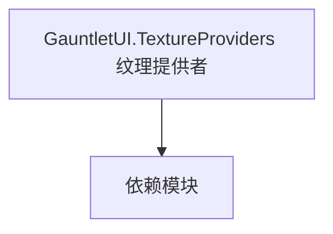

# GauntletUI.TextureProviders 纹理提供者

**一句话职责：** 本页以家族索引形式覆盖 `GauntletUI.TextureProviders 纹理提供者` 下全部 13 个业务类型，逐类给出命名空间、职责与典型时机，便于按模块而不是按字母表查阅。

## 心智模型

TextureProviders 是 Gauntlet UI 的图像源抽象：把「某个实体/概念」解析成实际纹理（头像、物品图标、旗帜等）。Widget 通过 ImageIdentifier 引用资源，由对应的 Provider 在运行期取图并缓存。它把 UI 与具体贴图路径解耦，支持按文化/阵营动态换图。

## 何时使用

自定义需要动态取图的 Widget（如自定义头像、物品图标）时，注册对应 TextureProvider 并通过 ImageIdentifier 引用。

## 依赖关系

`GauntletUI.TextureProviders 纹理提供者` 的类型依赖以下模块；缺其中任一都会导致编译或运行期失败。

- [GauntletUI 总览](../_index)
- [MBSubModuleBase](../../core/MBSubModuleBase)

## 类型清单

| Type | Namespace | Purpose | Timing |
| --- | --- | --- | --- |
| `BannerTableauTextureProvider` | TaleWorlds.MountAndBlade.GauntletUI.TextureProviders | Gauntlet UI 相关类型，参与界面构建与数据绑定 | 界面打开时 |
| `BrightnessDemoTextureProvider` | TaleWorlds.MountAndBlade.GauntletUI.TextureProviders | Gauntlet UI 相关类型，参与界面构建与数据绑定 | 界面打开时 |
| `CharacterTableauTextureProvider` | TaleWorlds.MountAndBlade.GauntletUI.TextureProviders | Gauntlet UI 相关类型，参与界面构建与数据绑定 | 界面打开时 |
| `ItemTableauTextureProvider` | TaleWorlds.MountAndBlade.GauntletUI.TextureProviders | Gauntlet UI 相关类型，参与界面构建与数据绑定 | 界面打开时 |
| `OnlineImageTextureProvider` | TaleWorlds.MountAndBlade.GauntletUI.TextureProviders | Gauntlet UI 相关类型，参与界面构建与数据绑定 | 界面打开时 |
| `SaveLoadHeroTableauTextureProvider` | TaleWorlds.MountAndBlade.GauntletUI.TextureProviders | Gauntlet UI 相关类型，参与界面构建与数据绑定 | 界面打开时 |
| `SceneTextureProvider` | TaleWorlds.MountAndBlade.GauntletUI.TextureProviders | Gauntlet UI 相关类型，参与界面构建与数据绑定 | 界面打开时 |
| `BannerImageTextureProvider` | TaleWorlds.MountAndBlade.GauntletUI.TextureProviders.ImageIdentifiers | Gauntlet UI 相关类型，参与界面构建与数据绑定 | 界面打开时 |
| `CharacterImageTextureProvider` | TaleWorlds.MountAndBlade.GauntletUI.TextureProviders.ImageIdentifiers | Gauntlet UI 相关类型，参与界面构建与数据绑定 | 界面打开时 |
| `CraftingPieceImageTextureProvider` | TaleWorlds.MountAndBlade.GauntletUI.TextureProviders.ImageIdentifiers | Gauntlet UI 相关类型，参与界面构建与数据绑定 | 界面打开时 |
| `ImageIdentifierTextureProvider` | TaleWorlds.MountAndBlade.GauntletUI.TextureProviders.ImageIdentifiers | Gauntlet UI 相关类型，参与界面构建与数据绑定 | 界面打开时 |
| `ItemImageTextureProvider` | TaleWorlds.MountAndBlade.GauntletUI.TextureProviders.ImageIdentifiers | Gauntlet UI 相关类型，参与界面构建与数据绑定 | 界面打开时 |
| `PlayerAvatarImageTextureProvider` | TaleWorlds.MountAndBlade.GauntletUI.TextureProviders.ImageIdentifiers | Gauntlet UI 相关类型，参与界面构建与数据绑定 | 界面打开时 |

## 风险与边界

取图是异步/缓存操作，首帧可能为空；控件需处理加载态。Provider 返回大图要控制缓存上限，否则长期运行内存膨胀。

## 参见

- [GauntletUI 总览](../_index)
- [MBSubModuleBase](../../core/MBSubModuleBase)
