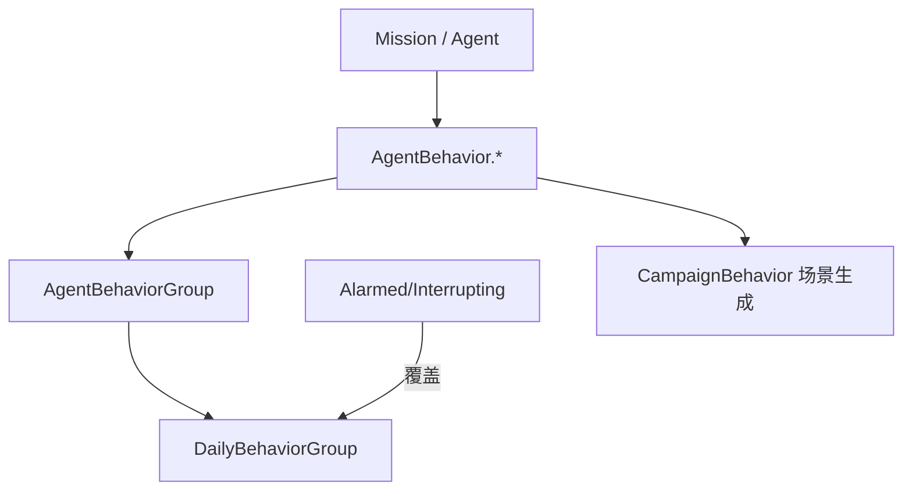

# Agent Behaviors 家族手册

**一句话职责：** `SandBox.Missions.AgentBehaviors` 是城镇、村庄、据点等「场景内 NPC」的 AI 行为集合。基类 `AgentBehavior` 定义每帧更新与事件钩子；具体行为（行走、交谈、巡逻、逃跑、战斗……）被组织进 `AgentBehaviorGroup` / `DailyBehaviorGroup` 等分组，由任务逻辑按场景状态启用，决定平民与卫兵在场景里怎么动、怎么互动。

## 心智模型

把一次城镇任务想成「一组 NPC + 各自的行为树 + 一个日程调度器」。每个 NPC 持有一个或多个 `AgentBehavior`，每帧由 `MissionLogic`/行为管理器驱动更新；`DailyBehaviorGroup` 按时间线切换「工作/休息/巡逻」，`AlarmedBehaviorGroup`/`InterruptingBehaviorGroup` 在受惊时插队覆盖日常行为。行为之间不直接改战役字段，只通过 `Agent` 的瞬时状态（位置、朝向、动画）表现。阅读顺序：先看 [Mission](../../mission/Mission) 与 [Agent](../../mission/Agent) 了解代理生命周期，再看 [CampaignBehaviorBase](../../campaign-ext/CampaignBehaviorBase) 了解场景 NPC 如何被行为系统生成，最后回到本页按「移动 / 社交 / 防御 / 调度」分类找行为。

## 何时使用

- 你要改变的是「场景内 NPC 的临场表现」（走哪、说什么、是否逃跑），而不是战役世界状态。
- 自定义场景 AI 时继承 `AgentBehavior` 并只订阅关心的事件；不要直接在行为里写 `Hero`/`Settlement`/`MobileParty` 的战役字段。
- 行为必须可被日程/惊动系统启用与打断；设计新行为时预留中断点，避免 NPC 卡死在单一状态。

## 依赖关系

- 上游：[Mission](../../mission/Mission) 与 [Agent](../../mission/Agent) 提供场景与实体状态；[CampaignBehaviorBase](../../campaign-ext/CampaignBehaviorBase) 的子类负责把 NPC 与行为装配进场景。
- 下游：行为驱动 `Agent` 的瞬时移动/动画；冲突结果通常交回战役层（`*Action`/事件）。
- 邻接模块：[mission-ext 总索引](../_index) 与本页同级 [MissionLogics](../MissionLogics/)。

## Agent Behavior 类型（SandBox.Missions.AgentBehaviors）

| Type | Namespace | Purpose | Timing |
| --- | --- | --- | --- |
| `AgentBehavior` | SandBox.Missions.AgentBehaviors | 场景内 NPC 行为树基类，定义每帧更新与事件钩子的统一契约。 | 行为生命周期 |
| `AgentBehaviorGroup` | SandBox.Missions.AgentBehaviors | 把多个相关 AgentBehavior 组合成一个可启用/禁用的行为组。 | 行为组切换 |
| `AlarmedBehaviorGroup` | SandBox.Missions.AgentBehaviors | NPC 进入警觉状态时启用的一组行为（如逃跑/戒备），对应被惊动的反应。 | 受惊时 |
| `BehaviorSets` | SandBox.Missions.AgentBehaviors | 预定义行为集合，按场景/职业选取并装配到 NPC。 | 初始化 |
| `CautiousBehavior` | SandBox.Missions.AgentBehaviors | 谨慎行为：NPC 降低移动速度、保持距离、避免冲突的保守行动。 | 遇险/警戒 |
| `ChangeLocationBehavior` | SandBox.Missions.AgentBehaviors | 移动 NPC 到新位置（换点/转移）的行为。 | 调度切换 |
| `DailyBehaviorGroup` | SandBox.Missions.AgentBehaviors | 按一天时间线调度的一组日常行为（工作/休息/巡逻），驱动 NPC 日程。 | 每帧/按时段 |
| `EscortAgentBehavior` | SandBox.Missions.AgentBehaviors | 护送行为：NPC 跟随被护送目标并保持在附近。 | 护送中 |
| `FightBehavior` | SandBox.Missions.AgentBehaviors | 战斗行为：NPC 进入攻击/防守交战状态。 | 遭遇敌人 |
| `FleeBehavior` | SandBox.Missions.AgentBehaviors | 逃跑行为：NPC 逃离威胁源（敌人/危险区域）。 | 受威胁 |
| `FollowAgentBehavior` | SandBox.Missions.AgentBehaviors | 跟随行为：NPC 持续跟随某目标 Agent 并保持间距。 | 跟随中 |
| `IdleAgentBehavior` | SandBox.Missions.AgentBehaviors | 待机行为：NPC 在原地/随机小范围闲晃，无明确目标。 | 空闲时 |
| `InterruptingBehaviorGroup` | SandBox.Missions.AgentBehaviors | 可打断当前行为、插队执行高优先级反应的行为组（如被惊动）。 | 高优先事件 |
| `NotableSpawnPointHandler` | SandBox.Missions.AgentBehaviors | 处理城镇要人（Notable）刷新点，决定要人 NPC 在场景中的位置与生成。 | 场景加载 |
| `PatrolAgentBehavior` | SandBox.Missions.AgentBehaviors | 巡逻行为：NPC 沿巡逻路线循环移动。 | 巡逻中 |
| `PatrollingGuardBehavior` | SandBox.Missions.AgentBehaviors | 巡逻卫兵行为：卫兵沿固定路线巡视并响应附近威胁。 | 站岗巡逻 |
| `ScriptBehavior` | SandBox.Missions.AgentBehaviors | 由脚本/任务逻辑驱动的行为，执行外部指定的动作序列。 | 脚本触发 |
| `StandGuardBehavior` | SandBox.Missions.AgentBehaviors | 站岗行为：NPC 固定在岗哨位置警戒。 | 警戒时 |
| `TalkBehavior` | SandBox.Missions.AgentBehaviors | 交谈行为：NPC 走向并与其他 Agent 对话/互动。 | 社交触发 |
| `WalkingBehavior` | SandBox.Missions.AgentBehaviors | 行走行为：NPC 在路径点间移动的基础行走。 | 移动中 |

## 风险与边界

- **不要改战役字段**：行为里直接写 `Hero`/`Settlement`/`MobileParty` 会绕过 `*Action` 的事件、缓存与存档不变量，可能导致坏档或地图状态不一致。
- **Agent 生命周期**：任务结束/撤离后 `Agent` 引用失效；订阅 Agent 事件的行为必须在 `OnMissionEnd` 前退订，避免悬空回调。
- **行为死锁**：新行为必须预留中断点；若某行为不响应 `InterruptingBehaviorGroup`，NPC 会卡死在单一状态。
- **重复进入场景**：再次进入同类场景时，行为组需能清理旧状态，否则会出现重复 NPC 或残留动画。

## 参见

- 代理与任务：[Agent](../../mission/Agent)、[Mission](../../mission/Mission)
- 场景 NPC 生成：[CampaignBehaviorBase](../../campaign-ext/CampaignBehaviorBase)
- 行为编排上层：[MissionLogics](../MissionLogics/)
