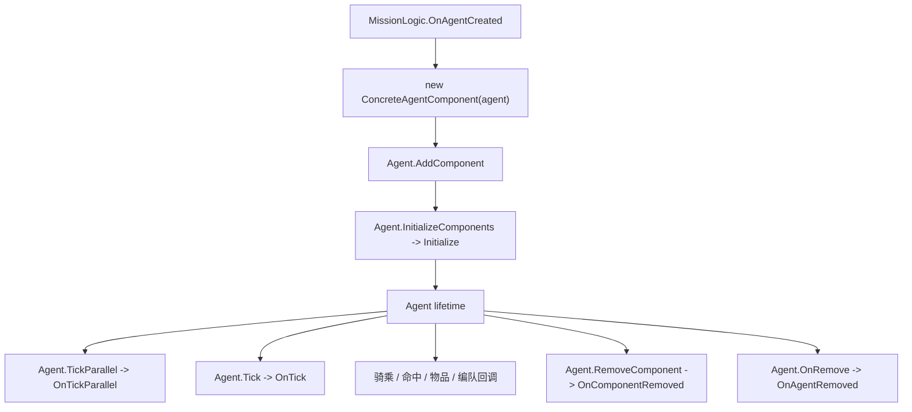

# AgentComponent

**Namespace:** `TaleWorlds.MountAndBlade`  
**Module:** `TaleWorlds.MountAndBlade`  
**Type:** `public abstract class AgentComponent`  
**Base:** 无  
**Source:** `bin/TaleWorlds.MountAndBlade/TaleWorlds.MountAndBlade/AgentComponent.cs`

## 一句话职责

`AgentComponent` 是绑定到一个存活 `Agent` 的 Mission 期扩展点；`Agent` 持有组件列表，并把生命周期、tick、战斗、装备、骑乘、编队和移除回调转发给每个组件。

## 心智模型：每个 Agent 的回调插槽

它不是全局服务、`MissionBehavior` 或存档对象。Mission 侧逻辑用一个 `Agent` 创建具体组件，调用 `Agent.AddComponent`；组件列表准备好后，`Agent` 才会在合适阶段调用 `Initialize`。在 Agent 存活期间，`Agent.TickParallel` 和 `Agent.Tick` 分别分发两个 tick 通道，原生和 Mission 回调分发事件方法；`Agent.OnRemove` 调用 `OnAgentRemoved`，标志着组件不应再使用该 Agent。

基类用 protected 字段保存所属 `Agent`。因此组件是 Agent 的短寿命子对象，不是 Agent 或 Mission 的独立持有者。`Agent.GetComponent<T>()` 返回第一个匹配组件；`Agent.Components` 暴露只读组件列表，`CommonAIComponent` 等系统会读取它。



## 何时使用，何时不要使用

**适合使用：**

- 一个 Agent 需要随 Agent 一起销毁的局部状态或回调；
- Mission 功能需要处理单个 Agent 的骑乘、拾取、武器耐久、士气贡献、AI 输入、编队变化或 Agent 移除；
- Mission 逻辑可以在 `OnAgentCreated` 创建组件，或在已打开的 Mission 中通过 `Mission.AddMissionBehavior` 和 `Agent.AddComponent` 接入。

**不要使用：**

- 行为属于整个场景时；应继承 [`MissionBehavior`](../../mission/MissionBehavior) 或 [`MissionLogic`](../MissionLogic)；
- 状态必须跨存档或跨 Mission 时；应在 [`CampaignBehaviorBase`](../../campaign/CampaignBehaviorBase) 中用 `SyncData` 保存；
- 需要全局模块或战役钩子时；使用 [`MBSubModuleBase`](../../core/MBSubModuleBase) 或 Campaign 事件；
- 只是要从外部观察 Agent 死亡时；用 [`MissionBehavior.OnAgentRemoved`](../../mission/MissionBehavior)，因为它能同时提供 affector、`AgentState` 和 `KillingBlow`。

添加组件不会使它成为 `MissionBehavior`，不会立刻调用 `Initialize`，也不会按类型去重。如果 mod 添加两个同一具体类型的组件，`GetComponent<T>()` 只返回第一个，但两个实例都会收到 Agent 转发的回调。

## 依赖与回调边界

**上游**

- [`Agent`](../../mission/Agent) 持有 `_components`，负责添加、移除和转发回调。
- [`Mission`](../../mission/Mission) 持有场景，并决定 Agent 创建、tick、骑乘、命中和移除的阶段。
- [`MissionLogic`](../MissionLogic) 或其他 [`MissionBehavior`](../../mission/MissionBehavior) 是通常的注册边界。

**下游**

- [`CommonAIComponent`](../CommonAIComponent) 消费 `GetMoraleAddition`，执行 AI 士气与撤退逻辑，并在移除时清理坐骑预留。
- [`HumanAIComponent`](../HumanAIComponent) 使用 tick、撤退、骑乘和移除回调处理人类 AI 与坐骑预留。
- [`CampaignAgentComponent`](../../campaign-ext/CampaignAgentComponent) 使用 `OnTick`、`OnStopUsingGameObject` 和士气钩子，把 Campaign/Sandbox 行为桥接到 Mission Agent。
- [`MPPerksAgentComponent`](../MPPerksAgentComponent) 使用骑乘、拾取、丢武器和移除回调维护 perk 订阅。
- [`VictoryComponent`](../VictoryComponent) 是 `AgentVictoryLogic` 创建的短寿命组件，其计时器由所属 Mission 逻辑检查。
- [`ScriptedMovementComponent`](../ScriptedMovementComponent) 持有 Mission 内目标，并在 `OnTick` 中更新 scripted movement。

`AgentComponent` 本身没有存档契约，也没有 Campaign 事件分发契约。派生组件可以在构造器中订阅 Agent 事件，但必须根据实际释放者在 `OnAgentRemoved` 或 `OnComponentRemoved` 中取消订阅。不要假设基类会替你解绑。

## 注册与生命周期

### protected 构造器

`protected AgentComponent(Agent agent)` 保存所属 Agent。mod 应创建具体派生类，而不是创建抽象基类。构造器执行时组件还没有进入 `Agent.Components`，因此不要假定其他组件已经初始化，也不要在这里使用必须等 Agent 完整 build 后才存在的 Mission 状态。

### `Agent.AddComponent`

`Agent.AddComponent(AgentComponent)` 把实例追加到组件列表。源码只在添加确切的 `CommonAIComponent` 或 `HumanAIComponent` 时更新 Agent 的快捷引用；它不会调用 `Initialize`，也不会拒绝重复实例。引擎和 Mission 逻辑用这条路径添加 AI、perk、胜利反应和 scripted movement 组件。

### `Initialize()`

默认实现为空。`Agent.InitializeComponents()` 在组件列表组装后遍历调用它。把依赖 Agent 完整 build 的初始化放在这里，而不要把可能在构造器失败时泄漏的生命周期订阅全部塞进构造器。

### `Agent.GetComponent<T>()` 与 `Agent.Components`

`GetComponent<T>()` 返回第一个可赋值给 `T` 的组件，没有则返回 `null`；`Components` 是只读列表。可选组件使用 typed lookup 并检查 `null`。只有确实需要聚合契约时才遍历列表，例如 `CommonAIComponent.Initialize` 会把所有组件的士气增量相加。

### `Agent.RemoveComponent`

`Agent.RemoveComponent(component)` 移除指定实例，然后调用该实例的 `OnComponentRemoved`。它不会调用 `OnAgentRemoved`。Agent 从 AI 控制切换时的逻辑就使用这条边界。因此显式组件移除和整个 Agent 移除都可能发生，清理逻辑必须兼容两条路径。

## 按阶段说明回调成员

基类的普通实现都是空操作，只有 `GetMoraleAddition` 返回 `0f`，`GetMoraleDecreaseConstant` 返回 `1f`。只覆盖组件真正拥有的回调；其中很多回调会对每个存活 Agent 或每帧执行，必须保持轻量。

### 初始化与 tick

| 成员 | 用途与副作用 | 时机边界 |
| --- | --- | --- |
| `Initialize()` | 建立每 Agent 缓存，或订阅依赖完整组件组装的资源。 | 由 `Agent.InitializeComponents` 调用，不是由 `AddComponent` 立即调用。 |
| `OnTick(float dt)` | 执行属于该 Agent 的普通 Mission 线程逐帧工作；`ScriptedMovementComponent` 在这里更新目标和移动。 | Agent 和 Mission tick 必须仍然有效；不要在这里执行 Campaign 存档变更。 |
| `OnTickParallel(float dt)` | 执行 Agent 并行 tick 通道的工作，例如 `CommonAIComponent` 的士气恢复与撤退检查。 | 把它当作并行边界：不要访问 UI、修改 Campaign 单例或无锁写共享 mod 状态。 |

### 士气与战斗

| 成员 | 用途与副作用 | 时机边界 |
| --- | --- | --- |
| `GetMoraleAddition()` | 返回该组件对初始士气的增量。`CommonAIComponent.Initialize` 会汇总所有组件结果，再交给 `BattleMoraleModel`。 | 只返回数值，不要从这个查询方法写士气；默认值为 `0f`。 |
| `GetMoraleDecreaseConstant()` | 提供组件特有的士气下降系数，`CampaignAgentComponent` 会按围城攻城方/守方上下文实现它。 | 它是规则输入，不是修改士气的命令；默认值为 `1f`，覆盖实现读取的所属 Party/MapEvent 必须有效。 |
| `OnHit(Agent affectorAgent, int damage, in MissionWeapon affectorWeapon, in Blow b, in AttackCollisionData collisionData)` | 在命中数据仍可用时响应攻击；`CommonAIComponent` 会在无骑手的 AI 坐骑受伤时触发 panic。 | 回调应局部且轻量；不要保存 `in` 参数，也不要把一次命中当作死亡完成。 |
| `OnDisciplineChanged()` | Agent discipline 改变时刷新组件局部状态。 | 这是 Agent 回调，不是 Campaign 事件。 |

### 装备、骑乘与场景交互

| 成员 | 用途与副作用 | 时机边界 |
| --- | --- | --- |
| `OnItemPickup(SpawnedItemEntity item)` | 观察拾取物品；`MPPerksAgentComponent` 会检查拾取武器是否是旗帜并触发 perk 事件。 | `item` 是 Mission 对象，应立即读取，不要保存原生实体引用。 |
| `OnWeaponDrop(MissionWeapon droppedWeapon)` | 观察丢弃武器；perk 组件用它识别丢弃旗帜。 | 参数来自当前装备操作，不是修改 roster 的 API。 |
| `OnWeaponHPChanged(ItemObject item, int hitPoints)` | Agent 修改装备槽耐久后响应。 | `ItemObject` 属于当前装备图；不要借此绕过装备写入或网络同步。 |
| `OnStopUsingGameObject()` | Agent 停止使用 usable object 后释放组件状态；`CampaignAgentComponent` 会在 AI Agent 上把边界传给 `AgentNavigator`。 | Mission 对象可能已经进入停止使用清理，不要在这里发起第二次交互。 |
| `OnMount(Agent mount)` | Agent 骑乘时更新状态；perk 组件订阅坐骑生命变化，Human AI 调整移动限制。 | `mount` 只在此回调附近可靠；骑手或坐骑移除时必须解除事件订阅。 |
| `OnDismount(Agent mount)` | 反向解除骑乘订阅或移动调整。 | `mount` 可能正在移除；读取当前状态，不要跨 Mission 保存它。 |
| `OnRetreating()` | 撤退开始时调整该 Agent 的行为；Human AI 会在此降低速度限制。 | 这是 Mission 状态通知，不是发起撤退的命令；发起撤退应走 Agent/Common AI 契约。 |
| `OnAgentTeleported()` | Agent 传送后重建临时空间状态。 | 回调后重新读取位置和场景句柄；缓存的原生位置可能过期。 |
| `OnFormationSet()` | Agent 分配到 Formation 后同步组件状态。 | 回调发生在编队赋值之后；移除流程中 Formation 仍可能为 `null`，不要假定永久归属。 |

### AI 输入与清理

| 成员 | 用途与副作用 | 时机边界 |
| --- | --- | --- |
| `OnAIInputSet(ref Agent.EventControlFlag eventFlag, ref Agent.MovementControlFlag movementFlag, ref Vec2 inputVector)` | 在 Agent 应用本帧 AI 控制值前检查或调整它们。 | `ref` 值是当前帧控制契约；修改应局部，不要在这里访问 UI 或 Campaign。 |
| `OnAgentRemoved()` | Agent 被 `Agent.OnRemove` 从 Mission 参与状态移除时释放订阅和 per-Agent 引用。 | 它晚于部分 Team/Formation 清理，早于原生对象完全不可用；需要持久信息时先复制稳定 ID，然后停止使用 Agent。 |
| `OnComponentRemoved()` | 该实例通过 `Agent.RemoveComponent` 被显式移除时释放资源。 | 它不是 Agent 死亡回调；若两条路径都可能释放同一资源，清理必须幂等。 |

## 真实注册与获取示例

下面使用真实 Mission 路径：`MissionLogic` 收到 `OnAgentCreated`，通过 `Agent.AddComponent` 添加具体组件，再通过 `Agent.GetComponent<T>()` 获取它。Mission 已打开时可以用 `Mission.Current.AddMissionBehavior` 动态添加；Mission 工厂也可以在初始 behavior 数组中加入该逻辑。

```csharp
using TaleWorlds.MountAndBlade;

public sealed class PickupAuditComponent : AgentComponent
{
    private bool _removed;

    public PickupAuditComponent(Agent agent)
        : base(agent)
    {
    }

    public override void OnItemPickup(SpawnedItemEntity item)
    {
        if (_removed || item == null)
        {
            return;
        }

        // 这里只复制稳定数据，不保存原生 item 实体。
        string itemId = item.WeaponCopy.Item?.StringId;
        _ = itemId;
    }

    public override void OnAgentRemoved()
    {
        _removed = true;
    }

    public override void OnComponentRemoved()
    {
        _removed = true;
    }
}

public sealed class PickupAuditLogic : MissionLogic
{
    public override void OnAgentCreated(Agent agent)
    {
        base.OnAgentCreated(agent);
        if (agent.IsHuman && agent.GetComponent<PickupAuditComponent>() == null)
        {
            agent.AddComponent(new PickupAuditComponent(agent));
        }

        PickupAuditComponent component = agent.GetComponent<PickupAuditComponent>();
        _ = component;
    }
}

// 只在 Mission 存活期间运行。
Mission.Current.AddMissionBehavior(new PickupAuditLogic());
```

示例中的重复检查是有意的：`AddComponent` 本身不会保证每个类型只有一个实例。如果组件是在 Agent 已创建后才加入，就要枚举当前 Mission 的 Agent 并逐个添加；之后的新 Agent 通过 `OnAgentCreated` 接入。功能结束时用 `Agent.RemoveComponent` 移除组件，让 `OnComponentRemoved` 在 Agent 消失前释放资源。

## 崩溃与存档边界

- **生命周期错误：** `AgentComponent` 不是存档参与者。应在 Campaign behavior 中保存稳定的角色或 roster 身份，并在后续 Mission 重新获取当前 Agent；绝不要序列化 protected Agent 引用。
- **阶段错误：** 构造器、`Initialize`、普通 tick 和移除回调的保证不同。`Mission.Current`、`Agent.Mission`、Team、Formation、坐骑和场景句柄在不同回调中可能不存在或已进入清理。
- **Agent/坐骑过期引用：** `OnAgentRemoved`、`OnAgentDeleted` 或 Mission 结束后，延迟任务、静态缓存和下一场 Mission 都不能使用旧的原生 Agent 引用。移除时解除坐骑和 Agent 事件。
- **显式移除路径不同：** `RemoveComponent` 调用的是 `OnComponentRemoved`，不是 `OnAgentRemoved`。如果只在一个方法清理，控制器切换或功能关闭就会泄漏订阅。
- **并行 tick 误用：** `OnTickParallel` 不应访问 UI、无锁写共享 Campaign 状态，或调用假定主 Mission 线程的代码；只做线程安全计算和组件局部状态更新。
- **重复组件：** `AddComponent` 直接追加，重复派生类型可能让士气被重复计算、事件被处理两次，并使 `GetComponent<T>()` 返回的实例不是调用方以为的那个。
- **保存原生对象：** `SpawnedItemEntity`、`MissionWeapon` 上下文、Agent、Formation 和 usable 场景对象都只在 Mission 期有效。移除前复制稳定的基础值或字符串 ID，不要把原生句柄带进存档或下一场 Mission。
- **跨层修改：** Agent 回调不是 Action 或 Campaign 事件边界。不要因为 Agent 发生某个事件，就从组件回调直接改 Party 所属、关系、金钱或存档数据。

## 版本说明

本文以 v1.4.5 的 `TaleWorlds.MountAndBlade.AgentComponent` 和 `Agent` 源码为准。早期版本也有组件模式，但派生组件集合、回调顺序、AI 逻辑和 Agent 构建路径可能不同；跨版本使用前必须重新核对目标版本的回调和 Agent 属性。

## 参见与双向导航

- **↑ Parent：** [Mission 扩展 API](../)
- **↔ Sibling：** [Agent](../../mission/Agent) · [Mission](../../mission/Mission) · [MissionBehavior](../../mission/MissionBehavior) · [MissionLogic](../MissionLogic)
- **派生组件：** [CommonAIComponent](../CommonAIComponent) · [HumanAIComponent](../HumanAIComponent) · [CampaignAgentComponent](../../campaign-ext/CampaignAgentComponent) · [MPPerksAgentComponent](../MPPerksAgentComponent)
- **相关生命周期：** [MissionObject](../MissionObject) · [AgentNavigator](../../gameplay/AgentNavigator) · [AgentComponentExtensions](../AgentComponentExtensions)
- **架构：** [崩溃边界](../../../architecture/crash-boundary) · [SDK 总览](../../../architecture/sdk-overview)
