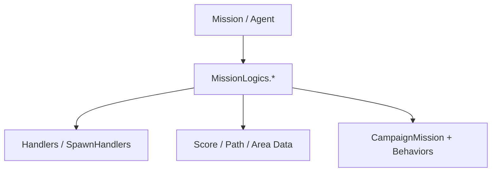

# Mission Logics 家族手册

**一句话职责：** `SandBox.Missions.MissionLogics` 收纳 SandBox 在各类任务（Mission）中实际运行的逻辑与数据：从战斗、潜行、围城到室内与据点交互。它们是 Mission 生命周期内的「行为编排层」，区别于战役层（Campaign）的 Behavior 与 Action。

## 心智模型

把一次任务想成「场景 + 一组 MissionLogic + 一组 Agent」。MissionLogic 在 `OnMissionStart` / `OnMissionTick` / 各事件回调里读取 Mission 与 Agent 状态、驱动演出、并在结束时把结果交回战役层（通常通过 `*Action` 或 Behavior 事件）。MissionLogic 之间不直接互相改字段，而是通过 Mission 上的 `MissionLogic` 列表、共享的 `Mission` 状态与任务内事件通信。阅读顺序建议先看 [Mission](../../mission/Mission) 与 [CampaignMission](../../campaign-ext/CampaignMission) 了解 Mission 如何被创建，再回到本页按任务类型找对应的 Logic；涉及 Agent 时参见 [Agent](../../mission/Agent)。需要战役层承接结果时，跳到 [Behaviors](../) 与对应的 Action。

## 何时使用

- 你要改变的是「任务进行中」的状态（刷怪、巡逻、潜行暴露、对话衔接、撤离），而不是战役世界状态。
- 优先用引擎/Mission 提供的现成 MissionLogic；需要新行为时继承 `MissionLogic`（或对应基类）并只订阅自己关心的事件。
- 不要在 MissionLogic 里直接改 `Hero`/`Settlement`/`MobileParty` 的战役字段——任务结束应走 `*Action` 或 Behavior 事件，否则会绕过存档与事件边界。

## 依赖关系

- 上游：[Mission](../../mission/Mission)、[CampaignMission](../../campaign-ext/CampaignMission) 与 [Agent](../../mission/Agent) 提供场景与实体状态。
- 下游：任务结束结果交回 [Behaviors](../) 与对应 `*Action`；名册、地图视觉与存档由战役层消费。
- 邻接模块：[mission-ext 总索引](../_index) 与 [campaign-ext/behaviors](../../campaign-ext/behaviors/)。

## MissionLogic 与配套类型（SandBox.Missions.MissionLogics）

| Type | Namespace | Purpose | Timing |
| --- | --- | --- | --- |
| `AgentTrackTypes` | SandBox.Missions.MissionLogics | 枚举 Agent 在任务中可被打标签的追踪类型，供潜行/侦查逻辑区分敌我关注对象 | 潜行/侦查逻辑初始化 |
| `BattleAgentLogic` | SandBox.Missions.MissionLogics | 战斗任务里统一调度参战 Agent 的生成、编队与阵亡回收的基础逻辑 | 战斗任务开始 |
| `BattleSurgeonLogic` | SandBox.Missions.MissionLogics | 战斗任务中治疗伤员并决定其退出战斗或归队的战地医护逻辑 | 战斗进行/伤员出现 |
| `CampaignSiegeStateHandler` | SandBox.Missions.MissionLogics | 把战役层的围城状态（准备/强攻/停战）同步到当前任务的呈现与可用行为 | 围城任务装配 |
| `CombatMissionWithDialogueController` | SandBox.Missions.MissionLogics | 在带对话的战斗任务（决斗、谈判破裂）中控制对话触发与战斗开始的衔接 | 对话→战斗切换 |
| `CorpseDraggingMissionLogic` | SandBox.Missions.MissionLogics | 允许玩家在任务中拖动尸体以隐藏或挪动的物理交互逻辑 | 尸体交互时 |
| `CrossRoadScoreData` | SandBox.Missions.MissionLogics | 路口评分数据：为任务路径点选择提供十字路口的通行权重 | 路径生成时读取 |
| `DisguiseMissionLogic` | SandBox.Missions.MissionLogics | 伪装任务中管理玩家/同伴外观切换与身份暴露判定的逻辑 | 伪装进入/被识破 |
| `EnemyAgentAIDeactivationMissionLogic` | SandBox.Missions.MissionLogics | 在过场或特定阶段临时关闭敌方 Agent AI，避免干扰脚本演出 | 演出/过场阶段 |
| `HeroSkillHandler` | SandBox.Missions.MissionLogics | 在任务上下文里按英雄技能结算特殊效果（侦察、医疗加成等）的 handler | 技能触发点 |
| `HouseMissionController` | SandBox.Missions.MissionLogics | 室内（房屋/建筑内部）任务场景的进入、镜头与可交互物管理 | 进入室内场景 |
| `IMissionProgressTracker` | SandBox.Missions.MissionLogics | 任务进度追踪接口：供 MissionLogic 上报阶段完成度给上层任务系统 | 各阶段完成 |
| `IndoorMissionController` | SandBox.Missions.MissionLogics | 室内任务总控：加载内部场景、放置 NPC 与触发室内事件 | 室内任务开始 |
| `ItemCatalogController` | SandBox.Missions.MissionLogics | 任务中商品/物品目录的展示与选择（商店、战利品清单）控制 | 打开物品目录 |
| `LeaveMissionLogic` | SandBox.Missions.MissionLogics | 处理单位或玩家离开当前任务的边界逻辑（清理状态、触发撤离） | 撤离边界 |
| `LocationCharacterAgentSpawnedMissionEvent` | SandBox.Missions.MissionLogics | 场景角色生成对应 Agent 后发出的任务内事件，供其他逻辑订阅 | 角色 Agent 生成后 |
| `LocationItemSpawnHandler` | SandBox.Missions.MissionLogics | 场景物品（可拾取物）按 Location 配置生成的 handler | 场景加载/区域进入 |
| `LookBackPointData` | SandBox.Missions.MissionLogics | 回头观察点数据：标记 NPC 会转身查看的路径点，用于巡逻与警觉 | 巡逻路径配置 |
| `MissionAgentLookHandler` | SandBox.Missions.MissionLogics | 控制 Agent 视线朝向（看向目标、警戒扫视）的任务逻辑 | 每帧/警觉时 |
| `MissionAlleyHandler` | SandBox.Missions.MissionLogics | 小巷（城镇后巷）任务区域的进入与可用交互管理 | 进入后巷区域 |
| `MissionBasicTeamLogic` | SandBox.Missions.MissionLogics | 任务基础分队逻辑：建立队伍、分配阵营与初始编队的最小实现 | 任务分队建立 |
| `MissionCaravanOrVillagerTacticsHandler` | SandBox.Missions.MissionLogics | 商队/村民在遭遇任务中的逃跑、躲避或求援战术选择 | 遭遇触发时 |
| `MissionCrimeHandler` | SandBox.Missions.MissionLogics | 任务内犯罪行为（偷窃、袭击）的记录与通缉/卫兵反应触发 | 犯罪判定 |
| `MissionFightHandler` | SandBox.Missions.MissionLogics | 任务中可控战斗（竞技场、巡逻冲突）的发起、判定与结束处理 | 战斗开始/结束 |
| `MissionPathGenerationLogic` | SandBox.Missions.MissionLogics | 为任务场景生成 NPC/巡逻移动路径点的逻辑 | 场景布置阶段 |
| `MissionSettlementPrepareLogic` | SandBox.Missions.MissionLogics | 进入据点相关任务前准备据点场景状态（驻军、事件标记）的逻辑 | 据点任务准备 |
| `MountAgentLogic` | SandBox.Missions.MissionLogics | 坐骑 Agent 的生成、挂载与下马行为管理，服务于骑兵单位 | 骑兵单位生成 |
| `NavigationPathData` | SandBox.Missions.MissionLogics | 导航路径点数据：描述任务场景内可行走路径与权重，供寻路使用 | 寻路读取 |
| `PointOfInterestBaseData` | SandBox.Missions.MissionLogics | 兴趣点基类数据：标记场景中值得注意的位置及其评分 | POI 配置 |
| `PointOfInterestScorePair` | SandBox.Missions.MissionLogics | 兴趣点评分对：把某位置与其吸引力分数配对，供 AI 选择前往 | AI 选点 |
| `PointOfInterests` | SandBox.Missions.MissionLogics | 兴趣点集合容器：汇总场景内所有 POI 供任务逻辑查询与排序 | 逻辑查询 POI |
| `RetirementMissionLogic` | SandBox.Missions.MissionLogics | 退役/养老相关任务（如老兵退隐）的流程控制逻辑 | 退休剧情触发 |
| `SandBoxBattleMissionSpawnHandler` | SandBox.Missions.MissionLogics | SandBox 战斗任务中按战役上下文生成双方部队与英雄的 handler | 战斗任务生成 |
| `SandBoxMissionHandler` | SandBox.Missions.MissionLogics | SandBox 任务入口总控：根据任务类型装配对应的 MissionLogic 与场景 | 任务创建时 |
| `SandBoxMissionSpawnHandler` | SandBox.Missions.MissionLogics | SandBox 通用任务生成 handler：创建 Mission 对象并注入初始状态 | 通用任务生成 |
| `SandBoxSallyOutMissionController` | SandBox.Missions.MissionLogics | 围城时守军出城突袭（sally out）任务的触发与流程控制 | 出城突袭触发 |
| `SandBoxSiegeMissionSpawnHandler` | SandBox.Missions.MissionLogics | SandBox 攻城任务中按据点状态生成攻防双方与器械的 handler | 攻城任务生成 |
| `SandboxGeneralsAndCaptainsAssignmentLogic` | SandBox.Missions.MissionLogics | 战斗任务中分配双方主将/队长（影响指挥加成与阵型）的逻辑 | 战斗布阵阶段 |
| `SandboxHighlightsController` | SandBox.Missions.MissionLogics | 任务高亮控制器：标记可交互目标、路径提示与焦点物体 | 演出/提示时 |
| `SearchBodyMissionHandler` | SandBox.Missions.MissionLogics | 搜身/搜尸任务交互：打开尸体物品栏并结算发现物的逻辑 | 搜尸交互 |
| `ShadowingAgentOffenseInfo` | SandBox.Missions.MissionLogics | 跟踪/盯梢任务中记录被跟踪者攻击意图的情报数据 | 盯梢判定 |
| `StandingGuardSpawnData` | SandBox.Missions.MissionLogics | 固定哨兵生成数据：定义哨兵位置、朝向与警戒范围的生成参数 | 哨兵布置 |
| `StealthAreaData` | SandBox.Missions.MissionLogics | 潜行区域数据：定义某区域潜行难度、暴露速度与声光阈值 | 潜行区域配置 |
| `StealthAreaMissionLogic` | SandBox.Missions.MissionLogics | 潜行区域任务的暴露判定、警报升级与脱离逻辑 | 处于潜行区域时 |
| `StealthMissionController` | SandBox.Missions.MissionLogics | 潜行任务总控：协调潜行区域、巡逻与玩家隐蔽度 | 潜行任务全程 |
| `StealthOffenseTypes` | SandBox.Missions.MissionLogics | 潜行中被发现后的反击类型枚举（呼叫援军、直接攻击等） | 暴露结算 |
| `StealthPatrolPointMissionLogic` | SandBox.Missions.MissionLogics | 巡逻点任务逻辑：定义巡逻路线、停留与警觉反应 | 巡逻执行 |
| `UsableMachineData` | SandBox.Missions.MissionLogics | 可用机械/装置（攻城器械、机关）的数据定义与交互参数 | 装置配置 |
| `VillageMissionController` | SandBox.Missions.MissionLogics | 村庄任务（村民求援、护送）的进入与场景布置控制 | 村庄任务开始 |
| `VisitPointNodeScoreData` | SandBox.Missions.MissionLogics | 访问点节点评分数据：为 AI 选择要前往的访问点提供评分 | AI 选点 |
| `VisualTrackerMissionBehavior` | SandBox.Missions.MissionLogics | 任务内视觉追踪行为：在屏幕上持续标记被追踪目标 | 追踪进行中 |
| `WhileEnteringSettlementBattleMissionController` | SandBox.Missions.MissionLogics | 进入据点即触发战斗（如埋伏）的任务控制器 | 进入据点边界 |

## 风险与边界

- **不要在 MissionLogic 内改战役字段**：任务中直接写 `Hero`/`Settlement`/`MobileParty` 会绕过 `*Action` 的事件、缓存与存档不变量，可能导致坏档或地图状态不一致。
- **Mission 生命周期**：Agent 在任务结束/撤离后引用即失效；订阅 `Agent` 事件的 Logic 必须在 `OnMissionEnd` 前退订，避免悬空回调。
- **Spawn handler 的幂等**：重复进入同类任务时，生成 handler 需能清理旧状态，否则会出现重复部队或残留 NPC。
- **演出与 AI 关闭**：`EnemyAgentAIDeactivationMissionLogic` 等临时关 AI 的逻辑必须在演出结束后恢复，否则后续战斗 NPC 失活。

## 参见

- 上层创建流程：[CampaignMission](../../campaign-ext/CampaignMission)、[Mission](../../mission/Mission)
- 实体与交互：[Agent](../../mission/Agent)
- 战役层承接：[Behaviors](../)、[Actions](../../campaign-ext/actions/)
