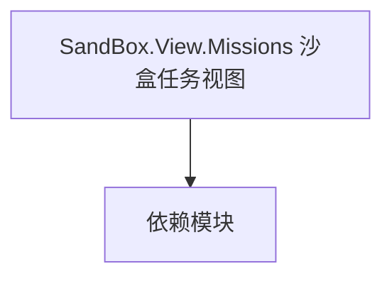

# SandBox.View.Missions 沙盒任务视图

**一句话职责：** 本页以家族索引形式覆盖 `SandBox.View.Missions 沙盒任务视图` 下全部 38 个业务类型，逐类给出命名空间、职责与典型时机，便于按模块而不是按字母表查阅。

## 心智模型

SandBox.View.Missions 是沙盒模块为任务场景提供的可视化与交互类型（如决斗、训练、特殊玩法的表现层）。它们沿用 MissionView 体系，但专注于沙盒玩法的呈现，桥接 SandBox 的玩法逻辑与战斗场景表现。

## 何时使用

扩展沙盒内某个任务玩法的表现（如自定义决斗 HUD/特效）时，继承对应 MissionView 并由对应 MissionLogic 注册。

## 依赖关系

`SandBox.View.Missions 沙盒任务视图` 的类型依赖以下模块；缺其中任一都会导致编译或运行期失败。

- [Mission 战斗场景](../../mission/Mission)
- [MissionLogics 任务逻辑](../MissionLogics/_index)
- [Mission 扩展总览](../_index)

## 类型清单

| Type | Namespace | Purpose | Timing |
| --- | --- | --- | --- |
| `EavesdroppingMissionCameraView` | SandBox.View.Missions | 战斗场景可视化视图，订阅 Mission 事件并在每帧刷新表现层 | 战斗/任务加载时 |
| `GenderEnum` | SandBox.View.Missions | 视图层类型，负责场景或 UI 的呈现 | 战斗/任务加载时 |
| `MissionAgentAlarmStateView` | SandBox.View.Missions | 战斗场景可视化视图，订阅 Mission 事件并在每帧刷新表现层 | 战斗/任务加载时 |
| `MissionArenaPracticeFightView` | SandBox.View.Missions | 战斗场景可视化视图，订阅 Mission 事件并在每帧刷新表现层 | 战斗/任务加载时 |
| `MissionAudienceHandler` | SandBox.View.Missions | 战斗场景可视化视图，订阅 Mission 事件并在每帧刷新表现层 | 战斗/任务加载时 |
| `MissionCampaignBattleSpectatorView` | SandBox.View.Missions | 战斗场景可视化视图，订阅 Mission 事件并在每帧刷新表现层 | 战斗/任务加载时 |
| `MissionCampaignView` | SandBox.View.Missions | 战斗场景可视化视图，订阅 Mission 事件并在每帧刷新表现层 | 战斗/任务加载时 |
| `MissionConversationCameraView` | SandBox.View.Missions | 战斗场景可视化视图，订阅 Mission 事件并在每帧刷新表现层 | 战斗/任务加载时 |
| `MissionConversationPrepareView` | SandBox.View.Missions | 战斗场景可视化视图，订阅 Mission 事件并在每帧刷新表现层 | 战斗/任务加载时 |
| `MissionCustomCameraView` | SandBox.View.Missions | 战斗场景可视化视图，订阅 Mission 事件并在每帧刷新表现层 | 战斗/任务加载时 |
| `MissionEquipItemToolView` | SandBox.View.Missions | 战斗场景可视化视图，订阅 Mission 事件并在每帧刷新表现层 | 战斗/任务加载时 |
| `MissionHideoutAmbushBossFightCinematicView` | SandBox.View.Missions | 战斗场景可视化视图，订阅 Mission 事件并在每帧刷新表现层 | 战斗/任务加载时 |
| `MissionHideoutAmbushCinematicView` | SandBox.View.Missions | 战斗场景可视化视图，订阅 Mission 事件并在每帧刷新表现层 | 战斗/任务加载时 |
| `MissionHideoutCinematicView` | SandBox.View.Missions | 战斗场景可视化视图，订阅 Mission 事件并在每帧刷新表现层 | 战斗/任务加载时 |
| `MissionItemCalatogView` | SandBox.View.Missions | 战斗场景可视化视图，订阅 Mission 事件并在每帧刷新表现层 | 战斗/任务加载时 |
| `MissionMainAgentDetectionView` | SandBox.View.Missions | 战斗场景可视化视图，订阅 Mission 事件并在每帧刷新表现层 | 战斗/任务加载时 |
| `MissionPreloadView` | SandBox.View.Missions | 战斗场景可视化视图，订阅 Mission 事件并在每帧刷新表现层 | 战斗/任务加载时 |
| `MissionQuestBarView` | SandBox.View.Missions | 战斗场景可视化视图，订阅 Mission 事件并在每帧刷新表现层 | 战斗/任务加载时 |
| `MissionSettlementPrepareView` | SandBox.View.Missions | 战斗场景可视化视图，订阅 Mission 事件并在每帧刷新表现层 | 战斗/任务加载时 |
| `MissionSingleplayerViewHandler` | SandBox.View.Missions | 战斗场景可视化视图，订阅 Mission 事件并在每帧刷新表现层 | 战斗/任务加载时 |
| `MissionSoundParametersView` | SandBox.View.Missions | 战斗场景可视化视图，订阅 Mission 事件并在每帧刷新表现层 | 战斗/任务加载时 |
| `MissionStealthFailCounterView` | SandBox.View.Missions | 战斗场景可视化视图，订阅 Mission 事件并在每帧刷新表现层 | 战斗/任务加载时 |
| `OtherMissionViews` | SandBox.View.Missions | 视图层类型，负责场景或 UI 的呈现 | 战斗/任务加载时 |
| `SandBoxMissionViews` | SandBox.View.Missions | 视图层类型，负责场景或 UI 的呈现 | 战斗/任务加载时 |
| `SoundParameterMissionCulture` | SandBox.View.Missions | 视图层类型，负责场景或 UI 的呈现 | 战斗/任务加载时 |
| `StealthMissionUIHandler` | SandBox.View.Missions | 战斗场景可视化视图，订阅 Mission 事件并在每帧刷新表现层 | 战斗/任务加载时 |
| `DefaultMissionNameMarkerHandler` | SandBox.View.Missions.NameMarkers | 视图层类型，负责场景或 UI 的呈现 | 战斗/任务加载时 |
| `MissionNameMarkerUIHandler` | SandBox.View.Missions.NameMarkers | 视图层类型，负责场景或 UI 的呈现 | 战斗/任务加载时 |
| `StealthNameMarkerProvider` | SandBox.View.Missions.NameMarkers | 视图层类型，负责场景或 UI 的呈现 | 战斗/任务加载时 |
| `SceneType` | SandBox.View.Missions.SandBox | 视图层类型，负责场景或 UI 的呈现 | 战斗/任务加载时 |
| `SpawnPointDebugView` | SandBox.View.Missions.SandBox | 场景脚本组件，挂载到 GameObject 提供可重写逻辑 | 战斗/任务加载时 |
| `SpawnPointUnits` | SandBox.View.Missions.SandBox | 视图层类型，负责场景或 UI 的呈现 | 战斗/任务加载时 |
| `MusicArenaPracticeMissionView` | SandBox.View.Missions.Sound.Components | 战斗场景可视化视图，订阅 Mission 事件并在每帧刷新表现层 | 战斗/任务加载时 |
| `MusicTournamentMissionView` | SandBox.View.Missions.Sound.Components | 战斗场景可视化视图，订阅 Mission 事件并在每帧刷新表现层 | 战斗/任务加载时 |
| `ArenaPreloadView` | SandBox.View.Missions.Tournaments | 战斗场景可视化视图，订阅 Mission 事件并在每帧刷新表现层 | 战斗/任务加载时 |
| `MissionTournamentJoustingView` | SandBox.View.Missions.Tournaments | 战斗场景可视化视图，订阅 Mission 事件并在每帧刷新表现层 | 战斗/任务加载时 |
| `MissionTournamentView` | SandBox.View.Missions.Tournaments | 战斗场景可视化视图，订阅 Mission 事件并在每帧刷新表现层 | 战斗/任务加载时 |
| `TournamentMissionViews` | SandBox.View.Missions.Tournaments | 视图层类型，负责场景或 UI 的呈现 | 战斗/任务加载时 |

## 风险与边界

视图只呈现、不判定；玩法胜负仍由 MissionLogic 决定。注意沙盒任务视图与 Native 同名视图可能并存，引用时确认命名空间。

## 参见

- [Mission 战斗场景](../../mission/Mission)
- [MissionLogics 任务逻辑](../MissionLogics/_index)
- [Mission 扩展总览](../_index)
