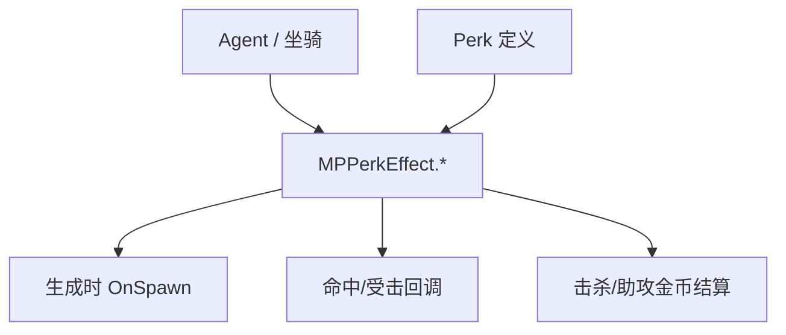

# Perk Effects 家族手册

**一句话职责：** `TaleWorlds.MountAndBlade.Network.Gameplay.Perks.Effects` 收纳所有 perk 效果（`MPPerkEffect` 子类）。它们不是独立系统，而是被 perk 定义引用的「属性修改器」：在代理生成、命中、受击、助攻、击杀或装备变更等时机，按 perk 等级对 `Agent` 或坐骑的驱动属性（DrivenProperty）、伤害、护甲、生命、速度与金币结算做增量调整。

## 心智模型

把一次多人战斗想成「代理进场 → 应用所有已解锁 perk 的 Effects → 战斗过程中各事件触发对应 Effect」。每个 `MPPerkEffect` 在 `OnAgentBuild / OnPerkActivated / 命中回调 / 受击回调` 中读取自身参数（通常是 perk 等级映射的系数），写回 `Agent` 的 `DrivenProperty` 或战斗结算结果。Effects 之间互不感知，全都通过 `Agent` 状态叠加；阅读顺序建议先看 [Mission](../../mission/Mission) 与 [Agent](../../mission/Agent) 了解代理生命周期，再回到本页按「攻击/防御/坐骑/经济」四类找对应 Effect。需要修改全局战斗数值时，应改对应的 `Model`（如 `AgentApplyDamageModel`）而非直接堆叠 Effect。

## 何时使用

- 你要改变的是「某个 perk 解锁后带来的战斗数值差异」，而不是基础战斗规则——基础规则由 `Mission`/`Agent` 与各 `Model` 定义。
- 自定义 perk 时，继承 `MPPerkEffect` 并只重写自己关心的事件钩子；不要在 Effect 里直接改 `Hero`/`MobileParty` 等战役字段（那是战役层的事）。
- 不要在 Effect 中做重逻辑或异步操作；Effect 在战斗热路径上被频繁调用，应保持轻量、幂等。

## 依赖关系

- 上游：[Mission](../../mission/Mission) 与 [Agent](../../mission/Agent) 提供代理与坐骑状态；perk 定义在 `PerkObject` 中引用这些 Effect。
- 下游：修改结果直接作用于 `Agent` 的战斗属性与多人金币结算；基础战斗公式由 [CampaignBehaviorBase](../../campaign-ext/CampaignBehaviorBase) 之外的战斗 `Model` 决定。
- 邻接模块：[mission-ext 总索引](../../mission-ext/_index) 与 [SubModule 启动](../../core/MBSubModuleBase)。

## Perk Effect 类型（TaleWorlds.MountAndBlade.Network.Gameplay.Perks.Effects）

| Type | Namespace | Purpose | Timing |
| --- | --- | --- | --- |
| `AlternativeAttackDamageEffect` | TaleWorlds.MountAndBlade.Network.Gameplay.Perks.Effects | 装备近战武器时，按 perk 等级提升交替攻击（盾击/蹬踢）造成的伤害。 | 交替攻击命中 |
| `AlternativeEquipmentEffect` | TaleWorlds.MountAndBlade.Network.Gameplay.Perks.Effects | 装备特定类别武器或护具时激活对应 perk 效果，解锁特定武器动作或形态。 | 装备变更 |
| `ArmorEffect` | TaleWorlds.MountAndBlade.Network.Gameplay.Perks.Effects | 受击时按 perk 等级提升护甲值，降低承受的物理伤害。 | 受击结算 |
| `DamageEffect` | TaleWorlds.MountAndBlade.Network.Gameplay.Perks.Effects | 攻击命中敌人时按 perk 等级提升对敌人造成的伤害。 | 命中结算 |
| `DamageInterruptionThresholdEffect` | TaleWorlds.MountAndBlade.Network.Gameplay.Perks.Effects | 提高打断当前攻击所需的承受伤害阈值，使连击更不容易被敌方攻击打断。 | 受击中断判定 |
| `DamageTakenEffect` | TaleWorlds.MountAndBlade.Network.Gameplay.Perks.Effects | 受击时按 perk 等级降低承受的伤害。 | 受击结算 |
| `DrivenPropertyEffect` | TaleWorlds.MountAndBlade.Network.Gameplay.Perks.Effects | 代理生成时按 perk 等级修改其某项驱动属性（力量、敏捷等 DrivenProperty）。 | 生成时 |
| `DrivenPropertyOnSpawnEffect` | TaleWorlds.MountAndBlade.Network.Gameplay.Perks.Effects | 单位出场/上马那一刻应用 DrivenProperty 加成，影响初始战斗属性。 | 出场/上马 |
| `EncumbranceEffect` | TaleWorlds.MountAndBlade.Network.Gameplay.Perks.Effects | 按 perk 等级降低装备带来的累赘（负重惩罚），提升机动性。 | 装备变更 |
| `GoldGainOnAssistEffect` | TaleWorlds.MountAndBlade.Network.Gameplay.Perks.Effects | 对敌人造成伤害并提供助攻时，按 perk 等级增加个人获得的金币收入。 | 助攻结算 |
| `GoldGainOnKillEffect` | TaleWorlds.MountAndBlade.Network.Gameplay.Perks.Effects | 击杀敌人时按 perk 等级增加获得的金币。 | 击杀结算 |
| `GoldRecoveryEffect` | TaleWorlds.MountAndBlade.Network.Gameplay.Perks.Effects | 按 perk 等级提升金币恢复速率，影响多人经济循环。 | 持续恢复 |
| `HealthRecoveryEffect` | TaleWorlds.MountAndBlade.Network.Gameplay.Perks.Effects | 代理存活时按 perk 等级提升生命值恢复速率。 | 持续恢复 |
| `HitpointsEffect` | TaleWorlds.MountAndBlade.Network.Gameplay.Perks.Effects | 生成时按 perk 等级增加代理的最大生命值。 | 生成时 |
| `MountDamageEffect` | TaleWorlds.MountAndBlade.Network.Gameplay.Perks.Effects | 骑乘时对敌方坐骑造成的伤害按 perk 等级提升。 | 坐骑命中 |
| `MountDamageTakenEffect` | TaleWorlds.MountAndBlade.Network.Gameplay.Perks.Effects | 骑乘时坐骑承受的伤害按 perk 等级降低。 | 坐骑受击 |
| `MountHealthRecoveryEffect` | TaleWorlds.MountAndBlade.Network.Gameplay.Perks.Effects | 骑乘时坐骑的生命恢复速率按 perk 等级提升。 | 持续恢复 |
| `MountManeuverEffect` | TaleWorlds.MountAndBlade.Network.Gameplay.Perks.Effects | 骑乘时按 perk 等级提升坐骑的操控与机动属性。 | 生成/上马 |
| `MountSpeedEffect` | TaleWorlds.MountAndBlade.Network.Gameplay.Perks.Effects | 骑乘时按 perk 等级提升坐骑移动速度。 | 生成/上马 |
| `RandomEquipmentEffect` | TaleWorlds.MountAndBlade.Network.Gameplay.Perks.Effects | 生成时随机赋予装备并应用对应属性加成，幅度取决于 perk 等级。 | 生成时 |
| `RangedAccuracyEffect` | TaleWorlds.MountAndBlade.Network.Gameplay.Perks.Effects | 使用远程武器时按 perk 等级提升命中精度，降低弹道散布。 | 远程射击 |
| `RangedHeadShotDamageEffect` | TaleWorlds.MountAndBlade.Network.Gameplay.Perks.Effects | 远程武器爆头时按 perk 等级提升爆头额外伤害。 | 爆头命中 |
| `RewardGoldOnAssistEffect` | TaleWorlds.MountAndBlade.Network.Gameplay.Perks.Effects | 助攻事件触发时按 perk 等级发放金币奖励，偏向团队/任务奖励结算。 | 助攻事件 |
| `RewardGoldOnDeathEffect` | TaleWorlds.MountAndBlade.Network.Gameplay.Perks.Effects | 单位死亡（阵亡或击杀结算）时按 perk 等级给予金币奖励。 | 死亡结算 |
| `ShieldDamageEffect` | TaleWorlds.MountAndBlade.Network.Gameplay.Perks.Effects | 用盾牌攻击（盾击）时按 perk 等级提升对敌伤害。 | 盾击命中 |
| `ShieldDamageTakenEffect` | TaleWorlds.MountAndBlade.Network.Gameplay.Perks.Effects | 被盾牌攻击时按 perk 等级降低承受的伤害。 | 受盾击 |
| `SpeedBonusEffect` | TaleWorlds.MountAndBlade.Network.Gameplay.Perks.Effects | 按 perk 等级为单位提供基础移动速度加成。 | 生成时 |
| `ThrowingWeaponDamageEffect` | TaleWorlds.MountAndBlade.Network.Gameplay.Perks.Effects | 使用投掷武器命中时按 perk 等级提升伤害。 | 投掷命中 |
| `ThrowingWeaponSpeedEffect` | TaleWorlds.MountAndBlade.Network.Gameplay.Perks.Effects | 按 perk 等级提升投掷武器的出手/飞行速度。 | 投掷时 |
| `TroopCountEffect` | TaleWorlds.MountAndBlade.Network.Gameplay.Perks.Effects | 在自定义/多人战斗中按 perk 等级影响可带部队数量或增援规模。 | 编队/生成 |

## 风险与边界

- **轻量原则**：Effect 在战斗热路径上高频调用，任何重逻辑、集合遍历或异步 IO 都会造成卡顿；只做简单的数值增量。
- **不要改战役字段**：在 Effect 里写 `Hero`/`MobileParty`/`Settlement` 会绕过 `*Action` 的事件、缓存与存档不变量，可能导致坏档或地图状态不一致。
- **幂等性**：生成期 Effect（如 `HitpointsEffect`/`SpeedBonusEffect`）在重复进场时会被重新应用，逻辑必须可重复执行而不叠加脏状态。
- **坐骑引用失效**：`Mount*` 系列在代理下马或坐骑死亡后引用即失效；必须在引用前判空，避免空引用崩溃。

## 参见

- 代理与任务：[Agent](../../mission/Agent)、[Mission](../../mission/Mission)
- 战斗启动与注册：[MBSubModuleBase](../../core/MBSubModuleBase)
- 战斗数值基础规则：各战斗 `Model`（见 `GameModels` 与 `AgentApplyDamageModel` 相关页）
