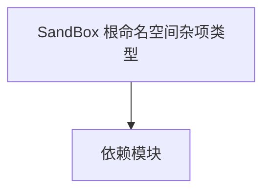

# SandBox 根命名空间杂项类型

**一句话职责：** 本页以家族索引形式覆盖 `SandBox 根命名空间杂项类型` 下全部 32 个业务类型，逐类给出命名空间、职责与典型时机，便于按模块而不是按字母表查阅。

## 心智模型

SandBox 根命名空间收敛了一批不属于更具体子系统的全局辅助类型：作弊指令、编辑器钩子、跨系统小工具等。它们多数以单例或静态入口形式存在，被各 CampaignBehavior/子系统在初始化或调试期调用，是「胶水层」而非核心规则。

## 何时使用

需要全局调试/编辑器能力或跨系统小工具时，从这里取用对应类型；不要把核心玩法规则塞进根命名空间。

## 依赖关系

`SandBox 根命名空间杂项类型` 的类型依赖以下模块；缺其中任一都会导致编译或运行期失败。

- [MBSubModuleBase](../core/MBSubModuleBase)
- [CampaignBehaviors 总览](../campaign-ext/_index)
- [API 总览](../_index)

## 类型清单

| Type | Namespace | Purpose | Timing |
| --- | --- | --- | --- |
| `Add1000GoldCheat` | SandBox | 调试作弊项，通过控制台或菜单触发开发期效果 | 战役初始化期 |
| `Add100InfluenceCheat` | SandBox | 调试作弊项，通过控制台或菜单触发开发期效果 | 战役初始化期 |
| `Add100RenownCheat` | SandBox | 调试作弊项，通过控制台或菜单触发开发期效果 | 战役初始化期 |
| `AddCraftingMaterialsCheat` | SandBox | 调试作弊项，通过控制台或菜单触发开发期效果 | 战役初始化期 |
| `BoostSkillCheatGroup` | SandBox | 调试作弊项，通过控制台或菜单触发开发期效果 | 战役初始化期 |
| `BoostSkillCheeat` | SandBox | 调试作弊项，通过控制台或菜单触发开发期效果 | 战役初始化期 |
| `CampaignMapSiegePrefabEntityCache` | SandBox | 场景脚本组件，挂载到 GameObject 提供可重写逻辑 | 战役初始化期 |
| `CompleteBuildingProjectCheat` | SandBox | 调试作弊项，通过控制台或菜单触发开发期效果 | 战役初始化期 |
| `EditorSceneMissionManager` | SandBox | 该命名空间下的业务类型，承担其派生约定职责 | 战役初始化期 |
| `FillCraftingStaminaCheat` | SandBox | 调试作弊项，通过控制台或菜单触发开发期效果 | 战役初始化期 |
| `GameplayCheatBase` | SandBox | 该命名空间下的业务类型，承担其派生约定职责 | 战役初始化期 |
| `GameplayCheatGroup` | SandBox | 调试作弊项，通过控制台或菜单触发开发期效果 | 战役初始化期 |
| `GameplayCheatItem` | SandBox | 调试作弊项，通过控制台或菜单触发开发期效果 | 战役初始化期 |
| `GameplayCheatsManager` | SandBox | 该命名空间下的业务类型，承担其派生约定职责 | 战役初始化期 |
| `Give10GrainCheat` | SandBox | 调试作弊项，通过控制台或菜单触发开发期效果 | 战役初始化期 |
| `Give10WarhorsesCheat` | SandBox | 调试作弊项，通过控制台或菜单触发开发期效果 | 战役初始化期 |
| `Give5TroopsToPlayerCheat` | SandBox | 调试作弊项，通过控制台或菜单触发开发期效果 | 战役初始化期 |
| `HealMainHeroCheat` | SandBox | 调试作弊项，通过控制台或菜单触发开发期效果 | 战役初始化期 |
| `HealPlayerPartyCheat` | SandBox | 调试作弊项，通过控制台或菜单触发开发期效果 | 战役初始化期 |
| `LocationCharacterMissionExtensions` | SandBox | 该命名空间下的业务类型，承担其派生约定职责 | 战役初始化期 |
| `MapSceneHelper` | SandBox | 该命名空间下的业务类型，承担其派生约定职责 | 战役初始化期 |
| `MissionHelper` | SandBox | 该命名空间下的业务类型，承担其派生约定职责 | 战役初始化期 |
| `ModuleCheckResult` | SandBox | 该命名空间下的业务类型，承担其派生约定职责 | 战役初始化期 |
| `NavigationState` | SandBox | 该命名空间下的业务类型，承担其派生约定职责 | 战役初始化期 |
| `SandboxBattleBannerBearersModel` | SandBox | 领域模型，聚合规则与计算供 Behavior 调用 | 战役初始化期 |
| `SandBoxEditorMissionTester` | SandBox | 该命名空间下的业务类型，承担其派生约定职责 | 战役初始化期 |
| `SandBoxHelpers` | SandBox | 该命名空间下的业务类型，承担其派生约定职责 | 战役初始化期 |
| `SandBoxSaveHelper` | SandBox | 该命名空间下的业务类型，承担其派生约定职责 | 战役初始化期 |
| `SaveHelperState` | SandBox | 该命名空间下的业务类型，承担其派生约定职责 | 战役初始化期 |
| `UnlockAllCraftingRecipesCheat` | SandBox | 调试作弊项，通过控制台或菜单触发开发期效果 | 战役初始化期 |
| `UnlockFogOfWarCheat` | SandBox | 调试作弊项，通过控制台或菜单触发开发期效果 | 战役初始化期 |
| `WoundAllEnemiesCheat` | SandBox | 调试作弊项，通过控制台或菜单触发开发期效果 | 战役初始化期 |

## 风险与边界

根命名空间类型职责杂，调用前确认其生命周期（很多仅在编辑器/调试构建有效）。作弊类在生产构建应被禁用或空实现，避免误触发。

## 参见

- [MBSubModuleBase](../core/MBSubModuleBase)
- [CampaignBehaviors 总览](../campaign-ext/_index)
- [API 总览](../_index)
